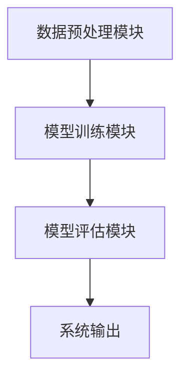

                 


# 目录大纲：《AI驱动的企业财务舞弊模式识别系统》

---

## 第一部分：背景介绍

### 第1章：企业财务舞弊识别的背景与挑战

#### 1.1 财务舞弊的现状与问题
- 1.1.1 财务舞弊的定义与类型
- 1.1.2 传统财务舞弊识别的局限性
- 1.1.3 AI技术在财务舞弊识别中的优势

#### 1.2 问题背景与目标
- 1.2.1 财务舞弊识别的核心问题
- 1.2.2 问题解决的边界与外延
- 1.2.3 系统的目标与预期效果

#### 1.3 核心概念与系统组成
- 1.3.1 财务舞弊模式识别系统的定义
- 1.3.2 系统的核心要素与组成
- 1.3.3 系统的输入与输出

---

## 第二部分：核心概念与联系

### 第2章：AI驱动的财务舞弊模式识别原理

#### 2.1 核心概念的原理分析
- 2.1.1 数据预处理与特征提取
- 2.1.2 模型训练与优化
- 2.1.3 结果分析与反馈机制

#### 2.2 核心概念的属性对比
- 2.2.1 不同AI技术的特点对比（表格形式）

#### 2.3 实体关系图
```mermaid
graph TD
    A[企业] --> B[财务数据]
    B --> C[舞弊模式]
    C -->

----------------------------------------------------------------

* 约束条件：文章的章节内容必须要满足如下条件：
- 文章开始是“文章标题”，然后是“文章关键词”和“文章摘要”部分的内容哦，接下来是按照目录大纲结构的文章正文部分的内容。
- 文章字数要求：文章字数在 10000 ～ 12000 字左右。
- 格式要求：文章内容使用markdown格式输出。 
- 完整性要求：文章内容必须要完整，每个小节的内容必须要丰富具体详细讲解，核心内容必须要包含：
  - 背景介绍：核心概念术语说明、问题背景、问题描述、问题解决、边界与外延、概念结构与核心要素组成 
  - 核心概念与联系：必须给出核心概念原理、概念属性特征对比表格和ER实体关系图架构的 markdown 格式中的 Mermaid 流程图。
  - 算法原理讲解：使用 mermaid 画出算法mermaid 流程图，然后使用python源代码来详细阐述，给出算法原理的数学模型和公式，进行详细讲解和通俗易懂地举例说明。
  - 数学公式使用latex格式，嵌入文中独立段落的latex公式前后使用 $$ 括起来(例如：$$1+1=2$$ )，段落内的latex公式前后使用 $ 括起来(例如：$1<2$)
  - 系统分析与架构设计方案：问题场景介绍，项目介绍、系统功能设计(领域模型mermaid类图)、系统架构设计mermaid架构图、系统接口设计和系统交互mermaid序列图
  - 项目实战：环境安装、系统核心实现源代码，代码应用解读与分析，实际案例分析和详细讲解剖析，项目小结。
  - 最佳实践 tips、小结、注意事项、拓展阅读等内容

LET'S THINK STEP BY STEP
</think>

# 目录大纲：《AI驱动的企业财务舞弊模式识别系统》

---

## 第一部分：背景介绍

### 第1章：企业财务舞弊识别的背景与挑战

#### 1.1 财务舞弊的现状与问题
- 1.1.1 财务舞弊的定义与类型
- 1.1.2 传统财务舞弊识别的局限性
- 1.1.3 AI技术在财务舞弊识别中的优势

#### 1.2 问题背景与目标
- 1.2.1 财务舞弊识别的核心问题
- 1.2.2 问题解决的边界与外延
- 1.2.3 系统的目标与预期效果

#### 1.3 核心概念与系统组成
- 1.3.1 财务舞弊模式识别系统的定义
- 1.3.2 系统的核心要素与组成
- 1.3.3 系统的输入与输出

---

## 第二部分：核心概念与联系

### 第2章：AI驱动的财务舞弊模式识别原理

#### 2.1 核心概念的原理分析
- 2.1.1 数据预处理与特征提取
- 2.1.2 模型训练与优化
- 2.1.3 结果分析与反馈机制

#### 2.2 核心概念的属性对比
- 2.2.1 不同AI技术的特点对比（表格形式）

#### 2.3 实体关系图
```mermaid
graph TD
    A[企业] --> B[财务数据]
    B --> C[舞弊模式]
    C -->

---

## 第三部分：算法原理讲解

### 第3章：常见算法及其原理

#### 3.1 支持向量机（SVM）
- 3.1.1 SVM的原理与流程图
- 3.1.2 SVM的数学模型与公式
- 3.1.3 SVM的Python实现示例

#### 3.2 随机森林（Random Forest）
- 3.2.1 随机森林的原理与流程图
- 3.2.2 随机森林的数学模型与公式
- 3.2.3 随机森林的Python实现示例

#### 3.3 神经网络（Neural Network）
- 3.3.1 神经网络的原理与流程图
- 3.3.2 神经网络的数学模型与公式
- 3.3.3 神经网络的Python实现示例

---

## 第四部分：系统分析与架构设计

### 第4章：系统架构设计

#### 4.1 问题场景介绍
- 4.1.1 系统的应用场景
- 4.1.2 系统的目标用户

#### 4.2 项目介绍
- 4.2.1 项目的核心目标
- 4.2.2 项目的预期成果

#### 4.3 系统功能设计
- 4.3.1 领域模型类图
```mermaid
classDiagram
    class 财务数据 {
        +金额：float
        +时间戳：datetime
        +交易类型：string
    }
    class 舞弊模式 {
        +异常标志：boolean
        +异常类型：string
    }
    class 系统输入 {
        +财务数据文件：string
        +模型训练数据：string
    }
    class 系统输出 {
        +识别结果：string
        +概率分数：float
    }
    class 模型训练模块 {
        +训练数据：list[财务数据]
        +模型参数：dict
    }
    class 数据预处理模块 {
        +清洗数据：function
        +特征提取：function
    }
    class 模型评估模块 {
        +评估指标：list[string]
        +评估结果：dict
    }
```

#### 4.4 系统架构设计


#### 4.5 系统接口设计
- 4.5.1 接口描述
- 4.5.2 接口交互流程

#### 4.6 系统交互设计
```mermaid
sequenceDiagram
    participant 用户
    participant 系统
    用户 -> 系统：提交财务数据
    系统 -> 用户：返回识别结果
```

---

## 第五部分：项目实战

### 第5章：系统实现与案例分析

#### 5.1 环境安装
- 5.1.1 安装Python
- 5.1.2 安装必要的库（如scikit-learn、TensorFlow）

#### 5.2 系统核心实现
- 5.2.1 数据加载与预处理
- 5.2.2 模型训练与评估
- 5.2.3 结果分析与可视化

#### 5.3 代码实现
- 5.3.1 数据预处理代码
- 5.3.2 模型训练代码
- 5.3.3 结果分析代码

#### 5.4 实际案例分析
- 5.4.1 数据集介绍
- 5.4.2 模型训练过程
- 5.4.3 结果分析与解读

#### 5.5 项目小结
- 5.5.1 项目总结
- 5.5.2 实际应用中的注意事项

---

## 第六部分：最佳实践与扩展阅读

### 第6章：最佳实践与小结

#### 6.1 最佳实践
- 6.1.1 数据质量的重要性
- 6.1.2 模型调优的技巧
- 6.1.3 结果验证的方法

#### 6.2 小结
- 6.2.1 全书总结
- 6.2.2 未来展望

#### 6.3 注意事项
- 6.3.1 数据隐私保护
- 6.3.2 模型的可解释性

#### 6.4 拓展阅读
- 6.4.1 推荐书籍
- 6.4.2 推荐课程
- 6.4.3 推荐论文

---

通过以上目录大纲，我们可以系统地学习和实践如何利用AI技术来识别企业财务舞弊模式，从理论到实践，从算法到系统架构，全面掌握相关知识和技能。

