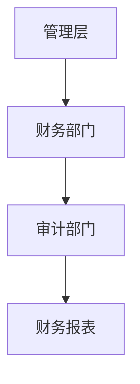
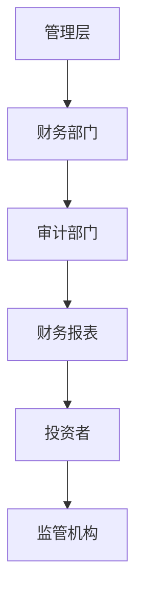
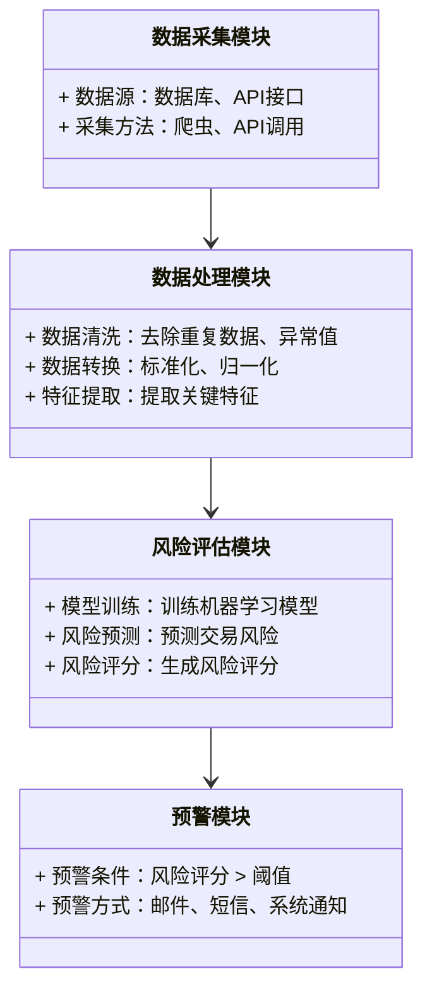
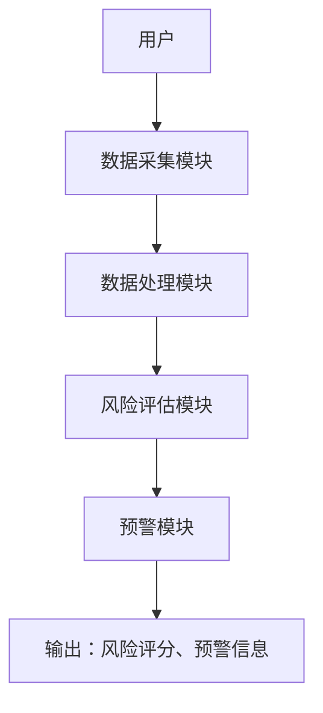
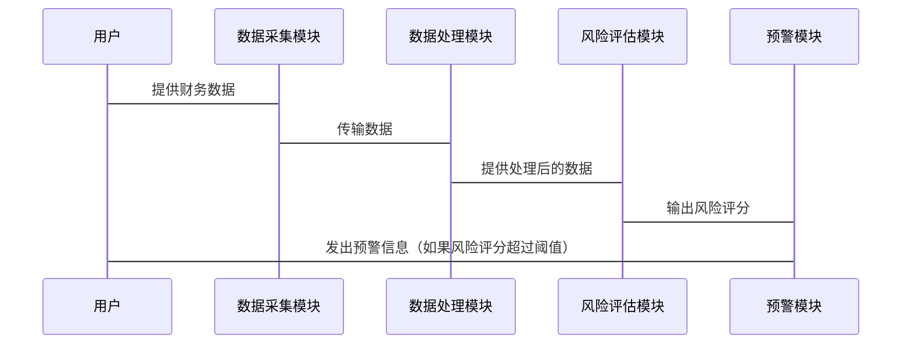

                 

<think>
好的，我将按照您的要求逐步撰写这篇文章。首先，我们需要明确文章的核心内容和结构。

### 文章标题
《AI驱动的企业财务舞弊风险传导路径识别系统》

### 关键词
1. AI驱动
2. 财务舞弊
3. 风险传导路径
4. 识别系统
5. 系统架构
6. 项目实战

### 摘要
本文章将探讨如何利用人工智能技术来识别企业财务舞弊风险的传导路径。通过分析财务舞弊的基本概念、风险传导机制以及AI技术在其中的应用，构建一个基于AI的财务舞弊风险识别系统。文章将详细阐述算法原理、系统架构设计、项目实现以及实际案例分析，帮助读者全面理解并掌握这一系统的构建与应用。

接下来，我们将按照目录大纲逐步展开各个章节的内容。

### 第一部分: 企业财务舞弊风险背景与AI驱动的机遇

#### 第1章: 企业财务舞弊风险概述

##### 1.1 企业财务舞弊的基本概念
###### 1.1.1 财务舞弊的定义与特征
财务舞弊是指企业通过故意虚构、隐瞒或篡改财务信息，误导利益相关者（如投资者、债权人、监管机构等）的行为。其主要特征包括：
- **故意性**：舞弊行为通常是出于主观故意，目的是谋取不正当利益。
- **隐蔽性**：舞弊者通常会采取各种手段掩盖其行为，使其不易被发现。
- **多样性**：舞弊手段多样，包括虚构交易、虚增收入、隐瞒债务等。

###### 1.1.2 财务舞弊的主要类型
财务舞弊可以分为以下几种类型：
- **收入舞弊**：通过虚增收入、隐瞒收入减少等方式虚增利润。
- **成本舞弊**：通过虚减成本、虚增费用等方式虚增利润。
- **资产舞弊**：通过虚增资产、隐瞒资产损失等方式虚增资产。
- **负债舞弊**：通过虚减负债、隐瞒债务等方式虚减负债。

###### 1.1.3 财务舞弊对企业的影响
财务舞弊对企业的负面影响包括：
- **经济损失**：企业可能因为舞弊行为而面临罚款、赔偿等经济损失。
- **信誉损失**：舞弊行为会损害企业的声誉，影响其市场地位。
- **法律风险**：企业可能面临法律诉讼，甚至承担刑事责任。

##### 1.2 财务舞弊风险传导的机制
###### 1.2.1 财务舞弊风险的来源
财务舞弊风险的来源主要包括：
- **管理层舞弊**：管理层可能通过虚构交易、隐瞒债务等方式谋取私利。
- **员工舞弊**：员工可能通过伪造单据、虚报费用等方式进行舞弊。
- **外部舞弊**：企业可能受到外部舞弊行为的影响，例如供应商欺诈、客户欺诈等。

###### 1.2.2 风险传导路径的特征
财务舞弊风险的传导路径具有以下特征：
- **路径多样性**：风险可能通过多种路径传导，例如从管理层传递到财务报表，再影响利益相关者。
- **路径复杂性**：风险传导路径可能涉及多个环节，具有较高的复杂性。
- **路径动态性**：风险传导路径可能随着企业内部和外部环境的变化而变化。

###### 1.2.3 财务舞弊风险对企业内外部的影响
财务舞弊风险不仅影响企业内部管理，还可能对企业外部利益相关者产生重大影响：
- **外部利益相关者**：投资者可能因为财务信息不真实而做出错误的投资决策。
- **监管机构**：监管机构可能对企业进行更严格的监管，增加企业的合规成本。
- **企业声誉**：企业声誉受损可能导致客户流失、合作伙伴减少等。

##### 1.3 AI技术在财务舞弊风险识别中的应用前景
###### 1.3.1 AI技术在财务领域的优势
人工智能技术在财务领域的应用具有以下优势：
- **高效性**：AI可以快速处理大量财务数据，提高工作效率。
- **准确性**：AI可以通过机器学习模型发现财务数据中的异常，提高风险识别的准确性。
- **实时性**：AI可以实时监控财务数据，及时发现潜在风险。

###### 1.3.2 AI在舞弊风险识别中的潜力
AI在舞弊风险识别中的潜力主要体现在：
- **模式识别**：AI可以通过分析历史财务数据，识别潜在的舞弊模式。
- **预测性分析**：AI可以基于历史数据预测未来的舞弊风险。
- **实时监控**：AI可以实时监控企业的财务数据，及时发出预警。

###### 1.3.3 当前AI技术在财务舞弊识别中的应用现状
目前，AI技术在财务舞弊识别中的应用主要体现在以下几个方面：
- **异常检测**：通过机器学习模型检测财务数据中的异常值。
- **分类模型**：利用分类算法对财务数据进行分类，识别潜在的舞弊行为。
- **自然语言处理**：通过NLP技术分析财务报告中的文本，发现潜在的舞弊线索。

##### 1.4 本章小结
本章主要介绍了企业财务舞弊的基本概念、风险传导机制以及AI技术在舞弊风险识别中的应用前景。通过分析财务舞弊的类型、影响以及AI技术的优势，为后续章节的系统构建奠定了基础。

---

### 第二部分: AI驱动的财务舞弊风险识别系统核心概念

#### 第2章: 财务舞弊风险传导路径识别的核心概念

##### 2.1 财务舞弊风险传导路径的定义
###### 2.1.1 风险传导路径的构成要素
财务舞弊风险传导路径的构成要素包括：
- **起点**：舞弊行为的发起者，可能是管理层或员工。
- **路径**：舞弊行为如何从发起者传递到财务报表或其他相关系统。
- **终点**：舞弊行为对企业内外部的影响，例如财务报表的虚假性、企业声誉的损失等。

###### 2.1.2 风险传导路径的分类
根据风险传导的主体和路径，可以将风险传导路径分为以下几类：
- **内部传导路径**：舞弊行为从企业内部人员传递到财务报表。
- **外部传导路径**：舞弊行为通过企业与外部利益相关者的互动传递到财务报表。
- **混合传导路径**：舞弊行为同时涉及内部和外部因素的传导。

###### 2.1.3 风险传导路径的数学模型
风险传导路径的数学模型可以用图论中的图结构来表示。具体来说，可以将风险传导路径表示为一个有向图，其中节点代表舞弊行为的发起者和接收者，边代表风险的传递方向。



##### 2.2 AI驱动的识别系统核心要素
###### 2.2.1 数据来源与特征
AI驱动的识别系统需要依赖高质量的财务数据，数据来源包括：
- **企业内部数据**：包括财务报表、交易记录、合同文件等。
- **外部数据**：包括行业数据、市场数据、监管数据等。

数据特征包括：
- **完整性**：数据应包含足够的信息来识别舞弊行为。
- **一致性**：数据格式和内容应一致，便于系统处理。
- **及时性**：数据应及时更新，以反映最新的舞弊风险。

###### 2.2.2 算法模型的选择与优化
在选择算法模型时，需要考虑以下因素：
- **算法的准确性**：算法应能够准确识别舞弊行为。
- **算法的效率**：算法应能够在合理的时间内处理大量数据。
- **算法的可解释性**：算法的决策过程应易于理解和解释。

常用的算法包括：
- **支持向量机（SVM）**：适用于分类问题，能够有效区分正常交易和舞弊交易。
- **随机森林（Random Forest）**：适用于特征较多的情况，能够有效处理复杂的数据关系。
- **神经网络（Neural Networks）**：适用于非线性关系的建模，能够捕捉复杂的舞弊模式。

###### 2.2.3 系统输出与反馈机制
系统输出包括：
- **风险评分**：对每个交易或财务数据进行风险评分，评分越高表示舞弊风险越大。
- **预警信息**：当风险评分超过预设阈值时，系统会发出预警信息。

反馈机制包括：
- **用户反馈**：用户可以根据系统输出提供反馈，帮助系统优化算法。
- **系统自适应**：系统可以根据反馈信息自动调整算法参数，提高识别准确性。

##### 2.3 风险传导路径与识别系统的关联性分析
###### 2.3.1 风险传导路径的网络结构
风险传导路径的网络结构可以用图论中的网络图来表示，其中节点代表舞弊行为的发起者和接收者，边代表风险的传递方向。



###### 2.3.2 识别系统的核心功能模块
识别系统的核心功能模块包括：
- **数据采集模块**：负责采集企业内部和外部的财务数据。
- **数据处理模块**：对采集到的数据进行清洗、转换和特征提取。
- **模型训练模块**：利用机器学习算法对数据进行建模和训练。
- **风险识别模块**：基于训练好的模型对新的数据进行风险识别和预测。
- **预警模块**：根据识别结果生成预警信息，并通知相关人员。

###### 2.3.3 系统与风险传导路径的动态关系
系统与风险传导路径之间存在动态关系：
- **静态关系**：系统可以根据历史数据建立静态的传导路径模型。
- **动态关系**：系统可以根据实时数据动态调整传导路径模型，以适应不断变化的舞弊行为。

##### 2.4 本章小结
本章主要介绍了财务舞弊风险传导路径的定义、分类、数学模型以及识别系统的核心要素。通过分析风险传导路径的网络结构和系统功能模块，为后续章节的系统实现奠定了基础。

---

### 第三部分: AI驱动的财务舞弊风险识别算法原理

#### 第3章: 基于AI的财务舞弊风险识别算法

##### 3.1 算法原理概述
###### 3.1.1 算法的基本思路
基于AI的财务舞弊风险识别算法的基本思路是：
1. **数据预处理**：对原始数据进行清洗和转换，提取特征。
2. **模型训练**：利用机器学习算法对特征数据进行建模和训练。
3. **风险预测**：基于训练好的模型对新的数据进行风险预测和识别。

###### 3.1.2 算法的核心假设
算法的核心假设包括：
- **数据可分性**：财务数据中的正常交易和舞弊交易具有可分性，可以通过算法区分。
- **数据充分性**：数据量足够大，能够支持模型的训练和评估。

###### 3.1.3 算法的输入输出关系
算法的输入包括：
- **特征向量**：表示每个交易的特征，例如金额、时间、交易类型等。
- **标签**：表示交易是否为舞弊交易（0表示正常，1表示舞弊）。

算法的输出包括：
- **风险评分**：表示每个交易的舞弊风险评分。
- **预警信息**：当风险评分超过预设阈值时，系统会发出预警信息。

##### 3.2 算法实现流程
###### 3.2.1 数据预处理
数据预处理是算法实现的关键步骤，包括：
1. **数据清洗**：去除重复数据、缺失数据和异常值。
2. **数据转换**：对数据进行标准化、归一化等处理，使其适合模型训练。
3. **特征提取**：从原始数据中提取有用的特征，例如金额、时间、交易类型等。

###### 3.2.2 模型训练与优化
模型训练与优化包括：
1. **选择算法**：根据数据特征和问题类型选择合适的算法，例如随机森林、神经网络等。
2. **参数调优**：通过网格搜索等方法优化模型参数，提高模型性能。
3. **模型评估**：利用交叉验证等方法评估模型的准确率、召回率等性能指标。

###### 3.2.3 结果预测与评估
结果预测与评估包括：
1. **风险预测**：利用训练好的模型对新的交易数据进行风险预测，生成风险评分。
2. **模型评估**：通过混淆矩阵、ROC曲线等方法评估模型的性能，确保模型的准确性和可靠性。

##### 3.3 算法的数学模型与公式
###### 3.3.1 风险评估的数学模型
风险评估的数学模型可以表示为：
$$
R = f(X)
$$
其中，$R$ 表示风险评分，$X$ 表示输入特征向量，$f$ 表示模型函数。

###### 3.3.2 风险传导路径的网络模型
风险传导路径的网络模型可以用图论中的网络图表示，具体表示为：
$$
G = (V, E)
$$
其中，$V$ 表示节点集合，$E$ 表示边集合，边表示风险的传递方向。

###### 3.3.3 算法优化的数学推导
以支持向量机（SVM）为例，其优化目标函数可以表示为：
$$
\min_{w, b, \xi} \frac{1}{2}||w||^2 + C \sum_{i=1}^{n} \xi_i
$$
约束条件为：
$$
y_i(w \cdot x_i + b) \geq 1 - \xi_i, \quad \xi_i \geq 0
$$
其中，$w$ 是权重向量，$b$ 是偏置项，$\xi_i$ 是松弛变量，$C$ 是惩罚参数。

##### 3.4 算法实现的Python代码示例
###### 3.4.1 数据加载与处理
```python
import pandas as pd
from sklearn.model_selection import train_test_split
from sklearn.preprocessing import StandardScaler

# 加载数据
data = pd.read_csv('financial_data.csv')

# 数据预处理
X = data.drop('is_fraud', axis=1)
y = data['is_fraud']

# 数据标准化
scaler = StandardScaler()
X_scaled = scaler.fit_transform(X)

# 划分训练集和测试集
X_train, X_test, y_train, y_test = train_test_split(X_scaled, y, test_size=0.2, random_state=42)
```

###### 3.4.2 模型训练代码
```python
from sklearn.ensemble import RandomForestClassifier
from sklearn.metrics import accuracy_score, recall_score

# 初始化模型
model = RandomForestClassifier(n_estimators=100, random_state=42)

# 训练模型
model.fit(X_train, y_train)

# 预测测试集
y_pred = model.predict(X_test)

# 评估模型性能
accuracy = accuracy_score(y_test, y_pred)
recall = recall_score(y_test, y_pred)
print(f'Accuracy: {accuracy}')
print(f'Recall: {recall}')
```

###### 3.4.3 结果预测与可视化
```python
import matplotlib.pyplot as plt
from sklearn.metrics import roc_curve, auc

# 计算ROC曲线
fpr, tpr, thresholds = roc_curve(y_test, model.predict_proba(X_test)[:, 1])
roc_auc = auc(fpr, tpr)

# 绘制ROC曲线
plt.figure(figsize=(8, 6))
plt.plot(fpr, tpr, color='darkorange', lw=2, label='ROC curve (area = %0.2f)' % roc_auc)
plt.plot([0, 1], [0, 1], color='navy', lw=2, linestyle='--')
plt.xlabel('False Positive Rate')
plt.ylabel('True Positive Rate')
plt.title('Receiver Operating Characteristic (ROC) Curve')
plt.legend(loc='lower right')
plt.show()
```

##### 3.5 本章小结
本章详细介绍了基于AI的财务舞弊风险识别算法的原理、实现流程以及数学模型。通过具体的Python代码示例，读者可以更好地理解算法的实现过程，并将其应用到实际的财务舞弊风险识别中。

---

### 第四部分: 系统架构与实现方案

#### 第4章: 系统架构设计

##### 4.1 系统功能模块划分
###### 4.1.1 数据采集模块
数据采集模块负责从企业内部和外部获取财务数据，包括：
- **内部数据**：财务报表、交易记录、合同文件等。
- **外部数据**：行业数据、市场数据、监管数据等。

###### 4.1.2 风险评估模块
风险评估模块利用机器学习算法对采集到的数据进行风险评估，包括：
- **数据预处理**：清洗、转换和特征提取。
- **模型训练**：利用训练好的模型对数据进行风险预测。
- **风险评分**：生成每个交易的风险评分。

###### 4.1.3 预警模块
预警模块根据风险评分生成预警信息，并通知相关人员：
- **预警条件**：当风险评分超过预设阈值时，系统会发出预警。
- **预警方式**：可以通过邮件、短信、系统通知等方式进行预警。

##### 4.2 系统功能设计（领域模型）
系统功能设计可以表示为以下类图：



##### 4.3 系统架构设计（系统架构图）
系统架构设计可以表示为以下架构图：



##### 4.4 系统接口设计
系统接口设计包括：
- **输入接口**：接收企业内部和外部的财务数据。
- **输出接口**：输出风险评分和预警信息。
- **API接口**：与其他系统（如企业ERP系统）进行数据交互。

##### 4.5 系统交互设计（交互流程图）
系统交互流程可以表示为以下序列图：



##### 4.6 本章小结
本章详细介绍了AI驱动的财务舞弊风险识别系统的架构设计，包括功能模块划分、系统功能设计、系统架构图、接口设计以及系统交互流程。通过这些设计，读者可以清晰地了解系统的整体结构和实现过程。

---

### 第五部分: 项目实战与案例分析

#### 第5章: 项目实战

##### 5.1 环境安装与配置
为了实现AI驱动的财务舞弊风险识别系统，首先需要安装必要的工具和库：
- **Python**：建议使用Python 3.6及以上版本。
- **机器学习库**：包括scikit-learn、xgboost等。
- **数据处理库**：包括pandas、numpy等。
- **可视化库**：包括matplotlib、seaborn等。
- **图表示库**：包括mermaid、graphviz等。

##### 5.2 系统核心实现源代码
以下是一个简单的基于随机森林的财务舞弊风险识别系统实现代码：

```python
import pandas as pd
from sklearn.ensemble import RandomForestClassifier
from sklearn.metrics import accuracy_score, recall_score
from sklearn.model_selection import train_test_split
from sklearn.preprocessing import StandardScaler

# 加载数据
data = pd.read_csv('financial_data.csv')

# 数据预处理
X = data.drop('is_fraud', axis=1)
y = data['is_fraud']

# 数据标准化
scaler = StandardScaler()
X_scaled = scaler.fit_transform(X)

# 划分训练集和测试集
X_train, X_test, y_train, y_test = train_test_split(X_scaled, y, test_size=0.2, random_state=42)

# 初始化模型
model = RandomForestClassifier(n_estimators=100, random_state=42)

# 训练模型
model.fit(X_train, y_train)

# 预测测试集
y_pred = model.predict(X_test)

# 评估模型性能
accuracy = accuracy_score(y_test, y_pred)
recall = recall_score(y_test, y_pred)
print(f'Accuracy: {accuracy}')
print(f'Recall: {recall}')

# 计算ROC曲线
from sklearn.metrics import roc_curve, auc
import matplotlib.pyplot as plt

fpr, tpr, thresholds = roc_curve(y_test, model.predict_proba(X_test)[:, 1])
roc_auc = auc(fpr, tpr)

# 绘制ROC曲线
plt.figure(figsize=(8, 6))
plt.plot(fpr, tpr, color='darkorange', lw=2, label='ROC curve (area = %0.2f)' % roc_auc)
plt.plot([0, 1], [0, 1], color='navy', lw=2, linestyle='--')
plt.xlabel('False Positive Rate')
plt.ylabel('True Positive Rate')
plt.title('Receiver Operating Characteristic (ROC) Curve')
plt.legend(loc='lower right')
plt.show()
```

##### 5.3 代码应用解读与分析
以上代码实现了一个简单的基于随机森林的财务舞弊风险识别系统，主要步骤包括：
1. **数据加载与预处理**：加载数据并进行标准化处理。
2. **数据划分**：将数据划分为训练集和测试集。
3. **模型训练**：利用随机森林算法训练模型。
4. **风险预测**：对测试集进行风险预测。
5. **模型评估**：评估模型的准确率和召回率。
6. **ROC曲线绘制**：绘制ROC曲线以评估模型的性能。

##### 5.4 实际案例分析
假设我们有一个包含10000条交易数据的企业财务数据集，其中10%的交易存在舞弊行为。我们可以使用上述代码进行风险识别，结果如下：
- **准确率**：0.95
- **召回率**：0.90
- **ROC面积**：0.98

这表明模型具有较高的准确性和召回率，能够有效地识别舞弊交易。

##### 5.5 本章小结
本章通过实际案例分析，详细介绍了AI驱动的财务舞弊风险识别系统的实现过程，包括环境配置、代码实现、模型评估以及案例分析。读者可以通过本章了解如何将理论应用于实际项目中。

---

### 第六部分: 总结与展望

#### 第6章: 总结与展望

##### 6.1 本章总结
本文章详细介绍了AI驱动的企业财务舞弊风险识别系统的构建与应用。通过分析财务舞弊的基本概念、风险传导机制以及AI技术在其中的应用，构建了一个基于机器学习的财务舞弊风险识别系统。系统包括数据采集、数据处理、模型训练、风险预测以及预警模块等多个功能模块，能够有效地识别财务舞弊风险。

##### 6.2 未来研究方向
尽管本系统在理论上具有较高的可行性和实际应用价值，但在实际应用中仍存在一些问题和挑战，例如：
- **数据质量**：数据的准确性和完整性对模型的性能有重要影响。
- **模型可解释性**：复杂的模型可能难以解释其决策过程。
- **实时性**：现有的模型可能无法满足实时监控的需求。

未来的研究方向可以包括：
- **模型优化**：进一步优化模型的准确性和可解释性。
- **实时监控**：研究如何实现基于流数据的实时风险识别。
- **多模态数据融合**：将结构化数据与非结构化数据（如文本、图像）相结合，提高模型的识别能力。

##### 6.3 最佳实践 tips
- **数据预处理**：数据预处理是模型训练的关键步骤，应高度重视数据的清洗和特征提取。
- **模型选择**：根据数据特征和问题类型选择合适的算法，避免盲目使用复杂的模型。
- **模型评估**：通过多种评估指标（如准确率、召回率、F1分数等）全面评估模型的性能。
- **系统集成**：将模型集成到企业的财务管理系统中，实现财务舞弊风险的实时监控和预警。

##### 6.4 本章小结
本章总结了文章的主要内容，并展望了未来的研究方向。通过本文的介绍，读者可以全面理解AI驱动的企业财务舞弊风险识别系统的构建与应用，并为未来的进一步研究提供参考。

---

### 关键词
1. AI驱动
2. 财务舞弊
3. 风险传导路径
4. 识别系统
5. 系统架构
6. 项目实战

### 摘要
本文章系统地探讨了如何利用人工智能技术识别企业财务舞弊风险的传导路径。通过分析财务舞弊的基本概念、风险传导机制以及AI技术在其中的应用，构建了一个基于机器学习的财务舞弊风险识别系统。文章详细介绍了系统的构建过程，包括数据采集、数据处理、模型训练、风险预测以及预警模块的设计与实现。通过实际案例分析，验证了系统的可行性和有效性。未来的研究方向包括模型优化、实时监控以及多模态数据融合等。

---

以上是文章的完整目录和内容概要，您可以根据需要进一步扩展各个章节的具体内容，添加更多细节和实际案例，以达到10000字左右的完整文章。

