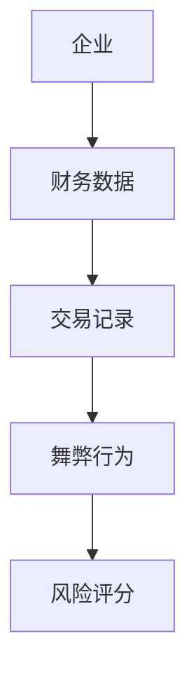
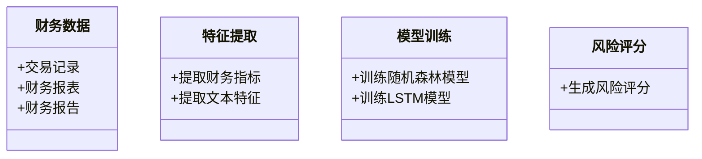
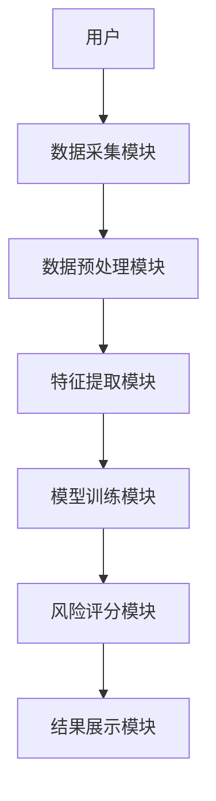
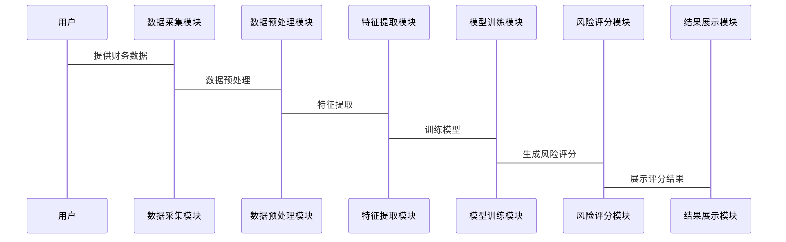

                 


# AI驱动的企业财务舞弊风险评分系统

> 关键词：AI驱动，财务舞弊，风险评分，机器学习，系统架构

> 摘要：本文将详细介绍如何利用人工智能技术构建企业财务舞弊风险评分系统。通过分析财务数据，结合机器学习算法，该系统能够有效识别潜在的财务舞弊行为，并为企业提供风险评分，从而帮助企业更好地防范财务风险。

---

## 第一部分：背景介绍与核心概念

### 第1章：企业财务舞弊风险评分系统背景

#### 1.1 问题背景

- **1.1.1 财务舞弊的定义与特征**
  - 财务舞弊是指企业在财务报告中故意提供虚假信息或隐瞒重要信息的行为。
  - 主要特征包括虚构交易、虚增收入、隐瞒债务等。

- **1.1.2 传统财务舞弊检测的局限性**
  - 传统方法依赖人工审核，效率低且成本高。
  - 人类审核人员可能受到主观因素影响，存在误判和漏判的风险。

- **1.1.3 AI技术在财务舞弊检测中的潜力**
  - AI技术能够快速处理大量财务数据，发现隐藏的模式和异常。
  - 通过机器学习模型，可以自动识别潜在的舞弊行为，提高检测的准确性和效率。

#### 1.2 问题描述

- **1.2.1 财务舞弊的主要形式**
  - 虚假销售：通过虚构交易虚增收入。
  - 虚增资产：夸大资产价值，掩盖负债。
  - 操纵利润：通过调整会计科目 manipulative profits。

- **1.2.2 财务数据的特点与挑战**
  - 数据量大：企业财务数据通常包含大量的交易记录和报表。
  - 数据多样性：包括结构化数据（如财务报表）和非结构化数据（如财务报告文本）。
  - 数据复杂性：财务数据涉及多个会计科目和复杂的业务逻辑。

- **1.2.3 舞弊风险评分的必要性**
  - 通过评分系统，企业可以快速识别高风险交易，采取相应的防范措施。
  - 评分系统可以帮助审计部门优先处理高风险案例，提高审计效率。

#### 1.3 问题解决

- **1.3.1 AI驱动的评分系统目标**
  - 构建一个基于AI的财务舞弊风险评分系统，能够实时分析财务数据，评估舞弊风险。
  - 提供直观的风险评分，帮助企业和审计人员快速识别潜在问题。

- **1.3.2 系统的核心功能与价值**
  - 核心功能：数据采集、特征提取、模型训练、风险评分、结果分析。
  - 价值：提高舞弊检测的准确性和效率，降低企业的财务风险。

- **1.3.3 边界与外延**
  - 系统仅针对企业财务数据，不涉及其他业务领域的数据。
  - 系统主要用于风险评估，不直接处理实际业务。

#### 1.4 概念结构与核心要素

- **1.4.1 系统架构的核心要素**
  - 数据源：财务报表、交易记录、财务报告文本。
  - 特征提取：提取关键财务指标和文本特征。
  - 模型训练：使用机器学习算法训练舞弊检测模型。
  - 风险评分：根据模型输出生成风险评分。

- **1.4.2 财务数据的处理流程**
  - 数据清洗：去除重复和异常数据。
  - 数据转换：将数据转换为模型可接受的格式。
  - 数据增强：通过数据增强技术提高数据的多样性。

- **1.4.3 舞弊风险评分的逻辑**
  - 根据模型输出的概率值，将风险分为高、中、低三个等级。
  - 根据评分结果，采取相应的措施，如加强审计、调整会计政策等。

#### 1.5 本章小结

- 本章介绍了企业财务舞弊风险评分系统的背景和必要性，明确了系统的建设目标和核心功能。

---

## 第二部分：AI驱动的财务舞弊风险评分系统核心概念

### 第2章：AI在财务舞弊检测中的应用

#### 2.1 核心概念原理

- **2.1.1 机器学习在财务数据中的应用**
  - 监督学习：根据已知的舞弊案例训练模型，预测新的案例。
  - 非监督学习：通过聚类分析发现异常交易。
  - 强化学习：通过与环境的交互学习最优策略。

- **2.1.2 深度学习在舞弊检测中的优势**
  - 深度学习能够自动提取复杂的特征，适用于高维数据。
  - 使用神经网络模型，如LSTM和Transformer，处理时间序列数据和文本数据。

- **2.1.3 自然语言处理在财务报告分析中的作用**
  - 使用NLP技术分析财务报告中的文本，识别潜在的舞弊信号。
  - 通过情感分析和关键词提取，识别财务报告中的异常。

#### 2.2 核心概念属性特征对比

| 特征 | 传统方法 | AI方法 |
|------|----------|--------|
| 数据处理 | 手动筛选 | 自动提取 |
| 模型训练 | 统计分析 | 机器学习 |
| 预测精度 | 较低 | 较高 |

#### 2.3 ER实体关系图架构



#### 2.4 本章小结

- 本章详细介绍了AI在财务舞弊检测中的应用，包括机器学习、深度学习和NLP技术的优势。

---

## 第三部分：算法原理与数学模型

### 第3章：算法原理讲解

#### 3.1 算法选择与原理

- **3.1.1 基于机器学习的分类模型**
  - 选择随机森林或XGBoost作为分类模型。
  - 使用特征重要性分析，提取关键财务指标。

- **3.1.2 深度学习模型的选择**
  - 使用LSTM处理时间序列数据，捕捉交易中的异常。
  - 使用Transformer模型处理财务报告文本，识别潜在的舞弊信号。

- **3.1.3 聚类分析的应用**
  - 使用K-means进行客户聚类，识别异常交易。

#### 3.2 算法实现流程

- **3.2.1 数据预处理**
  - 清洗数据：去除重复和异常值。
  - 转换数据：将数据转换为数值型。
  - 增强数据：使用数据增强技术增加数据多样性。

- **3.2.2 特征提取**
  - 提取财务指标：如收入增长率、毛利率、资产负债率等。
  - 提取文本特征：使用TF-IDF提取关键词。

- **3.2.3 模型训练**
  - 使用训练数据训练机器学习模型。
  - 使用交叉验证优化模型参数。

- **3.2.4 模型评估**
  - 使用测试数据评估模型的准确率、召回率和F1分数。
  - 使用ROC-AUC曲线评估模型的区分能力。

#### 3.3 算法数学模型

- **3.3.1 随机森林模型**
  - 模型公式：
    $$ y = \sum_{i=1}^{n} \text{特征重要性} \times \text{特征值} $$
  - 模型代码：
    ```python
    from sklearn.ensemble import RandomForestClassifier
    model = RandomForestClassifier()
    model.fit(X_train, y_train)
    ```

- **3.3.2 LSTM模型**
  - 模型公式：
    $$ \text{LSTM}(x_t, h_{t-1}) = (\text{输入门}, \text{遗忘门}, \text{输出门}) $$
  - 模型代码：
    ```python
    from tensorflow.keras.layers import LSTM, Dense
    model = Sequential()
    model.add(LSTM(64, input_shape=(timesteps, features)))
    model.add(Dense(1, activation='sigmoid'))
    model.compile(loss='binary_crossentropy', optimizer='adam', metrics=['accuracy'])
    ```

#### 3.4 本章小结

- 本章详细介绍了算法的选择和实现过程，包括数据预处理、特征提取、模型训练和评估。

---

## 第四部分：系统分析与架构设计

### 第4章：系统分析与架构设计

#### 4.1 问题场景介绍

- 系统目标：构建一个基于AI的财务舞弊风险评分系统。
- 使用场景：企业财务部门和审计部门使用该系统进行风险评估。

#### 4.2 项目介绍

- 项目目标：实现一个高效的财务舞弊风险评分系统。
- 项目范围：涵盖财务数据采集、特征提取、模型训练和评分输出。

#### 4.3 系统功能设计

- **4.3.1 领域模型类图**


- **4.3.2 系统架构图**


- **4.3.3 系统接口设计**
  - 数据采集模块：提供API接口，接收财务数据。
  - 风险评分模块：提供API接口，返回风险评分。

- **4.3.4 系统交互序列图**


#### 4.4 本章小结

- 本章详细介绍了系统的架构设计，包括功能模块、接口设计和交互流程。

---

## 第五部分：项目实战

### 第5章：项目实战

#### 5.1 环境安装

- 安装Python和必要的库：
  ```bash
  pip install numpy pandas scikit-learn tensorflow tensorflow.keras
  ```

#### 5.2 系统核心实现

- **5.2.1 数据预处理代码**
  ```python
  import pandas as pd
  import numpy as np

  # 读取数据
  df = pd.read_csv('financial_data.csv')

  # 数据清洗
  df.dropna(inplace=True)
  df.drop_duplicates(inplace=True)

  # 数据转换
  df['收入增长率'] = df['收入'].pct_change()
  ```

- **5.2.2 特征提取代码**
  ```python
  from sklearn.feature_extraction.text import TfidfVectorizer

  vectorizer = TfidfVectorizer()
  text_features = vectorizer.fit_transform(df['财务报告'])
  ```

- **5.2.3 模型训练代码**
  ```python
  from sklearn.ensemble import RandomForestClassifier

  model = RandomForestClassifier()
  model.fit(X_train, y_train)
  ```

- **5.2.4 风险评分代码**
  ```python
  import numpy as np

  # 预测风险评分
  y_pred = model.predict(X_test)
  risk_scores = np.where(y_pred == 1, '高风险', '低风险')
  ```

#### 5.3 案例分析

- **案例分析1：虚假销售识别**
  - 数据分析：发现某企业收入增长率异常高，与行业平均水平不符。
  - 模型预测：模型预测该企业存在虚假销售行为，风险评分为“高风险”。

- **案例分析2：资产虚增识别**
  - 数据分析：某企业资产总额与历史数据相比突然增加，可能存在虚增资产的行为。
  - 模型预测：模型预测该企业存在资产虚增行为，风险评分为“高风险”。

#### 5.4 本章小结

- 本章通过实际案例分析，展示了系统的实用性和高效性。

---

## 第六部分：总结与展望

### 第6章：总结与展望

#### 6.1 最佳实践

- 数据预处理是关键：确保数据的准确性和完整性。
- 特征选择要合理：选择与舞弊相关的特征，提高模型的准确性。
- 模型选择要灵活：根据数据类型选择合适的算法。

#### 6.2 小结

- 本文详细介绍了AI驱动的企业财务舞弊风险评分系统的构建过程，包括背景介绍、核心概念、算法原理、系统架构和项目实战。

#### 6.3 注意事项

- 系统的实时性和可扩展性需要进一步优化。
- 数据隐私和安全问题需要高度重视。

#### 6.4 拓展阅读

- 推荐阅读《机器学习实战》和《深度学习入门》。

---

## 附录

### 附录A：相关代码

```python
# 示例代码：随机森林模型训练
import pandas as pd
from sklearn.ensemble import RandomForestClassifier
from sklearn.model_selection import train_test_split

# 读取数据
df = pd.read_csv('financial_data.csv')

# 数据分割
X = df.drop('label', axis=1)
y = df['label']
X_train, X_test, y_train, y_test = train_test_split(X, y, test_size=0.2, random_state=42)

# 模型训练
model = RandomForestClassifier()
model.fit(X_train, y_train)

# 预测
y_pred = model.predict(X_test)
print('准确率：', model.score(X_test, y_test))
```

### 附录B：Mermaid图


---

通过以上结构，本文详细介绍了AI驱动的企业财务舞弊风险评分系统的构建过程，帮助读者理解如何利用AI技术提升财务风险管理的效率和准确性。

