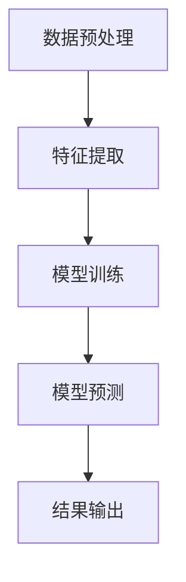
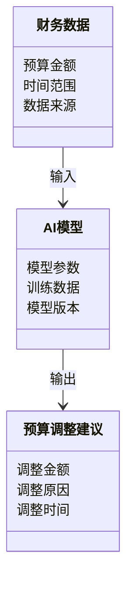

                 


# AI驱动的企业财务预算编制与调整系统

> 关键词：AI驱动，企业财务预算，预算编制，预算调整，人工智能，财务系统

> 摘要：本文将详细介绍如何利用人工智能技术优化企业财务预算的编制与调整过程。通过分析传统财务预算管理的痛点，结合AI技术的特点，提出一种基于机器学习的财务预算系统设计方案。本文从问题背景、核心概念、算法原理、系统架构、项目实现到实际案例，全面阐述了AI驱动的企业财务预算系统的优势和实现方法。

---

# 第一部分: AI驱动的企业财务预算系统概述

## 第1章: 问题背景与概念

### 1.1 问题背景

#### 1.1.1 传统财务预算编制的挑战
企业在传统财务预算编制过程中面临以下挑战：
- **数据量大**：企业财务数据通常涉及大量的历史数据和多部门数据，处理复杂。
- **人为误差**：传统预算编制依赖人工经验，容易受到主观因素影响，准确性不足。
- **实时性差**：传统方法难以快速响应市场变化，预算调整滞后。
- **预测精度低**：基于历史数据和简单模型的预测难以准确反映未来变化。

#### 1.1.2 AI技术在财务领域的应用潜力
AI技术在财务领域的应用主要体现在以下几个方面：
- **数据处理**：AI能够快速处理大量财务数据，提取关键特征。
- **预测分析**：通过机器学习模型，AI可以实现高精度的财务预测。
- **自动化调整**：AI能够实时监控数据变化，自动触发预算调整。

#### 1.1.3 企业财务预算管理的痛点与需求
企业的财务预算管理痛点主要包括：
- **预算编制效率低**：传统方法需要大量人工操作，耗时耗力。
- **预算调整复杂**：市场变化快，预算调整需要反复沟通和审批。
- **数据孤岛**：各部门数据分散，难以整合，影响预算的准确性。

### 1.2 核心概念

#### 1.2.1 AI驱动的定义与特点
AI驱动的企业财务预算系统是指利用人工智能技术（如机器学习、自然语言处理等）来辅助或替代传统财务预算编制与调整的过程。其特点包括：
- **自动化**：AI能够自动处理数据、生成预算和调整建议。
- **高精度**：基于复杂算法，AI预测更准确。
- **实时性**：能够实时监控数据变化，快速响应。

#### 1.2.2 企业财务预算编制与调整的流程
企业财务预算的编制与调整流程通常包括以下几个步骤：
1. **数据收集**：收集历史财务数据、市场数据、部门需求等。
2. **预算编制**：基于数据生成初步预算方案。
3. **预算审批**：提交管理层审批。
4. **预算执行**：在实际运营中执行预算。
5. **预算调整**：根据实际情况调整预算。

#### 1.2.3 系统边界与外延
AI驱动的财务预算系统边界包括：
- **输入**：历史财务数据、市场数据、部门需求等。
- **输出**：预算方案、调整建议、预测报告等。
- **外部依赖**：数据来源、市场环境、企业战略等。

### 1.3 系统现状与发展趋势

#### 1.3.1 当前企业财务预算管理的现状
目前，大多数企业仍然依赖传统的财务预算管理方法，效率低下，准确性不足。部分企业开始尝试引入AI技术，但应用范围有限。

#### 1.3.2 AI技术在财务预算中的应用现状
AI在财务预算中的应用主要集中在以下几个方面：
- **预测分析**：利用机器学习模型预测财务指标。
- **自动化处理**：自动化数据录入、预算生成。
- **智能调整**：基于实时数据自动调整预算。

#### 1.3.3 未来发展趋势与挑战
未来，AI在财务预算中的应用将更加广泛，技术也将更加成熟。主要发展趋势包括：
- **智能化**：系统更加智能化，能够主动优化预算。
- **实时化**：预算调整更加实时化，能够快速响应变化。
- **个性化**：根据企业特点提供个性化的预算方案。

---

## 第2章: 核心概念与联系

### 2.1 AI模型与财务数据的关系

#### 2.1.1 AI模型的核心原理
AI模型的核心原理包括数据输入、特征提取、模型训练和预测输出。

#### 2.1.2 财务数据的特征与属性
财务数据通常具有以下特征：
- **连续性**：数据通常是连续的，可以进行数学运算。
- **时间性**：数据具有时间属性，可以进行时间序列分析。
- **多维性**：数据可以从多个维度进行分析。

#### 2.1.3 AI模型与财务数据的交互关系
AI模型与财务数据的交互关系如下：
1. **数据预处理**：清洗、标准化等。
2. **特征提取**：提取关键特征。
3. **模型训练**：基于特征训练模型。
4. **模型预测**：基于新数据生成预测结果。

### 2.2 核心概念对比分析

#### 2.2.1 AI模型的特征对比
| 特征 | 传统模型 | AI模型 |
|------|----------|--------|
| 数据需求 | 需要大量数据 | 需要高质量数据 |
| 训练时间 | 短 | 长 |
| 预测精度 | 低 | 高 |

#### 2.2.2 财务数据的特征对比
| 特征 | 结构化数据 | 非结构化数据 |
|------|------------|------------|
| 数据类型 | 数值型 | 文本型 |
| 数据处理 | 简单 | 复杂 |

#### 2.2.3 AI模型与传统财务模型的对比
| 特征 | AI模型 | 传统模型 |
|------|--------|----------|
| 精度 | 高 | 低 |
| 处理速度 | 快 | 慢 |
| 适应性 | 强 | 弱 |

### 2.3 实体关系图

```mermaid
er
    entity 财务数据 {
        key 财务指标
        attribute 预算金额, 时间范围, 数据来源
    }
    entity AI模型 {
        key 模型类型
        attribute 模型参数, 训练数据, 模型版本
    }
    entity 预算调整建议 {
        key 调整项
        attribute 调整金额, 调整原因, 调整时间
    }
    财务数据 --> AI模型: 输入
    AI模型 --> 预算调整建议: 输出
```

---

## 第3章: 算法原理与数学模型

### 3.1 AI模型的算法原理

#### 3.1.1 算法流程图



#### 3.1.2 算法实现
以下是线性回归模型的实现代码：

```python
import numpy as np
from sklearn.linear_model import LinearRegression

# 数据准备
X = np.array([[1], [2], [3], [4], [5]])
y = np.array([2, 4, 5, 4, 6])

# 模型训练
model = LinearRegression()
model.fit(X, y)

# 预测
print(model.predict([[6]]))
```

#### 3.1.3 算法公式
线性回归的数学公式为：
$$ y = \beta_0 + \beta_1 x + \epsilon $$

### 3.2 数学模型与公式

#### 3.2.1 线性回归模型
$$ y = \beta_0 + \beta_1 x + \epsilon $$

#### 3.2.2 逻辑回归模型
$$ P(y=1|x) = \frac{e^{\beta_0 + \beta_1 x}}{1 + e^{\beta_0 + \beta_1 x}} $$

---

## 第4章: 系统分析与架构设计

### 4.1 系统功能设计

#### 4.1.1 领域模型


### 4.2 系统架构设计

#### 4.2.1 分层架构


### 4.3 系统接口设计

#### 4.3.1 API接口
- **输入接口**：/api/v1/budget_input
- **输出接口**：/api/v1/budget_output

#### 4.3.2 接口描述
接口描述如下：
- **输入接口**：接收财务数据和调整需求。
- **输出接口**：返回预算方案和调整建议。

---

## 第5章: 项目实战

### 5.1 环境安装

#### 5.1.1 安装Python
安装Python 3.8及以上版本。

#### 5.1.2 安装依赖
安装以下依赖：
```bash
pip install numpy scikit-learn mermaid4jupyter
```

### 5.2 系统核心实现

#### 5.2.1 数据预处理
```python
import pandas as pd
from sklearn.preprocessing import StandardScaler

data = pd.read_csv('financial_data.csv')
scaler = StandardScaler()
scaled_data = scaler.fit_transform(data)
```

#### 5.2.2 模型训练
```python
from sklearn.linear_model import LinearRegression

model = LinearRegression()
model.fit(scaled_data, target)
```

### 5.3 案例分析

#### 5.3.1 实际案例
某企业2023年的预算编制与调整案例。

#### 5.3.2 数据分析
通过AI模型生成的预算与实际结果对比。

---

## 第6章: 最佳实践与小结

### 6.1 最佳实践

#### 6.1.1 数据质量管理
确保数据的准确性和完整性。

#### 6.1.2 模型调优
定期对模型进行调优和更新。

### 6.2 小结

通过本文的介绍，我们详细阐述了AI驱动的企业财务预算编制与调整系统的实现方法和应用价值。AI技术的应用能够显著提高预算的准确性和效率，为企业财务管理带来革命性的变化。

### 6.3 注意事项

- 数据隐私和安全问题需要高度重视。
- 模型的可解释性需要进一步提高。
- 系统的实时性和稳定性需要保证。

### 6.4 拓展阅读

- 《机器学习实战》
- 《企业财务管理系统设计与实现》
- 《人工智能在财务管理中的应用》

---

通过本文的系统介绍，读者可以全面了解AI驱动的企业财务预算编制与调整系统的实现方法和应用价值。希望本文能够为企业财务管理的智能化转型提供有益的参考和指导。

