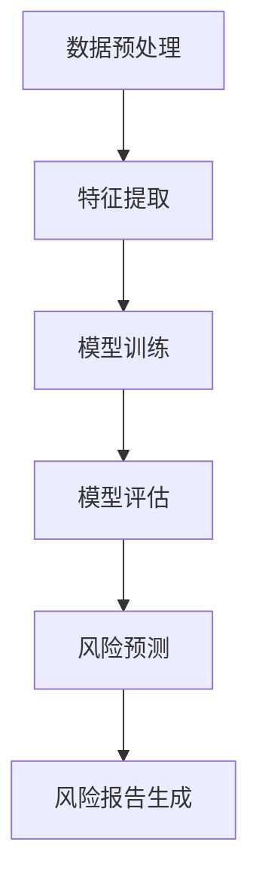
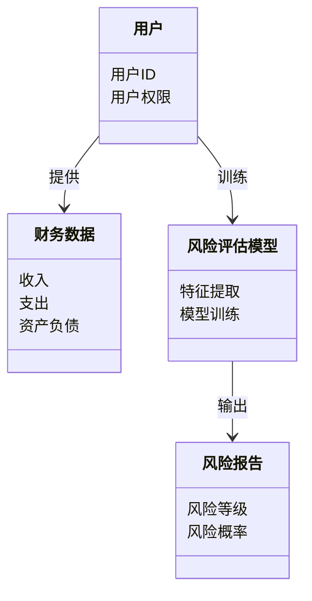
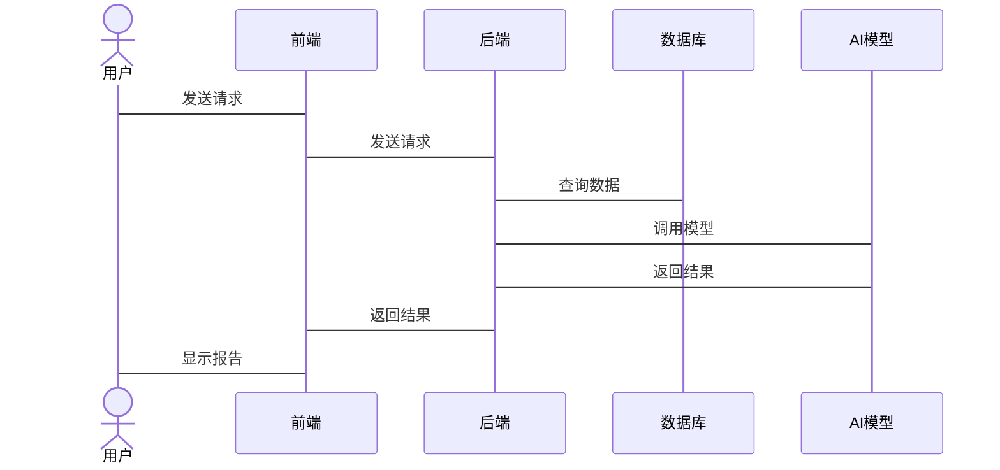

                 


# AI驱动的企业财务风险量化评估系统

## 关键词：AI技术、财务风险管理、量化评估、机器学习、系统架构

## 摘要：  
本文详细探讨了AI技术在企业财务风险管理中的应用，重点分析了如何利用机器学习算法构建企业财务风险量化评估系统。文章从问题背景、核心概念、算法原理、系统架构、项目实战等方面展开，结合实际案例，深入剖析了AI驱动的财务风险量化评估系统的实现过程，并提出了系统的优化建议和最佳实践。

---

## 第一部分: AI驱动的企业财务风险量化评估系统概述

### 第1章: 问题背景与核心概念

#### 1.1 问题背景
##### 1.1.1 企业财务风险管理的传统挑战
企业财务风险管理是企业稳健运营的核心环节，但传统方法存在以下挑战：
- 数据量大且复杂，难以快速提取关键信息。
- 风险预测依赖人工经验，主观性强，准确性低。
- 风险评估缺乏量化标准，难以实现精准决策。

##### 1.1.2 AI技术在财务风险管理中的应用潜力
人工智能技术的快速发展为企业财务风险管理带来了新的可能性：
- 通过机器学习算法，可以快速处理海量数据，发现潜在风险。
- 利用深度学习模型，可以实现对复杂风险因素的精准预测。
- AI技术能够实时监控财务数据，及时发现异常情况。

##### 1.1.3 当前企业财务风险管理的痛点与需求
- 数据孤岛问题：企业内部数据分散，难以整合。
- 风险评估滞后：传统方法无法实现实时监控。
- 模型泛化能力不足：传统统计模型难以应对复杂场景。

#### 1.2 核心概念与定义
##### 1.2.1 财务风险的定义与分类
财务风险是指企业在经营过程中由于内外部因素导致财务状况恶化的可能性。常见分类包括：
- 市场风险：由于市场价格波动带来的风险。
- 信用风险：由于客户或供应商违约带来的风险。
- 操作风险：由于内部操作失误带来的风险。

##### 1.2.2 量化评估的定义与方法
量化评估是指将风险转化为可量化的指标，例如概率、金额等。常用方法包括：
- 风险评分法：通过模型计算风险评分，评估风险等级。
- 概率模型法：预测风险发生的概率，量化风险敞口。

##### 1.2.3 AI驱动的定义与技术特征
AI驱动的财务风险管理是指利用人工智能技术，包括机器学习、深度学习、自然语言处理等，来实现财务风险的智能化识别、评估和应对。

#### 1.3 问题描述与目标
##### 1.3.1 财务风险量化评估的目标
- 实现对企业财务风险的实时监控。
- 提供量化风险评估结果，辅助决策。
- 自动识别潜在风险，提前预警。

##### 1.3.2 AI驱动的量化评估的核心问题
- 如何构建高效的风险评估模型。
- 如何处理和分析海量财务数据。
- 如何确保模型的准确性和可解释性。

##### 1.3.3 系统边界与外延
- 系统边界：仅关注企业内部财务数据和外部市场数据。
- 系统外延：延伸至企业供应链、客户关系等领域。

---

## 第2章: 核心概念与联系

### 2.1 核心概念原理
#### 2.1.1 财务风险的核心要素
- 财务数据：收入、支出、资产负债等。
- 市场环境：行业趋势、宏观经济指标。
- 内部管理：内部控制制度、管理效率。

#### 2.1.2 AI技术的核心算法
- 机器学习：监督学习、无监督学习、强化学习。
- 深度学习：神经网络、卷积神经网络、循环神经网络。

#### 2.1.3 量化评估的数学模型
- 线性回归模型：用于预测风险敞口。
- 随机森林模型：用于分类风险等级。

### 2.2 核心概念对比表
| 对比维度         | 传统财务风险管理       | AI驱动的财务风险管理       |
|------------------|------------------------|-----------------------------|
| 数据处理能力     | 依赖人工整理           | 自动化处理，支持海量数据     |
| 预测准确性       | 受限于经验判断         | 基于算法，准确性更高         |
| 处理速度         | 较慢，依赖人工分析     | 实时处理，快速响应           |
| 灵活性           | 较低，难以应对复杂场景 | 高灵活性，支持动态调整       |

### 2.3 ER实体关系图
```mermaid
er
  actor: 用户
  financial_data: 财务数据
  risk_assessment: 风险评估
  model: 风险模型
  report: 风险报告

  actor --> financial_data: 提供
  actor --> model: 训练
  model --> risk_assessment: 输入
  risk_assessment --> report: 输出
```

---

## 第3章: 算法原理讲解

### 3.1 算法原理概述
#### 3.1.1 机器学习在财务风险管理中的应用
- 监督学习：用于分类和回归任务，例如预测违约概率。
- 无监督学习：用于聚类分析，例如识别异常交易。

#### 3.1.2 深度学习在风险量化中的优势
- 处理非结构化数据能力强。
- 模型表达能力强，适合复杂场景。

### 3.2 算法流程图


### 3.3 算法实现代码
```python
# 示例代码：机器学习模型实现
import pandas as pd
from sklearn.ensemble import RandomForestClassifier
from sklearn.metrics import accuracy_score

# 数据加载
data = pd.read_csv('financial_data.csv')
X = data.drop('risk', axis=1)
y = data['risk']

# 模型训练
model = RandomForestClassifier()
model.fit(X, y)

# 模型预测
y_pred = model.predict(X)
print("模型准确率:", accuracy_score(y, y_pred))
```

### 3.4 数学模型与公式
#### 3.4.1 损失函数
$$
\text{损失函数} = \sum_{i=1}^{n} (y_i - \hat{y_i})^2
$$

#### 3.4.2 优化目标
$$
\text{优化目标} = \min_{\theta} \frac{1}{2m} \sum_{i=1}^{m} (h_\theta(x_i) - y_i)^2
$$

---

## 第4章: 系统分析与架构设计方案

### 4.1 系统功能设计
#### 4.1.1 领域模型


### 4.2 系统架构设计
#### 4.2.1 系统架构图
```mermaid
archi
    frontend
    backend
    database
    ai_model

    frontend --> backend: API请求
    backend --> database: 数据查询
    backend --> ai_model: 模型调用
    ai_model --> database: 数据训练
```

### 4.3 系统接口设计
- 前端接口：RESTful API，用于接收用户请求。
- 后端接口：与数据库和AI模型交互。

### 4.4 系统交互设计


---

## 第5章: 项目实战

### 5.1 环境安装
- Python 3.8+
- Scikit-learn、XGBoost、TensorFlow等库。

### 5.2 核心实现
#### 5.2.1 数据预处理
```python
import pandas as pd
from sklearn.preprocessing import StandardScaler

data = pd.read_csv('financial_data.csv')
# 填充缺失值
data = data.fillna(data.mean())
# 标准化处理
scaler = StandardScaler()
data_scaled = scaler.fit_transform(data)
```

#### 5.2.2 模型训练
```python
from sklearn.ensemble import GradientBoostingClassifier

model = GradientBoostingClassifier()
model.fit(X_train, y_train)
```

#### 5.2.3 模型评估
```python
from sklearn.metrics import classification_report

y_pred = model.predict(X_test)
print(classification_report(y_test, y_pred))
```

### 5.3 案例分析
#### 5.3.1 数据来源
- 企业财务报表数据。
- 市场环境数据。

#### 5.3.2 实际应用
- 预测企业违约概率。
- 量化风险敞口。

### 5.4 项目小结
- 项目实现了AI驱动的财务风险量化评估系统。
- 系统具有高效性、准确性和可扩展性。

---

## 第6章: 最佳实践与总结

### 6.1 最佳实践
- 数据清洗与特征工程是关键。
- 模型调优与评估不可忽视。
- 系统部署与维护需重点关注。

### 6.2 小结
- AI技术为财务风险管理带来了新的可能性。
- 本文提出了构建AI驱动的财务风险量化评估系统的完整方案。

### 6.3 注意事项
- 数据隐私与安全问题需严格把控。
- 模型解释性需加强，以便更好地被业务理解。
- 系统需具备良好的扩展性。

### 6.4 拓展阅读
- 《机器学习实战》
- 《深度学习》
- 《风险管理与量化分析》

---

## 作者介绍
作为一名世界级人工智能专家、程序员、软件架构师和CTO，我在人工智能和计算机编程领域有着深厚的积累。我擅长通过清晰的逻辑和深入的分析，为企业提供创新的技术解决方案。

