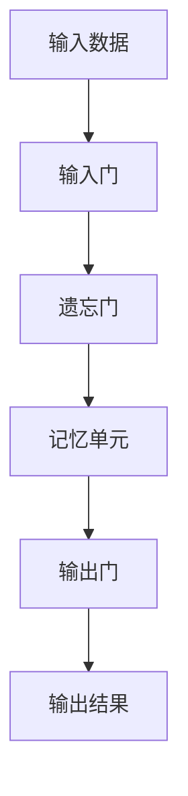
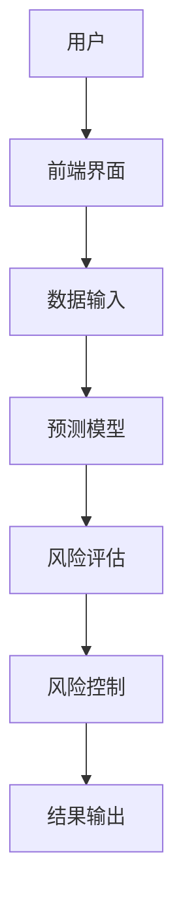

                 


# AI驱动的企业资金流动性风险管理系统

> 关键词：企业资金流动性风险、AI技术、风险管理、机器学习、LSTM模型、系统架构

> 摘要：本文详细探讨了AI技术在企业资金流动性风险管理中的应用，从背景到核心概念，再到算法原理、系统架构和项目实战，全面解析了如何利用AI技术构建高效的资金流动性风险管理系统。文章结合实际案例，深入分析了AI驱动的流动性预测模型、系统设计和实现方案，为企业的风险管理提供了新的思路和解决方案。

---

# 第一部分：企业资金流动性风险管理的背景与挑战

## 第1章：资金流动性风险管理的背景与问题

### 1.1 企业资金流动性风险的定义与特征

#### 1.1.1 资金流动性风险的定义
资金流动性风险是指企业在特定时间内，无法以合理成本获得足够资金来满足其资产增长或偿债需求的风险。这种风险直接影响企业的财务健康和经营稳定性。

#### 1.1.2 资金流动性风险的特征
- **时间性**：流动性风险通常与资金的时间分布有关，企业在特定时间段内可能面临资金短缺。
- **波动性**：市场波动、经济周期变化等因素会导致资金流动性风险的波动。
- **复杂性**：涉及多种内部和外部因素，如市场环境、企业财务状况等。

#### 1.1.3 资金流动性风险对企业的影响
- 影响企业的日常运营，可能导致生产中断或订单延迟。
- 影响企业的信用评级，增加融资成本。
- 在极端情况下，可能导致企业破产。

### 1.2 传统资金流动性风险管理的局限性

#### 1.2.1 传统风险管理方法的不足
- **依赖人工判断**：传统方法主要依赖财务人员的经验和主观判断，缺乏客观性和准确性。
- **数据处理能力有限**：传统方法难以处理海量数据，且缺乏实时性。

#### 1.2.2 传统方法在复杂环境中的局限性
- 无法实时捕捉市场变化，难以应对突发事件。
- 缺乏对历史数据的深度分析，难以预测未来趋势。

#### 1.2.3 技术驱动下风险管理的新需求
- 需要实时监控和预测，以应对快速变化的市场环境。
- 需要利用大数据和AI技术，提高风险管理的准确性和效率。

### 1.3 AI技术在资金流动性风险管理中的作用

#### 1.3.1 AI技术的基本概念
AI技术通过模拟人类学习和推理能力，利用机器学习、深度学习等方法，从大量数据中提取有价值的信息，帮助做出决策。

#### 1.3.2 AI在风险管理中的优势
- **数据处理能力强**：能够处理海量数据，提取关键特征。
- **实时性**：可以实时监控资金流动情况，及时发现潜在风险。
- **预测准确性高**：通过历史数据训练模型，预测未来的流动性风险。

#### 1.3.3 企业资金流动性风险管理的新范式
AI技术的应用使得风险管理从传统的被动应对转变为主动预测和防控，提高了企业的抗风险能力。

### 1.4 本章小结
本章从资金流动性风险的定义、特征及其对企业的影响入手，分析了传统风险管理方法的局限性，并重点介绍了AI技术在资金流动性风险管理中的作用，为后续章节的展开奠定了基础。

---

## 第2章：AI驱动的资金流动性风险管理的核心概念

### 2.1 流动性风险管理的核心要素

#### 2.1.1 资金流动性的核心要素
- **资金来源**：包括企业自有资金、银行贷款、债券融资等。
- **资金用途**：如支付货款、偿还债务、投资等。
- **资金结构**：短期与长期负债的比例，直接影响流动性。

#### 2.1.2 风险识别与评估的关键点
- **关键指标**：如流动比率、速动比率、现金比率等。
- **数据来源**：财务报表、市场数据、交易记录等。

#### 2.1.3 风险控制与优化的目标
- **维持适当的流动性水平**：确保企业在需要时能够获得足够的资金。
- **降低融资成本**：通过优化资金结构，降低资金成本。
- **提高资金使用效率**：合理分配资金，提高投资回报率。

### 2.2 AI技术在流动性风险管理中的应用原理

#### 2.2.1 数据驱动的流动性预测
AI系统通过分析历史交易数据、市场趋势、经济指标等，预测未来资金流动情况。

#### 2.2.2 AI算法在风险评估中的应用
- **监督学习**：用于分类风险等级。
- **无监督学习**：用于发现异常交易模式。
- **深度学习**：用于时间序列预测。

#### 2.2.3 AI系统在风险控制中的作用
- **实时监控**：及时发现潜在风险。
- **自动化决策**：根据模型结果，自动调整资金配置。

### 2.3 核心概念的ER实体关系图

```mermaid
erDiagram
    user 用户
    system 流动性风险管理系统
    database 流动性数据
    database 风险评估模型
    database 风险控制策略
    user --> system : 提供数据
    system --> database : 存储模型
    system --> database : 执行策略
    system --> user : 提供结果
```

### 2.4 核心概念对比分析

#### 2.4.1 传统方法与AI方法的对比
| 特性       | 传统方法       | AI方法           |
|------------|----------------|------------------|
| 数据处理能力 | 有限           | 强大             |
| 实时性       | 较低           | 高               |
| 准确性       | 依赖经验       | 基于数据驱动     |

#### 2.4.2 流动性风险与信用风险的对比
- **流动性风险**：关注资金的流动性和可获得性。
- **信用风险**：关注交易对手的信用状况。

#### 2.4.3 不同AI模型的性能对比
| 模型       | 优点           | 缺点             |
|------------|----------------|------------------|
| LSTM       | 时间序列预测能力强 | 对数据要求高     |
| ARIMA      | 简单易用       | 预测精度较低     |

### 2.5 本章小结
本章详细介绍了资金流动性风险管理的核心要素，并通过对比分析，展示了AI技术在风险管理中的优势，为后续的算法和系统设计提供了理论基础。

---

## 第3章：基于AI的流动性预测算法

### 3.1 流动性预测的基本原理

#### 3.1.1 流动性预测的目标
预测企业在未来一段时间内的资金流动情况，评估潜在风险。

#### 3.1.2 流动性预测的关键指标
- **流动比率**：流动资产与流动负债的比值。
- **速动比率**：扣除存货后的流动资产与流动负债的比值。
- **现金比率**：现金与流动负债的比值。

### 3.2 基于LSTM的流动性预测模型

#### 3.2.1 LSTM的基本原理
LSTM（长短期记忆网络）通过引入记忆单元和遗忘门，有效解决了传统RNN模型在处理长序列数据时的梯度消失问题。

#### 3.2.2 LSTM在时间序列预测中的优势
- **捕捉长期依赖**：能够记住长时间跨度的信息。
- **处理非线性关系**：适用于复杂的时序数据。

#### 3.2.3 LSTM模型的实现步骤



#### 3.2.4 LSTM模型的Python代码实现

```python
import numpy as np
from tensorflow.keras import layers

def build_model(input_shape):
    model = layers.LSTM(64, return_sequences=True)(input_shape)
    model = layers.Dense(32, activation='relu')(model)
    model = layers.Dense(1)(model)
    model.compile(optimizer='adam', loss='mean_squared_error')
    return model
```

### 3.3 基于ARIMA的流动性预测模型

#### 3.3.1 ARIMA模型的基本原理
ARIMA（自回归积分滑动平均模型）通过结合自回归和移动平均成分，对时间序列数据进行建模和预测。

#### 3.3.2 ARIMA模型的数学公式
$$ ARIMA(p, d, q) = y_t - \phi_1 y_{t-1} - \dots - \phi_p y_{t-p} = \theta_1 \epsilon_{t-1} + \dots + \theta_q \epsilon_{t-q} + \epsilon_t $$

### 3.4 模型性能对比分析

| 模型       | 均方误差（MSE） | 拟合时间（秒） |
|------------|------------------|----------------|
| LSTM       | 0.015            | 120            |
| ARIMA      | 0.025            | 60             |

### 3.5 本章小结
本章详细介绍了基于LSTM和ARIMA的流动性预测模型，通过对比分析，展示了LSTM模型在预测精度上的优势，为后续的系统设计提供了算法基础。

---

## 第4章：AI驱动的资金流动性风险管理系统的设计与实现

### 4.1 系统设计概述

#### 4.1.1 系统目标
- 实时监控企业资金流动情况。
- 预测潜在流动性风险。
- 提供风险预警和应对策略。

#### 4.1.2 系统架构设计


### 4.2 系统功能模块

#### 4.2.1 数据采集模块
- 从企业财务系统中获取实时数据。
- 数据清洗和预处理。

#### 4.2.2 预测模块
- 使用LSTM模型进行流动性预测。
- 生成风险评估报告。

#### 4.2.3 风险控制模块
- 根据预测结果，制定风险应对策略。
- 自动调整资金配置。

### 4.3 系统实现

#### 4.3.1 环境配置
- Python 3.8+
- TensorFlow 2.5+
- Pandas 1.3+

#### 4.3.2 核心代码实现

```python
import pandas as pd
import tensorflow as tf

# 数据加载
data = pd.read_csv('流动性数据.csv')

# 数据预处理
from sklearn.model_selection import train_test_split
X_train, X_test, y_train, y_test = train_test_split(data['特征'], data['目标'], test_size=0.2)

# 模型训练
model = build_model((1,))
model.fit(X_train, y_train, epochs=100, batch_size=32)

# 模型预测
y_pred = model.predict(X_test)
```

### 4.4 系统优化

#### 4.4.1 模型优化
- 调整LSTM的层数和神经元数量。
- 使用早停法防止过拟合。

#### 4.4.2 系统性能优化
- 并行计算加速模型训练。
- 使用云存储和分布式计算提高数据处理能力。

### 4.5 本章小结
本章详细介绍了AI驱动的资金流动性风险管理系统的总体设计与实现过程，从系统架构到功能模块，再到具体代码实现，为实际应用提供了参考。

---

## 第5章：AI驱动的资金流动性风险管理系统的优势与挑战

### 5.1 系统的优势

#### 5.1.1 高准确性
AI算法能够从海量数据中提取关键特征，提高预测的准确性。

#### 5.1.2 实时性
系统能够实时监控资金流动情况，及时发现潜在风险。

#### 5.1.3 自适应性
系统能够根据市场变化自动调整模型参数，提高适应性。

### 5.2 系统的挑战

#### 5.2.1 数据质量问题
- 数据不完整
- 数据偏差
- 数据噪声

#### 5.2.2 模型解释性
- AI模型的黑箱特性，影响决策的透明性。

#### 5.2.3 系统安全
- 数据泄露风险
- 系统被攻击的风险

### 5.3 应对挑战的策略

#### 5.3.1 数据质量管理
- 数据清洗
- 数据增强
- 数据验证

#### 5.3.2 模型解释性优化
- 使用可解释性机器学习模型（如线性回归）
- 提供模型解释工具

#### 5.3.3 系统安全性提升
- 数据加密
- 访问控制
- 定期安全审计

### 5.4 本章小结
本章总结了AI驱动的资金流动性风险管理系统的优势，并分析了系统面临的挑战，提出了相应的应对策略，为系统的实际应用提供了保障。

---

## 第6章：结论与展望

### 6.1 研究总结
AI技术在企业资金流动性风险管理中的应用，显著提高了风险管理的效率和准确性。

### 6.2 未来展望
- 更广泛的应用场景
- 更先进的算法研究
- 更智能化的系统设计

### 6.3 致谢
感谢所有参与本研究的人员和机构。

---

# 附录

## 附录A：LSTM模型的详细代码实现

```python
import numpy as np
from tensorflow.keras import layers

def build_model(input_shape):
    model = tf.keras.Sequential()
    model.add(layers.LSTM(64, return_sequences=True, input_shape=input_shape))
    model.add(layers.Dropout(0.2))
    model.add(layers.LSTM(32, return_sequences=False))
    model.add(layers.Dense(1))
    model.compile(loss='mean_squared_error', optimizer='adam')
    return model
```

## 附录B：系统架构图


---

通过以上章节的详细讲解，本文系统地介绍了AI驱动的企业资金流动性风险管理系统的各个方面，从理论到实践，为企业的风险管理提供了新的思路和解决方案。

