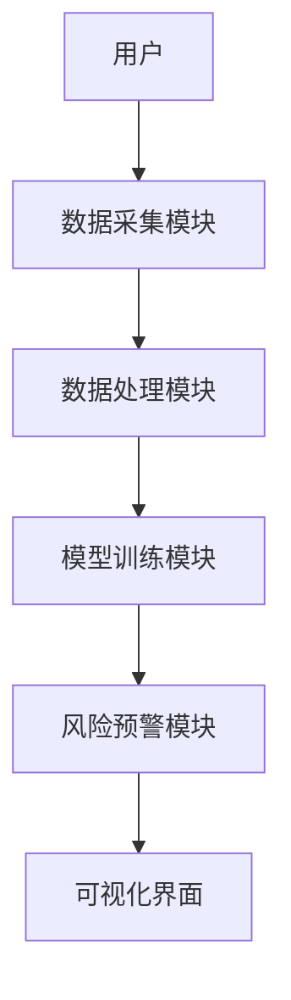

                 


# AI驱动的供应商健康度分析：评估上游风险

## 关键词：供应商健康度，AI，风险评估，供应链管理，机器学习，风险预警

## 摘要：  
本文探讨了如何利用人工智能技术对供应商的健康状况进行分析，以评估和管理供应链中的上游风险。文章首先介绍了供应商健康度分析的重要性，然后详细讲解了核心概念、算法原理、系统架构，并通过实际案例展示了如何利用AI技术实现供应商健康度评估。最后，文章总结了最佳实践和未来发展方向，为供应链风险管理提供了新的思路。

---

# 第1章: 供应商健康度分析概述

## 1.1 问题背景与描述

### 1.1.1 供应链管理的重要性  
现代企业高度依赖供应链，从原材料采购到产品交付的每一个环节都与供应商密切相关。供应商的稳定性直接影响企业的生产效率和成本控制。然而，供应链中的不确定性（如供应商财务状况恶化、交货延迟等）可能导致严重的经济损失。

### 1.1.2 问题描述  
传统的供应商评估方法通常依赖人工经验或简单的财务指标分析，难以全面、动态地评估供应商的健康状况。尤其是在数据量庞大的情况下，人工评估效率低下且容易出错。

### 1.1.3 问题解决方法  
引入AI技术，通过机器学习算法分析海量数据，提取关键特征，构建供应商健康度模型，实现自动化、智能化的评估。

### 1.1.4 边界与外延  
供应商健康度分析主要关注供应商的财务状况、交货能力、产品质量等核心指标，不涉及供应商的内部管理细节。其外延包括风险预警、供应链优化和供应商关系管理。

### 1.1.5 核心要素与概念结构  
- **输入数据**：供应商的历史交易数据、财务数据、物流数据、市场反馈等。
- **输出结果**：供应商健康度评分（如A、B、C、D等级）、风险预警信号。
- **核心算法**：机器学习模型（如随机森林、逻辑回归等）。
- **应用场景**：供应链优化、风险控制、供应商筛选。

---

# 第2章: 核心概念与联系

## 2.1 供应商健康度分析的原理  
供应商健康度分析通过整合多源数据，利用AI算法对供应商进行综合评估，帮助企业在供应链管理中做出更明智的决策。

## 2.2 核心概念属性对比  

| 概念       | 描述                                                                 |
|------------|----------------------------------------------------------------------|
| 供应商健康度 | 衡量供应商在财务、运营和交付能力方面的健康状况。                     |
| 数据特征   | 包括供应商的历史订单数据、财务报表、交货准时率等。                   |
| 模型性能   | 包括模型的准确率、召回率、F1分数等。                                 |
| 评估指标   | 包括健康度评分、风险等级（如低风险、中风险、高风险）。               |

## 2.3 实体关系架构  
```mermaid
er
  %% 供应商健康度分析的实体关系图
  actor(供应商)
  actor(客户)
  actor(评估系统)
  entity(供应商信息)
  entity(评估指标)
  entity(健康报告)
  entity(风险预警)
  relation(供应商 -> 供应商信息: 1..n)
  relation(供应商 -> 评估指标: 1..n)
  relation(评估系统 -> 供应商信息: 1..n)
  relation(评估系统 -> 评估指标: 1..n)
  relation(评估系统 -> 健康报告: 1..n)
  relation(健康报告 -> 风险预警: 1..n)
```

---

# 第3章: 算法原理与实现

## 3.1 数据预处理  
数据预处理是机器学习模型训练的基础，包括数据清洗、特征提取和数据标准化。

### 3.1.1 数据清洗  
- 删除重复数据。
- 处理缺失值（如用均值填充、删除异常值）。
- 标准化数据（如归一化处理）。

```python
# 示例代码：数据清洗
import pandas as pd
data = pd.read_csv('suppliers.csv')
data.drop_duplicates(inplace=True)
data.fillna(data.mean(), inplace=True)
```

## 3.2 特征工程  
特征工程是提升模型性能的关键，包括选择重要的特征和构建新特征。

### 3.2.1 特征选择  
- 使用相关性分析（如皮尔逊相关系数）选择重要特征。
- 使用LASSO回归进行特征筛选。

### 3.2.2 特征构建  
- 将时间序列数据（如交货准时率）进行滑动窗口处理。
- 将分类变量（如供应商等级）进行独热编码。

## 3.3 模型训练  
使用机器学习算法（如随机森林、逻辑回归）进行模型训练。

### 3.3.1 随机森林模型  
随机森林是一种基于树的集成算法，适合处理高维数据。

```python
from sklearn.ensemble import RandomForestClassifier
model = RandomForestClassifier(n_estimators=100, random_state=42)
model.fit(X_train, y_train)
```

### 3.3.2 模型评估  
评估指标包括准确率、召回率、F1分数等。

---

## 3.4 模型调优与部署  

### 3.4.1 超参数优化  
使用网格搜索或随机搜索优化模型参数。

### 3.4.2 模型部署  
将训练好的模型部署到生产环境中，实时接收供应商数据，输出健康度评分。

---

# 第4章: 系统分析与架构设计

## 4.1 问题场景介绍  
供应商健康度分析系统需要处理大量异构数据，实时输出健康报告和风险预警。

## 4.2 系统功能设计  

### 4.2.1 数据采集模块  
- 从ERP系统、财务系统等数据源采集供应商信息。
- 数据格式包括结构化数据（如CSV）和非结构化数据（如文本评论）。

### 4.2.2 数据处理模块  
- 对采集到的数据进行清洗、转换和标准化。
- 使用工具如Pandas和Spark进行数据处理。

### 4.2.3 模型训练模块  
- 使用机器学习框架（如Scikit-learn、XGBoost）训练供应商健康度模型。
- 定期更新模型以适应数据变化。

### 4.2.4 风险预警模块  
- 根据模型输出的健康评分，生成风险预警信号。
- 提供可视化界面，帮助用户快速识别高风险供应商。

## 4.3 系统架构设计  



---

# 第5章: 项目实战

## 5.1 环境安装  
安装必要的软件和库，如Python、Pandas、Scikit-learn、Mermaid等。

## 5.2 核心代码实现  

### 5.2.1 数据预处理代码  
```python
import pandas as pd
from sklearn.preprocessing import StandardScaler

# 读取数据
data = pd.read_csv('suppliers.csv')

# 删除重复数据
data.drop_duplicates(inplace=True)

# 处理缺失值
data.fillna(data.mean(), inplace=True)

# 标准化数据
scaler = StandardScaler()
data_scaled = scaler.fit_transform(data)
```

### 5.2.2 模型训练代码  
```python
from sklearn.ensemble import RandomForestClassifier
from sklearn.metrics import accuracy_score

# 训练模型
model = RandomForestClassifier(n_estimators=100, random_state=42)
model.fit(X_train, y_train)

# 模型评估
y_pred = model.predict(X_test)
print("准确率:", accuracy_score(y_test, y_pred))
```

### 5.2.3 可视化代码  
```python
import matplotlib.pyplot as plt
importances = model.feature_importances_
indices = np.argsort(importances)[::-1]

plt.figure(figsize=(8, 5))
plt.title('特征重要性分析')
plt.bar(range(X_train.shape[1]), importances[indices], align='center')
plt.xticks(range(X_train.shape[1]), indices, rotation=45)
plt.show()
```

## 5.3 项目小结  
通过实际案例分析，展示了如何利用AI技术实现供应商健康度分析，并给出了系统的实现方案和代码示例。

---

# 第6章: 扩展与应用

## 6.1 最佳实践  
- 定期更新模型，适应数据变化。
- 结合领域知识，优化特征工程。
- 使用分布式计算框架（如Spark）处理大规模数据。

## 6.2 小结  
本文详细介绍了AI驱动的供应商健康度分析方法，从理论到实践，为供应链风险管理提供了新的思路。

## 6.3 注意事项  
- 数据隐私问题需严格遵守相关法规。
- 模型的可解释性需关注，避免“黑箱”问题。
- 系统的实时性要求需根据具体场景调整。

## 6.4 拓展阅读  
推荐阅读以下书籍和论文：
- 《机器学习实战》
- 《供应链管理：案例分析与实践》
- 《深度学习在供应链中的应用研究》

---

# 结语  
AI驱动的供应商健康度分析正在改变供应链管理的方式。通过智能化的评估方法，企业可以更好地管理上游风险，提升供应链的整体效率和抗风险能力。未来，随着AI技术的不断发展，供应商健康度分析将更加精准、实时和智能化。

