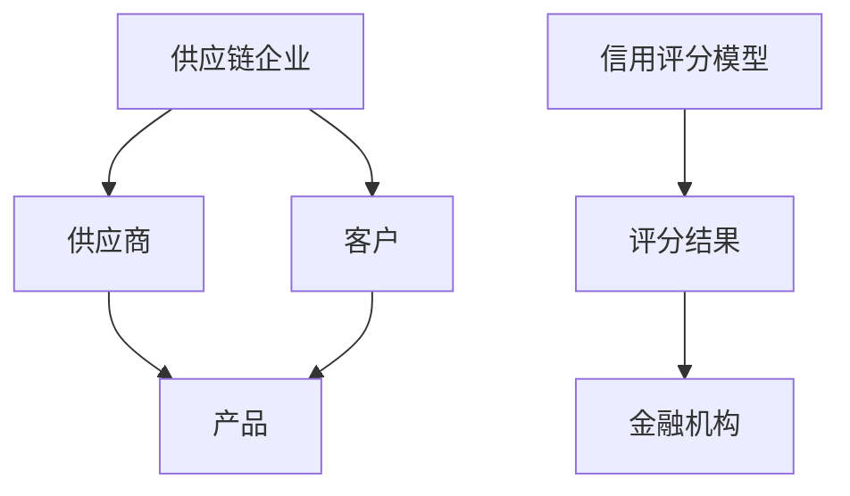
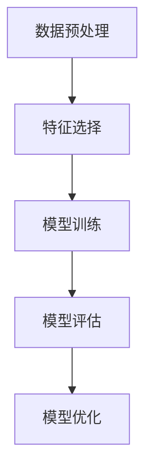
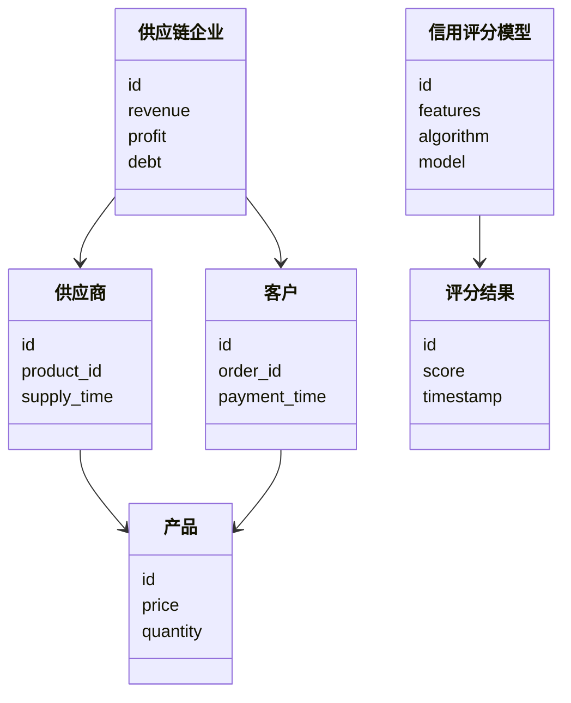
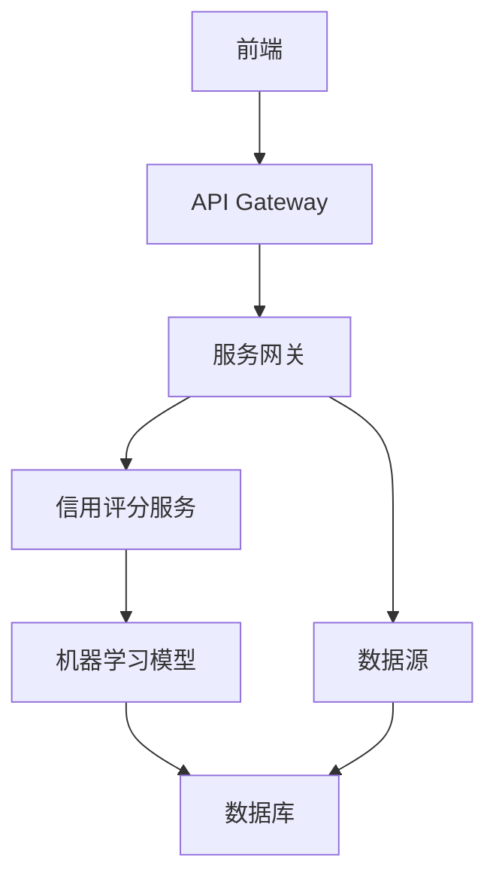
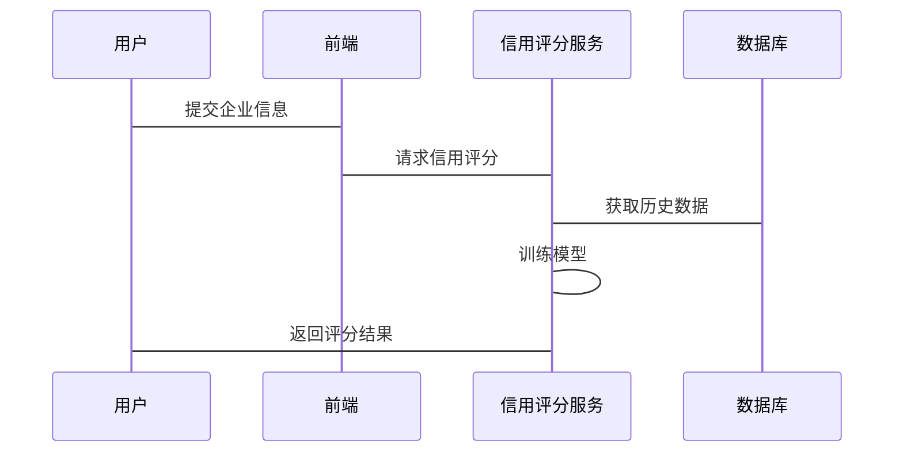

                 


# AI驱动的供应链金融信用评分模型

## 关键词：供应链金融、信用评分、人工智能、机器学习、风险管理

## 摘要：  
本文深入探讨了AI驱动的供应链金融信用评分模型的构建与应用。通过分析供应链金融的核心要素，结合人工智能技术，提出了一种基于机器学习的信用评分模型，旨在解决传统信用评估方法的局限性。文章从模型背景、核心概念、算法原理、系统设计、项目实战等多方面展开，详细阐述了模型的构建过程、实现方法及实际应用场景，为供应链金融领域的信用风险管理和优化提供了理论与实践指导。

---

## 第1章: 供应链金融与信用评分模型的背景

### 1.1 供应链金融的定义与特点
#### 1.1.1 供应链金融的定义
供应链金融（Supply Chain Finance, SCF）是指通过整合供应链上的企业、供应商、客户等多方资源，利用资金流、信息流和物流的协同优化，为供应链上的企业提供融资支持的一种金融模式。

#### 1.1.2 供应链金融的核心特点
- **协同性**：供应链金融强调供应链上下游企业之间的协同合作，而非单一企业独立运作。
- **嵌入性**：金融活动嵌入到供应链的日常运营中，而非事后补救。
- **风险分担**：通过多方参与和信息共享，降低单点风险，实现风险共担。

#### 1.1.3 供应链金融的参与者与角色
- **核心企业**：供应链中的主导企业，如制造商或零售商。
- **供应商**：为供应链提供原材料或服务的企业。
- **客户**：供应链的终端消费者或下游企业。
- **金融机构**：提供融资支持的银行或其他金融机构。
- **技术平台**：支持供应链金融运作的技术平台或系统。

### 1.2 信用评分模型的定义与作用
#### 1.2.1 信用评分模型的定义
信用评分模型（Credit Scoring Model）是一种通过分析企业或个人的财务数据、经营状况、市场表现等信息，评估其信用风险的数学模型。

#### 1.2.2 信用评分模型的作用与意义
- **风险控制**：通过评分模型识别高风险客户，降低金融机构的坏账率。
- **决策支持**：帮助金融机构快速、准确地做出融资决策。
- **效率提升**：自动化评分模型可以显著提高信用评估的效率和准确性。

#### 1.2.3 传统信用评分模型的局限性
- **数据维度有限**：传统模型主要依赖财务数据，难以全面反映企业的经营状况。
- **静态评估**：传统模型通常基于静态数据，难以捕捉企业的动态变化。
- **人工干预较多**：传统模型的评估过程依赖人工判断，主观性强，效率低。

### 1.3 AI驱动的供应链金融信用评分模型的背景
#### 1.3.1 AI技术在供应链金融中的应用趋势
随着人工智能技术的快速发展，AI在供应链金融中的应用日益广泛。通过机器学习、自然语言处理和大数据分析等技术，可以更精准地评估企业的信用风险。

#### 1.3.2 数据驱动的信用评分模型的优势
- **数据丰富性**：AI技术可以整合供应链中的多源数据，包括交易数据、物流数据、市场数据等。
- **动态评估**：基于实时数据和动态模型，信用评分可以实时更新，反映企业的最新状况。
- **自动化与智能化**：AI模型能够自动处理数据、识别模式，并自适应优化模型。

#### 1.3.3 供应链金融与AI技术的结合点
- **数据整合与分析**：AI技术可以整合供应链中的多源异构数据，构建统一的信用评估数据集。
- **风险预测与预警**：通过机器学习算法，预测企业的信用风险，提前发出预警信号。
- **决策支持与优化**：基于AI的评分模型可以为金融机构提供更精准的决策支持，并优化供应链的融资方案。

---

## 第2章: 供应链金融信用评分模型的核心概念

### 2.1 供应链金融信用评分模型的组成
#### 2.1.1 数据来源与特征
供应链金融信用评分模型的数据来源包括：
- **企业财务数据**：收入、利润、资产负债表等。
- **供应链交易数据**：订单、交货时间、交易金额等。
- **市场数据**：行业趋势、竞争对手信息、市场价格波动等。
- **物流数据**：运输时间、货物状态、供应链节点信息等。

#### 2.1.2 模型结构与算法
模型结构包括：
- **数据预处理**：数据清洗、特征提取、数据标准化等。
- **模型训练**：选择合适的机器学习算法，如逻辑回归、随机森林、神经网络等。
- **模型评估**：通过准确率、召回率、F1分数等指标评估模型性能。
- **模型优化**：通过网格搜索、交叉验证等方法优化模型参数。

#### 2.1.3 评分标准与结果输出
评分标准通常采用分数制，如0-100分，其中分数越高表示信用风险越低。评分结果可以用于金融机构的融资决策，如贷款审批、授信额度调整等。

### 2.2 核心概念的属性特征对比
#### 2.2.1 数据特征对比表

| 数据特征       | 传统信用评分模型 | AI驱动的供应链金融模型 |
|----------------|------------------|------------------------|
| 数据来源       | 财务数据为主      | 多源数据（财务、交易、物流等） |
| 数据维度       | 少               | 多                   |
| 数据实时性     | 低               | 高                   |

#### 2.2.2 模型算法对比表

| 算法类型       | 传统信用评分模型 | AI驱动的供应链金融模型 |
|----------------|------------------|------------------------|
| 算法类型       | 逻辑回归、线性模型 | 逻辑回归、随机森林、神经网络等 |
| 模型复杂度     | 简单             | 复杂                   |
| 模型性能       | 较低             | 较高                   |

#### 2.2.3 评分标准对比表

| 评分标准       | 传统信用评分模型 | AI驱动的供应链金融模型 |
|----------------|------------------|------------------------|
| 评分范围       | 0-100分         | 0-100分               |
| 评分更新频率   | 定期更新         | 实时更新               |
| 评分依据       | 财务数据为主      | 多维度数据             |

### 2.3 ER实体关系图


---

## 第3章: AI驱动信用评分模型的算法原理

### 3.1 常见算法介绍
#### 3.1.1 逻辑回归
逻辑回归是一种常用的分类算法，适用于二分类问题。其核心思想是通过 sigmoid 函数将线性回归的结果映射到概率空间。

公式：
$$ P(y=1|x) = \frac{e^{\beta_0 + \beta_1 x}}{1 + e^{\beta_0 + \beta_1 x}} $$

#### 3.1.2 随机森林
随机森林是一种基于决策树的集成算法，通过随机采样和特征选择来提高模型的泛化能力。

### 3.2 算法原理流程图


### 3.3 算法实现代码
```python
import pandas as pd
from sklearn.linear_model import LogisticRegression
from sklearn.metrics import accuracy_score

# 加载数据
data = pd.read_csv('supply_chain_data.csv')

# 特征选择
features = ['revenue', 'profit', 'debt']
target = 'credit_risk'

# 数据分割
from sklearn.model_selection import train_test_split
X_train, X_test, y_train, y_test = train_test_split(data[features], data[target], test_size=0.2)

# 模型训练
model = LogisticRegression()
model.fit(X_train, y_train)

# 模型评估
y_pred = model.predict(X_test)
print("准确率:", accuracy_score(y_test, y_pred))
```

### 3.4 算法数学模型
逻辑回归的损失函数：
$$ L(\theta) = -\frac{1}{m} \sum_{i=1}^{m} [y_i \ln h(x_i) + (1 - y_i) \ln (1 - h(x_i))] $$
其中，$$ h(x_i) = \frac{e^{\theta^T x_i}}{1 + e^{\theta^T x_i}} $$

---

## 第4章: 系统分析与架构设计方案

### 4.1 问题场景介绍
供应链金融系统需要实时处理大量的数据流，包括订单、物流、支付等信息。为了提高信用评分的准确性，需要构建一个基于AI的评分系统，实现对供应链参与方的信用风险评估。

### 4.2 项目介绍
本项目旨在开发一个AI驱动的供应链金融信用评分系统，利用机器学习技术对供应链上的企业进行信用评分，帮助金融机构做出更精准的融资决策。

### 4.3 系统功能设计
#### 4.3.1 领域模型


#### 4.3.2 系统架构设计


#### 4.3.3 系统交互设计


---

## 第5章: 项目实战

### 5.1 环境安装
- **Python 3.8+**
- **Jupyter Notebook**
- **Scikit-learn**
- **Pandas**
- **Mermaid CLI**

### 5.2 核心实现代码
```python
from sklearn.ensemble import RandomForestClassifier
from sklearn.metrics import classification_report

# 加载数据
data = pd.read_csv('supply_chain_data.csv')

# 特征选择
features = ['revenue', 'profit', 'debt', 'order_amount', 'delivery_time']
target = 'credit_risk'

# 数据分割
from sklearn.model_selection import train_test_split
X_train, X_test, y_train, y_test = train_test_split(data[features], data[target], test_size=0.2)

# 模型训练
model = RandomForestClassifier()
model.fit(X_train, y_train)

# 模型评估
y_pred = model.predict(X_test)
print(classification_report(y_test, y_pred))
```

### 5.3 代码应用解读与分析
- **特征选择**：选择了与信用评分相关的多个特征，包括收入、利润、债务、订单金额和交货时间。
- **模型训练**：使用随机森林算法，通过交叉验证优化模型参数。
- **模型评估**：通过分类报告评估模型的性能，包括准确率、召回率和F1分数。

### 5.4 实际案例分析
以某制造企业的供应链为例，分析其信用评分过程：

1. **数据收集**：收集企业的财务数据、供应链交易数据和物流数据。
2. **特征工程**：提取关键特征，如收入增长率、应收账款周转率等。
3. **模型训练**：使用训练好的随机森林模型进行评分。
4. **结果输出**：生成信用评分报告，供金融机构参考。

### 5.5 项目小结
通过项目实战，验证了AI驱动的供应链金融信用评分模型的有效性。与传统模型相比，基于机器学习的模型在准确率和效率上都有显著提升。

---

## 第6章: 最佳实践与案例分析

### 6.1 最佳实践 tips
1. **数据质量管理**：确保数据的完整性和准确性，避免因数据问题导致模型偏差。
2. **模型迭代优化**：定期更新模型，适应市场变化和企业需求。
3. **隐私与合规性**：在处理供应链数据时，需遵守相关法律法规，保护企业隐私。

### 6.2 小结
AI驱动的供应链金融信用评分模型通过整合多源数据和先进算法，显著提高了信用评估的准确性和效率。本文从理论到实践，详细探讨了模型的构建与应用，为供应链金融领域的信用风险管理提供了新的思路。

### 6.3 注意事项
- **数据隐私**：在处理企业数据时，需严格遵守数据保护法规。
- **模型解释性**：复杂的模型可能缺乏可解释性，需结合业务背景进行解读。
- **实时性要求**：高频率的供应链交易需要实时评分能力，对系统性能提出更高要求。

### 6.4 拓展阅读
- 《供应链金融：理论与实践》
- 《机器学习实战》
- 《大数据分析与应用》

---

## 附录

### 附录A: 数据集说明
- 数据来源：公开供应链数据集和企业内部数据。
- 数据格式：CSV格式，包含企业财务数据、供应链交易数据和市场数据。

### 附录B: 工具库安装
```bash
pip install pandas scikit-learn mermaid
```

### 附录C: 参考文献
1. 王某某. 《供应链金融：理论与实践》. 北京: 清华大学出版社, 2020.
2. 李某某. 《机器学习实战》. 北京: 人民邮电出版社, 2019.

---

通过以上内容，读者可以系统地了解AI驱动的供应链金融信用评分模型的构建与应用，从理论到实践，全面掌握其核心技术和实际操作方法。

