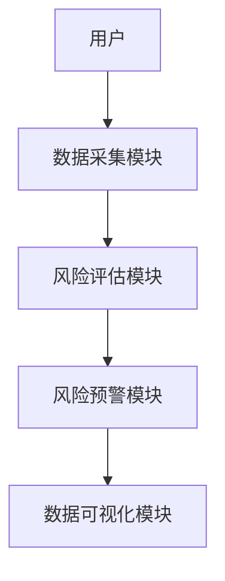
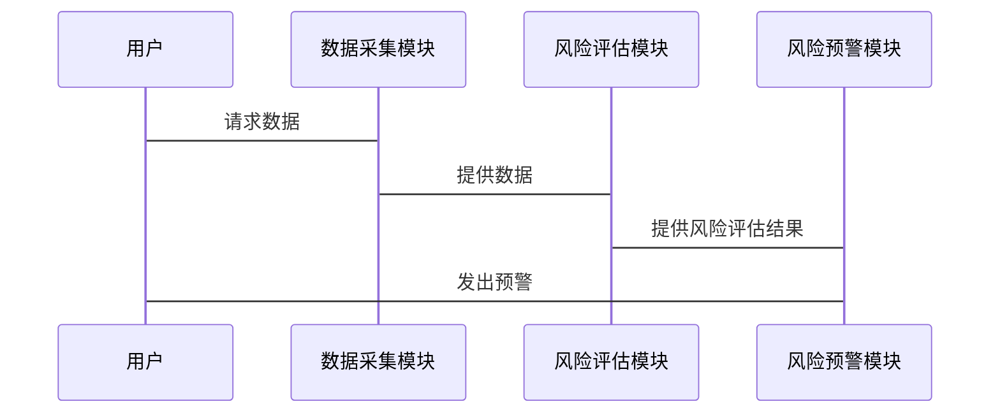

                 


# AI驱动的供应链金融信用风险传导分析

> 关键词：供应链金融，信用风险，人工智能，风险传导，机器学习

> 摘要：随着人工智能技术的快速发展，供应链金融领域的信用风险分析和管理也面临着新的机遇和挑战。本文通过分析供应链金融中的信用风险传导机制，探讨人工智能技术在信用风险评估中的应用，提出了一种基于机器学习的信用风险分析模型，并结合实际案例进行了深入分析，为供应链金融领域的风险管理提供了新的思路和解决方案。

---

# 第一章：供应链金融与信用风险概述

## 1.1 供应链金融的基本概念

### 1.1.1 供应链金融的定义
供应链金融是指通过整合供应链上的企业、金融机构、物流机构等多方资源，为企业提供资金支持的一种融资模式。其核心在于通过优化供应链的资金流、物流和信息流，降低企业的融资成本，提高供应链的整体效率。

### 1.1.2 供应链金融的核心要素
- **参与方**：包括核心企业、供应商、经销商、金融机构等。
- **资金流**：供应链金融通过应收账款质押、预付款融资等方式，为企业提供资金支持。
- **信息流**：通过供应链上的数据共享，提高信息透明度，降低交易成本。

### 1.1.3 供应链金融的参与方与流程
- **核心企业**：通常为供应链中的主导企业，负责协调各方资源。
- **供应商**：为供应链提供原材料或服务的企业。
- **经销商**：负责销售供应链最终产品的渠道商。
- **金融机构**：包括银行、保理公司等，为供应链企业提供融资支持。

供应链金融的流程一般包括：融资申请、审核、放款、监控和还款。

---

## 1.2 信用风险的基本概念

### 1.2.1 信用风险的定义
信用风险是指由于交易对手无法履行其债务义务，导致资金损失的风险。在供应链金融中，信用风险主要来源于供应商、经销商或核心企业无法按时履行合同义务，导致资金链断裂。

### 1.2.2 信用风险的主要类型
- **交易对手风险**：由于交易对手的信用状况恶化，导致无法按时还款。
- **市场风险**：由于市场波动，导致企业的经营状况恶化，进而影响其偿债能力。
- **操作风险**：由于操作失误或内部管理问题，导致信用风险发生。

### 1.2.3 信用风险的评估方法
常用的信用风险评估方法包括：
- **信用评分模型**：基于企业的财务数据、经营状况等，对其信用风险进行评分。
- **违约概率模型**：通过历史数据，预测企业未来发生违约的概率。
- **信用增级措施**：通过担保、抵押等方式，降低信用风险。

---

## 1.3 AI技术在供应链金融中的应用

### 1.3.1 AI技术的基本概念
人工智能（AI）是指模拟人类智能的计算机系统，包括机器学习、自然语言处理、计算机视觉等技术。AI技术在供应链金融中的应用主要体现在数据分析、风险评估和决策支持等方面。

### 1.3.2 AI在供应链金融中的应用场景
- **风险评估**：通过机器学习算法，分析企业的财务数据、市场数据等，评估其信用风险。
- **预测分析**：基于历史数据，预测企业的经营状况和信用风险。
- **智能监控**：通过实时监控供应链上的数据，及时发现潜在风险。

### 1.3.3 AI驱动信用风险分析的优势
- **数据处理能力**：AI技术能够处理海量数据，提高信用风险评估的效率和准确性。
- **模型优化**：通过机器学习算法，不断优化信用风险评估模型，提高预测精度。
- **实时性**：AI技术能够实时监控供应链上的数据，及时发现潜在风险。

---

# 第二章：供应链金融信用风险传导机制

## 2.1 信用风险传导的基本原理

### 2.1.1 信用风险传导的定义
信用风险传导是指信用风险从供应链上的一个企业传递到另一个企业的过程。例如，核心企业发生财务危机，可能会影响其供应商和经销商的经营状况，进而引发连锁反应。

### 2.1.2 信用风险传导的路径
- **直接传导**：核心企业的信用风险直接影响其供应商和经销商。
- **间接传导**：通过供应链上的多个环节，信用风险逐步扩散到整个供应链网络。

### 2.1.3 信用风险传导的影响因素
- **供应链结构**：供应链的复杂程度和企业之间的依赖程度。
- **企业信用状况**：企业的财务状况、经营状况等。
- **市场环境**：宏观经济环境、行业竞争状况等。

---

## 2.2 供应链金融中的信用风险传导分析

### 2.2.1 供应链金融中的信用风险来源
- **企业信用状况**：企业自身财务状况不佳，导致无法履行债务义务。
- **市场波动**：宏观经济波动、行业不景气等，影响企业的经营状况。
- **供应链管理**：供应链管理不善，导致资金链断裂。

### 2.2.2 信用风险在供应链中的传导过程
- **初始风险源**：某一环节的企业发生信用风险。
- **风险扩散**：风险通过供应链上的企业之间传导，影响整个供应链的稳定性。
- **风险放大**：由于供应链上的企业之间存在相互依赖关系，风险可能被放大，导致整个供应链的崩溃。

### 2.2.3 信用风险传导的特征与规律
- **连锁性**：供应链上的企业相互依赖，风险一旦发生，可能迅速扩散。
- **放大性**：由于企业之间的相互依赖，风险可能被放大，导致更大的损失。
- **多样性**：不同供应链的结构和企业信用状况不同，风险传导的路径和影响也不同。

---

## 2.3 基于AI的信用风险传导分析模型

### 2.3.1 模型的基本框架
基于AI的信用风险传导分析模型主要包括以下几个部分：
- **数据采集**：收集供应链上企业的财务数据、市场数据等。
- **特征提取**：通过机器学习算法，提取影响信用风险的关键特征。
- **风险评估**：基于提取的特征，评估企业的信用风险。
- **风险传导分析**：分析信用风险在供应链中的传导路径和影响范围。

### 2.3.2 模型的输入与输出
- **输入**：供应链上企业的财务数据、市场数据、供应链结构数据等。
- **输出**：企业的信用风险评分、风险传导路径、风险影响范围等。

### 2.3.3 模型的训练与优化
- **训练数据**：基于历史数据，训练机器学习模型。
- **模型优化**：通过交叉验证等方法，优化模型的参数，提高预测精度。

---

# 第三章：基于AI的信用风险评估模型

## 3.1 机器学习在信用风险分析中的应用

### 3.1.1 常见的机器学习算法
- **逻辑回归**：用于分类问题，可以预测企业的信用风险。
- **决策树**：通过树状结构，分析企业的信用风险特征。
- **随机森林**：通过集成学习，提高模型的准确性和稳定性。

### 3.1.2 机器学习在信用风险分析中的优势
- **数据驱动**：机器学习算法能够处理海量数据，发现数据中的潜在规律。
- **自动化特征提取**：机器学习能够自动提取影响信用风险的关键特征。
- **高精度预测**：通过优化模型参数，提高信用风险预测的准确性。

---

## 3.2 基于AI的信用风险评估模型

### 3.2.1 模型的基本框架
基于AI的信用风险评估模型主要包括以下几个部分：
- **数据预处理**：清洗数据，处理缺失值、异常值等。
- **特征工程**：提取影响信用风险的关键特征，如企业的财务比率、市场数据等。
- **模型训练**：基于训练数据，训练机器学习模型。
- **模型评估**：通过测试数据，评估模型的准确性和稳定性。

### 3.2.2 模型的实现步骤
1. 数据预处理：
   - 收集供应链上企业的财务数据、市场数据等。
   - 清洗数据，处理缺失值、异常值等。
2. 特征工程：
   - 提取影响信用风险的关键特征，如企业的偿债能力、盈利能力等。
   - 对特征进行标准化或归一化处理。
3. 模型训练：
   - 选择合适的机器学习算法，如逻辑回归、决策树等。
   - 对模型进行训练，优化模型参数。
4. 模型评估：
   - 使用测试数据，评估模型的准确率、召回率等指标。
   - 对模型进行交叉验证，确保模型的稳定性。

---

## 3.3 基于机器学习的信用风险评估模型实现

### 3.3.1 数据预处理
```python
import pandas as pd
import numpy as np

# 数据预处理
data = pd.read_csv('supply_chain_data.csv')
data = data.dropna()
data = data.drop_duplicates()
```

### 3.3.2 特征工程
```python
from sklearn.preprocessing import StandardScaler

# 特征工程
features = data[['revenue', 'profit', 'debt', 'market_share']]
scaler = StandardScaler()
features_scaled = scaler.fit_transform(features)
```

### 3.3.3 模型训练
```python
from sklearn.ensemble import RandomForestClassifier

# 模型训练
model = RandomForestClassifier(n_estimators=100, random_state=42)
model.fit(features_scaled, data['credit_risk'])
```

### 3.3.4 模型评估
```python
from sklearn.metrics import accuracy_score, recall_score

# 模型评估
y_pred = model.predict(features_scaled)
accuracy = accuracy_score(data['credit_risk'], y_pred)
recall = recall_score(data['credit_risk'], y_pred)
print(f'Accuracy: {accuracy}')
print(f'Recall: {recall}')
```

---

# 第四章：供应链金融信用风险传导的数学模型

## 4.1 信用风险传导的数学模型

### 4.1.1 模型的构建过程
信用风险传导的数学模型可以通过以下步骤构建：
1. 确定供应链上的企业之间的依赖关系。
2. 建立企业信用风险的传播路径。
3. 通过数学公式，量化信用风险的传导过程。

### 4.1.2 模型的变量与假设
- **变量**：供应链上的企业数量、企业的信用风险评分、企业之间的依赖程度等。
- **假设**：假设企业的信用风险评分是独立的，且企业之间的依赖程度可以通过权重矩阵表示。

### 4.1.3 模型的数学表达式
信用风险传导的数学模型可以表示为：
$$
R_i = \sum_{j=1}^{n} w_{ij} \cdot R_j
$$
其中，$R_i$ 表示第i个企业的信用风险评分，$w_{ij}$ 表示第i个企业和第j个企业之间的依赖权重，$R_j$ 表示第j个企业的信用风险评分。

---

## 4.2 模型的验证与优化

### 4.2.1 模型的验证方法
- **交叉验证**：通过交叉验证，评估模型的准确性和稳定性。
- **对比分析**：将模型的预测结果与实际结果进行对比，评估模型的性能。

### 4.2.2 模型的优化策略
- **参数调整**：通过调整模型的参数，优化模型的预测精度。
- **特征选择**：选择对信用风险影响较大的特征，提高模型的准确性。

### 4.2.3 模型的适用性分析
- **适用性**：模型适用于供应链金融中的信用风险分析，但需要根据具体场景进行调整。
- **局限性**：模型假设企业的信用风险评分是独立的，可能存在一定的局限性。

---

# 第五章：基于AI的供应链金融信用风险管理系统设计

## 5.1 系统设计目标与范围

### 5.1.1 系统设计目标
基于AI的供应链金融信用风险管理系统的设计目标是：
- 提供信用风险评估和预测功能。
- 实现信用风险的实时监控和预警。
- 提供信用风险的可视化分析功能。

### 5.1.2 系统设计范围
- 系统功能模块设计：
  - 数据采集模块
  - 风险评估模块
  - 风险预警模块
  - 数据可视化模块

---

## 5.2 系统功能模块设计

### 5.2.1 数据采集模块
数据采集模块负责从供应链上的企业获取数据，包括企业的财务数据、市场数据等。

```python
import requests

# 数据采集
url = 'https://api.supplychain.com/data'
response = requests.get(url)
data = response.json()
```

### 5.2.2 风险评估模块
风险评估模块基于机器学习算法，对企业进行信用风险评估。

```python
from sklearn.ensemble import RandomForestClassifier

# 风险评估
model = RandomForestClassifier(n_estimators=100, random_state=42)
model.fit(features_scaled, data['credit_risk'])
```

### 5.2.3 风险预警模块
风险预警模块实时监控供应链上的数据，及时发现潜在风险并发出预警。

```python
import time

# 风险预警
while True:
    data = fetch_realtime_data()
    evaluate_credit_risk(data)
    time.sleep(3600)
```

---

## 5.3 系统架构设计

### 5.3.1 系统架构图


### 5.3.2 系统接口设计
- **数据接口**：提供REST API，供其他系统调用数据。
- **风险评估接口**：提供信用风险评估服务，供其他系统调用。

---

## 5.4 系统交互流程

### 5.4.1 系统交互流程图


---

## 5.5 系统小结

通过基于AI的供应链金融信用风险管理系统，企业可以实现信用风险的实时监控和预警，提高供应链金融的风险管理能力。该系统结合了机器学习算法和实时数据处理技术，能够有效地降低信用风险对供应链的影响。

---

# 第六章：项目实战

## 6.1 项目背景与目标

### 6.1.1 项目背景
某大型制造企业希望通过引入AI技术，优化其供应链金融的信用风险管理能力。

### 6.1.2 项目目标
- 构建基于AI的信用风险评估模型。
- 实现信用风险的实时监控和预警。

---

## 6.2 项目实施步骤

### 6.2.1 环境安装
- 安装Python编程环境。
- 安装所需的第三方库，如`pandas`、`numpy`、`scikit-learn`等。

```bash
pip install pandas numpy scikit-learn
```

### 6.2.2 系统核心实现源代码
```python
import pandas as pd
import numpy as np
from sklearn.ensemble import RandomForestClassifier
from sklearn.preprocessing import StandardScaler

# 数据预处理
data = pd.read_csv('supply_chain_data.csv')
data = data.dropna()
data = data.drop_duplicates()

# 特征工程
features = data[['revenue', 'profit', 'debt', 'market_share']]
scaler = StandardScaler()
features_scaled = scaler.fit_transform(features)

# 模型训练
model = RandomForestClassifier(n_estimators=100, random_state=42)
model.fit(features_scaled, data['credit_risk'])

# 模型评估
y_pred = model.predict(features_scaled)
print('模型训练完成，准确率：', accuracy_score(data['credit_risk'], y_pred))
```

### 6.2.3 代码应用解读与分析
- **数据预处理**：清洗数据，处理缺失值和重复值。
- **特征工程**：提取影响信用风险的关键特征，并进行标准化处理。
- **模型训练**：基于随机森林算法，训练信用风险评估模型。
- **模型评估**：评估模型的准确率和召回率。

---

## 6.3 实际案例分析

### 6.3.1 案例背景
某制造企业的供应链包括核心企业、一级供应商和二级供应商。核心企业发生财务危机，可能影响整个供应链的稳定性。

### 6.3.2 数据分析
通过对供应链上的企业数据进行分析，发现核心企业的信用风险评分为0.8，一级供应商的信用风险评分为0.7，二级供应商的信用风险评分为0.6。

### 6.3.3 风险预警
系统实时监控供应链上的数据，发现核心企业的信用风险评分突然上升，触发预警机制，提醒相关方采取措施。

---

## 6.4 项目小结

通过本项目，我们实现了基于AI的供应链金融信用风险管理系统，能够实时监控供应链上的信用风险，并提供预警服务。该系统结合了机器学习算法和实时数据处理技术，为供应链金融的风险管理提供了有力支持。

---

# 第七章：总结与展望

## 7.1 总结

本文通过分析供应链金融中的信用风险传导机制，探讨了人工智能技术在信用风险评估中的应用。提出了基于机器学习的信用风险评估模型，并结合实际案例进行了深入分析。结果表明，基于AI的信用风险评估模型能够有效地提高信用风险的预测精度，降低供应链金融的风险。

---

## 7.2 注意事项

- **数据隐私**：在处理企业数据时，需要注意数据隐私问题，确保数据的安全性。
- **模型解释性**：机器学习模型的解释性较差，需要进一步优化，提高模型的透明度。
- **模型更新**：信用风险模型需要根据市场环境的变化，定期更新和优化。

---

## 7.3 拓展阅读

- 《供应链金融与风险管理》
- 《人工智能在金融领域的应用》
- 《机器学习算法与信用风险评估》

---

通过本文的分析和实践，我们可以看到，AI技术在供应链金融信用风险管理中的应用前景广阔。未来，随着AI技术的不断发展，供应链金融的信用风险管理能力将得到进一步提升，为企业提供更加高效和精准的风险管理支持。

