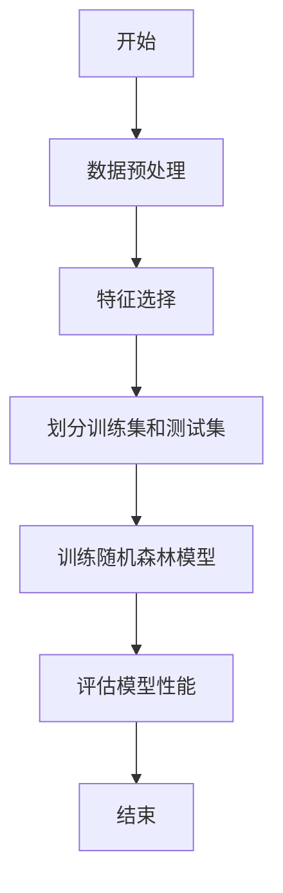
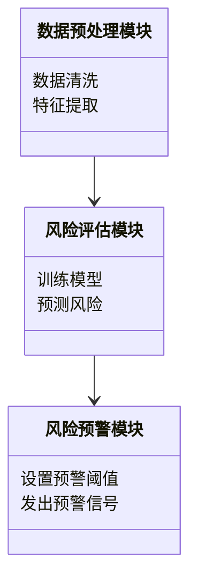

                 


# AI驱动的供应链金融风险管理

> 关键词：供应链金融、风险管理、人工智能、机器学习、数学模型、系统架构

> 摘要：本文详细探讨了人工智能在供应链金融风险管理中的应用，从核心概念、算法原理到系统架构，再到项目实战，全面分析了如何利用AI技术提升供应链金融的风险管理能力。通过具体案例和数学模型，本文展示了AI在风险识别、预测和控制中的独特价值，并提出了实际应用中的最佳实践和注意事项。

---

## 第1章: 供应链金融风险管理概述

### 1.1 供应链金融的基本概念

#### 1.1.1 供应链金融的定义
供应链金融（Supply Chain Finance，SCF）是指通过整合供应链上下游的企业，利用资金流、信息流和物流的协同作用，为供应链上的企业提供融资支持的一种金融模式。其核心在于通过优化资金流动，降低企业的运营成本，同时提高整个供应链的效率。

#### 1.1.2 供应链金融的核心要素
供应链金融涉及多个关键要素，包括：
1. **核心企业**：供应链中的主导企业，通常为制造商或大型零售商。
2. **供应商**：为供应链提供原材料或服务的企业。
3. **分销商/零售商**：负责产品销售的下游企业。
4. **金融机构**：提供融资、信贷等金融服务的机构。

#### 1.1.3 供应链金融的运作流程
供应链金融的运作流程通常包括以下几个步骤：
1. **需求分析**：核心企业分析供应链中的资金需求。
2. **融资申请**：供应链上的企业向金融机构提出融资申请。
3. **风险评估**：金融机构对供应链上的企业和交易进行风险评估。
4. **融资决策**：金融机构根据评估结果决定融资方案。
5. **资金发放与监控**：资金发放后，金融机构对资金使用进行监控，确保资金用于供应链的优化。

### 1.2 供应链金融风险管理的重要性

#### 1.2.1 风险管理在供应链金融中的作用
供应链金融涉及多个环节和多方参与者，因此风险管理尤为重要。有效的风险管理可以降低供应链中断的风险，减少企业的财务损失，同时提高供应链的整体效率。

#### 1.2.2 供应链金融中的主要风险类型
1. **信用风险**：由于供应商或分销商的信用问题导致的违约风险。
2. **操作风险**：供应链运作中的操作失误或流程不畅导致的风险。
3. **市场风险**：市场波动导致的供应链价值损失风险。

#### 1.2.3 风险管理对供应链效率的影响
有效的风险管理可以减少供应链中的不确定性，提高供应链的透明度和可预测性，从而提升整体效率。此外，通过风险管理，企业可以更好地规划和分配资源，降低运营成本。

### 1.3 AI驱动的风险管理优势

#### 1.3.1 传统风险管理的局限性
传统的风险管理方法依赖于人工分析和经验判断，存在以下问题：
1. **主观性**：人为判断容易受到主观因素的影响，可能导致决策偏差。
2. **低效性**：人工分析效率低下，难以应对海量数据和复杂场景。
3. **不准确性**：传统方法难以准确预测和识别潜在风险。

#### 1.3.2 AI在风险管理中的独特价值
人工智能技术可以通过大数据分析、机器学习和自然语言处理等手段，帮助金融机构更准确地识别和预测供应链中的潜在风险。AI的优势包括：
1. **数据处理能力**：AI能够快速处理海量数据，发现数据中的潜在关联。
2. **自动化分析**：AI可以自动分析供应链中的各种数据，提供实时风险预警。
3. **精准预测**：通过机器学习算法，AI可以预测供应链中的潜在风险，提前采取应对措施。

#### 1.3.3 AI驱动的风险管理的未来趋势
随着AI技术的不断发展，供应链金融风险管理将更加智能化和自动化。未来的风险管理将更加注重数据的实时性、模型的动态调整能力和系统的自我优化能力。

---

## 第2章: 供应链金融中的风险管理挑战

### 2.1 供应链金融中的主要风险

#### 2.1.1 信用风险
信用风险是供应链金融中最主要的风险之一。由于供应链中的供应商或分销商可能因财务状况恶化或信用评级下降而导致违约，给金融机构带来直接损失。

#### 2.1.2 操作风险
操作风险是指供应链运作过程中由于操作失误、流程不畅或系统故障等导致的风险。例如，库存管理不当可能导致供应链中断，进而影响企业的正常运营。

#### 2.1.3 市场风险
市场风险是指由于市场价格波动、政策变化或经济环境变化等因素导致的供应链价值损失风险。例如，原材料价格波动可能影响供应链的成本和利润。

### 2.2 风险管理的复杂性

#### 2.2.1 数据的多样性与不完整性
供应链金融中的数据来源多样，包括财务数据、交易数据、物流数据等，但这些数据往往存在不完整或不一致的问题，给风险管理带来挑战。

#### 2.2.2 风险因素的动态变化
供应链中的风险因素是动态变化的，例如市场需求波动、供应商信用状况变化等，这些变化使得传统的静态风险评估方法难以应对。

#### 2.2.3 风险评估的准确性要求
供应链金融的风险管理需要高精度的评估结果，以确保融资决策的准确性和可靠性。传统的评估方法由于依赖人工判断，往往难以满足这一要求。

### 2.3 AI技术在风险管理中的应用前景

#### 2.3.1 AI在风险识别中的潜力
AI技术可以通过自然语言处理和大数据分析，从海量数据中提取潜在风险信号，帮助金融机构更早地识别供应链中的潜在风险。

#### 2.3.2 AI在风险预测中的优势
通过机器学习算法，AI可以基于历史数据和实时数据，建立风险预测模型，预测供应链中的潜在风险，从而提前采取应对措施。

#### 2.3.3 AI在风险控制中的创新应用
AI技术可以通过动态监控和实时反馈，帮助金融机构优化风险管理策略，降低供应链中的信用风险和操作风险。

---

## 第3章: AI驱动的供应链金融风险管理核心概念与联系

### 3.1 AI驱动的风险管理原理

#### 3.1.1 数据驱动的决策模型
AI驱动的风险管理基于大量数据，通过构建数据驱动的决策模型，帮助金融机构做出更准确的融资决策。

#### 3.1.2 机器学习在风险预测中的应用
机器学习算法可以通过对历史数据的训练，建立风险预测模型，预测供应链中的潜在风险。

#### 3.1.3 深度学习在风险识别中的应用
深度学习技术可以通过对非结构化数据（如文本、图像等）的分析，帮助金融机构识别潜在风险。

### 3.2 核心概念与原理

#### 3.2.1 核心概念原理
AI驱动的供应链金融风险管理基于以下原理：
1. **数据驱动**：通过大数据分析，提取供应链中的潜在风险信号。
2. **机器学习**：利用机器学习算法，建立风险预测模型。
3. **实时监控**：通过实时数据流，动态监控供应链中的潜在风险。

#### 3.2.2 核心概念属性特征对比
以下是供应链金融中主要风险类型的核心属性特征对比：

| 风险类型 | 主要特征 | 数据来源 | 影响因素 |
|----------|----------|----------|----------|
| 信用风险 | 借款企业信用状况 | 财务报表、信用评级 | 企业财务状况、行业风险 |
| 操作风险 | 供应链运作中的失误 | 运营数据、系统日志 | 人员操作、系统故障 |
| 市场风险 | 市场价格波动 | 市场数据、宏观经济指标 | 原材料价格、市场需求 |

#### 3.2.3 ER实体关系图
以下是供应链金融风险管理的ER实体关系图：

```mermaid
er
actor: 金融机构, 供应链企业, 供应商, 分销商
event: 融资申请, 资金发放, 资金监控
```

---

## 第4章: AI驱动的供应链金融风险管理算法原理

### 4.1 算法原理概述

#### 4.1.1 机器学习算法的选择
在供应链金融风险管理中，常用的机器学习算法包括：
1. **随机森林**：适用于分类和回归问题，适合处理高维数据。
2. **支持向量机（SVM）**：适用于分类问题，适合处理小样本数据。
3. **神经网络**：适用于复杂非线性问题，适合处理大量数据。

#### 4.1.2 算法流程图
以下是随机森林算法的流程图：



#### 4.1.3 算法实现代码
以下是Python代码示例：

```python
from sklearn.ensemble import RandomForestClassifier
from sklearn.metrics import accuracy_score
from sklearn.model_selection import train_test_split

# 数据预处理
X = dataset.drop('target', axis=1)
y = dataset['target']

# 划分训练集和测试集
X_train, X_test, y_train, y_test = train_test_split(X, y, test_size=0.2, random_state=42)

# 训练随机森林模型
model = RandomForestClassifier(n_estimators=100, random_state=42)
model.fit(X_train, y_train)

# 模型预测
y_pred = model.predict(X_test)

# 评估模型性能
print("Accuracy:", accuracy_score(y_test, y_pred))
```

### 4.2 数学模型与公式

#### 4.2.1 风险评估模型
以下是风险评估模型的数学公式：

$$
\text{风险评分} = \alpha \cdot \text{信用评分} + \beta \cdot \text{市场风险评分} + \gamma \cdot \text{操作风险评分}
$$

其中，$\alpha$、$\beta$、$\gamma$为权重系数，根据具体情况确定。

#### 4.2.2 风险预测模型
以下是风险预测模型的数学公式：

$$
P(\text{违约}) = \sigma(w_1 \cdot x_1 + w_2 \cdot x_2 + \ldots + w_n \cdot x_n)
$$

其中，$x_i$为特征变量，$w_i$为对应的权重，$\sigma$为sigmoid函数。

---

## 第5章: AI驱动的供应链金融风险管理系统架构设计

### 5.1 系统分析与设计

#### 5.1.1 系统功能模块
以下是系统功能模块的类图：



#### 5.1.2 系统架构设计
以下是系统架构的架构图：


---

## 第6章: AI驱动的供应链金融风险管理项目实战

### 6.1 环境安装与配置

#### 6.1.1 Python环境安装
安装Python和必要的库：

```bash
pip install numpy pandas scikit-learn
```

#### 6.1.2 数据集获取
从公开数据集获取供应链金融数据。

### 6.2 核心代码实现

#### 6.2.1 数据预处理
```python
import pandas as pd
import numpy as np

# 数据清洗
df = pd.read_csv('data.csv')
df = df.dropna()
```

#### 6.2.2 模型训练
```python
from sklearn.ensemble import RandomForestClassifier

# 训练随机森林模型
model = RandomForestClassifier()
model.fit(X_train, y_train)
```

#### 6.2.3 模型评估
```python
from sklearn.metrics import accuracy_score

# 模型预测
y_pred = model.predict(X_test)

# 评估模型性能
print("Accuracy:", accuracy_score(y_test, y_pred))
```

### 6.3 项目案例分析与总结

#### 6.3.1 实际案例分析
通过具体案例分析，展示AI在供应链金融风险管理中的实际应用效果。

#### 6.3.2 项目小结
总结项目实施的经验和教训，提出改进建议。

---

## 第7章: AI驱动的供应链金融风险管理总结与展望

### 7.1 最佳实践与注意事项

#### 7.1.1 数据质量的重要性
确保数据的准确性和完整性，是AI驱动风险管理成功的关键。

#### 7.1.2 模型的可解释性
模型的可解释性是风险管理中信任和决策的重要基础。

#### 7.1.3 模型的动态更新
供应链中的风险因素是动态变化的，需要定期更新模型以适应新的数据和环境。

### 7.2 未来研究方向

#### 7.2.1 更先进的算法研究
探索更先进的机器学习和深度学习算法，提高风险管理的精度和效率。

#### 7.2.2 多模态数据融合
结合文本、图像等多种数据源，提高风险管理的全面性和准确性。

#### 7.2.3 可解释性研究
研究如何提高AI模型的可解释性，增强用户对模型的信任和接受度。

### 7.3 总结

通过本文的详细分析，我们可以看到AI技术在供应链金融风险管理中的巨大潜力。未来，随着AI技术的不断发展和创新，供应链金融风险管理将变得更加智能化和高效化。

---

## 关键词
供应链金融、风险管理、人工智能、机器学习、数学模型、系统架构

## 摘要
本文详细探讨了人工智能在供应链金融风险管理中的应用，从核心概念、算法原理到系统架构，再到项目实战，全面分析了如何利用AI技术提升供应链金融的风险管理能力。通过具体案例和数学模型，本文展示了AI在风险识别、预测和控制中的独特价值，并提出了实际应用中的最佳实践和注意事项。

