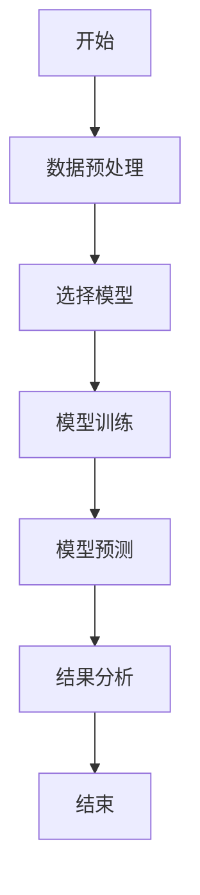
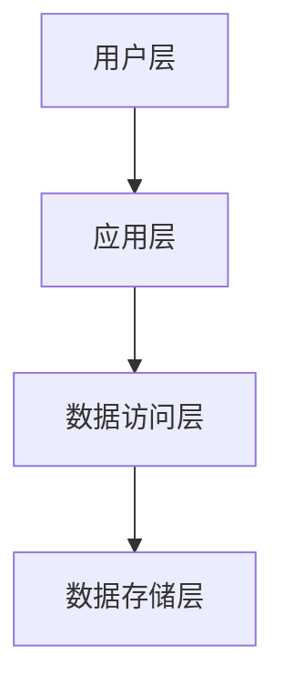

                 


# AI驱动的供应链韧性分析：评估公司长期竞争力

## 关键词：
AI技术、供应链韧性、供应链管理、企业竞争力、风险管理

## 摘要：
供应链是企业运营的核心环节，其韧性直接关系到企业的长期竞争力。随着AI技术的快速发展，AI在供应链管理中的应用日益广泛。本文将深入探讨AI驱动的供应链韧性分析，从理论到实践，详细分析其核心概念、算法原理、系统架构及实际应用案例，为企业提升供应链韧性提供有力支持。

---

## 目录

1. **供应链韧性与AI驱动分析概述**
   1.1 供应链韧性的定义与重要性
   1.2 AI在供应链管理中的应用背景
   1.3 供应链韧性分析的核心目标

2. **供应链韧性分析的核心概念与联系**
   2.1 核心概念原理
   2.2 实体关系图（ER图）架构
   2.3 本章小结

3. **AI驱动的供应链韧性分析算法原理**
   3.1 算法原理概述
   3.2 算法流程图
   3.3 本章小结

4. **供应链韧性分析的数学模型与公式**
   4.1 供应链韧性分析的数学模型
   4.2 关键公式与解读
   4.3 本章小结

5. **供应链韧性分析系统的系统架构设计**
   5.1 系统功能设计
   5.2 系统架构设计
   5.3 系统接口设计
   5.4 本章小结

6. **项目实战：AI驱动的供应链韧性分析系统实现**
   6.1 项目背景与目标
   6.2 系统核心功能实现
   6.3 项目小结

7. **结论与展望**
   7.1 本章总结
   7.2 未来展望

---

## 正文

### 第1章 供应链韧性与AI驱动分析概述

#### 1.1 供应链韧性的定义与重要性
供应链韧性是指在面对外部干扰（如疫情、自然灾害、原材料短缺等）时，供应链能够快速恢复并保持稳定运行的能力。  
- **供应链的基本概念**：供应链包括从原材料采购到产品交付的整个流程，涉及供应商、制造商、分销商、零售商等多个环节。  
- **供应链韧性的内涵**：韧性体现在供应链的灵活性、冗余性、响应速度和恢复能力等方面。  
- **供应链韧性对企业竞争力的影响**：强大的供应链韧性能够帮助企业降低运营风险，快速应对市场变化，提升客户满意度和市场竞争力。

#### 1.2 AI在供应链管理中的应用背景
传统供应链管理存在效率低、响应慢、预测不准等问题，而AI技术的引入为供应链管理带来了革命性的变化。  
- **AI如何赋能供应链管理**：通过机器学习、自然语言处理、计算机视觉等技术，AI可以帮助企业实现智能化预测、自动化决策和实时监控。  
- **供应链韧性分析的必要性**：在复杂多变的市场环境中，企业需要能够快速识别潜在风险并制定应对策略，AI驱动的供应链韧性分析成为企业不可或缺的工具。

#### 1.3 供应链韧性分析的核心目标
供应链韧性分析的核心目标是通过AI技术，帮助企业识别供应链中的潜在风险，优化资源配置，提升整体供应链的稳定性和响应能力。  
- **核心目标**：预测潜在风险、优化供应链结构、提高供应链透明度、降低运营成本。  
- **关键指标**：包括供应链中断概率、库存周转率、交付准时率、供应商多样性等。

---

### 第2章 供应链韧性分析的核心概念与联系

#### 2.1 核心概念原理
供应链韧性分析涉及多个核心概念，如风险预测、需求预测、库存优化等。  
- **风险预测**：通过AI技术分析历史数据，预测供应链可能面临的风险事件。  
- **需求预测**：基于历史销售数据和市场趋势，预测未来的需求，优化库存管理。  
- **库存优化**：通过动态调整库存水平，减少浪费，提高资金利用率。

#### 2.2 实体关系图（ER图）架构
供应链韧性分析系统涉及多个实体及其关系，以下是核心实体关系图：

```mermaid
er
    %% 供应链韧性分析系统 ER 图
    %% 表示供应商、制造商、分销商、零售商等实体之间的关系
    classDiagram
        class 供应链韧性分析系统 {
            id
            name
            description
        }
        class 供应商 {
            id
            name
            capacity
        }
        class 制造商 {
            id
            name
            production_capacity
        }
        class 分销商 {
            id
            name
            distribution_area
        }
        class 零售商 {
            id
            name
            location
        }
        class 产品 {
            id
            name
            type
        }
        class 风险事件 {
            id
            type
            impact
        }
        供应链韧性分析系统 --> 供应商
        供应链韧性分析系统 --> 制造商
        供应链韧性分析系统 --> 分销商
        供应链韧性分析系统 --> 零售商
        供应链韧性分析系统 --> 产品
        供应链韧性分析系统 --> 风险事件
```

---

### 第3章 AI驱动的供应链韧性分析算法原理

#### 3.1 算法原理概述
AI驱动的供应链韧性分析涉及多种算法，包括时间序列分析、机器学习和深度学习。  
- **时间序列分析**：用于预测未来的供应链需求和库存变化。  
- **机器学习**：通过训练数据，识别潜在风险并分类。  
- **深度学习**：用于更复杂的模式识别，如图像识别和自然语言处理。

#### 3.2 算法流程图
以下是时间序列分析算法的流程图：



#### 3.3 本章小结
本章详细介绍了AI驱动的供应链韧性分析算法原理，包括时间序列分析、机器学习和深度学习的应用，以及算法流程图的绘制。

---

### 第4章 供应链韧性分析的数学模型与公式

#### 4.1 供应链韧性分析的数学模型
供应链韧性分析涉及多种数学模型，如ARIMA模型、随机森林模型等。  
- **ARIMA模型**：用于时间序列预测，公式为：  
  $$ ARIMA(p, d, q) $$  
  其中，p为自回归阶数，d为差分阶数，q为移动平均阶数。

#### 4.2 关键公式与解读
- **ARIMA模型的预测公式**：  
  $$ \hat{y}_t = \phi_1 \hat{y}_{t-1} + \phi_2 \hat{y}_{t-2} + \dots + \phi_p \hat{y}_{t-p} + \theta_1 e_{t-1} + \theta_2 e_{t-2} + \dots + \theta_q e_{t-q} $$  
  其中，$\hat{y}_t$为预测值，$\phi_i$和$\theta_i$为模型参数，$e_{t-i}$为残差。

#### 4.3 本章小结
本章通过数学公式详细介绍了供应链韧性分析的核心模型，包括ARIMA模型和随机森林模型，并给出了公式解读。

---

### 第5章 供应链韧性分析系统的系统架构设计

#### 5.1 系统功能设计
供应链韧性分析系统主要包括以下功能模块：  
- **数据采集模块**：采集供应链各环节的数据，如供应商信息、库存数据、销售数据等。  
- **数据处理模块**：对数据进行清洗、转换和标准化处理。  
- **模型分析模块**：基于AI算法对数据进行分析，预测潜在风险并生成优化建议。  
- **结果展示模块**：将分析结果以可视化形式展示，帮助用户快速理解。

#### 5.2 系统架构设计
以下是供应链韧性分析系统的分层架构图：



#### 5.3 系统接口设计
系统接口设计包括数据接口和API接口。  
- **数据接口**：用于数据的输入和输出，支持CSV、JSON等格式。  
- **API接口**：提供RESTful API，供其他系统调用。

#### 5.4 本章小结
本章详细介绍了供应链韧性分析系统的功能设计、架构设计和接口设计，为后续的系统实现奠定了基础。

---

### 第6章 项目实战：AI驱动的供应链韧性分析系统实现

#### 6.1 项目背景与目标
本项目旨在通过AI技术实现供应链韧性分析，帮助企业识别潜在风险并优化供应链结构。

#### 6.2 系统核心功能实现
以下是系统核心功能的实现代码：

```python
import pandas as pd
from sklearn.ensemble import RandomForestRegressor
from sklearn.metrics import mean_absolute_error

# 数据加载
data = pd.read_csv('supply_chain.csv')

# 特征工程
features = data.drop('demand', axis=1)
target = data['demand']

# 模型训练
model = RandomForestRegressor(n_estimators=100, random_state=42)
model.fit(features, target)

# 预测
 predictions = model.predict(features)

# 评估
mae = mean_absolute_error(target, predictions)
print(f"均绝对误差：{mae}")
```

#### 6.3 项目小结
本章通过实际案例展示了AI驱动的供应链韧性分析系统的实现过程，包括数据处理、模型训练和结果评估。

---

### 第7章 结论与展望

#### 7.1 本章总结
本文详细探讨了AI驱动的供应链韧性分析，从理论到实践，全面分析了供应链韧性的核心概念、算法原理、系统架构及实际应用案例。

#### 7.2 未来展望
随着AI技术的不断发展，供应链韧性分析将更加智能化和自动化。未来的研究方向包括更复杂的模型优化、多源数据融合以及实时监控系统的开发。

---

通过本文的分析，企业可以更好地利用AI技术提升供应链韧性，从而增强自身的长期竞争力。

