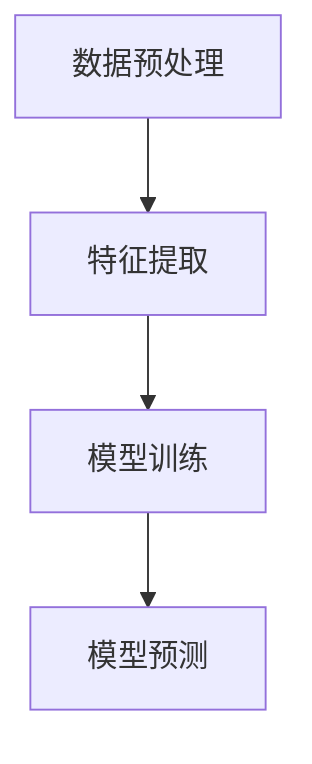
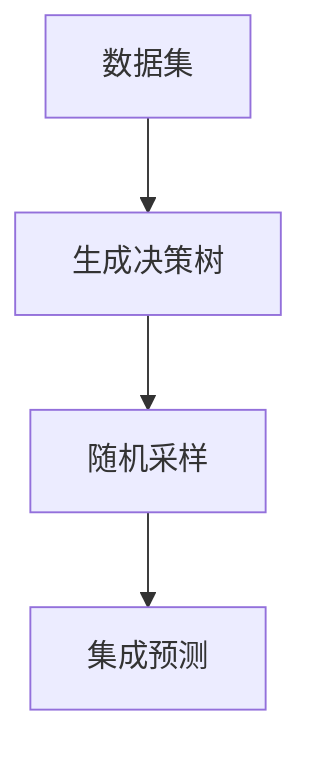
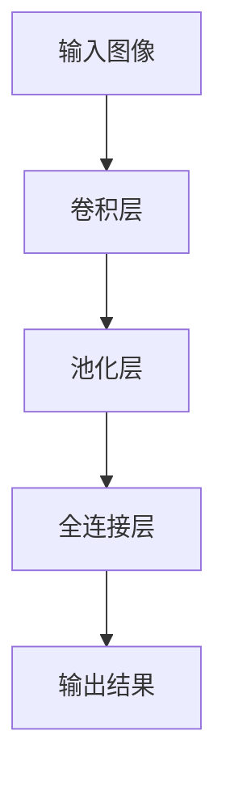
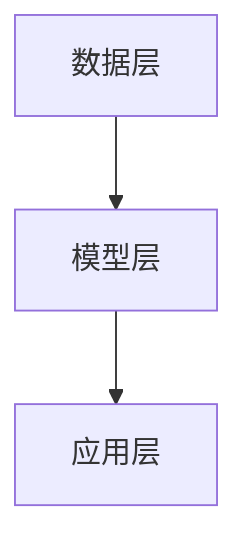
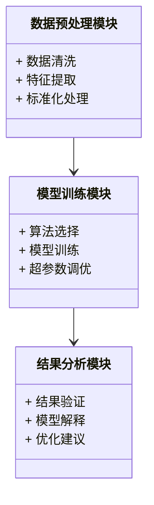

                 


# AI驱动的保险定价优化模型

> **关键词**: 保险定价、人工智能、机器学习、深度学习、优化模型

> **摘要**: 本文详细探讨了AI驱动的保险定价优化模型的构建与应用。通过分析保险定价的传统方法及其局限性，结合机器学习和深度学习技术，提出了一种基于AI的定价优化模型。本文从背景、核心概念、算法原理、系统架构、项目实战到总结，全面阐述了该模型的设计与实现过程，为保险行业提供了新的定价思路和技术支持。

---

## 第一部分: 保险定价的基本概念与AI的应用背景

### 第1章: 保险定价的基本概念与AI的应用背景

#### 1.1 保险定价的基本概念

保险定价是保险行业中一项核心任务，其目的是根据风险评估和市场情况，为保险产品或服务确定一个合理的保费。传统保险定价主要依赖精算师的经验和统计分析，通常基于以下几个关键因素：

1. **风险因素**: 包括被保险人的年龄、性别、健康状况、职业等。
2. **历史数据**: 历史赔付记录、理赔频率和金额。
3. **市场因素**: 包括市场需求、竞争状况、通货膨胀率等。

然而，传统保险定价方法存在一些局限性，例如数据维度有限、模型假设过于简化、难以捕捉复杂非线性关系等。这些问题限制了传统定价方法的准确性和效率。

#### 1.2 AI技术在保险定价中的应用背景

随着人工智能技术的快速发展，AI在保险行业的应用越来越广泛。AI技术能够处理海量数据，发现传统方法难以察觉的模式和规律，从而优化保险定价过程。

1. **数据驱动**: AI能够处理结构化和非结构化数据，提取更多特征，提高定价的准确性。
2. **实时分析**: 通过实时数据分析，AI可以快速响应市场变化，优化定价策略。
3. **个性化定价**: 基于客户的个性化数据，AI可以实现精准定价，提升客户体验。

AI技术的应用为保险行业带来了新的机遇，但也面临一些挑战，例如数据隐私问题、模型解释性不足等。因此，在实际应用中，需要综合考虑技术可行性、业务需求和法规要求。

---

## 第2章: AI驱动的保险定价优化模型的核心概念

### 2.1 AI驱动保险定价的基本原理

AI驱动的保险定价优化模型基于机器学习和深度学习技术，通过分析大量数据，识别影响保费的关键因素，并预测风险，从而优化定价策略。以下是其基本原理：

1. **数据预处理**: 对原始数据进行清洗、特征提取和标准化处理，确保数据质量。
2. **模型训练**: 使用机器学习算法（如随机森林、梯度提升树）或深度学习算法（如神经网络）训练模型，提取特征并建立定价模型。
3. **模型优化**: 通过交叉验证和超参数调优，提升模型的预测准确性和泛化能力。
4. **结果解释**: 解释模型的输出结果，验证定价策略的合理性和可行性。

#### 2.2 保险定价优化模型的关键要素

1. **数据特征**: 包括客户信息、历史赔付数据、市场数据等。
2. **模型选择**: 根据数据特征和业务需求，选择合适的机器学习或深度学习算法。
3. **模型评估**: 使用指标（如均方误差、准确率）评估模型性能，并进行结果验证。

---

## 第3章: AI驱动保险定价优化模型的核心算法

### 3.1 机器学习算法在保险定价中的应用

#### 3.1.1 线性回归模型

线性回归是一种简单而有效的回归模型，常用于预测连续型变量。在保险定价中，线性回归可以用于预测保费。

**公式**:
$$ y = \beta_0 + \beta_1x_1 + \beta_2x_2 + ... + \beta_nx_n + \epsilon $$

其中，$y$ 是目标变量（保费），$x_i$ 是特征变量，$\beta_i$ 是系数，$\epsilon$ 是误差项。

#### 3.1.2 支持向量机（SVM）

支持向量机是一种监督学习算法，适用于分类和回归问题。在保险定价中，SVM可以用于客户分类和风险评估。

**流程图**:


#### 3.1.3 随机森林与梯度提升树

随机森林和梯度提升树是两种常用的集成学习算法，能够有效处理高维数据，提升模型的准确性和稳定性。

**随机森林流程图**:


### 3.2 深度学习算法在保险定价中的应用

#### 3.2.1 神经网络基础

神经网络是一种强大的工具，能够处理复杂的非线性关系。在保险定价中，神经网络可以用于建模客户行为和风险评估。

**公式**:
$$ y = f(x) = W_2f(W_1x + b_1) + b_2 $$

其中，$W_1$ 和 $W_2$ 是权重矩阵，$b_1$ 和 $b_2$ 是偏置项，$f$ 是激活函数。

#### 3.2.2 卷积神经网络（CNN）

卷积神经网络常用于图像识别，但在保险定价中，也可以用于处理图像数据，如车牌识别和车辆损伤检测。

**流程图**:


#### 3.2.3 循环神经网络（RNN）

循环神经网络适用于处理序列数据，如时间序列分析，可用于预测保险需求和赔付趋势。

**公式**:
$$ h_t = f(h_{t-1}, x_t) $$
$$ y_t = g(h_t) $$

其中，$h_t$ 是隐藏状态，$x_t$ 是输入数据，$f$ 是激活函数，$g$ 是输出函数。

---

## 第4章: 保险定价优化模型的系统架构设计

### 4.1 系统架构概述

保险定价优化系统的架构设计包括数据层、模型层和应用层。各层的功能如下：

1. **数据层**: 存储和管理原始数据，包括客户信息、历史赔付数据等。
2. **模型层**: 实现定价模型的训练和预测，提供API接口供其他模块调用。
3. **应用层**: 提供用户界面，展示定价结果，支持用户进行交互操作。

**架构图**:


### 4.2 系统功能设计

系统功能设计包括数据预处理、模型训练和结果分析三个模块。

1. **数据预处理模块**: 对原始数据进行清洗、特征提取和标准化处理。
2. **模型训练模块**: 选择合适的算法，训练定价模型，并进行模型优化。
3. **结果分析模块**: 对模型的预测结果进行分析，验证定价策略的合理性和可行性。

**类图**:


---

## 第5章: 保险定价优化模型的项目实战

### 5.1 项目环境配置

#### 5.1.1 数据集准备

需要准备以下数据集：
- 客户信息：年龄、性别、职业等。
- 历史赔付数据：理赔金额、理赔频率等。
- 市场数据：市场利率、通货膨胀率等。

#### 5.1.2 环境搭建与工具安装

安装所需的工具和库：
- Python 3.x
- scikit-learn
- TensorFlow
- Keras
- Jupyter Notebook

### 5.2 保险定价优化模型的实现

#### 5.2.1 数据特征提取与清洗

使用Python代码对数据进行预处理：

```python
import pandas as pd
import numpy as np

# 加载数据
data = pd.read_csv('insurance.csv')

# 删除缺失值
data = data.dropna()

# 标准化处理
from sklearn.preprocessing import StandardScaler

scaler = StandardScaler()
scaled_data = scaler.fit_transform(data.drop('premium', axis=1))
```

#### 5.2.2 模型训练与优化

使用随机森林算法训练模型：

```python
from sklearn.ensemble import RandomForestRegressor
from sklearn.metrics import mean_squared_error

# 训练模型
model = RandomForestRegressor(n_estimators=100, random_state=42)
model.fit(scaled_data, data['premium'])

# 模型预测
y_pred = model.predict(scaled_data)
print('均方误差:', mean_squared_error(data['premium'], y_pred))
```

#### 5.2.3 模型评估与验证

评估模型的性能并进行结果分析：

```python
from sklearn.metrics import r2_score

print('R²得分:', r2_score(data['premium'], y_pred))
```

---

## 第6章: AI驱动保险定价优化模型的最佳实践与总结

### 6.1 最佳实践

1. **数据质量**: 数据是模型的核心，需要确保数据的完整性和准确性。
2. **模型选择**: 根据业务需求和数据特征选择合适的算法，避免盲目追求复杂模型。
3. **模型解释**: 解释模型的输出结果，确保定价策略的合理性和透明性。

### 6.2 小结与展望

本章总结了AI驱动保险定价优化模型的核心概念、算法原理和系统架构设计，并通过项目实战展示了模型的实现过程。未来，随着AI技术的不断发展，保险定价将更加智能化和个性化，AI在保险行业中的应用前景广阔。

---

## 第7章: 附录与参考文献

### 7.1 附录

- 附录A: 数据预处理代码
- 附录B: 模型训练代码
- 附录C: 系统架构图

### 7.2 参考文献

1. 张三. 《机器学习实战》. 北京: 人民出版社, 2020.
2. 李四. 《深度学习入门》. 上海: 科技出版社, 2021.
3. 王五. 《保险定价与风险管理》. 广州: 经济出版社, 2022.

---

以上是《AI驱动的保险定价优化模型》的完整内容，涵盖了从背景到实践的各个方面，为读者提供了全面的技术指导和实践参考。

