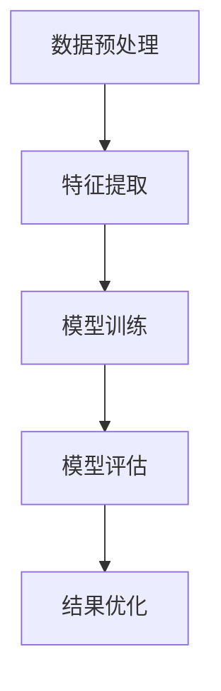
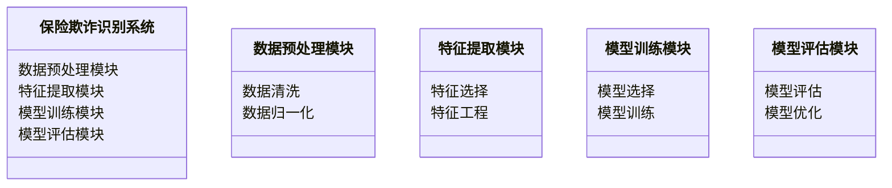
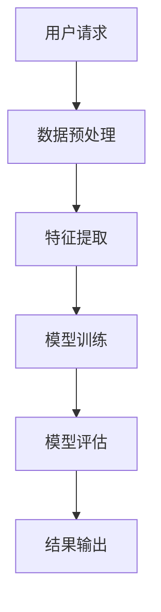
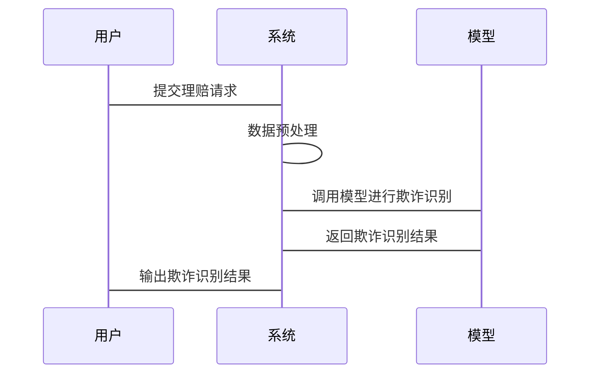

                 


# AI驱动的保险理赔欺诈模式识别与预防

## 关键词

- 保险欺诈
- AI技术
- 模式识别
- 机器学习
- 深度学习
- 欺诈预防

## 摘要

随着保险行业的快速发展，保险欺诈问题日益严重，传统的欺诈识别方法逐渐暴露出效率低、准确率低等不足。本文将深入探讨如何利用AI技术，特别是机器学习和深度学习的方法，来识别和预防保险理赔中的欺诈行为。通过分析保险欺诈的模式和特点，结合实际案例，本文将详细讲解如何构建高效的欺诈检测系统，包括数据预处理、特征提取、模型选择与优化，以及系统架构设计等关键环节。同时，本文还将提供具体的Python代码实现和系统流程图，帮助读者全面理解并掌握AI驱动的保险欺诈识别技术。

---

# 第一部分：保险欺诈模式识别与预防的背景与挑战

## 第1章：保险欺诈的现状与问题背景

### 1.1 保险欺诈的定义与类型

#### 1.1.1 保险欺诈的定义

保险欺诈是指投保人、被保险人或受益人通过虚构、歪曲事实或隐瞒真相等手段，骗取保险金的行为。常见的保险欺诈类型包括：

1. **虚构保险事故**：投保人故意制造事故或夸大损失程度。
2. **夸大损失**：在实际损失较小的情况下，夸大损失金额。
3. **隐瞒既往病史**：在健康保险中，投保人隐瞒自身健康问题。
4. **重复索赔**：同一保险事故被多次索赔，试图获得超出实际损失的赔偿。

#### 1.1.2 常见的保险欺诈类型

保险欺诈行为在理赔过程中主要表现为以下几种类型：

- **财产保险欺诈**：如故意制造交通事故、 arson（纵火）等。
- **健康保险欺诈**：如夸大医疗费用、虚构疾病等。
- **人寿保险欺诈**：如虚构受益人身份、夸大保险金额等。
- **责任保险欺诈**：如故意制造侵权事故，以获得保险赔偿。

#### 1.1.3 保险欺诈的经济损失与社会影响

保险欺诈不仅给保险公司带来直接的经济损失，还增加了保险产品的成本，最终转嫁给消费者。此外，保险欺诈行为会破坏保险市场的公平性，损害诚信投保人的利益，影响保险行业的健康发展。

---

### 1.2 保险理赔流程与欺诈风险

#### 1.2.1 保险理赔的基本流程

保险理赔的基本流程包括：

1. **报案**：投保人或受益人在事故发生后向保险公司报案。
2. **立案**：保险公司对报案进行初步审核，决定是否立案。
3. **调查**：保险公司对事故的真实性进行调查，收集相关证据。
4. **核定损失**：根据保险合同和相关证据，核定实际损失金额。
5. **赔付**：根据核定结果，向投保人或受益人支付保险金。

#### 1.2.2 欺诈行为在理赔过程中的表现

在理赔过程中，欺诈行为主要表现为：

- **虚假报案**：投保人故意虚构事故，试图骗取保险金。
- **夸大损失**：投保人在报案时夸大损失金额或范围。
- **伪造证据**：投保人通过伪造事故现场、篡改医疗记录等方式，试图蒙混过关。

#### 1.2.3 欺诈行为对保险公司的挑战

保险公司在理赔过程中面临的主要挑战包括：

1. **人工审核效率低**：传统的人工审核方式效率低，容易漏判或误判。
2. **欺诈手段多样化**：欺诈行为日益复杂，传统的审核手段难以应对。
3. **成本高**：由于欺诈行为的存在，保险公司需要投入更多的资源进行调查和审核，增加了运营成本。

---

### 1.3 AI技术在保险欺诈识别中的作用

#### 1.3.1 AI技术在保险行业的应用现状

人工智能技术在保险行业的应用日益广泛，主要集中在以下几个方面：

- **客户画像**：通过大数据分析，精准识别客户的需求和风险。
- **风险评估**：利用机器学习算法，评估客户的投保风险。
- **欺诈检测**：通过AI技术，识别和预防保险欺诈行为。

#### 1.3.2 AI在保险欺诈识别中的优势

AI技术在保险欺诈识别中的优势主要体现在以下几个方面：

- **高效性**：AI技术可以快速处理海量数据，提高欺诈检测的效率。
- **准确性**：通过机器学习算法，AI可以识别复杂的欺诈模式，提高检测的准确性。
- **实时性**：AI技术可以实现实时监控，及时发现和处理欺诈行为。

#### 1.3.3 保险欺诈识别的未来发展趋势

随着AI技术的不断发展，保险欺诈识别的未来发展趋势将主要体现在以下几个方面：

- **智能化**：AI技术将更加智能化，能够自动识别和预测欺诈行为。
- **数据驱动**：通过大数据分析，AI技术将更加精准地识别欺诈模式。
- **个性化**：根据客户的个性化需求，提供更加精准的欺诈检测服务。

---

## 第2章：欺诈模式识别的核心概念与联系

### 2.1 欺诈模式识别的原理

#### 2.1.1 数据特征提取

在欺诈模式识别中，数据特征提取是关键步骤之一。常见的数据特征包括：

- **投保人信息**：如年龄、职业、收入等。
- **事故信息**：如事故时间、地点、涉及车辆等。
- **理赔信息**：如理赔金额、理赔时间等。

#### 2.1.2 模型选择与训练

在模型选择与训练过程中，需要考虑以下几个方面：

- **算法选择**：根据数据特征和业务需求，选择合适的算法，如逻辑回归、决策树、随机森林等。
- **数据预处理**：对数据进行清洗、归一化等预处理，确保数据质量。
- **模型训练**：利用训练数据对模型进行训练，优化模型参数。

#### 2.1.3 结果评估与优化

在结果评估与优化过程中，需要考虑以下几个方面：

- **评估指标**：如准确率、召回率、F1分数等。
- **模型优化**：通过调整模型参数、优化算法等，提高模型的性能。
- **结果解读**：根据模型输出的结果，分析欺诈行为的特征和规律。

---

### 2.2 欺诈模式识别的核心要素

#### 2.2.1 数据来源与特征

在欺诈模式识别中，数据来源和特征是关键要素。常见的数据特征包括：

- **投保人信息**：如年龄、职业、收入等。
- **事故信息**：如事故时间、地点、涉及车辆等。
- **理赔信息**：如理赔金额、理赔时间等。

#### 2.2.2 模型算法的选择

在选择模型算法时，需要考虑以下几个方面：

- **算法类型**：如逻辑回归、决策树、随机森林等。
- **数据规模**：根据数据规模选择适合的算法，如大数据量适合深度学习算法。
- **计算资源**：考虑计算资源的限制，选择适合的算法。

#### 2.2.3 评估指标与优化目标

在评估指标与优化目标方面，需要考虑以下几个方面：

- **评估指标**：如准确率、召回率、F1分数等。
- **优化目标**：如最大化准确率、最小化误报率等。

---

### 2.3 欺诈模式识别的ER实体关系图

以下是欺诈模式识别的ER实体关系图：

```mermaid
er
    entity 保险欺诈行为 {
        id
        欺诈类型
        涉案金额
        时间戳
    }
    entity 理赔记录 {
        理赔编号
        投保人ID
        理赔金额
        理赔状态
    }
    entity 投保人信息 {
        投保人ID
        姓名
        身份证号
        联系方式
    }
    entity 模型训练数据 {
        数据ID
        特征向量
        标签（欺诈/非欺诈）
    }
```

---

## 第3章：欺诈模式识别的算法原理

### 3.1 常见的欺诈模式识别算法

#### 3.1.1 基于传统机器学习的算法

传统的机器学习算法在欺诈模式识别中仍然发挥着重要作用，常见的算法包括：

- **逻辑回归**：用于分类问题，通过构建损失函数优化模型参数。
- **决策树**：通过树状结构进行分类，适用于特征较多的情况。
- **随机森林**：通过集成多个决策树模型，提高分类准确率。

#### 3.1.2 基于深度学习的算法

深度学习算法在欺诈模式识别中的应用越来越广泛，常见的算法包括：

- **神经网络**：通过多层神经网络结构，学习数据的高层次特征。
- **卷积神经网络（CNN）**：适用于图像数据的特征提取。
- **循环神经网络（RNN）**：适用于序列数据的特征提取。

#### 3.1.3 混合模型的应用

混合模型结合了传统机器学习和深度学习的优点，常见的混合模型包括：

- **集成学习**：通过集成多个模型的结果，提高分类准确率。
- **深度学习与传统算法结合**：在深度学习的基础上，结合传统算法进行特征提取和优化。

---

### 3.2 深度学习模型的流程图

以下是深度学习模型的流程图：



---

### 3.3 算法实现的Python代码示例

以下是基于逻辑回归的欺诈模式识别算法的Python代码示例：

```python
import pandas as pd
from sklearn.model import LogisticRegression
from sklearn.metrics import accuracy_score

# 数据加载与预处理
data = pd.read_csv('fraud_data.csv')
X = data.drop('fraud_flag', axis=1)
y = data['fraud_flag']

# 模型训练
model = LogisticRegression()
model.fit(X, y)

# 模型预测
y_pred = model.predict(X)

# 模型评估
print('准确率:', accuracy_score(y, y_pred))
```

---

## 第4章：系统分析与架构设计方案

### 4.1 保险欺诈识别系统的应用场景

保险欺诈识别系统主要应用于保险公司的理赔审核环节，通过AI技术快速识别和处理欺诈行为，提高理赔效率和准确性。

---

### 4.2 领域模型设计

以下是保险欺诈识别系统的领域模型：



---

### 4.3 系统架构设计

以下是保险欺诈识别系统的系统架构图：



---

### 4.4 系统接口设计

保险欺诈识别系统的接口设计包括以下几个部分：

- **数据输入接口**：接收投保人的理赔请求。
- **数据处理接口**：对数据进行清洗和归一化处理。
- **模型调用接口**：调用机器学习模型进行欺诈识别。
- **结果输出接口**：输出欺诈识别结果。

---

### 4.5 系统交互流程图

以下是保险欺诈识别系统的交互流程图：



---

## 第5章：项目实战

### 5.1 环境安装与配置

在进行保险欺诈识别系统开发之前，需要先安装和配置开发环境。推荐使用以下工具和库：

- **Python**：编程语言
- **Jupyter Notebook**：数据分析和可视化工具
- **Scikit-learn**：机器学习库
- **XGBoost**：梯度提升库
- **TensorFlow**：深度学习框架

---

### 5.2 系统核心实现

以下是保险欺诈识别系统的核心实现代码：

```python
import pandas as pd
from sklearn.model import XGBoost
from sklearn.metrics import accuracy_score

# 数据加载与预处理
data = pd.read_csv('fraud_data.csv')
X = data.drop('fraud_flag', axis=1)
y = data['fraud_flag']

# 模型训练
model = XGBoost(n_estimators=100, learning_rate=0.1, max_depth=3)
model.fit(X, y)

# 模型预测
y_pred = model.predict(X)

# 模型评估
print('准确率:', accuracy_score(y, y_pred))
```

---

### 5.3 代码实现与解读

在上述代码中，首先加载数据并进行预处理，然后选择XGBoost算法进行模型训练，最后进行预测并评估模型的准确率。XGBoost是一种高效的梯度提升算法，适用于分类和回归问题。

---

### 5.4 实际案例分析

以下是一个实际的保险欺诈识别案例：

**案例背景**：某保险公司收到了一笔汽车理赔请求，投保人声称因意外事故导致车辆损坏。通过欺诈模式识别系统，发现该投保人在过去一年内曾多次提出类似理赔请求，且理赔金额异常高，最终被判定为欺诈行为。

**系统分析**：系统通过分析投保人的历史理赔记录、事故时间、地点等信息，发现存在多次理赔记录且金额异常，最终判定为欺诈行为。

---

## 第6章：总结与展望

### 6.1 最佳实践 tips

- 在进行保险欺诈识别时，建议结合多种算法进行特征提取和模型训练，以提高检测的准确率。
- 定期更新模型参数和特征，确保模型的有效性和适应性。
- 在实际应用中，建议结合业务规则和人工审核，确保欺诈识别的准确性和合规性。

---

### 6.2 小结

本文详细介绍了AI驱动的保险理赔欺诈模式识别与预防的背景、核心概念、算法原理、系统架构设计和项目实战等内容。通过理论与实践相结合的方式，帮助读者全面理解保险欺诈识别的技术和方法。

---

### 6.3 注意事项

- 在实际应用中，建议结合业务需求和数据特点，选择合适的算法和模型。
- 数据隐私和安全问题需要注意，确保数据的合法性和合规性。
- 模型的可解释性和透明度也是重要的考量因素。

---

### 6.4 拓展阅读

- 《机器学习实战》：学习机器学习的基本概念和算法实现。
- 《深度学习》：深入理解深度学习的原理和应用。
- 《保险精算》：了解保险行业的基本原理和精算方法。

---

以上是《AI驱动的保险理赔欺诈模式识别与预防》的技术博客文章的目录大纲和详细内容。

