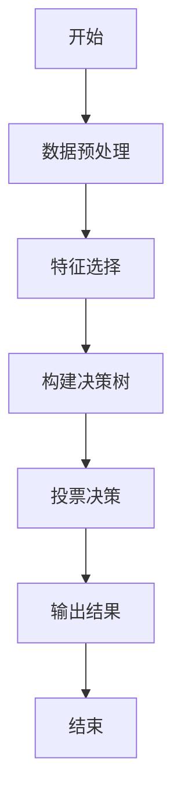
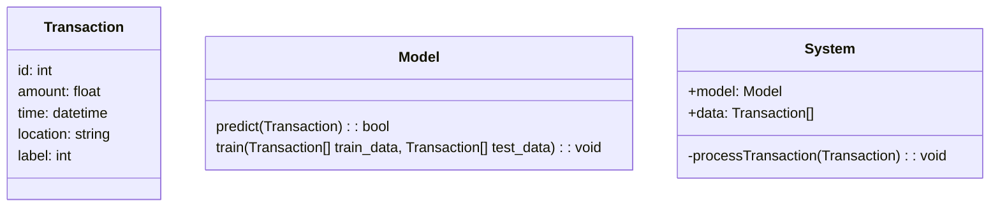
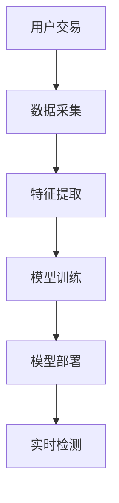
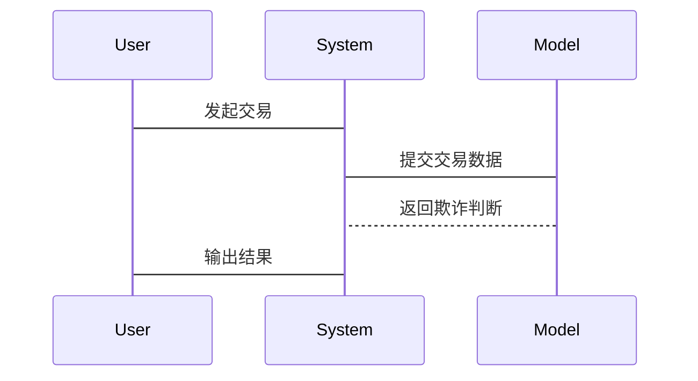
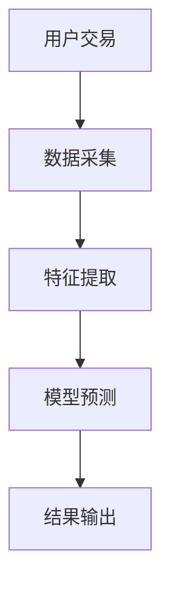

                 


```markdown
# AI驱动的信用卡欺诈模式识别

> 关键词：信用卡欺诈，人工智能，模式识别，机器学习，深度学习

> 摘要：随着信用卡欺诈手段的日益复杂化，传统的欺诈检测方法逐渐显现出其局限性。本文将深入探讨如何利用人工智能技术，特别是机器学习和深度学习，来识别信用卡欺诈模式。通过分析欺诈检测的核心概念、算法原理、系统架构以及实际项目案例，本文将为读者提供一个全面的技术视角，展示AI在信用卡欺诈检测中的应用前景和实际效果。

---

## 第一部分: 信用卡欺诈模式识别的背景与概述

### 第1章: 信用卡欺诈模式识别的背景与问题描述

#### 1.1 信用卡欺诈的现状与挑战

##### 1.1.1 信用卡欺诈的定义与类型
信用卡欺诈是指不法分子利用信用卡进行非法交易，导致持卡人或发卡机构遭受经济损失的行为。常见的欺诈类型包括：
- **盗刷**：未经授权的交易。
- **虚假交易**：通过创建虚假商户进行的交易。
- **身份盗用**：冒用他人身份申请信用卡并进行欺诈交易。

##### 1.1.2 欺诈行为对企业与个人的影响
- **对企业的影响**：欺诈交易可能导致发卡机构的财务损失和声誉损害。
- **对个人的影响**：持卡人可能面临未经授权的交易，导致信用评分下降或财务损失。

##### 1.1.3 当前欺诈检测技术的局限性
- **传统规则-based系统**：基于固定的规则，难以应对新型的欺诈手段。
- **低准确性**：传统方法在复杂场景下容易出现误报或漏报。

#### 1.2 AI技术在欺诈检测中的应用前景

##### 1.2.1 AI技术在金融领域的应用现状
- 人工智能技术（如机器学习、深度学习）在金融领域的应用日益广泛，尤其是在风险评估、欺诈检测和信用评分方面。

##### 1.2.2 深度学习在信用卡欺诈检测中的优势
- **复杂模式识别**：深度学习能够捕捉高维数据中的复杂模式。
- **实时性**：通过优化模型结构，可以实现实时欺诈检测。

##### 1.2.3 欺诈检测中的实时性与准确性的平衡
- 实时检测要求模型在极短的时间内做出决策，这可能限制模型的复杂性，从而影响准确性。
- 需要设计高效的模型架构和优化算法，以在保证实时性的前提下提高准确性。

### 第2章: AI驱动的信用卡欺诈模式识别技术基础

#### 2.1 信用卡交易数据的特征分析

##### 2.1.1 交易数据的构成与特点
- **交易时间**：交易发生的时间点。
- **交易金额**：交易的金额大小。
- **交易地点**：交易发生的位置信息。
- **交易类型**：如在线交易、实体商店交易等。

##### 2.1.2 欺诈交易的特征提取
- **异常交易频率**：短时间内频繁交易。
- **非正常交易时间**：深夜或凌晨的交易。
- **地理位置异常**：交易地点与持卡人常用地点不符。

##### 2.1.3 数据预处理与特征工程
- 数据清洗：处理缺失值、异常值。
- 特征选择：从大量特征中筛选出对欺诈检测有高区分度的特征。
- 特征工程：构建高级特征，如交易时间间隔、金额变化率等。

#### 2.2 深度学习与传统机器学习的对比

##### 2.2.1 传统机器学习在欺诈检测中的应用
- **随机森林**：基于决策树的集成学习方法，适合处理高维数据。
- **支持向量机（SVM）**：适合处理小规模数据，但对高维数据的性能较差。

##### 2.2.2 深度学习的优势与挑战
- **优势**：能够自动提取特征，适合处理非结构化数据。
- **挑战**：需要大量标注数据，计算资源消耗大。

##### 2.2.3 混合模型的潜在价值
- **混合模型**：结合传统机器学习和深度学习的优势，可能在实际应用中表现出更高的准确性和效率。

---

## 第二部分: 信用卡欺诈模式识别的核心概念与原理

### 第3章: 模式识别与信用卡欺诈检测

#### 3.1 模式识别的基本原理

##### 3.1.1 模式识别的定义与分类
- **定义**：模式识别是通过计算机技术对数据中的模式进行分析和分类的过程。
- **分类**：监督学习和无监督学习，基于是否有标签数据。

##### 3.1.2 欺诈模式识别的核心要素
- **数据特征**：交易金额、时间、地点等。
- **模型选择**：选择适合数据的模型结构。
- **评估指标**：准确率、召回率、F1分数等。

#### 3.2 机器学习模型在欺诈检测中的应用

##### 3.2.1 分类算法在欺诈检测中的作用
- **逻辑回归**：适合二分类问题。
- **决策树**：适合处理复杂特征关系。

##### 3.2.2 回归算法的适用场景
- **欺诈金额预测**：使用回归模型预测欺诈交易的金额。

##### 3.2.3 集成学习的优势
- **投票机制**：通过集成多个模型的预测结果，提高整体准确率。

---

## 第三部分: 信用卡欺诈模式识别的算法原理与数学模型

### 第4章: 基于机器学习的信用卡欺诈检测算法

#### 4.1 随机森林算法

##### 4.1.1 算法原理
随机森林是一种基于决策树的集成学习方法，通过构建多个决策树并进行投票来提高预测准确率。

##### 4.1.2 算法流程图


##### 4.1.3 Python代码实现
```python
from sklearn.ensemble import RandomForestClassifier
from sklearn.model_selection import train_test_split
from sklearn.metrics import accuracy_score

# 数据预处理
X = df.drop('label', axis=1)
y = df['label']

# 划分训练集和测试集
X_train, X_test, y_train, y_test = train_test_split(X, y, test_size=0.2, random_state=42)

# 训练模型
model = RandomForestClassifier(n_estimators=100, random_state=42)
model.fit(X_train, y_train)

# 模型评估
y_pred = model.predict(X_test)
print("准确率:", accuracy_score(y_test, y_pred))
```

#### 4.2 深度学习模型

##### 4.2.1 LSTM网络
- **数学公式**：
  $$ \text{LSTM}(x_t) = \text{tanh}(f_t) \odot \text{sigmoid}(i_t) $$
  其中，\( f_t \) 是遗忘门，\( i_t \) 是输入门。

##### 4.2.2 LSTM在时间序列分析中的应用
LSTM网络适合处理时间序列数据，能够捕捉到交易时间中的异常模式。

##### 4.2.3 Python代码实现
```python
from tensorflow.keras.layers import LSTM, Dense, Dropout
from tensorflow.keras.models import Sequential

# 构建LSTM模型
model = Sequential()
model.add(LSTM(64, input_shape=(timesteps, features)))
model.add(Dropout(0.2))
model.add(Dense(1, activation='sigmoid'))

model.compile(loss='binary_crossentropy', optimizer='adam', metrics=['accuracy'])
model.fit(X_train, y_train, epochs=10, batch_size=32, validation_data=(X_val, y_val))
```

---

## 第四部分: 信用卡欺诈模式识别的系统架构与设计

### 第5章: 信用卡欺诈检测系统的架构设计

#### 5.1 系统功能设计

##### 5.1.1 领域模型


##### 5.1.2 系统架构


##### 5.1.3 系统接口设计
- **输入接口**：接收交易数据。
- **输出接口**：输出欺诈风险评分。

#### 5.2 系统交互流程


---

## 第五部分: 信用卡欺诈模式识别的项目实战

### 第6章: 信用卡欺诈检测项目实战

#### 6.1 环境配置

##### 6.1.1 安装必要的库
```bash
pip install numpy pandas scikit-learn tensorflow matplotlib
```

#### 6.2 数据预处理与特征工程

##### 6.2.1 数据清洗
```python
import pandas as pd
from sklearn.impute import SimpleImputer

# 读取数据
data = pd.read_csv('credit_card_fraud.csv')

# 处理缺失值
imputer = SimpleImputer(missing_values=np.nan, strategy='mean')
imputed_data = imputer.fit_transform(data)
```

##### 6.2.2 特征选择
```python
from sklearn.feature_selection import SelectKBest, chi2

selector = SelectKBest(score_func=chi2, k=10)
selected_data = selector.fit_transform(imputed_data, target_data)
```

#### 6.3 模型训练与评估

##### 6.3.1 模型训练
```python
from sklearn.model_selection import train_test_split
from sklearn.ensemble import RandomForestClassifier
from sklearn.metrics import classification_report

# 划分数据集
X_train, X_test, y_train, y_test = train_test_split(selected_data, target_data, test_size=0.2, random_state=42)

# 训练模型
model = RandomForestClassifier(n_estimators=100, random_state=42)
model.fit(X_train, y_train)

# 模型评估
y_pred = model.predict(X_test)
print(classification_report(y_test, y_pred))
```

##### 6.3.2 模型优化
- **超参数调优**：使用网格搜索优化模型参数。
- **模型评估指标**：准确率、召回率、F1分数。

#### 6.4 系统部署与实时检测

##### 6.4.1 系统部署
```python
from flask import Flask, request
import joblib

app = Flask(__name__)
model = joblib.load('model.pkl')

@app.route('/predict', methods=['POST'])
def predict():
    data = request.json
    # 数据处理
    prediction = model.predict(data)
    return str(prediction)
```

##### 6.4.2 实时检测流程


---

## 第六部分: 信用卡欺诈模式识别的最佳实践与总结

### 第7章: 最佳实践与总结

#### 7.1 最佳实践

##### 7.1.1 数据质量
- 确保数据的完整性和准确性。
- 处理缺失值和异常值。

##### 7.1.2 模型选择
- 根据数据规模和类型选择合适的模型。
- 尝试多种模型，选择表现最佳的。

##### 7.1.3 模型优化
- 调整超参数，优化模型性能。
- 使用交叉验证评估模型。

#### 7.2 小结与展望

##### 7.2.1 小结
- AI技术在信用卡欺诈检测中表现出显著优势。
- 需要注意模型的实时性和准确性之间的平衡。

##### 7.2.2 展望
- 结合地理信息系统（GIS）进行空间分析。
- 使用图神经网络捕捉复杂的关联关系。

#### 7.3 注意事项

##### 7.3.1 模型的可解释性
- 需要注意模型的可解释性，特别是在法律和合规方面。
- 尝试使用可解释性模型（如SHAP值）来解释预测结果。

##### 7.3.2 数据隐私与安全
- 确保数据的安全性，防止数据泄露。
- 遵守相关数据隐私法规（如GDPR）。

##### 7.3.3 计算资源消耗
- 深度学习模型需要较高的计算资源，需要优化模型结构和训练策略。
- 使用轻量化模型或优化算法（如知识蒸馏）减少资源消耗。

---

## 第七部分: 拓展阅读与进一步学习

### 7.1 拓展阅读

#### 7.1.1 推荐书籍
- 《Python机器学习实战》
- 《深度学习入门：基于Python的理论与实现》

#### 7.1.2 推荐博客与资源
- [Towards Data Science](https://towardsdatascience.com/)
- [Kaggle](https://www.kaggle.com/)

### 7.2 进一步学习方向

#### 7.2.1 高级算法研究
- 图神经网络（Graph Neural Network）
- � 强化学习（Reinforcement Learning）

#### 7.2.2 应用场景扩展
- 结合区块链技术进行欺诈检测。
- 使用流数据处理技术实时分析交易。

---

## 结语

通过本文的详细探讨，我们可以看到AI技术在信用卡欺诈模式识别中的巨大潜力。从算法原理到系统架构，从项目实战到最佳实践，AI技术不仅提高了欺诈检测的准确性，还为金融机构提供了实时、高效的解决方案。未来，随着技术的不断发展，AI在金融安全领域的应用将更加广泛和深入。

---

**感谢您的阅读！**
```

