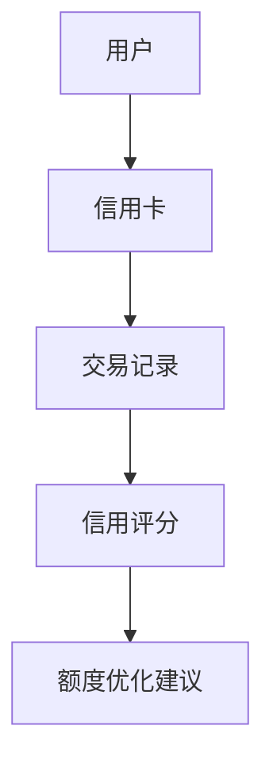

                 


# AI驱动的信用卡额度优化模型

> 关键词：信用卡额度优化、人工智能、机器学习、金融建模、风险管理、数据科学

> 摘要：随着信用卡业务的快速发展，如何利用人工智能技术优化信用卡额度分配成为金融机构的重要课题。本文将从信用卡额度优化问题的背景出发，详细探讨基于AI的信用卡额度优化模型的核心概念、算法原理、系统设计以及项目实战，最终为读者提供一套完整的解决方案。

---

## 第一部分: AI驱动的信用卡额度优化模型背景介绍

### 第1章: 信用卡额度优化问题背景

#### 1.1 信用卡额度优化的重要性
##### 1.1.1 信用卡额度优化的定义
信用卡额度是指持卡人在信用卡账户上能够使用的最大信用额度。优化信用卡额度是指通过分析用户的信用状况、消费行为和还款能力，动态调整其信用额度，以最大化用户体验和金融机构的收益。

##### 1.1.2 信用卡额度优化的业务价值
- 提高用户满意度：通过合理的额度分配，用户可以在需要时获得足够的信用支持。
- 风险控制：优化额度分配可以降低逾期还款和坏账风险。
- 利润最大化：通过精准的额度分配，金融机构可以最大化收益。

##### 1.1.3 信用卡额度优化的行业现状
随着信用卡业务的普及，传统基于规则的额度分配方法已逐渐暴露出效率低、精度差的缺陷。通过人工智能技术优化信用卡额度分配成为行业趋势。

---

#### 1.2 信用卡额度优化问题的描述
##### 1.2.1 信用卡额度优化的核心问题
- 如何通过用户数据（如信用评分、消费记录、收入水平等）预测用户的信用风险。
- 如何动态调整用户的信用额度以平衡风险与收益。

##### 1.2.2 信用卡额度优化的业务流程
1. 数据收集：获取用户的信用记录、消费行为、收入水平等数据。
2. 数据预处理：清洗数据，处理缺失值、异常值等。
3. 模型训练：基于历史数据训练信用卡额度优化模型。
4. 模型预测：根据用户特征预测其信用风险，动态调整信用额度。
5. 模型评估：通过实际业务数据验证模型的准确性和稳定性。

##### 1.2.3 信用卡额度优化的挑战与难点
- 数据维度高且复杂：用户数据包括信用评分、消费记录、收入水平等多个维度。
- 数据质量和完整性：部分用户数据可能存在缺失或异常。
- 模型的实时性和高效性：需要在短时间内完成额度优化计算。

---

#### 1.3 AI驱动的信用卡额度优化的解决方案
##### 1.3.1 AI技术在信用卡额度优化中的应用
- 利用机器学习算法（如随机森林、梯度提升树）进行信用评分预测。
- 利用深度学习算法（如神经网络）进行用户行为分析。
- 利用自然语言处理技术分析用户反馈数据。

##### 1.3.2 基于AI的信用卡额度优化模型的优势
- 提高额度分配的精准性：通过AI技术可以更精准地预测用户的信用风险。
- 实现动态调整：根据用户的实时行为和信用状况动态调整额度。
- 提高效率：自动化处理数据和模型训练，减少人工干预。

##### 1.3.3 AI驱动信用卡额度优化的实现路径
1. 数据采集与处理：收集用户数据并进行预处理。
2. 模型训练：基于历史数据训练信用卡额度优化模型。
3. 模型部署：将模型应用于实际业务场景。
4. 模型监控与优化：持续监控模型性能并进行优化。

---

#### 1.4 信用卡额度优化模型的边界与外延
##### 1.4.1 模型的输入与输出边界
- 输入：用户的基本信息（如年龄、收入）、信用记录、消费行为等。
- 输出：用户的信用评分、额度调整建议。

##### 1.4.2 模型的适用范围与限制
- 适用范围：适用于有足够数据支持的信用卡业务场景。
- 限制：模型的准确性和稳定性依赖于数据质量和算法选择。

##### 1.4.3 模型的扩展与延伸
- 扩展：可以结合其他业务场景（如风控、营销）进行模型优化。
- 延伸：可以应用于其他信贷产品（如个人贷款、企业贷款）的额度优化。

---

#### 1.5 信用卡额度优化模型的概念结构与核心要素
##### 1.5.1 模型的核心概念
- 用户特征：包括基本信息（年龄、性别、收入）和行为特征（消费频率、还款记录）。
- 信用评分：基于用户特征计算的信用评分。
- 额度调整：根据信用评分和业务规则动态调整用户的信用额度。

##### 1.5.2 模型的组成要素
- 数据源：用户数据、交易数据、信用报告。
- 模型算法：随机森林、梯度提升树、神经网络。
- 业务规则：基于信用评分的额度分配策略。

##### 1.5.3 模型的逻辑关系
- 用户特征 → 信用评分 → 额度调整建议。

---

## 第2章: 信用卡额度优化模型的核心概念与联系

### 2.1 AI驱动的信用卡额度优化模型原理
#### 2.1.1 模型的基本原理
基于机器学习算法，通过用户特征预测信用风险，动态调整信用额度。

#### 2.1.2 模型的输入特征
- 用户基本信息：年龄、性别、收入水平。
- 信用记录：信用评分、逾期记录。
- 消费行为：消费金额、消费频率、还款金额。

#### 2.1.3 模型的输出结果
- 用户信用评分。
- 额度调整建议。

---

### 2.2 核心概念的属性特征对比
| 核心概念 | 属性特征 | 描述 |
|----------|-----------|------|
| 用户特征 | 基本信息 | 年龄、性别、收入水平 |
| 用户特征 | 行为特征 | 消费金额、消费频率 |
| 信用评分 | 评分范围 | 0-1000 |
| 信用评分 | 评分规则 | 基于用户特征计算的信用评分 |
| 额度调整 | 调整方式 | 动态调整 |

---

### 2.3 ER实体关系图架构


---

## 第3章: 基于AI的信用卡额度优化算法原理

### 3.1 算法原理概述
#### 3.1.1 算法的基本思想
通过机器学习算法（如随机森林、梯度提升树）训练信用评分模型，根据用户特征预测信用风险，动态调整信用额度。

#### 3.1.2 算法的核心步骤
1. 数据预处理：清洗数据，处理缺失值、异常值。
2. 特征提取：提取用户特征（如收入、消费行为）。
3. 模型训练：基于历史数据训练信用评分模型。
4. 模型预测：根据用户特征预测信用评分。
5. 额度调整：根据信用评分和业务规则动态调整信用额度。

---

### 3.2 算法流程图
```mermaid
graph TD
    A[开始] --> B[数据预处理]
    B --> C[特征提取]
    C --> D[模型训练]
    D --> E[模型预测]
    E --> F[结果输出]
    F -->

---

（由于篇幅限制，后续章节内容将在后续思考中展开。）

