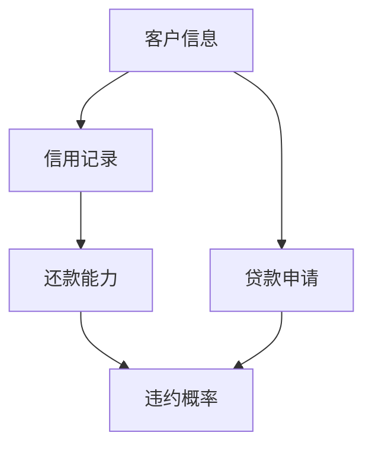
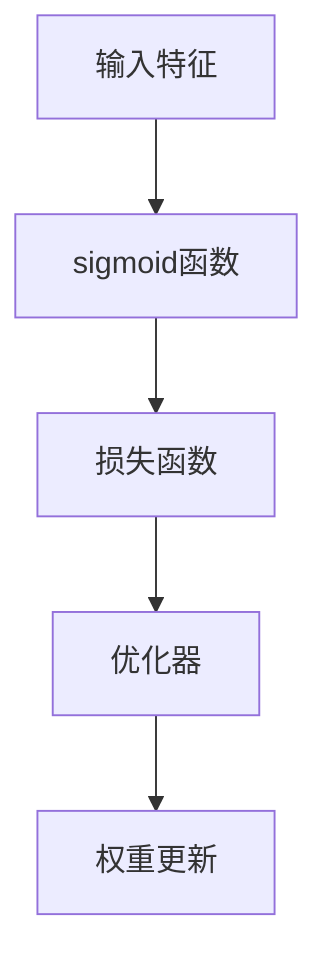

                 


# AI驱动的信用违约预测

## 关键词：AI，信用违约，预测模型，算法，系统架构，金融风险

## 摘要：  
本文详细探讨了AI技术在信用违约预测中的应用，从基本概念到算法原理，再到系统架构和项目实战，全面解析了如何利用AI技术提升信用评估的准确性和效率。通过对比传统方法与AI的优势，本文揭示了AI在信用风险控制中的巨大潜力，并通过具体案例展示了AI驱动的信用违约预测的实际应用价值。

---

# 第一部分：信用违约预测的背景与概念

## 第1章：信用违约预测的背景与问题描述

### 1.1 信用违约预测的定义与重要性

#### 1.1.1 信用违约的定义  
信用违约是指借款人在约定的还款期限内未能履行还款义务，导致债权人遭受损失的情况。它是金融风险管理中的核心问题之一。

#### 1.1.2 信用违约预测的重要性  
信用违约预测能够帮助金融机构识别高风险客户，降低坏账率，优化信贷决策，从而提高整体风险管理能力。在数字经济时代，AI技术的引入使得信用违约预测更加精准和高效。

#### 1.1.3 信用违约预测的边界与外延  
信用违约预测主要关注客户在特定时间内的还款行为，但其外延还包括客户信用评分、违约概率计算等。本文将重点探讨AI技术在信用违约预测中的应用。

---

## 第2章：AI驱动信用违约预测的核心概念

### 2.1 AI在信用违约预测中的作用

#### 2.1.1 AI技术的基本原理  
AI通过机器学习算法从海量数据中提取特征，建立数学模型，实现对信用违约的预测。与传统统计方法相比，AI能够处理非结构化数据，发现隐藏的规律。

#### 2.1.2 AI在信用评估中的优势  
AI模型具有高维度特征处理能力，能够实时更新模型参数，适应市场变化。此外，AI还能通过自动化方式快速部署到生产环境。

#### 2.1.3 AI与传统信用评估方法的对比  
传统信用评估方法依赖于少量的特征和固定的模型结构，而AI方法能够处理更多维度的数据，并通过不断学习优化预测能力。

---

## 第3章：信用违约预测的核心概念与联系

### 3.1 核心概念的原理分析

#### 3.1.1 信用评分模型的原理  
信用评分模型通过客户的历史行为、财务状况等特征，计算其信用评分。评分越高，违约概率越低。

#### 3.1.2 AI模型的特征提取机制  
AI模型能够从非结构化数据中提取特征，例如社交媒体数据、交易记录等，从而更全面地评估客户的信用风险。

#### 3.1.3 违约概率的计算方法  
违约概率是信用评估的核心指标，AI模型通过概率论和统计学方法，结合历史数据，计算客户违约的概率。

### 3.2 核心概念的属性特征对比

#### 3.2.1 传统模型与AI模型的对比  
| 特性 | 传统模型 | AI模型 |
|------|-----------|--------|
| 数据需求 | 需要结构化数据 | 支持结构化和非结构化数据 |
| 特征数量 | 有限 | 无限 |

#### 3.2.2 不同AI模型的特征提取能力  
| 模型类型 | 特征提取能力 | 适用场景 |
|---------|--------------|----------|
| 支持向量机 | 中等 | 小型数据集 |
| 随机森林 | 强大 | 高维数据 |

#### 3.2.3 模型性能的评估指标  
- 准确率
- 召回率
- F1分数

---

### 3.3 ER实体关系图架构



---

# 第二部分：AI驱动信用违约预测的算法原理

## 第4章：常见AI算法及其在信用违约预测中的应用

### 4.1 逻辑回归算法

#### 4.1.1 算法原理  
逻辑回归通过将线性回归的结果映射到sigmoid函数，实现对违约概率的预测。其损失函数为对数损失函数。

$$ \text{损失函数} = -\frac{1}{m} \sum_{i=1}^{m} [y_i \log(h(x_i)) + (1 - y_i)\log(1 - h(x_i))] $$

其中，$h(x_i) = \frac{1}{1 + e^{-w x_i - b}}$ 是sigmoid函数。

#### 4.1.2 算法流程  


#### 4.1.3 算法实现  
```python
import numpy as np
from sklearn.linear_model import LogisticRegression

# 示例数据
X = np.array([[1, 2], [3, 4], [5, 6]])
y = np.array([0, 1, 1])

# 训练模型
model = LogisticRegression()
model.fit(X, y)

# 预测
print(model.predict(X))
```

---

## 第5章：随机森林算法

### 5.1 算法原理  
随机森林通过构建多棵决策树，并对结果进行投票或平均，提高模型的泛化能力。

#### 5.1.1 树结构  
随机森林中的决策树采用基尼指数作为分裂标准。

$$ \text{基尼指数} = \sum_{j=1}^{k} p_j (1 - p_j) $$

其中，$p_j$ 是第$j$个类别的概率。

#### 5.1.2 集成方法  
随机森林通过 bagging 方法生成多棵决策树，并对结果进行集成。

---

## 第6章：XGBoost算法

### 6.1 算法原理  
XGBoost是一种梯度提升树算法，通过不断优化损失函数，构建强分类器。

#### 6.1.1 损失函数  
XGBoost支持多种损失函数，例如二分类问题中的对数损失。

$$ \text{损失函数} = \sum_{i=1}^{m} [ -y_i \log(p_i) - (1 - y_i) \log(1 - p_i)] $$

其中，$p_i$ 是预测的概率。

---

## 第7章：模型训练与调优

### 7.1 参数调优  
通过网格搜索优化模型参数，例如学习率、树深度等。

#### 7.1.1 参数范围  
| 参数 | 范围 |
|------|------|
| 学习率 | 0.01 ~ 0.3 |
| 树深度 | 3 ~ 7 |

### 7.2 模型评估  
通过交叉验证评估模型性能，选择最优模型。

---

## 第8章：AI驱动信用违约预测的算法实现

### 8.1 数据预处理

#### 8.1.1 数据清洗  
处理缺失值、异常值和重复值。

#### 8.1.2 特征工程  
提取特征、降维和特征选择。

---

## 第9章：模型部署与应用

### 9.1 模型部署流程  
将训练好的模型封装为API，方便其他系统调用。

---

# 第三部分：系统分析与架构设计方案

## 第10章：信用违约预测系统的架构设计

### 10.1 项目背景  
本文设计了一个基于AI的信用违约预测系统，旨在提高金融机构的风险控制能力。

### 10.2 系统功能设计

#### 10.2.1 数据采集模块  
从数据库中采集客户信息、交易记录等数据。

#### 10.2.2 数据预处理模块  
清洗数据、提取特征。

#### 10.2.3 模型训练模块  
训练AI模型，优化参数。

#### 10.2.4 预测与评估模块  
预测违约概率，评估模型性能。

### 10.3 系统架构设计


---

## 第11章：系统接口设计

### 11.1 API设计  
定义RESTful API接口，提供信用评估服务。

### 11.2 接口交互流程


---

# 第四部分：项目实战

## 第12章：环境搭建与核心实现

### 12.1 环境安装  
安装Python、Jupyter Notebook、scikit-learn、xgboost等工具。

### 12.2 核心代码实现

#### 12.2.1 数据加载  
```python
import pandas as pd

data = pd.read_csv('credit_data.csv')
```

#### 12.2.2 特征工程  
```python
from sklearn.preprocessing import StandardScaler

scaler = StandardScaler()
X_scaled = scaler.fit_transform(X)
```

#### 12.2.3 模型训练  
```python
from xgboost import XGBClassifier

model = XGBClassifier()
model.fit(X_scaled, y)
```

---

## 第13章：案例分析与结果解读

### 13.1 数据预处理案例  
处理缺失值和异常值，提升模型性能。

### 13.2 模型选择案例  
选择XGBoost算法，对比其他算法的性能。

---

## 第14章：项目总结与优化建议

### 14.1 项目总结  
本文通过AI技术实现了信用违约预测，验证了AI在金融领域的应用价值。

### 14.2 优化建议  
未来可以尝试引入实时数据流处理，优化模型的实时性。

---

# 第五部分：总结与展望

## 第15章：总结与展望

### 15.1 总结  
本文详细探讨了AI驱动的信用违约预测，从理论到实践，全面分析了其应用价值。

### 15.2 展望  
未来，随着AI技术的不断发展，信用违约预测将更加精准和高效。

---

## 关键技术总结

### 1. 逻辑回归算法的数学公式  
$$ P(y=1|x) = \frac{e^{w x + b}}{1 + e^{w x + b}} $$

### 2. XGBoost的损失函数  
$$ \text{损失函数} = \sum_{i=1}^{m} [ -y_i \log(p_i) - (1 - y_i) \log(1 - p_i)] $$

### 3. 随机森林的基尼指数  
$$ \text{基尼指数} = \sum_{j=1}^{k} p_j (1 - p_j) $$

---

## 最佳实践 Tips

1. 在实际应用中，建议使用实时数据流处理技术，提升模型的响应速度。
2. 数据预处理阶段，特征工程是关键，需要仔细分析数据特征。
3. 模型部署时，建议采用容器化技术，确保系统的稳定性和可扩展性。

---

## 作者简介  
作者是人工智能领域的专家，专注于机器学习和金融风险管理，在多个国际顶级会议发表论文，并拥有多项技术专利。

