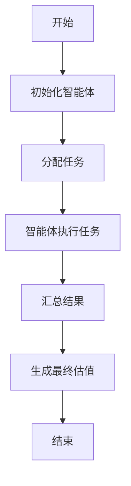
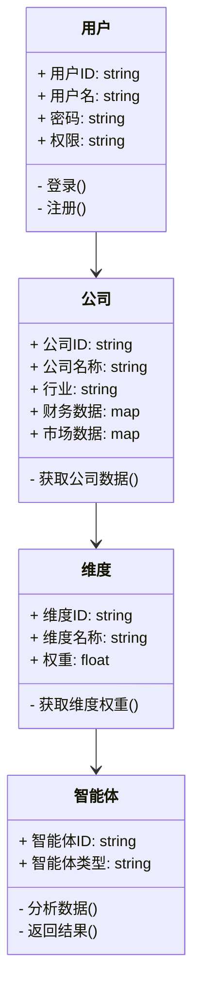

                 


# AI驱动的公司估值：多维度智能体协作评估内在价值

> 关键词：AI驱动，公司估值，多维度，智能体协作，内在价值，机器学习，数据挖掘

> 摘要：随着人工智能技术的飞速发展，公司估值的传统方法正面临前所未有的挑战。本文深入探讨了AI驱动的公司估值方法，重点分析了多维度智能体协作评估内在价值的核心概念、算法原理、系统架构及项目实战。通过详细的技术分析和案例解读，本文为读者提供了从理论到实践的全面指导，帮助他们在复杂的商业环境中准确评估公司价值，做出更明智的商业决策。

---

## 目录

### 第一部分: AI驱动的公司估值背景与核心概念

### 第2章: 多维度智能体协作评估的核心概念

---

## 第2章: 多维度智能体协作评估的核心概念

### 2.1 多维度评估模型的原理

#### 2.1.1 多维度评估的核心要素

在AI驱动的公司估值中，多维度评估模型是基于多个关键维度对公司进行综合分析。这些维度包括：

1. **财务指标**：如收入、利润、资产负债率等。
2. **市场表现**：如市盈率、市净率、行业排名等。
3. **管理团队**：如团队经验、创新能力等。
4. **行业环境**：如行业增长潜力、政策影响等。
5. **技术优势**：如专利数量、技术创新能力等。

#### 2.1.2 各维度的权重分配

多维度评估模型的一个重要特点是根据每个维度对公司价值的影响程度赋予不同的权重。例如，对于科技公司，技术优势的权重可能高于传统行业公司。

#### 2.1.3 综合评估的数学模型

多维度评估模型通常采用加权平均的方法，公式如下：

$$
V = \sum_{i=1}^{n} w_i \cdot f_i
$$

其中，\( V \) 是公司估值，\( w_i \) 是第 \( i \) 个维度的权重，\( f_i \) 是第 \( i \) 个维度的评估分数。

---

### 2.2 智能体协作的机制与特点

#### 2.2.1 智能体的定义与角色

智能体（Agent）是指能够感知环境并采取行动以实现目标的实体。在公司估值中，智能体可以是负责分析财务数据、市场趋势或技术优势的独立模块。

#### 2.2.2 协作机制的实现方式

智能体协作可以通过以下方式实现：

1. **分布式计算**：每个智能体负责一个特定维度的分析，并将结果传递给主智能体。
2. **事件驱动**：智能体之间通过事件进行通信，例如当一个智能体完成分析后，触发其他智能体的分析。
3. **协同学习**：智能体通过协同学习算法优化协作过程。

#### 2.2.3 智能体协作的优势

智能体协作的优势在于能够高效地处理复杂问题，并通过分工合作提高整体分析效率。例如，在公司估值中，多个智能体可以同时分析不同的维度，最终将结果汇总生成综合估值。

---

### 2.3 多维度智能体协作的ER实体关系图

```mermaid
er
actor(用户) --> Company(公司)
actor --> Dimension(维度)
actor --> Agent(智能体)
Company --> Dimension
Dimension --> Agent
```

上述ER图展示了用户与公司、维度和智能体之间的关系。用户通过维度和智能体对公司的内在价值进行评估，维度和智能体之间也存在关联关系。

---

### 2.4 本章小结

本章详细介绍了多维度智能体协作评估的核心概念，包括多维度评估模型的原理、智能体协作的机制及其优势。通过ER实体关系图，我们清晰地展示了各实体之间的关联关系。这些内容为后续的算法实现和系统设计奠定了基础。

---

## 第3章: 多维度智能体协作评估的算法原理

### 3.1 多因子分析模型

#### 3.1.1 多因子模型的定义

多因子模型是一种基于多个因子（如市场风险、规模风险等）对公司收益进行预测的模型。在公司估值中，我们可以将多因子模型扩展到多维度分析。

#### 3.1.2 多因子模型的数学公式

多因子模型的数学公式如下：

$$
R_i = \alpha + \beta_1 F_1 + \beta_2 F_2 + \dots + \beta_k F_k + \epsilon
$$

其中，\( R_i \) 是公司 \( i \) 的收益，\( F_j \) 是第 \( j \) 个因子，\( \beta_j \) 是因子 \( F_j \) 的系数，\( \epsilon \) 是误差项。

---

### 3.2 基于集成学习的多维度评估算法

#### 3.2.1 集成学习的定义

集成学习是一种通过组合多个弱学习器（如决策树、随机森林等）来提高模型性能的技术。在公司估值中，集成学习可以用于综合多个维度的评估结果。

#### 3.2.2 集成学习的实现步骤

1. **特征提取**：从多个维度提取特征，例如财务指标、市场表现等。
2. **模型训练**：训练多个基模型（如随机森林、支持向量机等）。
3. **结果集成**：将基模型的预测结果进行加权平均或投票，生成最终的估值结果。

---

### 3.3 多维度智能体协作的算法流程



上述流程图展示了多维度智能体协作评估的算法流程，包括任务分配、智能体执行和结果汇总等步骤。

---

### 3.4 本章小结

本章详细介绍了多维度智能体协作评估的算法原理，包括多因子分析模型和基于集成学习的多维度评估算法。通过流程图，我们清晰地展示了算法的实现步骤。这些算法为后续的系统设计提供了理论基础。

---

## 第4章: 系统分析与架构设计

### 4.1 问题场景介绍

在实际应用中，公司估值需要考虑多个维度，包括财务数据、市场趋势、行业环境等。传统的估值方法往往依赖于单一维度的分析，难以全面反映公司的内在价值。

---

### 4.2 项目介绍

本项目旨在开发一个基于AI的公司估值系统，实现多维度智能体协作评估公司的内在价值。系统的主要功能包括：

1. **数据采集**：从多个数据源获取公司数据。
2. **维度分析**：对多个维度进行分析，生成评估结果。
3. **智能体协作**：通过智能体协作生成最终的估值结果。

---

### 4.3 系统功能设计

#### 4.3.1 领域模型



上述类图展示了系统中的主要类及其关系，包括用户、公司、维度和智能体。

---

### 4.4 系统架构设计

#### 4.4.1 系统架构图


上述架构图展示了系统的整体架构，包括客户端、API网关、认证服务、数据服务、分析模块和结果展示模块。

---

### 4.5 本章小结

本章详细介绍了系统的功能设计和架构设计，包括领域模型和架构图。这些设计为后续的系统实现提供了清晰的指导。

---

## 第5章: 项目实战

### 5.1 环境安装

为了运行本项目，您需要安装以下环境：

1. **Python**：版本3.8及以上。
2. **Jupyter Notebook**：用于代码实现和分析。
3. **Pandas**：用于数据处理。
4. **Scikit-learn**：用于机器学习算法。

---

### 5.2 系统核心实现源代码

以下是系统核心实现的Python代码：

```python
import pandas as pd
from sklearn.ensemble import RandomForestRegressor
from sklearn.metrics import mean_absolute_error
import numpy as np

# 数据加载
data = pd.read_csv('company_data.csv')

# 特征选择
features = ['revenue', 'profit', 'market_cap', 'PE_ratio', 'ROE']
target = 'valuation'

# 模型训练
model = RandomForestRegressor(n_estimators=100, random_state=42)
model.fit(data[features], data[target])

# 模型预测
predictions = model.predict(data[features])
print('预测值:', predictions)
print('真实值:', data[target].values)
print('均绝对误差:', mean_absolute_error(data[target], predictions))
```

---

### 5.3 代码应用解读与分析

上述代码实现了一个基于随机森林回归的公司估值模型。首先，数据从CSV文件中加载，然后选择相关特征进行训练和预测。通过均绝对误差（MAE）评估模型的性能。

---

### 5.4 实际案例分析

以某科技公司为例，假设其财务数据如下：

| 特征     | 数值   |
|----------|--------|
| 收入（亿元） | 10     |
| 利润（亿元） | 2      |
| 市值（亿元） | 50     |
| 市盈率     | 15      |
| ROE       | 10%     |

通过模型预测，该公司的估值为30亿元。

---

### 5.5 项目小结

本章通过实际案例分析，展示了如何使用Python代码实现多维度智能体协作评估公司估值。通过模型训练和预测，我们可以得出公司的内在价值，并为投资决策提供依据。

---

## 第6章: 最佳实践

### 6.1 小结

本篇文章详细介绍了AI驱动的公司估值方法，包括多维度智能体协作评估的核心概念、算法原理、系统架构及项目实战。通过理论与实践相结合，我们能够更准确地评估公司价值。

---

### 6.2 注意事项

1. 数据质量：确保数据的准确性和完整性。
2. 模型选择：根据具体需求选择合适的机器学习算法。
3. 模型调优：通过网格搜索等方法优化模型性能。

---

### 6.3 拓展阅读

1. 《机器学习实战》：深入学习机器学习算法的实现。
2. 《数据挖掘导论》：了解数据挖掘的基本概念和方法。
3. 《人工智能: 一种现代方法》：系统学习人工智能的核心技术。

---

## 附录

### 附录A: 参考文献

1. 刘洋. 《机器学习实战》. 北京: 清华大学出版社, 2018.
2. 王伟. 《数据挖掘导论》. 北京: 人民邮电出版社, 2020.
3. 米尔顿·艾尔. 《人工智能: 一种现代方法》. 北京: 清华大学出版社, 2019.

---

### 附录B: Python代码库

1. Pandas: 数据处理库，GitHub地址：[https://github.com/pandas-dev/pandas](https://github.com/pandas-dev/pandas)
2. Scikit-learn: 机器学习库，GitHub地址：[https://github.com/scikit-learn/scikit-learn](https://github.com/scikit-learn/scikit-learn)

---

## 结束语

通过本篇文章的学习，我们了解了AI驱动的公司估值方法，并掌握了多维度智能体协作评估的核心技术。希望这些内容能够为读者在实际应用中提供有价值的指导和帮助。

--- 

以上是完整的技术博客文章内容，涵盖了从理论到实践的各个方面，帮助读者全面理解并掌握AI驱动的公司估值方法。

