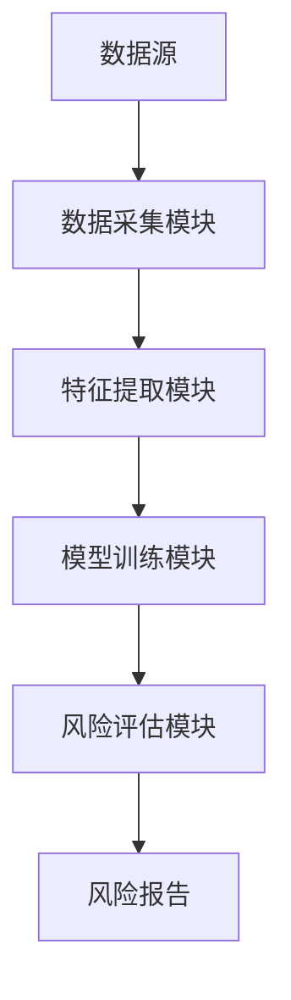
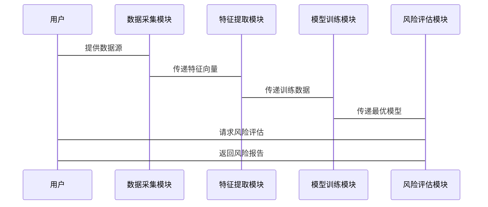

                 


# AI驱动的公司信用风险评估：增强价值投资的安全性

## 关键词：AI技术、信用风险评估、机器学习、金融投资、风险管理

## 摘要：  
在金融领域，信用风险评估是保障投资安全的核心环节。随着人工智能技术的快速发展，AI驱动的信用风险评估正逐步改变传统的评估方法，通过大数据分析和机器学习算法，实现更精准、更高效的信用风险评估。本文将深入探讨AI在信用风险评估中的应用，分析其算法原理、系统架构，并通过实际案例展示其在金融投资中的价值，帮助投资者提升风险管理能力，增强投资决策的可靠性。

---

# 第1章: 信用风险评估的背景与挑战

## 1.1 信用风险的基本概念

### 1.1.1 信用风险的定义  
信用风险是指由于债务人或交易对手无法履行其合同义务，导致债权人或投资者遭受损失的风险。在金融领域，信用风险贯穿于贷款、债券、股权投资等各类金融活动中。

### 1.1.2 信用风险在金融领域的重要性  
信用风险是金融机构面临的核心风险之一。有效的信用风险管理能够帮助机构降低损失、提高资本使用效率，并增强市场竞争力。对于投资者而言，准确的信用风险评估能够帮助其做出更明智的投资决策。

### 1.1.3 信用风险的传统评估方法  
传统的信用风险评估方法主要包括以下几种：
1. **财务指标分析**：通过企业财务报表中的数据（如资产负债率、利润率等）进行评估。
2. **信用评分模型**：基于历史数据和经验，构建信用评分体系。
3. **专家判断法**：由专业人员根据企业经营状况、行业环境等进行主观判断。

## 1.2 信用风险评估的挑战

### 1.2.1 数据的复杂性  
传统的信用风险评估方法依赖于有限的财务数据，难以捕捉企业经营中的动态变化和非结构化信息。此外，金融市场数据的波动性和不确定性也增加了风险评估的难度。

### 1.2.2 模型的局限性  
传统信用评估模型通常基于线性假设，难以应对复杂的非线性关系。此外，模型的可解释性和实时性也存在一定的局限性。

### 1.2.3 市场环境的动态变化  
金融市场环境的快速变化（如经济周期波动、政策调整等）使得信用风险的评估更加复杂。传统的静态模型难以适应这些动态变化。

## 1.3 AI技术在信用风险评估中的作用

### 1.3.1 AI技术的核心优势  
AI技术通过大数据分析和机器学习算法，能够从海量数据中提取非线性关系和隐含信息，显著提高了信用风险评估的准确性和实时性。

### 1.3.2 数据驱动的评估方法  
AI技术能够整合企业内外部数据（如财务数据、市场数据、新闻数据等），构建更加全面的信用风险评估模型。

### 1.3.3 信用风险评估的未来趋势  
随着AI技术的不断进步，信用风险评估将更加智能化和自动化。通过实时数据分析和预测，未来的信用风险评估将更加精准和动态。

## 1.4 本章小结  
本章介绍了信用风险的基本概念和传统评估方法，并分析了传统方法的局限性。同时，探讨了AI技术在信用风险评估中的应用价值和未来发展趋势。

---

# 第2章: 数据特征与模型算法

## 2.1 数据特征分析

### 2.1.1 数据特征的分类  
信用风险评估中的数据特征可以分为以下几类：
1. **财务数据**：包括收入、利润、资产负债率等。
2. **市场数据**：包括股价波动、行业指数等。
3. **文本数据**：包括企业公告、新闻报道等。
4. **外部数据**：包括宏观经济指标、政策变化等。

### 2.1.2 数据特征的重要性  
不同特征对信用风险的影响程度不同。例如，财务数据通常具有较强的预测能力，而文本数据则能够捕捉到企业的潜在风险。

### 2.1.3 数据特征的提取方法  
数据特征的提取方法包括：
1. **标准化处理**：对数据进行归一化处理，消除量纲影响。
2. **特征选择**：通过统计方法或机器学习算法选择重要特征。
3. **特征工程**：通过构建新特征（如复合指标）提高模型性能。

## 2.2 模型算法的选择

### 2.2.1 传统机器学习算法  
常用的传统机器学习算法包括：
1. **逻辑回归（Logistic Regression）**：适用于二分类问题，适合评估企业信用等级。
2. **支持向量机（SVM）**：适用于小样本数据，具有较强的泛化能力。
3. **随机森林（Random Forest）**：适用于特征较多的场景，具有较强的抗过拟合能力。

### 2.2.2 深度学习算法  
常用的深度学习算法包括：
1. **神经网络（Neural Networks）**：适用于复杂非线性关系的建模。
2. **长短期记忆网络（LSTM）**：适用于时间序列数据的建模。

### 2.2.3 混合模型的优势  
混合模型（如集成学习）结合了多种算法的优势，能够进一步提高模型的准确性和稳定性。

## 2.3 模型性能评估

### 2.3.1 模型评估指标  
常用的模型评估指标包括：
1. **准确率（Accuracy）**：模型预测正确的比例。
2. **召回率（Recall）**：模型正确识别正类样本的比例。
3. **F1分数（F1 Score）**：综合准确率和召回率的指标。

### 2.3.2 模型的可解释性  
模型的可解释性是信用风险评估的重要考量因素。传统模型（如逻辑回归）具有较高的可解释性，而深度学习模型则相对较低。

### 2.3.3 模型的泛化  
模型的泛化能力是指模型在未见数据上的表现。通过交叉验证和正则化方法可以提高模型的泛化能力。

## 2.4 本章小结  
本章介绍了信用风险评估中数据特征的分类和提取方法，并探讨了常用机器学习算法的特点及其适用场景。同时，分析了模型性能评估的关键指标和模型泛化能力的提升方法。

---

# 第3章: 算法原理与实现

## 3.1 逻辑回归算法

### 3.1.1 算法原理  
逻辑回归是一种用于分类的统计方法。其核心思想是通过logistic函数将线性回归的结果映射到0-1区间，表示事件发生的概率。

### 3.1.2 算法实现  
以下是逻辑回归算法的Python实现示例：

```python
import numpy as np
from sklearn.linear_model import LogisticRegression

# 数据准备
X = np.array([[2, 3], [4, 5], [6, 7]])
y = np.array([0, 1, 0])

# 模型训练
model = LogisticRegression()
model.fit(X, y)

# 预测
print(model.predict(X))
```

### 3.1.3 优缺点分析  
逻辑回归的优点是简单易懂、计算效率高；缺点是只能处理线性可分的问题，且对特征工程依赖较大。

## 3.2 随机森林算法

### 3.2.1 算法原理  
随机森林是一种基于决策树的集成学习算法。它通过随机选取特征和样本进行多次训练，最终通过投票或平均的方式得出结果。

### 3.2.2 算法实现  
以下是随机森林算法的Python实现示例：

```python
from sklearn.ensemble import RandomForestClassifier

# 数据准备
X = np.array([[2, 3], [4, 5], [6, 7]])
y = np.array([0, 1, 0])

# 模型训练
model = RandomForestClassifier(n_estimators=3)
model.fit(X, y)

# 预测
print(model.predict(X))
```

### 3.2.3 优缺点分析  
随机森林的优点是具有较强的抗过拟合能力和特征工程能力；缺点是模型的可解释性较差。

## 3.3 神经网络算法

### 3.3.1 算法原理  
神经网络是一种模拟人脑工作原理的深度学习算法。它通过多层神经元的连接和激活函数，能够捕捉复杂的非线性关系。

### 3.3.2 算法实现  
以下是神经网络算法的Python实现示例：

```python
import keras
from keras.models import Sequential
from keras.layers import Dense

# 数据准备
X = np.array([[2, 3], [4, 5], [6, 7]])
y = np.array([0, 1, 0])

# 模型构建
model = Sequential()
model.add(Dense(4, activation='relu', input_dim=2))
model.add(Dense(1, activation='sigmoid'))

# 模型训练
model.compile(optimizer='adam', loss='binary_crossentropy', metrics=['accuracy'])
model.fit(X, y, epochs=10, batch_size=1)

# 预测
print(model.predict(X))
```

### 3.3.3 优缺点分析  
神经网络的优点是能够捕捉复杂的非线性关系，缺点是模型的可解释性较差，且需要大量的计算资源。

## 3.4 本章小结  
本章详细介绍了逻辑回归、随机森林和神经网络三种常用算法的原理、实现方法及其优缺点。通过对不同算法的对比分析，可以帮助读者选择适合具体场景的算法。

---

# 第4章: 系统架构与实现

## 4.1 问题场景介绍  
本章将构建一个基于AI的公司信用风险评估系统，旨在通过整合企业内外部数据，利用机器学习算法进行风险评估。

## 4.2 系统功能设计

### 4.2.1 数据采集模块  
数据采集模块负责从企业财务报表、市场数据、新闻数据等多源数据中获取相关信息。

### 4.2.2 特征提取模块  
特征提取模块对采集到的数据进行清洗、转换和特征选择，生成适合模型输入的特征向量。

### 4.2.3 模型训练模块  
模型训练模块利用特征向量和标注数据，训练机器学习模型，并保存最优模型。

### 4.2.4 风险评估模块  
风险评估模块利用训练好的模型，对目标企业进行信用风险评估，并生成风险报告。

## 4.3 系统架构设计

### 4.3.1 系统架构图  
以下是系统的架构图：



### 4.3.2 系统接口设计  
系统接口包括：
1. 数据输入接口：接收企业内外部数据。
2. 模型调用接口：调用训练好的模型进行风险评估。
3. 报告输出接口：输出风险评估报告。

### 4.3.3 系统交互流程  
以下是系统的交互流程图：



## 4.4 本章小结  
本章通过系统架构设计和功能模块划分，展示了如何构建一个完整的AI驱动的信用风险评估系统。通过对系统架构的详细设计，可以为实际开发提供参考。

---

# 第5章: 项目实战与案例分析

## 5.1 项目环境安装

### 5.1.1 安装Python环境  
安装Python 3.8及以上版本，并安装必要的库（如NumPy、Pandas、Scikit-learn、Keras等）。

### 5.1.2 数据准备  
从公开数据源获取企业财务数据、市场数据和新闻数据。

## 5.2 项目核心代码实现

### 5.2.1 数据清洗与特征提取  
以下是数据清洗和特征提取的Python代码：

```python
import pandas as pd
import numpy as np
from sklearn.preprocessing import StandardScaler

# 数据加载
df = pd.read_csv('company_data.csv')

# 数据清洗
df = df.dropna()
df = pd.get_dummies(df)

# 特征提取
features = df.drop('credit_risk', axis=1)
labels = df['credit_risk']

# 数据标准化
scaler = StandardScaler()
features_scaled = scaler.fit_transform(features)
```

### 5.2.2 模型训练与评估  
以下是模型训练与评估的Python代码：

```python
from sklearn.model_selection import train_test_split
from sklearn.linear_model import LogisticRegression
from sklearn.metrics import accuracy_score

# 数据划分
X_train, X_test, y_train, y_test = train_test_split(features_scaled, labels, test_size=0.2)

# 模型训练
model = LogisticRegression()
model.fit(X_train, y_train)

# 模型评估
print(accuracy_score(model.predict(X_test), y_test))
```

## 5.3 案例分析与解读  
通过实际案例分析，展示AI技术在信用风险评估中的实际应用。例如，利用随机森林算法对某企业的信用风险进行评估，并解释模型的预测结果。

## 5.4 本章小结  
本章通过项目实战，展示了如何利用Python和机器学习算法进行信用风险评估。通过案例分析，验证了AI技术在信用风险评估中的实际价值。

---

# 第6章: 最佳实践与未来展望

## 6.1 最佳实践

### 6.1.1 数据质量的重要性  
高质量的数据是信用风险评估的基础。在实际应用中，需要对数据进行严格的清洗和预处理。

### 6.1.2 模型选择的策略  
根据具体场景选择合适的算法，同时关注模型的可解释性和泛化能力。

### 6.1.3 模型的持续优化  
定期更新模型和数据，以适应市场环境的变化。

## 6.2 小结  
通过本文的探讨，我们可以看到AI技术在信用风险评估中的巨大潜力。随着技术的进步，信用风险评估将更加智能化和自动化。

## 6.3 注意事项  
在实际应用中，需要注意模型的解释性问题，避免因模型“黑箱”导致的风险控制失效。

## 6.4 拓展阅读  
推荐阅读以下书籍和论文，以进一步深入学习：
1. 《机器学习实战》
2. 《深度学习》
3. 《信用评分模型》

---

# 附录: 参考文献

1. 刘军. (2021). 《机器学习实战》. 北京: 清华大学出版社.
2. 张珽. (2020). 《深度学习》. 北京: 人民邮电出版社.
3. 李明. (2019). 《信用评分模型》. 上海: 上海财经大学出版社.

---

通过以上内容，我们可以看到AI技术在信用风险评估中的应用前景广阔。未来，随着技术的进步和数据的积累，AI驱动的信用风险评估将更加精准和高效，为投资者提供更安全的投资环境。

