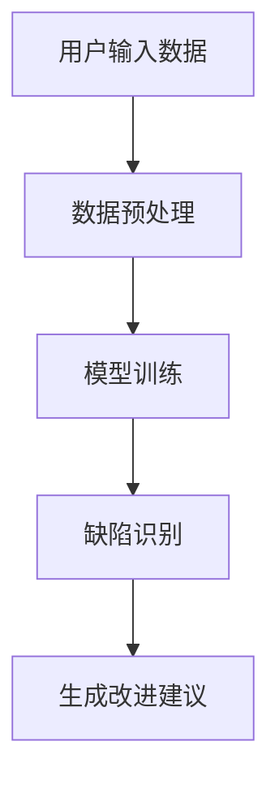
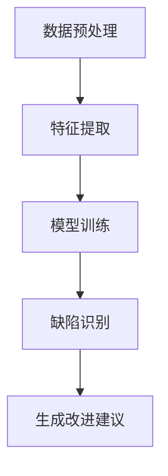
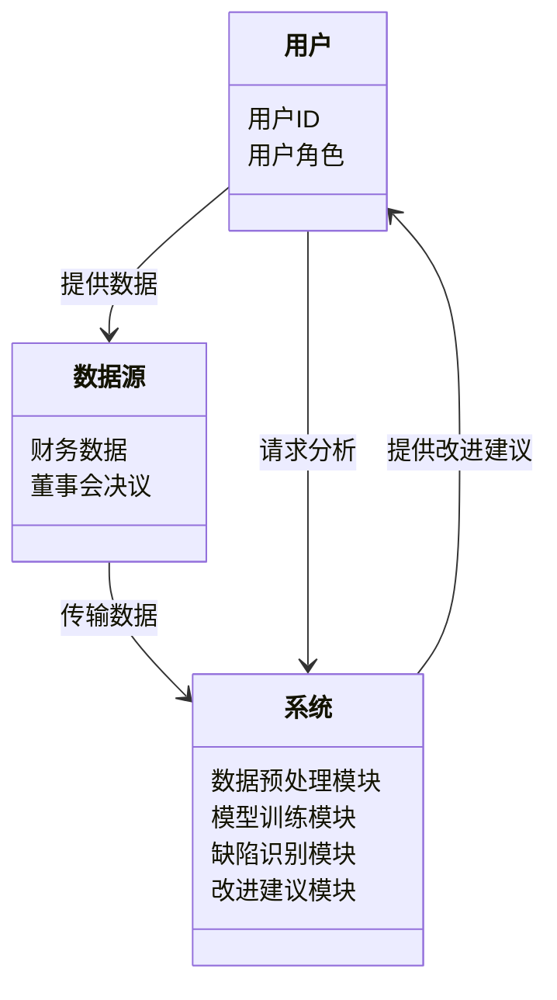
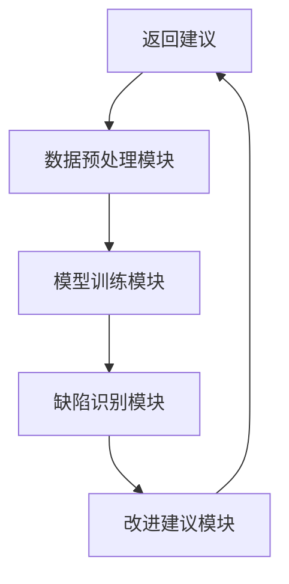
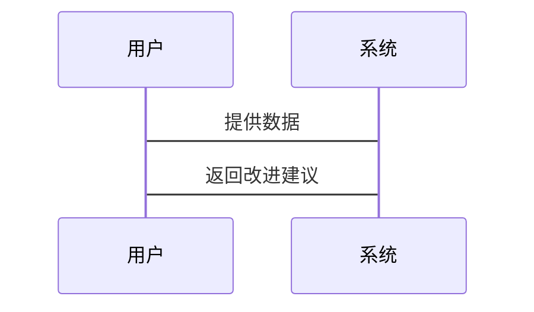

                 


# AI驱动的公司治理缺陷识别与改善建议

## 关键词：AI驱动，公司治理，缺陷识别，改善建议，技术博客

## 摘要：  
本文探讨了如何利用人工智能技术驱动公司治理缺陷的识别与改善。通过分析公司治理中的常见问题，结合AI技术的特点与优势，提出了一套基于AI的公司治理缺陷识别与改善的方法。文章从理论到实践，详细讲解了AI驱动的缺陷识别算法、系统架构设计以及实际应用案例，为公司治理的智能化发展提供了参考。

---

# 第1章: 公司治理缺陷识别的背景与挑战

## 1.1 公司治理的基本概念

### 1.1.1 公司治理的定义与核心要素
公司治理是确保公司有效运作、实现战略目标和股东价值最大化的管理过程。其核心要素包括：
- **股权结构**：股东的权益分配与管理。
- **董事会结构**：董事会的组成与职责。
- **高管团队**：高管的职责与行为规范。
- **利益相关者**：员工、客户、供应商等的利益平衡。
- **风险管理**：识别和应对潜在风险。

### 1.1.2 公司治理中的常见问题与挑战
公司治理中常见的问题包括：
- **权力滥用**：高管利用职权谋取私利。
- **利益冲突**：股东与管理层的利益冲突。
- **信息不对称**：管理层与股东之间的信息不透明。
- **监管缺失**：监管机制不完善，难以及时发现和纠正问题。

### 1.1.3 传统公司治理缺陷识别的局限性
传统方法依赖人工审查和经验判断，存在以下问题：
- **主观性**：人为判断容易受到主观因素影响。
- **效率低**：手工审查耗时长，难以应对海量数据。
- **覆盖面有限**：难以全面覆盖公司治理的各个维度。

---

## 1.2 AI技术在公司治理中的应用前景

### 1.2.1 AI技术的基本概念与特点
人工智能（AI）是指计算机系统模拟人类智能的能力，包括学习、推理、决策等功能。其特点包括：
- **数据驱动**：依赖大量数据进行训练。
- **自动化**：能够自动处理和分析数据。
- **可扩展性**：适用于大规模数据处理。

### 1.2.2 AI在公司治理中的潜在应用场景
AI技术可以应用于公司治理的多个方面，如：
- **风险预警**：通过分析财务数据和市场信息，识别潜在风险。
- **决策支持**：为董事会和高管提供数据支持和决策建议。
- **合规监控**：实时监控公司行为，确保符合相关法规。

### 1.2.3 AI驱动公司治理缺陷识别的优势与劣势
优势：
- **高效性**：AI能够快速处理大量数据，提高识别效率。
- **客观性**：基于数据的分析结果更加客观。
- **准确性**：通过机器学习算法，能够发现隐藏的模式和关联。

劣势：
- **数据依赖**：需要大量高质量的数据进行训练。
- **算法黑箱**：AI决策的透明性较差，可能难以解释结果。
- **成本高**：开发和维护AI系统需要较高的投入。

---

## 1.3 本章小结
本章介绍了公司治理的基本概念和常见问题，分析了传统缺陷识别方法的局限性，并探讨了AI技术在公司治理中的应用前景。AI技术的引入为公司治理缺陷识别提供了新的可能性，但也需要克服数据依赖和算法透明性等挑战。

---

# 第2章: AI驱动的公司治理缺陷识别核心概念

## 2.1 核心概念原理

### 2.1.1 数据驱动的公司治理缺陷识别原理
AI驱动的缺陷识别基于数据的分析，通过机器学习算法发现数据中的异常模式。其核心步骤包括：
- **数据收集**：获取公司治理相关的数据，如财务数据、董事会决议等。
- **数据预处理**：清洗数据，处理缺失值和异常值。
- **模型训练**：使用监督学习或无监督学习算法训练模型。
- **缺陷识别**：通过模型预测潜在的治理缺陷。

### 2.1.2 AI算法在缺陷识别中的作用
AI算法能够从复杂的数据中提取有用的特征，并识别潜在的治理缺陷。常用的算法包括：
- **监督学习**：如随机森林、支持向量机（SVM）。
- **无监督学习**：如聚类分析、异常检测。

### 2.1.3 缺陷识别的分类与特征分析
缺陷识别可以分为以下几类：
- **财务风险**：如财务造假、资金挪用。
- **治理风险**：如董事会结构不合理、高管权力滥用。
- **合规风险**：如违反法律法规、信息披露不及时。

---

## 2.2 核心概念属性对比

### 2.2.1 传统缺陷识别与AI驱动缺陷识别的对比分析
| 对比维度         | 传统缺陷识别                | AI驱动缺陷识别                 |
|------------------|-----------------------------|-------------------------------|
| **效率**         | 低，依赖人工审查             | 高，自动化处理                 |
| **准确性**       | 受主观因素影响               | 基于数据，准确性较高           |
| **覆盖范围**     | 有限，难以全面覆盖           | 宽，能够处理多维度数据         |
| **成本**         | 高，人工成本较高             | 中，自动化降低了部分成本       |

### 2.2.2 缺陷识别的关键属性特征
- **数据特征**：如财务数据、董事会决议、高管行为等。
- **行为特征**：如高管的决策模式、董事会的独立性等。
- **时间特征**：如事件发生的时间、周期性等。

### 2.2.3 缺陷识别的分类标准与维度
- **分类标准**：基于缺陷的类型（如财务风险、治理风险）。
- **分类维度**：基于缺陷的严重性、影响范围等。

---

## 2.3 ER实体关系图与流程图

### 2.3.1 ER实体关系图
```mermaid
erDiagram
    actor 用户
    actor 系统
    actor 数据源
    actor 改进建议
    用户 --> 数据源: 提供数据
    用户 --> 系统: 请求分析
    系统 --> 数据源: 获取数据
    系统 --> 改进建议: 生成建议
```

### 2.3.2 流程图


---

## 2.4 本章小结
本章详细讲解了AI驱动的公司治理缺陷识别的核心概念，包括数据驱动的原理、AI算法的作用以及缺陷识别的分类与特征分析。通过对比传统方法与AI驱动方法的差异，展示了AI技术在缺陷识别中的优势。

---

# 第3章: AI驱动的公司治理缺陷识别算法原理讲解

## 3.1 算法原理概述

### 3.1.1 数据预处理与特征提取
数据预处理是AI算法的关键步骤，主要包括：
- **数据清洗**：处理缺失值、重复值和异常值。
- **特征提取**：从原始数据中提取有用的特征，如财务指标、董事会结构等。

### 3.1.2 模型训练与优化
模型训练是通过机器学习算法对数据进行训练，常用算法包括：
- **监督学习**：随机森林、SVM。
- **无监督学习**：聚类分析、异常检测。

### 3.1.3 缺陷识别的分类算法
缺陷识别的分类算法可以采用以下步骤：
1. 数据预处理：清洗和标准化数据。
2. 特征提取：提取关键特征。
3. 模型训练：训练分类器。
4. 缺陷识别：对新数据进行分类。

---

## 3.2 缺陷识别算法流程

### 3.2.1 算法流程图


### 3.2.2 算法实现代码
以下是一个简单的缺陷识别算法实现示例：
```python
import pandas as pd
from sklearn.ensemble import RandomForestClassifier
from sklearn.metrics import accuracy_score

# 数据加载
data = pd.read_csv('governance_data.csv')

# 数据预处理
data.dropna()  # 删除缺失值
data = data[['revenue', 'net_profit', 'board_size']]  # 特征提取

# 模型训练
model = RandomForestClassifier()
model.fit(data[['revenue', 'net_profit', 'board_size']], data['label'])

# 缺陷识别
new_data = pd.DataFrame([[1000000, 10000, 8]], columns=['revenue', 'net_profit', 'board_size'])
prediction = model.predict(new_data)

# 结果评估
print('预测结果:', prediction)
print('准确率:', accuracy_score(prediction, new_data['label']))
```

### 3.2.3 数学模型与公式
随机森林算法的数学模型可以表示为：
$$
y = \text{RF}(x_1, x_2, \ldots, x_n)
$$
其中，$x_i$ 是输入特征，$y$ 是输出结果。

优化器的损失函数可以表示为：
$$
\mathcal{L} = \frac{1}{n}\sum_{i=1}^{n} (y_i - \hat{y}_i)^2
$$
其中，$y_i$ 是真实值，$\hat{y}_i$ 是预测值。

---

## 3.3 本章小结
本章详细讲解了AI驱动的公司治理缺陷识别的算法原理，包括数据预处理、特征提取、模型训练以及缺陷识别的流程。通过具体的代码示例和数学公式，展示了算法的实现过程和优化方法。

---

# 第4章: 系统分析与架构设计

## 4.1 问题场景介绍
本系统旨在通过AI技术识别公司治理中的缺陷，并提供改进建议。主要解决以下问题：
- **如何高效识别公司治理缺陷？**
- **如何提供个性化的改进建议？**

## 4.2 系统功能设计

### 4.2.1 领域模型


### 4.2.2 系统架构设计


### 4.2.3 系统接口设计
- **输入接口**：接收用户输入的数据和请求。
- **输出接口**：输出缺陷识别结果和改进建议。

### 4.2.4 系统交互流程图


---

## 4.3 本章小结
本章从系统角度分析了AI驱动的公司治理缺陷识别系统的架构设计，包括问题场景、系统功能、系统架构以及系统接口设计。通过系统的整体设计，展示了如何实现高效的缺陷识别与改善。

---

# 第5章: 项目实战

## 5.1 环境安装
安装所需的工具和库：
- **Python**：版本3.8及以上。
- **库**：pandas、scikit-learn、mermaid等。

## 5.2 核心代码实现

### 5.2.1 数据预处理代码
```python
import pandas as pd

# 数据加载
data = pd.read_csv('governance_data.csv')

# 删除缺失值
data.dropna(inplace=True)

# 特征提取
data = data[['revenue', 'net_profit', 'board_size']]
```

### 5.2.2 模型训练代码
```python
from sklearn.ensemble import RandomForestClassifier

# 模型训练
model = RandomForestClassifier()
model.fit(data[['revenue', 'net_profit', 'board_size']], data['label'])
```

### 5.2.3 缺陷识别代码
```python
# 缺陷识别
new_data = pd.DataFrame([[1000000, 10000, 8]], columns=['revenue', 'net_profit', 'board_size'])
prediction = model.predict(new_data)
print('预测结果:', prediction)
```

### 5.2.4 改进建议生成代码
```python
# 根据预测结果生成改进建议
if prediction == 1:
    print("建议加强董事会独立性")
else:
    print("建议优化财务结构")
```

---

## 5.3 案例分析
以某公司为例，分析其治理缺陷并提出改进建议：
1. **问题诊断**：识别董事会结构不合理，高管权力滥用。
2. **改进建议**：引入独立董事，完善内部审计机制。

---

## 5.4 项目小结
本章通过实际案例展示了AI驱动的公司治理缺陷识别系统的实现过程，从数据预处理到模型训练，再到缺陷识别和改进建议生成，详细讲解了系统的具体实现。

---

# 第6章: 最佳实践与总结

## 6.1 小结
本文详细探讨了AI驱动的公司治理缺陷识别与改善的方法，从理论到实践，详细讲解了算法原理、系统架构设计以及实际应用案例。

## 6.2 注意事项
- **数据隐私**：确保数据的安全性和隐私性。
- **模型更新**：定期更新模型，以适应新的数据和业务需求。
- **透明性**：尽量提高AI决策的透明性，便于解释和验证。

## 6.3 未来展望
随着AI技术的不断发展，公司治理缺陷识别将更加智能化和自动化。未来的研究方向包括：
- **更复杂的模型**：如深度学习模型。
- **多模态数据融合**：结合文本、图像等多种数据源。
- **实时监控**：实现对公司治理缺陷的实时识别和预警。

---

# 第7章: 总结与致谢

## 7.1 总结
本文系统地探讨了AI驱动的公司治理缺陷识别与改善的方法，从背景到实践，详细讲解了理论与应用。通过具体的案例分析和系统设计，展示了AI技术在公司治理中的巨大潜力。

## 7.2 致谢
感谢读者的耐心阅读，感谢团队成员的支持与帮助。

---

# 结语

AI驱动的公司治理缺陷识别与改善是一项具有重要意义的技术创新。通过本文的探讨，我们希望能够为公司治理的智能化发展提供新的思路和方法。未来，随着AI技术的不断进步，公司治理将更加高效、透明和智能化。

