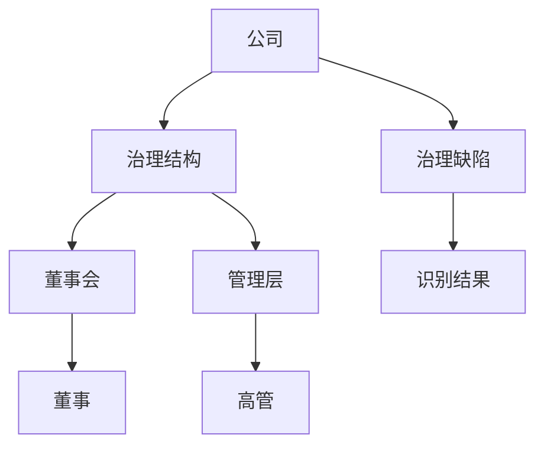
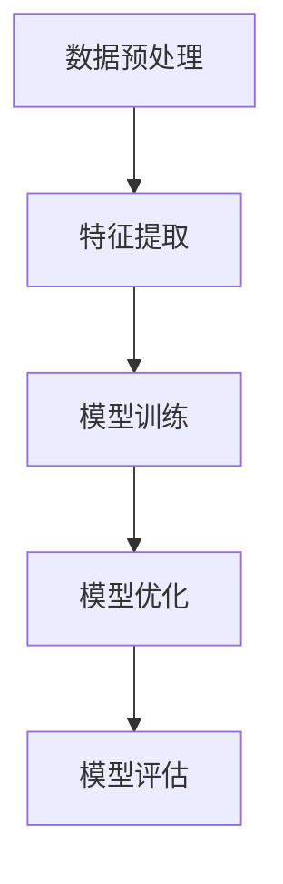
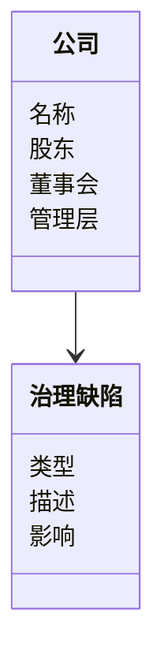
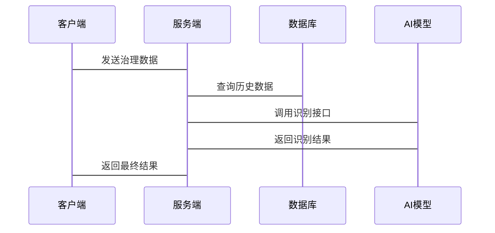

                 


# AI驱动的公司治理缺陷识别模型

## 关键词：AI、公司治理、缺陷识别、模型构建、算法原理

## 摘要：本文介绍了一种基于人工智能的公司治理缺陷识别模型，详细探讨了模型的设计思路、实现方法以及实际应用场景。通过分析公司治理中的常见问题，结合AI技术，提出了一种高效的缺陷识别方法，为企业治理提供了新的思路。

---

# 目录大纲

## 第1章: 公司治理缺陷识别的背景与问题描述

### 1.1 公司治理的基本概念
- 公司治理的定义与核心要素
- 公司治理的重要性与作用
- 公司治理中的常见问题

### 1.2 公司治理缺陷的定义与分类
- 公司治理缺陷的定义
- 公司治理缺陷的主要类型
- 公司治理缺陷的影响与风险

### 1.3 AI在公司治理中的应用潜力
- AI技术在公司治理中的优势
- 当前公司治理中的技术挑战
- AI驱动公司治理缺陷识别的可行性

### 1.4 本章小结

---

## 第2章: AI驱动公司治理缺陷识别的核心概念

### 2.1 公司治理缺陷识别模型的定义
- 模型的核心目标
- 模型的主要功能
- 模型的输入与输出

### 2.2 模型的关键组成部分
- 数据来源与特征
- 模型算法的选择
- 模型评估与优化

### 2.3 模型的核心属性与特征对比
- 模型的准确性
- 模型的可解释性
- 模型的可扩展性

### 2.4 模型的ER实体关系图


### 2.5 本章小结

---

## 第3章: AI驱动公司治理缺陷识别的算法原理

### 3.1 模型的算法选择
- 常见的公司治理缺陷识别算法
- 选择算法的依据
- 算法的优缺点分析

### 3.2 模型的训练与优化
- 数据预处理与特征提取
- 模型训练流程
- 模型调优与评估

### 3.3 模型的数学原理
- 损失函数与优化目标
$$\text{损失函数} = \sum_{i=1}^{n} (y_i - \hat{y}_i)^2$$
- 模型的训练过程
$$\text{优化目标} = \min_{\theta} \frac{1}{2m} \sum_{i=1}^{m} (y_i - \hat{y}_i)^2$$

### 3.4 模型的流程图


### 3.5 本章小结

---

## 第4章: 系统分析与架构设计方案

### 4.1 问题场景介绍
- 公司治理缺陷识别的需求分析
- 相关系统的功能需求
- 用户需求分析

### 4.2 系统功能设计
- 领域模型设计


### 4.3 系统架构设计
- 系统架构图


### 4.4 系统接口设计
- API接口定义
- 接口交互流程图


### 4.5 本章小结

---

## 第5章: 项目实战与案例分析

### 5.1 环境安装与配置
- 必需的开发工具安装
- 数据集准备
- 环境配置示例

### 5.2 核心代码实现
- 数据预处理代码
```python
import pandas as pd

data = pd.read_csv('corporate_governance.csv')
data_preprocessed = data.dropna()
```
- 模型训练代码
```python
from sklearn.model import Model

model = Model()
model.fit(preprocessed_data, labels)
```

### 5.3 代码解读与功能分析
- 核心代码的功能说明
- 模型训练的详细步骤

### 5.4 案例分析
- 具体案例的背景介绍
- 模型识别过程
- 结果分析与总结

### 5.5 本章小结

---

## 第6章: 总结与展望

### 6.1 本章总结
- 公司治理缺陷识别模型的核心内容回顾
- AI技术在公司治理中的应用价值

### 6.2 未来展望
- 模型优化的方向
- 技术的进一步发展
- 可能的应用领域扩展

### 6.3 本章小结

---

## 第7章: 最佳实践与注意事项

### 7.1 最佳实践
- 数据预处理的关键点
- 模型调优的注意事项
- 结果分析的技巧

### 7.2 注意事项
- 数据隐私保护
- 模型的可解释性
- 系统的可扩展性

### 7.3 本章小结

---

## 参考文献
- 列出本文中引用的主要文献和资料

---

## 附录
- 附录A: 公司治理缺陷识别模型的详细数学推导
- 附录B: 系统架构设计的详细说明
- 附录C: 项目实战的完整代码

---

## END

---

**注：以上为文章的大纲和部分内容的详细规划，实际撰写时需根据具体需求进行调整和补充。**

