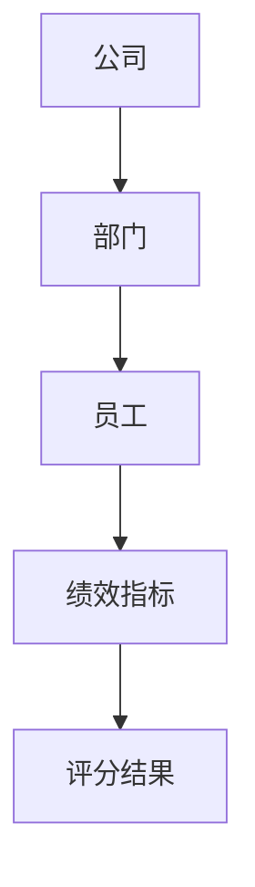
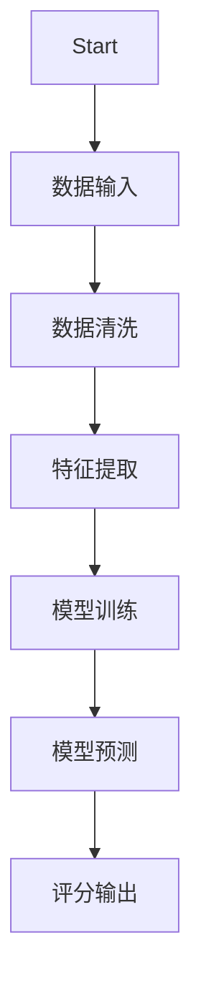
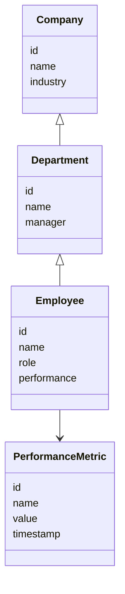

                 


# AI驱动的公司治理评分系统：量化管理质量

## 关键词：AI技术，公司治理，评分系统，管理质量，数据分析，机器学习

## 摘要：  
随着企业数字化转型的深入，公司治理的效率和质量成为企业成功的关键因素。传统的公司治理评分体系依赖人工判断，存在主观性强、效率低、覆盖面有限等问题。本文将探讨如何利用AI技术构建智能化的公司治理评分系统，通过数据驱动的方式量化管理质量，提升企业治理的透明度和决策效率。我们将从AI驱动的公司治理评分系统的核心概念、算法原理、系统架构到项目实战进行详细分析，为企业的数字化治理提供新的思路。

---

# 第1章: 公司治理评分系统的背景与意义

## 1.1 问题背景

### 1.1.1 传统公司治理的局限性
- **主观性**：传统评分体系依赖人工判断，主观性强，难以保证评分的客观性。
- **效率低**：人工评分耗时长，难以满足现代企业快速决策的需求。
- **覆盖面有限**：传统方法难以全面覆盖企业的各个管理维度，导致评分结果不够全面。

### 1.1.2 数字化转型对治理的新要求
- 数据驱动决策成为主流，企业需要更精准的管理评分工具。
- 现代企业组织结构复杂，需要更高效的管理方式。

### 1.1.3 AI技术在治理中的应用潜力
- AI技术能够快速处理大量数据，提供客观的评分结果。
- AI可以通过机器学习模型，识别管理中的潜在问题，优化决策流程。

## 1.2 问题描述
### 1.2.1 现有治理评分体系的不足
- 评分标准不统一，难以横向比较。
- 数据来源单一，无法全面反映企业状况。
- 缺乏动态调整能力，难以适应快速变化的商业环境。

### 1.2.2 数据驱动决策的必要性
- 数据是企业决策的基石，通过数据分析可以发现潜在问题。
- 数据驱动的评分体系能够帮助企业实现精准管理。

### 1.2.3 AI技术如何解决现有问题
- 利用AI技术构建智能化评分模型，提高评分效率和准确性。
- 通过机器学习算法，实现对复杂数据的深度分析。

## 1.3 问题解决
### 1.3.1 AI驱动评分的核心思路
- **数据采集**：收集企业的各项管理数据，包括财务数据、员工绩效、客户满意度等。
- **模型构建**：利用机器学习算法，构建评分模型。
- **动态调整**：根据企业实时数据，动态更新评分结果。

### 1.3.2 数据收集与处理的关键步骤
- 数据清洗：去除无效数据，处理缺失值。
- 数据预处理：标准化、归一化处理，确保数据适合模型输入。
- 数据特征提取：提取关键特征，减少冗余信息。

### 1.3.3 智能评分模型的构建方法
- **特征选择**：通过机器学习算法筛选重要特征。
- **模型训练**：利用训练数据训练评分模型。
- **模型优化**：通过交叉验证调整模型参数，提高预测准确性。

## 1.4 边界与外延
### 1.4.1 系统适用的范围
- 中小型企业：适合需要快速数字化转型的企业。
- 复杂组织结构：适合需要多维度管理评分的企业。

### 1.4.2 系统不适用的场景
- 数据不足的企业：缺乏足够的数据支持模型训练。
- 过度依赖人工判断的企业：难以适应数据驱动的管理方式。

### 1.4.3 系统与其他治理工具的关系
- 数据分析工具：提供数据支持。
- 管理咨询工具：提供决策建议。

## 1.5 核心要素与组成
### 1.5.1 数据来源
- 财务数据：收入、利润、成本等。
- 员工绩效：员工满意度、绩效考核结果。
- 客户反馈：客户满意度、投诉记录。

### 1.5.2 模型构建
- 数据预处理：清洗和标准化数据。
- 特征工程：提取关键特征，构建特征向量。
- 模型选择：选择适合的机器学习算法，如随机森林、支持向量机等。

### 1.5.3 评分标准
- 评分维度：包括财务表现、员工满意度、客户满意度等。
- 评分权重：根据企业特点，确定各维度的权重。

---

# 第2章: 核心概念与联系

## 2.1 评分模型的原理
### 2.1.1 数据预处理
- 清洗数据：去除异常值和重复数据。
- 数据标准化：将不同量纲的数据统一到同一尺度。
- 数据分组：根据业务需求对数据进行分组处理。

### 2.1.2 特征提取
- 文本特征提取：利用自然语言处理技术提取文本特征。
- 数值特征提取：通过统计方法提取数值特征。
- 图结构特征提取：分析数据之间的关联关系。

### 2.1.3 模型训练与优化
- 算法选择：选择适合的机器学习算法。
- 模型训练：利用训练数据训练模型。
- 模型优化：通过交叉验证调整模型参数，提高模型性能。

## 2.2 概念属性对比
| 概念 | 属性 | 特征 |
|------|------|------|
| 数据来源 | 财务数据 | 客观性高，易于量化 |
| 员工绩效 | 主观性较强，需结合多维度数据 |
| 客户反馈 | 反馈及时，但可能存在偏差 |

### 2.3 ER实体关系图


---

# 第3章: 算法原理讲解

## 3.1 算法流程


## 3.2 算法实现
```python
import pandas as pd
from sklearn.ensemble import RandomForestClassifier
from sklearn.metrics import accuracy_score

# 数据加载
data = pd.read_csv('management_data.csv')

# 数据清洗
data.dropna()  # 删除缺失值
data = data.drop_duplicates()  # 删除重复数据

# 特征提取
features = data[['revenue', 'profit', 'employee_satisfaction', 'customer_complaints']]
target = data['score']

# 模型训练
model = RandomForestClassifier()
model.fit(features, target)

# 模型预测
predicted_scores = model.predict(features)

# 模型评估
print("Accuracy:", accuracy_score(target, predicted_scores))
```

## 3.3 数学模型
### 评分计算公式
$$ \text{评分} = w_1 \times \text{财务指标} + w_2 \times \text{员工满意度} + w_3 \times \text{客户反馈} $$

### 权重分配
$$ w_1 + w_2 + w_3 = 1 $$

---

# 第4章: 系统分析与架构设计

## 4.1 问题场景介绍
- 企业需要一个智能化的管理评分系统，帮助管理层快速了解企业运营状况。
- 系统需要支持多维度的评分指标，提供动态调整能力。

## 4.2 系统功能设计
### 领域模型


### 系统架构
```mermaid
graph TD
    Client --> API Gateway
    API Gateway --> Service1
    Service1 --> Database1
    Service2 --> Database2
```

---

# 第5章: 项目实战

## 5.1 环境安装
```bash
pip install pandas scikit-learn mermaid4jupyter jupyterlab
```

## 5.2 核心代码实现
```python
import pandas as pd
from sklearn.ensemble import RandomForestRegressor
from sklearn.metrics import mean_squared_error

# 数据加载
data = pd.read_csv('management_data.csv')

# 数据清洗
data.dropna()

# 特征提取
features = data[['revenue', 'profit', 'employee_satisfaction', 'customer_complaints']]
target = data['score']

# 模型训练
model = RandomForestRegressor()
model.fit(features, target)

# 模型预测
predicted_scores = model.predict(features)

# 模型评估
print("均方误差:", mean_squared_error(target, predicted_scores))
```

## 5.3 实际案例分析
- 数据来源：某中型企业过去三年的管理数据。
- 模型训练：利用随机森林算法训练评分模型。
- 案例分析：通过模型预测，帮助企业发现管理中的潜在问题，并提出优化建议。

---

# 第6章: 最佳实践与小结

## 6.1 小结
- AI驱动的公司治理评分系统能够显著提升企业治理效率。
- 通过数据驱动的方式，帮助企业实现精准管理。

## 6.2 注意事项
- 数据质量是系统的核心，需确保数据的准确性和完整性。
- 模型需要定期更新，以适应企业的动态变化。

## 6.3 拓展阅读
- 推荐阅读《机器学习实战》和《数据驱动的决策》等书籍，深入理解AI在企业治理中的应用。

---

通过本文的详细讲解，我们希望能够为企业的数字化治理提供新的思路，帮助企业更好地量化管理质量，提升治理效率。

