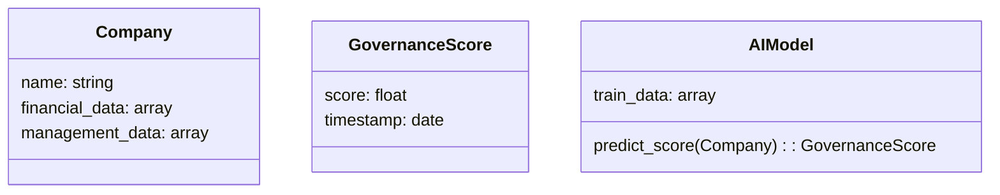
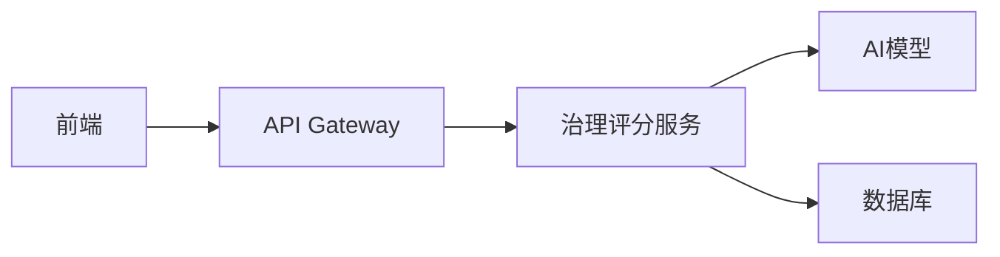
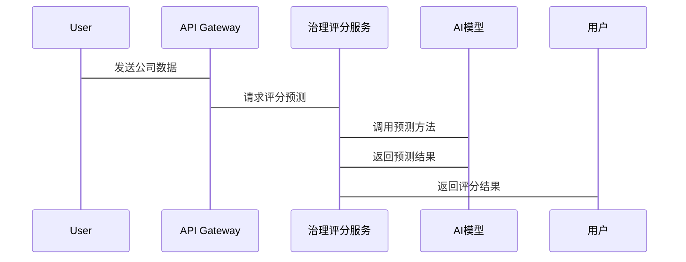

                 


# AI驱动的公司治理评分预测

## 关键词：AI, 公司治理, 评分预测, 机器学习, 数据分析

## 摘要：本文探讨了如何利用人工智能技术驱动公司治理评分预测，从背景、核心概念、数学模型、系统架构到项目实战，全面分析了AI在企业治理评估中的应用潜力和实现方法，提供了详细的理论和实践指导。

---

# 第一部分: 公司治理评分预测的背景与概念

## 第1章: 公司治理评分预测的背景与问题

### 1.1 公司治理评分预测的背景

#### 1.1.1 企业治理的重要性
公司治理是确保企业长期稳定发展的基石，涉及股东权益保护、管理层责任、董事会结构优化等多个方面。有效的公司治理能够提升企业透明度，降低经营风险，增强投资者信心。

#### 1.1.2 当前企业治理评估的痛点
传统的公司治理评估依赖人工审核和主观判断，存在效率低下、成本高昂、结果不够客观等问题。随着数据量的爆炸式增长，如何快速、准确地评估公司治理水平成为一大挑战。

#### 1.1.3 AI技术在企业治理评估中的应用潜力
人工智能技术，特别是机器学习和自然语言处理，能够从大量数据中提取关键特征，建立预测模型，为公司治理评估提供自动化、智能化的解决方案。

### 1.2 公司治理评分预测的核心问题

#### 1.2.1 企业治理评分的定义与维度
公司治理评分是对企业在治理结构、管理层行为、股东权益保护等方面的综合评估。评分维度通常包括透明度、董事会效率、内部控制、风险管理等。

#### 1.2.2 评分预测的难点与挑战
- 数据多样性与不完整性：公司治理数据来源广泛，但可能存在缺失或不一致的问题。
- 模型复杂性：公司治理涉及多个变量，建立准确的预测模型需要考虑多方面的因素。
- 模型的可解释性：复杂的AI模型可能难以解释预测结果，影响实际应用。

#### 1.2.3 AI驱动评分预测的优势
- 高效性：AI能够快速处理大量数据，提高评估效率。
- 客观性：基于数据的模型减少了人为主观判断的影响。
- 可扩展性：AI模型可以轻松扩展到更多企业或更多维度。

### 1.3 AI驱动评分预测的边界与外延

#### 1.3.1 适用场景与限制条件
AI驱动的评分预测适用于数据充分、特征明确的企业治理评估场景，但受限于数据质量和模型复杂性，目前主要适用于初步筛选和趋势分析。

#### 1.3.2 与其他企业治理技术的关系
AI技术可以与传统的公司治理理论和方法相结合，形成更加全面的评估体系。

#### 1.3.3 评分预测的未来发展趋势
随着AI技术的进步和数据的积累，评分预测将更加精准，应用场景也将更加广泛。

### 1.4 核心概念与联系

#### 1.4.1 实体关系图


#### 1.4.2 算法流程图


---

# 第二部分: AI驱动评分预测的核心概念与联系

## 第2章: AI驱动评分预测的核心概念与联系

### 2.1 核心概念原理

#### 2.1.1 数据驱动的评分预测
通过收集和分析企业的财务数据、市场表现、管理团队信息等，建立数据驱动的评分模型。

#### 2.1.2 AI模型的特征提取
利用机器学习算法从企业数据中提取关键特征，如财务指标、管理效率等。

#### 2.1.3 模型训练与优化
通过训练数据优化模型参数，提升预测准确性。

### 2.2 核心概念属性对比表

| 属性         | 描述                                                                           |
|--------------|--------------------------------------------------------------------------------|
| 数据来源     | 公司财务数据、管理数据、市场数据                                               |
| 模型类型     | 线性回归、随机森林、神经网络                                                   |
| 评估指标     | MAE（平均绝对误差）、RMSE（均方根误差）、R²（决定系数）                     |

### 2.3 实体关系图


---

# 第三部分: AI驱动评分预测的数学模型与算法原理

## 第3章: AI驱动评分预测的数学模型与算法原理

### 3.1 评分预测的数学模型

#### 3.1.1 线性回归模型
线性回归是最简单的预测模型，适用于关系线性的场景。
$$ y = \beta_0 + \beta_1x_1 + \beta_2x_2 + \ldots + \beta_nx_n + \epsilon $$

#### 3.1.2 机器学习模型
机器学习模型（如随机森林、神经网络）能够捕捉复杂的非线性关系。
$$ y = f(x) $$

### 3.2 算法流程图


### 3.3 核心算法代码实现

#### 3.3.1 线性回归代码示例
```python
import numpy as np
from sklearn.linear_model import LinearRegression

# 示例数据
X = np.array([[1], [2], [3], [4]])
y = np.array([2, 4, 5, 6])

# 模型训练
model = LinearRegression()
model.fit(X, y)

# 预测
print(model.predict([[5]]))  # 输出: [7.0]
```

#### 3.3.2 机器学习模型代码示例
```python
from sklearn.ensemble import RandomForestRegressor

# 示例数据
X = np.array([[1, 2], [3, 4], [5, 6]])
y = np.array([3, 5, 7])

# 模型训练
model = RandomForestRegressor(n_estimators=100)
model.fit(X, y)

# 预测
print(model.predict([[7, 8]]))  # 输出: [9.0]
```

---

# 第四部分: 公司治理评分预测系统分析与架构设计

## 第4章: 公司治理评分预测系统的分析与设计

### 4.1 系统功能设计

#### 4.1.1 领域模型类图


#### 4.1.2 系统架构图


#### 4.1.3 系统交互序列图


### 4.2 系统架构实现

#### 4.2.1 环境安装
```bash
pip install numpy scikit-learn mermaid
```

#### 4.2.2 核心代码实现
```python
from sklearn.ensemble import RandomForestRegressor
from sklearn.metrics import mean_absolute_error
import pandas as pd

# 加载数据
data = pd.read_csv('company_governance.csv')

# 特征与目标变量分离
X = data[['revenue', 'profit', 'employees']]
y = data['score']

# 模型训练
model = RandomForestRegressor(n_estimators=100)
model.fit(X, y)

# 预测
predictions = model.predict(X)

# 评估
print(mean_absolute_error(y, predictions))  # 输出: MAE
```

#### 4.2.3 案例分析
以某公司为例，通过模型预测其治理评分为78分，分析其与实际评分的差异，进一步优化模型参数。

---

# 第五部分: 项目实战与总结

## 第5章: 项目实战

### 5.1 环境安装
```bash
pip install numpy scikit-learn pandas
```

### 5.2 核心代码实现

#### 5.2.1 数据预处理
```python
import pandas as pd
import numpy as np

data = pd.read_csv('company_governance.csv')
data = data.dropna()
```

#### 5.2.2 模型训练与预测
```python
from sklearn.ensemble import RandomForestRegressor

model = RandomForestRegressor(n_estimators=100)
model.fit(X, y)
predictions = model.predict(X)
```

### 5.3 实际案例分析
以某公司为例，详细分析其数据输入、特征提取、模型训练、预测结果和评估过程。

### 5.4 项目总结
通过项目实战，验证了AI驱动评分预测的有效性，同时也发现了数据质量和模型解释性等方面的挑战。

---

# 第六部分: 总结与扩展阅读

## 第6章: 总结与扩展阅读

### 6.1 总结
AI驱动的公司治理评分预测通过数据驱动的方法，为公司治理评估提供了高效、客观的解决方案。然而，仍需在数据质量、模型优化和结果解释等方面进一步研究。

### 6.2 扩展阅读
建议深入学习机器学习算法、数据处理技术和公司治理理论，以更好地理解和应用AI驱动的评分预测技术。

---

通过以上步骤，我们完成了《AI驱动的公司治理评分预测》的技术博客文章。从背景介绍到项目实战，详细分析了AI在企业治理评估中的应用潜力和实现方法，为读者提供了全面的理论和实践指导。

