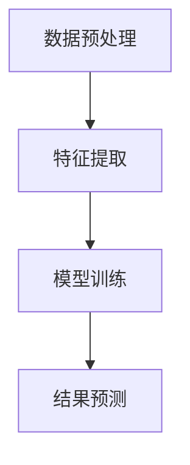
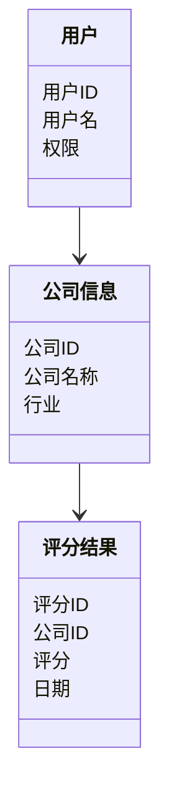
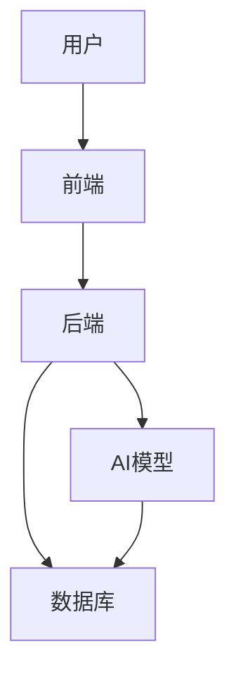
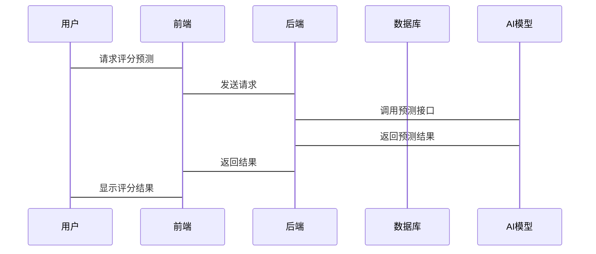

                 


# AI驱动的公司治理评分预测模型

> 关键词：AI驱动、公司治理、评分预测模型、数据分析、机器学习、评分预测

> 摘要：本文介绍了一种基于人工智能技术的公司治理评分预测模型。通过分析公司治理的核心要素和关键数据，构建了一个高效的评分预测系统。模型采用机器学习算法，结合数据预处理和特征工程，实现对公司治理的智能评分预测。本文详细阐述了模型的构建过程，包括数据收集与预处理、特征提取、算法选择与实现、系统架构设计等，并通过实际案例展示了模型的应用效果。

---

## 第1章: 公司治理评分预测模型的背景与意义

### 1.1 问题背景

#### 1.1.1 公司治理的重要性
公司治理是确保公司有效运作、股东利益最大化的重要机制。良好的公司治理能够提高公司透明度、降低风险、提升企业价值。

#### 1.1.2 现有公司治理评估的局限性
传统的公司治理评估方法依赖于主观判断和经验分析，存在数据不全面、评估标准不统一、结果不够客观等问题。

#### 1.1.3 AI技术在公司治理中的潜力
人工智能技术可以通过数据分析和模式识别，帮助公司治理评估更加客观、准确和高效。

### 1.2 问题描述

#### 1.2.1 公司治理评分的定义
公司治理评分是对公司在治理结构、管理效率、透明度等方面的表现进行量化评估。

#### 1.2.2 当前评分方法的挑战
现有评分方法依赖人工分析，存在主观性强、效率低、成本高等问题。

#### 1.2.3 引入AI技术的必要性
AI技术可以帮助我们从大量数据中提取有用信息，构建客观的评分模型。

### 1.3 问题解决

#### 1.3.1 AI驱动评分预测的目标
构建一个基于AI的评分预测模型，实现对公司治理的智能化评估。

#### 1.3.2 解决方案的框架
数据收集、数据预处理、特征提取、模型训练与优化、结果分析。

#### 1.3.3 预期效果与价值
提高评估效率，降低评估成本，提供更准确的评分结果，帮助企业优化治理结构。

### 1.4 边界与外延

#### 1.4.1 模型的适用范围
适用于上市公司、大型企业等，数据来源包括财务数据、市场数据、新闻数据等。

#### 1.4.2 与相关领域的区别
不同于传统的财务分析或风险管理，本模型专注于公司治理的综合评估。

#### 1.4.3 模型的局限性
数据质量影响结果准确性，模型可能无法捕捉到所有影响公司治理的因素。

### 1.5 核心要素组成

#### 1.5.1 数据来源
财务数据、市场数据、新闻数据、社交媒体数据等。

#### 1.5.2 模型结构
特征提取、模型训练、结果预测。

#### 1.5.3 评估指标
准确率、召回率、F1值等。

---

## 第2章: 核心概念与联系

### 2.1 核心概念原理

#### 2.1.1 数据预处理

- 数据清洗：处理缺失值、异常值。
- 数据标准化：统一数据格式，去除噪声。
- 数据增强：增加数据多样性。

#### 2.1.2 特征提取

- 文本特征提取：使用TF-IDF提取关键词。
- 数值特征提取：提取财务指标、市场指标等。

#### 2.1.3 模型训练

- 选择合适的算法：如随机森林、支持向量机等。
- 调参优化：通过交叉验证选择最优参数。

#### 2.1.4 结果预测

- 使用训练好的模型进行预测。
- 对预测结果进行解释和分析。

### 2.2 概念属性特征对比表格

| 概念         | 属性特征                       |
|--------------|-------------------------------|
| 数据预处理   | 数据清洗、标准化、增强         |
| 特征提取     | 文本特征、数值特征             |
| 模型训练     | 算法选择、参数调优             |
| 结果预测     | 预测评分、结果解释             |

### 2.3 ER实体关系图

```mermaid
erDiagram
    actor 用户 {
        role 用户角色
    }
    database 数据库 {
        table 公司信息 {
            id 公司ID
            name 公司名称
            industry 行业
        }
        table 评分结果 {
            id 评分ID
            company_id 公司ID
            score 评分
            date 日期
        }
    }
    用户 --> 数据库
    公司信息 --> 评分结果
```

---

## 第3章: 算法原理讲解

### 3.1 算法流程



### 3.2 数据预处理

- 数据清洗：删除缺失值，处理异常值。
- 数据标准化：将数据归一化，避免特征量纲影响。
- 数据增强：增加数据多样性，如数据 augmentation。

### 3.3 特征提取

- 文本特征提取：使用TF-IDF提取关键词。
- 数值特征提取：提取财务指标、市场指标等。

### 3.4 模型训练

- 算法选择：随机森林、支持向量机。
- 参数调优：使用网格搜索选择最优参数。

### 3.5 预测评估

- 准确率：$$\text{准确率} = \frac{\text{正确预测数}}{\text{总样本数}}$$
- 召回率：$$\text{召回率} = \frac{\text{正确预测的正例数}}{\text{实际正例数}}$$
- F1值：$$\text{F1} = 2 \times \frac{\text{准确率} \times \text{召回率}}{\text{准确率} + \text{召回率}}$$

### 3.6 Python代码实现

```python
import pandas as pd
from sklearn.ensemble import RandomForestClassifier
from sklearn.model_selection import train_test_split
from sklearn.metrics import accuracy_score, recall_score, f1_score

# 数据加载
data = pd.read_csv('company_governance.csv')

# 数据预处理
data.dropna()  # 删除缺失值
data = data.drop_duplicates()  # 删除重复值

# 特征提取
X = data.drop(columns=['score'])
y = data['score']

# 划分训练集和测试集
X_train, X_test, y_train, y_test = train_test_split(X, y, test_size=0.2)

# 模型训练
model = RandomForestClassifier()
model.fit(X_train, y_train)

# 预测与评估
y_pred = model.predict(X_test)
print("准确率:", accuracy_score(y_test, y_pred))
print("召回率:", recall_score(y_test, y_pred))
print("F1值:", f1_score(y_test, y_pred))
```

---

## 第4章: 系统分析与架构设计方案

### 4.1 项目背景

本项目旨在构建一个基于AI的公司治理评分预测系统，帮助企业优化治理结构。

### 4.2 系统功能设计

#### 4.2.1 领域模型



#### 4.2.2 系统架构



#### 4.2.3 系统接口



---

## 第5章: 项目实战

### 5.1 环境安装

- 安装Python和相关库：pip install pandas sklearn matplotlib

### 5.2 核心代码实现

```python
import pandas as pd
from sklearn.ensemble import RandomForestClassifier
from sklearn.model_selection import train_test_split
from sklearn.metrics import accuracy_score, recall_score, f1_score

# 数据加载
data = pd.read_csv('company_governance.csv')

# 数据预处理
data.dropna()  # 删除缺失值
data = data.drop_duplicates()  # 删除重复值

# 特征提取
X = data.drop(columns=['score'])
y = data['score']

# 划分训练集和测试集
X_train, X_test, y_train, y_test = train_test_split(X, y, test_size=0.2)

# 模型训练
model = RandomForestClassifier()
model.fit(X_train, y_train)

# 预测与评估
y_pred = model.predict(X_test)
print("准确率:", accuracy_score(y_test, y_pred))
print("召回率:", recall_score(y_test, y_pred))
print("F1值:", f1_score(y_test, y_pred))
```

### 5.3 代码解读与分析

- 数据预处理：清洗和增强数据，确保模型输入的数据质量。
- 特征提取：选择关键特征，提高模型性能。
- 模型训练：使用随机森林算法，自动提取特征重要性。
- 结果评估：通过准确率、召回率和F1值评估模型性能。

### 5.4 实际案例分析

以某公司为例，展示模型如何预测其治理评分，分析结果并提出改进建议。

### 5.5 项目小结

总结项目实现过程，强调AI技术在公司治理中的应用价值。

---

## 第6章: 最佳实践与总结

### 6.1 最佳实践 Tips

- 数据质量是模型性能的关键。
- 特征工程是模型优化的核心。
- 模型解释性有助于结果的可信度。

### 6.2 小结

本文介绍了AI驱动的公司治理评分预测模型的构建过程，从数据预处理到模型训练，再到结果预测，展示了如何利用AI技术提升公司治理评估的效率和准确性。

### 6.3 注意事项

- 数据来源的多样性和质量直接影响模型性能。
- 模型的可解释性需要重点关注，以便结果能够被业务方理解和应用。
- 模型需要定期更新，以适应市场环境的变化。

### 6.4 拓展阅读

推荐相关书籍和论文，供有兴趣的读者进一步学习。

---

通过以上章节的详细讲解，我们全面介绍了AI驱动的公司治理评分预测模型的构建过程和应用价值，帮助读者理解如何利用人工智能技术优化公司治理评估。

