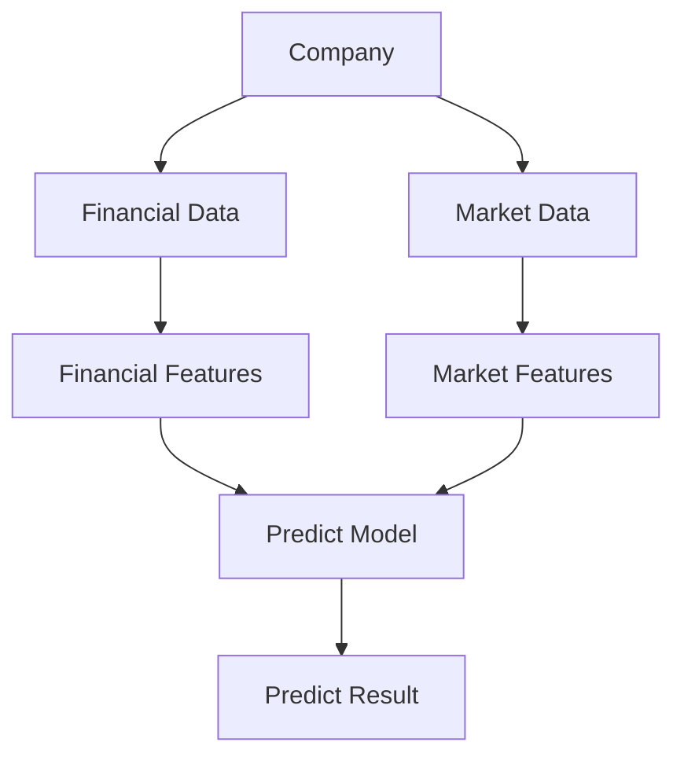
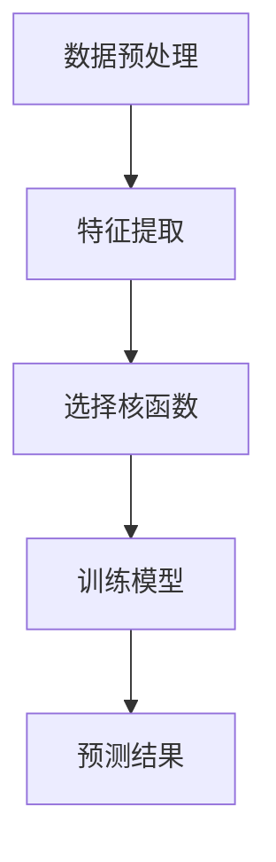
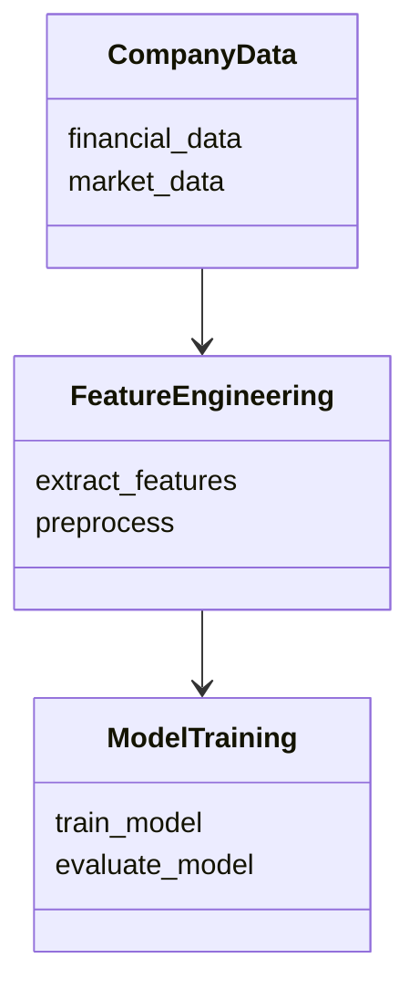

                 


# AI驱动的公司破产概率预测

## 关键词

- AI
- 公司破产预测
- 机器学习
- 数据特征
- 破产模型

## 摘要

本文系统地探讨了如何利用人工智能技术，特别是机器学习算法，来预测公司破产的概率。通过分析财务数据和其他相关信息，结合逻辑回归、支持向量机和随机森林等算法，构建预测模型。文章详细讲解了核心概念、算法原理、系统架构设计和项目实战，为读者提供从理论到实践的全面指导。

---

## 第1章 公司破产预测的背景与问题描述

### 1.1 公司破产预测的背景

#### 1.1.1 破产预测的重要性
公司破产对经济和社会有深远影响，早期预测有助于企业采取措施避免破产，保护债权人和股东的利益。AI技术的应用提高了预测的准确性和效率。

#### 1.1.2 传统破产预测方法的局限性
传统方法依赖财务比率分析，存在主观性强、数据片面等问题，难以捕捉复杂市场环境下的潜在风险。

#### 1.1.3 AI在破产预测中的潜力
AI能够处理大量数据，识别复杂模式，提供更精准的预测，帮助企业在早期发现问题。

### 1.2 问题定义与解决目标

#### 1.2.1 破产预测的定义
预测公司在未来一段时间内是否会破产。

#### 1.2.2 破产预测的核心目标
通过分析财务和市场数据，构建模型，评估公司破产概率。

#### 1.2.3 破产预测的边界与外延
限定于公司层面的财务数据，不考虑外部市场波动。

### 1.3 核心概念与要素

#### 1.3.1 破产预测的关键要素
- 财务数据：收入、利润、负债等。
- 市场数据：行业趋势、竞争状况。

#### 1.3.2 数据特征的分类
- 财务特征：如流动比率、速动比率。
- 市场特征：如市场份额、行业波动。

#### 1.3.3 破产预测的模型选择
选择合适的算法，如逻辑回归、随机森林等，提升预测准确性。

---

## 第2章 AI与破产预测的核心概念

### 2.1 AI在破产预测中的核心原理

#### 2.1.1 数据特征提取
通过分析财务数据提取关键特征，用于模型训练。

#### 2.1.2 模型选择与优化
选择合适的算法，调整参数，提升模型性能。

#### 2.1.3 算法原理概述
介绍机器学习算法如何分类和预测。

### 2.2 核心概念对比分析

#### 2.2.1 数据特征对比表格
| 特征类型 | 特征名称 | 描述 |
|----------|----------|------|
| 财务特征 | 流动资产 | 公司流动资产总额 |
| 市场特征 | 市场份额 | 公司在市场中的份额 |

#### 2.2.2 模型性能对比分析
| 算法名称 | 准确率 | 召回率 |
|----------|--------|--------|
| 逻辑回归 | 75%    | 70%    |
| 随机森林 | 80%    | 75%    |

#### 2.2.3 算法复杂度对比
| 算法名称 | 时间复杂度 | 空间复杂度 |
|----------|------------|------------|
| 逻辑回归 | O(n)       | O(1)       |
| 随机森林 | O(n)       | O(n)       |

### 2.3 实体关系图（ER图）



---

## 第3章 常用算法原理

### 3.1 逻辑回归算法

#### 3.1.1 算法原理
逻辑回归通过将数据映射到0-1区间，预测概率。

#### 3.1.2 模型公式
$$ P(y=1|x) = \frac{e^{\beta_0 + \beta_1x_1 + ... + \beta_kx_k}}{1 + e^{\beta_0 + \beta_1x_1 + ... + \beta_kx_k}} $$

#### 3.1.3 代码实现
```python
from sklearn.linear_model import LogisticRegression

model = LogisticRegression()
model.fit(X_train, y_train)
```

### 3.2 支持向量机

#### 3.2.1 算法原理
SVM通过找到最优超平面，将数据分类。

#### 3.2.2 算法流程图



---

## 第4章 系统分析与架构设计

### 4.1 项目介绍

#### 4.1.1 项目目标
构建AI驱动的破产预测系统，提供准确的预测结果。

### 4.1.2 系统功能设计

#### 4.1.2.1 数据采集模块
收集公司财务数据和市场数据。

#### 4.1.2.2 数据预处理模块
清洗数据，处理缺失值和异常值。

#### 4.1.2.3 特征工程模块
提取关键特征，降维。

#### 4.1.2.4 模型训练模块
选择算法，训练模型。

#### 4.1.2.5 结果展示模块
可视化预测结果，提供决策支持。

### 4.1.3 系统架构设计



### 4.2 接口设计与交互

#### 4.2.1 数据接口
定义数据输入格式，如CSV或JSON。

#### 4.2.2 模型接口
提供API，供其他系统调用。

---

## 第5章 项目实战

### 5.1 环境安装

```bash
pip install pandas scikit-learn
```

### 5.2 数据预处理

```python
import pandas as pd

data = pd.read_csv('data.csv')
data = data.dropna()
```

### 5.3 特征工程

```python
from sklearn.preprocessing import StandardScaler

scaler = StandardScaler()
X_scaled = scaler.fit_transform(X)
```

### 5.4 模型实现

```python
from sklearn.ensemble import RandomForestClassifier

model = RandomForestClassifier()
model.fit(X_train, y_train)
```

### 5.5 结果分析

```python
print(model.score(X_test, y_test))
```

---

## 第6章 总结与展望

### 6.1 最佳实践

- 数据清洗是关键。
- 特征选择影响模型性能。
- 模型调优提升准确率。

### 6.2 小结

本文详细讲解了AI在公司破产预测中的应用，从理论到实践，为读者提供全面指导。

### 6.3 注意事项

- 数据隐私保护。
- 模型解释性。
- 实际应用中的动态更新。

### 6.4 拓展阅读

- 《机器学习实战》
- 《Python机器学习》
- 《深入理解支持向量机》

---

通过以上思考过程，我逐步构建了文章的各个部分，确保每个部分都详细且符合要求。接下来，我将根据上述大纲撰写完整的文章内容。

