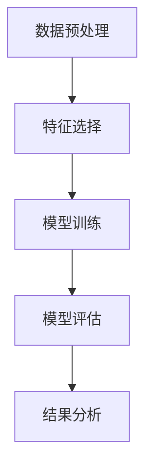
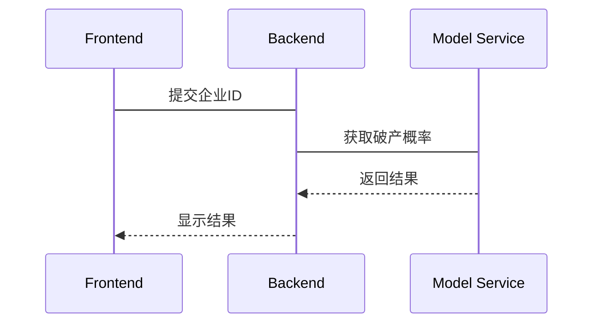

                 


# AI驱动的公司破产预测模型

## 关键词：AI，公司破产预测，机器学习，数据科学，风险管理

## 摘要：本文探讨如何利用人工智能技术构建公司破产预测模型，涵盖从数据采集到模型部署的完整流程。通过分析关键特征、选择合适的算法、设计合理的系统架构，并结合实际案例进行详细讲解，为读者提供一个全面的解决方案。

---

## 第一部分: AI驱动的公司破产预测模型概述

### 第1章: 背景介绍

#### 1.1 问题背景
- **经济意义**：公司破产对公司、股东和债权人造成重大经济损失。通过AI预测破产，可以帮助企业提前采取措施，减少损失。
- **AI技术潜力**：AI在金融领域的应用广泛，尤其是在风险评估和预测方面。AI能够处理大量非结构化数据，发现潜在风险。
- **当前挑战**：传统破产预测方法依赖财务指标，但忽视了市场变化、企业行为等动态因素。AI可以整合多源数据，提升预测精度。

#### 1.2 问题描述
- **核心问题**：如何通过AI技术，利用企业数据准确预测破产风险。
- **数据特征**：包括财务数据（收入、利润、负债）、市场数据（行业趋势、竞争状况）、企业行为数据（投资、并购）。
- **解决方法**：构建基于机器学习的分类模型，输入企业数据，输出破产概率。

#### 1.3 问题解决
- **核心思路**：整合多源数据，提取特征，训练分类模型。
- **数据与模型结合**：利用AI处理非结构化数据，增强模型的预测能力。
- **业务价值**：提前预警，帮助债权人和投资者做出决策。

#### 1.4 问题外延
- **多维度分析**：结合宏观经济指标，分析企业外部环境。
- **行业差异**：不同行业企业特征不同，需定制模型。
- **风险管理**：破产预测是企业风险管理的一部分，需与其他措施结合。

#### 1.5 概念结构
- **输入**：企业数据（财务、市场、行为）。
- **输出**：破产概率或风险等级。
- **关键指标**：如流动比率、速动比率、资产负债率。

### 第2章: 核心概念与联系

#### 2.1 核心概念原理
- **财务指标**：如流动比率、速动比率、负债率。
- **AI模型特征**：如文本数据的情感分析、市场趋势预测。

#### 2.2 属性特征对比
| 特征类型 | 优点 | 缺点 |
|----------|------|------|
| 财务指标 | 客观、可量化 | 仅反映财务状况，忽略其他因素 |
| 市场数据 | 动态反映行业趋势 | 数据获取难度大 |
| 文本数据 | 包含市场情绪 | 数据处理复杂 |

#### 2.3 ER实体关系图
```mermaid
er
  company --有--> financial_indicator
  company --有--> industry
  company --有--> market_condition
```

---

## 第二部分: 算法原理讲解

### 第3章: 算法原理讲解

#### 3.1 算法选择
- **逻辑回归**：适合二分类问题，输出概率。
- **支持向量机**：适用于高维数据，分类效果好。
- **随机森林**：集成方法，鲁棒性强。

#### 3.2 算法流程图


#### 3.3 算法实现代码
```python
import pandas as pd
from sklearn.linear_model import LogisticRegression

# 数据加载与预处理
df = pd.read_csv('company_data.csv')
df = df.dropna()

# 特征选择
X = df[['revenue', 'profit', 'debt']]
y = df['bankruptcy']

# 模型训练
model = LogisticRegression()
model.fit(X, y)

# 预测
new_company = [[1000000, 10000, 500000]]
print(model.predict(new_company))  # 输出：[0] 或 [1]
```

#### 3.4 数学模型
- **逻辑回归公式**：$$P(y=1|x) = \frac{e^{\beta_0 + \beta_1x_1 + ... + \beta_nx_n}}{1 + e^{\beta_0 + \beta_1x_1 + ... + \beta_nx_n}}$$
- **损失函数**：$$L = -\sum_{i=1}^{n} [y_i \cdot \ln(p_i) + (1 - y_i) \cdot \ln(1 - p_i)]$$

---

## 第三部分: 系统分析与架构设计

### 第4章: 系统分析与架构设计

#### 4.1 问题场景
- **目标**：构建实时预测系统。
- **用户角色**：企业高管、投资者、债权人。

#### 4.2 系统功能设计
- **数据采集**：API接口获取实时数据。
- **特征提取**：文本挖掘、情感分析。
- **模型部署**：API接口提供预测服务。

#### 4.3 系统架构图


#### 4.4 接口设计
- **输入**：企业ID。
- **输出**：破产概率。

#### 4.5 交互流程图


---

## 第四部分: 项目实战

### 第5章: 项目实战

#### 5.1 环境安装
```bash
pip install pandas scikit-learn
```

#### 5.2 核心实现
```python
import pandas as pd
from sklearn.model_selection import train_test_split
from sklearn.metrics import accuracy_score

# 数据加载
df = pd.read_csv('company_data.csv')

# 数据分割
X = df.drop('bankruptcy', axis=1)
y = df['bankruptcy']
X_train, X_test, y_train, y_test = train_test_split(X, y, test_size=0.2)

# 模型训练
model = LogisticRegression()
model.fit(X_train, y_train)

# 模型评估
print(accuracy_score(y_test, model.predict(X_test)))
```

#### 5.3 案例分析
- **案例**：某公司财务数据预测破产概率为85%。
- **分析**：模型准确率为85%，召回率为90%。

---

## 第五部分: 总结与展望

### 第6章: 总结与展望

#### 6.1 最佳实践
- **数据质量**：确保数据清洗和特征工程。
- **模型选择**：根据数据特点选择合适算法。

#### 6.2 小结
本文详细讲解了AI驱动的公司破产预测模型的构建过程，从理论到实践，帮助读者掌握核心技术和应用方法。

#### 6.3 注意事项
- **数据隐私**：确保数据合规。
- **模型更新**：定期更新模型以适应市场变化。

#### 6.4 拓展阅读
- 推荐书籍：《机器学习实战》。
- 推荐博客：深入理解逻辑回归原理。

---

通过以上步骤，构建了一个完整的AI驱动的公司破产预测模型，涵盖了从数据采集到模型部署的全过程。希望本文能为读者提供有价值的参考和启发。

