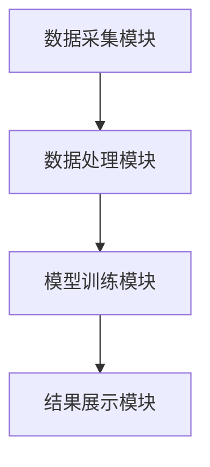
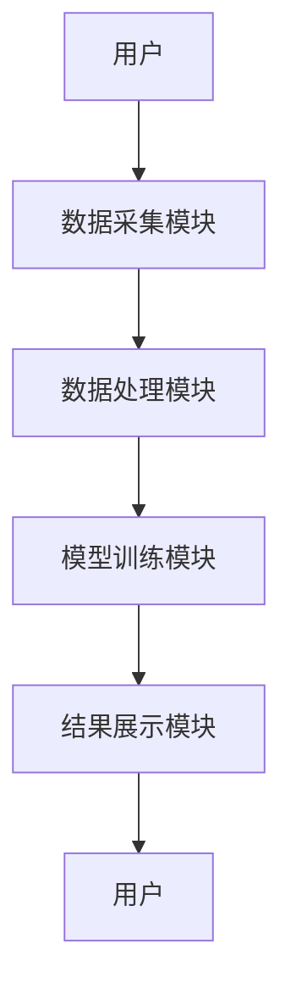

                 


# AI驱动的公司财务规划工具

## 关键词：人工智能、财务规划、公司财务管理、AI算法、财务预测、技术实现

## 摘要：
AI驱动的公司财务规划工具通过利用先进的人工智能技术，显著提升了财务规划的效率和准确性。本文深入探讨了这一工具的技术实现，包括核心算法原理、系统架构设计以及实际项目中的应用。文章详细分析了AI在数据处理、模型构建和系统设计中的应用，并通过案例展示了如何利用这些技术来优化财务预测和规划。通过本文，读者将全面了解AI驱动的财务规划工具如何为公司财务管理带来革新。

---

## 第一部分：背景介绍

### 第1章：AI与财务规划概述

#### 1.1 AI驱动的财务规划工具背景
- **1.1.1 财务规划的传统方法与挑战**
  - 传统财务规划依赖人工分析和统计模型，存在效率低、主观性强、数据处理复杂等问题。
  - 随着数据量的爆炸式增长，传统方法难以应对复杂多变的市场环境。
- **1.1.2 AI技术如何变革财务规划**
  - AI能够快速处理大量数据，发现隐藏的模式，提高预测的准确性。
  - AI工具可以实时更新财务预测，帮助公司做出更快的决策。
- **1.1.3 当前AI在财务领域的应用现状**
  - AI已经在财务分析、预测、风险评估等领域得到广泛应用。
  - 企业开始逐步采用AI驱动的财务规划工具，以提升竞争力。

#### 1.2 财务规划的核心概念
- **1.2.1 财务规划的基本定义与目标**
  - 财务规划是通过分析公司历史数据和市场环境，预测未来的财务状况，并制定相应的策略。
  - 目标包括优化资金分配、降低财务风险、提高盈利能力等。
- **1.2.2 公司财务规划的关键要素**
  - 收入预测、成本控制、资金流动、投资决策等。
- **1.2.3 AI在财务规划中的角色与价值**
  - AI作为辅助工具，能够提高财务预测的准确性和效率。
  - 通过深度学习模型，AI可以捕捉到传统方法难以发现的市场趋势。

#### 1.3 AI驱动财务规划的潜力与挑战
- **1.3.1 AI在财务规划中的优势**
  - 提高预测准确性：AI可以通过大量历史数据学习，发现复杂的市场规律。
  - 实时更新：AI系统能够快速响应市场变化，提供实时预测。
- **1.3.2 当前应用中的主要挑战**
  - 数据质量：财务数据的准确性直接影响模型的效果。
  - 模型解释性：复杂的AI模型可能难以被财务专家理解和信任。
- **1.3.3 未来发展的机会与风险**
  - 机会：随着技术进步，AI在财务规划中的应用将更加广泛。
  - 风险：数据泄露和模型被攻击的风险需要引起重视。

---

## 第二部分：核心概念与联系

### 第2章：AI驱动财务规划的核心概念

#### 2.1 AI在财务数据处理中的应用
- **2.1.1 数据特征提取**
  - 通过自然语言处理技术，从财务报告中提取关键信息。
  - 使用特征工程方法，构建有意义的财务指标。
- **2.1.2 数据清洗与预处理**
  - 去除无效数据、处理缺失值、标准化数据。
  - 数据增强技术，提高模型的鲁棒性。
- **2.1.3 数据标注与增强**
  - 根据财务知识，对数据进行标注。
  - 使用数据增强技术，扩展训练数据集。

#### 2.2 AI模型在财务预测中的应用
- **2.2.1 财务预测的类型与场景**
  - 收入预测、成本预测、利润预测、现金流预测等。
  - 市场波动预测、行业趋势预测等。
- **2.2.2 常见的财务预测模型**
  - 线性回归模型：适用于简单的线性关系。
  - 时间序列模型：适用于预测未来的数值。
  - 机器学习模型：如随机森林、支持向量机等。
- **2.2.3 模型评估与优化**
  - 使用交叉验证、ROC曲线等方法评估模型性能。
  - 调参优化，提高模型的准确性和稳定性。

#### 2.3 AI驱动的财务规划系统架构
- **2.3.1 系统核心模块划分**
  - 数据采集模块：从多个来源获取财务数据。
  - 数据处理模块：清洗、转换和特征提取。
  - 模型训练模块：构建和优化预测模型。
  - 结果展示模块：可视化预测结果和分析报告。
- **2.3.2 模块间关系与数据流**
  - 数据从采集模块流向处理模块，经过清洗和特征提取后，进入模型训练模块。
  - 训练好的模型输出预测结果，由展示模块进行可视化。
- **2.3.3 系统的整体架构图**



---

## 第三部分：算法原理讲解

### 第3章：AI驱动财务规划的算法原理

#### 3.1 数据预处理与特征工程
- **3.1.1 数据清洗与标准化**
  - 去除重复数据、处理缺失值。
  - 标准化数据，使其适合模型输入。
- **3.1.2 特征选择与降维**
  - 使用特征重要性分析，选择关键特征。
  - 应用主成分分析（PCA）进行降维。
- **3.1.3 时间序列数据处理**
  - 使用滑动窗口方法处理时间依赖性。
  - 应用LSTM网络捕捉时间序列的长期依赖关系。

#### 3.2 常见AI算法在财务规划中的应用
- **3.2.1 线性回归模型**
  - 简单线性回归：$y = a + bx + \epsilon$
  - 多元线性回归：$y = a + b_1x_1 + b_2x_2 + \dots + b_nx_n + \epsilon$
- **3.2.2 时间序列预测**
  - ARIMA模型：$y_t = \phi_1y_{t-1} + \theta_1\epsilon_{t-1} + \epsilon_t$
  - LSTM网络：通过细胞状态捕捉长期依赖关系。
- **3.2.3 随机森林与梯度提升树**
  - 随机森林：通过集成多个决策树提高准确性。
  - XGBoost：使用提升树算法，优化预测性能。

#### 3.3 深度学习模型在财务预测中的应用
- **3.3.1 RNN与LSTM网络**
  - RNN结构：处理序列数据，捕捉短期依赖关系。
  - LSTM结构：通过门控机制，捕捉长期依赖关系。
- **3.3.2 Transformer架构**
  - 使用自注意力机制，捕捉全局依赖关系。
  - 在财务预测中，Transformer网络表现出色。
- **3.3.3 图神经网络**
  - 将财务数据建模为图结构，捕捉节点之间的关系。
  - 使用GAT（Graph Attention Networks）进行预测。

---

## 第四部分：系统分析与架构设计

### 第4章：AI驱动财务规划系统的架构设计

#### 4.1 系统功能设计
- **4.1.1 功能模块划分**
  - 数据采集模块：从数据库、API等来源获取财务数据。
  - 数据处理模块：清洗、转换和特征提取。
  - 模型训练模块：构建和优化预测模型。
  - 结果展示模块：可视化预测结果和分析报告。
- **4.1.2 系统功能流程图**


#### 4.2 系统架构设计
- **4.2.1 采用微服务架构**
  - 每个功能模块独立运行，便于扩展和维护。
  - 使用容器化技术（如Docker）部署服务。
- **4.2.2 系统架构图**


#### 4.3 系统接口设计
- **4.3.1 API接口定义**
  - 数据接口：获取财务数据的REST API。
  - 预测接口：调用模型进行财务预测的API。
  - 结果接口：获取预测结果的API。
- **4.3.2 系统交互流程图**



---

## 第五部分：项目实战

### 第5章：AI驱动财务规划工具的实现

#### 5.1 项目环境配置
- **5.1.1 安装必要的库**
  - Python：3.8+
  - 数据处理库：Pandas、NumPy
  - 深度学习库：TensorFlow、Keras
  - 可视化库：Matplotlib、Seaborn

#### 5.2 系统核心实现
- **5.2.1 数据预处理代码**

```python
import pandas as pd
import numpy as np

# 加载数据
data = pd.read_csv('financial_data.csv')

# 数据清洗
data.dropna(inplace=True)
data = data.drop_duplicates()

# 特征工程
from sklearn.preprocessing import StandardScaler

scaler = StandardScaler()
data_scaled = scaler.fit_transform(data)
```

- **5.2.2 模型训练代码**

```python
from tensorflow.keras.models import Sequential
from tensorflow.keras.layers import LSTM, Dense

model = Sequential()
model.add(LSTM(64, input_shape=(timesteps, features)))
model.add(Dense(1))
model.compile(loss='mean_squared_error', optimizer='adam')
model.fit(X_train, y_train, epochs=100, batch_size=32)
```

#### 5.3 案例分析
- **5.3.1 数据集介绍**
  - 使用历史财务数据和市场数据进行训练。
- **5.3.2 模型预测与分析**
  - 使用训练好的模型对未来的财务状况进行预测。
  - 对比实际数据，评估模型的准确性。
- **5.3.3 结果展示**
  - 使用可视化工具展示预测结果和实际数据的对比。

---

## 第六部分：总结与展望

### 第6章：总结与展望

#### 6.1 最佳实践 tips
- **数据质量**：确保数据的准确性和完整性。
- **模型解释性**：选择合适的模型，确保结果可解释。
- **持续优化**：定期更新模型，适应市场变化。

#### 6.2 小结
- AI驱动的财务规划工具通过高效的数据处理和智能的预测模型，显著提升了财务规划的效率和准确性。
- 本文详细介绍了系统的架构设计、算法实现和项目实战，为读者提供了全面的技术指导。

#### 6.3 注意事项
- 数据隐私和安全问题需要高度重视。
- 模型的泛化能力需要通过交叉验证进行评估。

#### 6.4 拓展阅读
- 推荐阅读《机器学习实战》、《深度学习入门》等相关书籍，深入了解AI算法的实现细节。

---

通过以上内容，读者可以系统地了解AI驱动的公司财务规划工具的技术实现和应用。从背景介绍到算法原理，再到系统设计和项目实战，本文为读者提供了全面的知识框架和技术指导。

