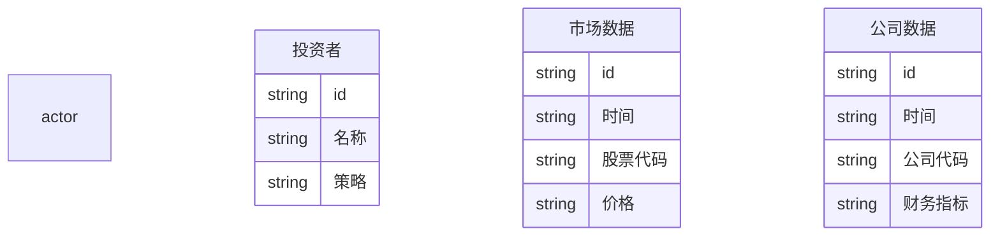
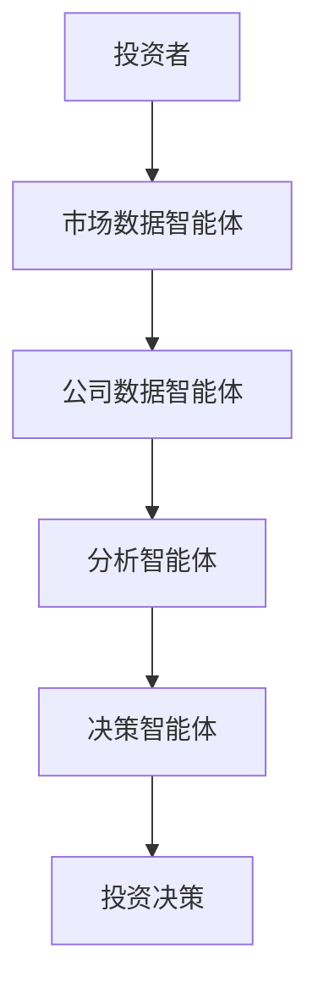
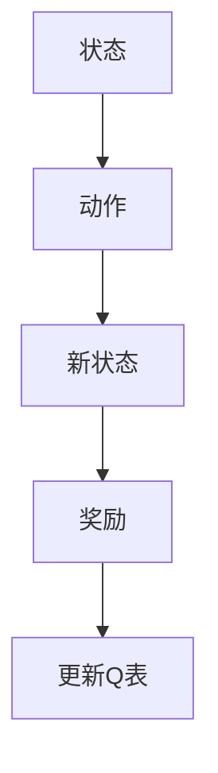
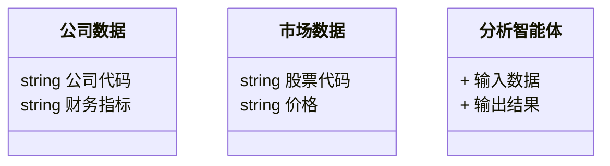

                 


# AI驱动的公司间比较分析：价值投资中的多智能体应用

## 关键词：AI驱动、公司间比较分析、价值投资、多智能体、算法原理、系统架构、项目实战

## 摘要：  
本文探讨了AI技术在公司间比较分析中的应用，特别是在价值投资中的多智能体策略。通过系统化的分析，介绍了如何利用多智能体系统进行公司间的深度比较，结合算法原理和系统架构，详细阐述了AI驱动的公司间比较分析在价值投资中的实际应用和案例。本文旨在为投资者和技术开发者提供理论支持和实践指导，帮助他们更好地理解和应用AI技术在价值投资中的潜力。

---

# 第一部分：背景介绍

## 第1章：AI与多智能体概述

### 1.1 AI与多智能体的基本概念

#### 1.1.1 AI的基本概念
- **人工智能（AI）**：AI是指计算机系统执行人类智能任务的能力，如视觉识别、语音识别、决策制定等。
- **机器学习（ML）**：ML是AI的一个子领域，通过数据训练模型，使其能够从数据中学习并做出预测或决策。
- **深度学习（DL）**：DL是ML的一个子领域，主要基于人工神经网络，模拟人脑的处理方式。

#### 1.1.2 多智能体系统的定义与特点
- **多智能体系统（MAS）**：由多个智能体组成的系统，每个智能体都能独立决策并与其他智能体协作。
- **特点**：
  - 分布式：智能体独立运行，通过通信协作。
  - 协作性：智能体之间共享信息，共同完成任务。
  - 反应性：智能体能够实时感知环境并做出反应。

#### 1.1.3 多智能体在金融领域的应用背景
- **金融领域的复杂性**：金融市场参与者众多，信息复杂，需要实时决策。
- **多智能体的优势**：能够模拟市场中的多参与者行为，提供更精准的分析。
- **价值投资中的应用场景**：通过多智能体分析公司基本面、市场情绪等，辅助投资决策。

---

## 第2章：公司间比较分析的方法

### 2.1 数据收集与预处理

#### 2.1.1 数据来源
- **公开市场数据**：股票价格、交易量、市场指数等。
- **公司财务报表**：收入、利润、资产负债表等。
- **行业报告**：行业趋势、竞争分析等。

#### 2.1.2 数据清洗
- **数据清洗的方法**：识别并处理缺失值、异常值、重复值等。
- **异常值处理**：使用统计方法或机器学习方法检测异常值。
- **数据标准化**：将数据转换到统一尺度，便于模型训练。

### 2.2 特征提取与选择

#### 2.2.1 常见的财务指标
- **市盈率（P/E）**：股价与每股收益的比率，衡量股票价格是否合理。
- **市净率（P/B）**：股价与每股净资产的比率，衡量股票价格与资产价值的关系。
- **资产负债率**：负债与资产的比率，衡量公司的财务健康状况。

#### 2.2.2 文本数据处理
- **新闻标题提取**：使用自然语言处理（NLP）技术提取公司相关的新闻标题。
- **公司公告分析**：分析公司发布的公告，提取关键信息。
- **自然语言处理技术**：使用词袋模型或词嵌入（如Word2Vec）处理文本数据。

---

## 第3章：AI驱动的公司间比较分析模型

### 3.1 机器学习模型的选择

#### 3.1.1 监督学习与无监督学习
- **监督学习**：用于有标签的数据，如预测股票价格。
- **无监督学习**：用于无标签的数据，如聚类分析公司。

#### 3.1.2 深度学习模型
- **神经网络的应用**：用于复杂模式识别。
- **卷积神经网络（CNN）**：用于图像识别和序列数据处理。
- **循环神经网络（RNN）**：用于时间序列数据处理。

### 3.2 多智能体协作机制

#### 3.2.1 多智能体协作的基本原理
- **信息共享**：智能体之间共享数据和信息。
- **协作策略**：制定协作规则，确保任务完成。
- **决策协调**：协调各智能体的决策，避免冲突。

#### 3.2.2 多智能体协作的实现方法
- **基于规则的协作**：预定义规则，指导智能体协作。
- **基于学习的协作**：通过机器学习模型学习协作策略。
- **基于市场的协作**：模拟市场机制，智能体通过市场交易协作。

---

## 第4章：价值投资中的多智能体应用

### 4.1 价值投资的基本原理

#### 4.1.1 价值投资的定义
- **价值投资**：寻找市场价格低于内在价值的股票进行投资。

#### 4.1.2 价值投资的关键因素
- **公司基本面分析**：分析公司的财务状况、行业地位、竞争优势等。
- **股价与内在价值的比较**：比较市场价格与内在价值，寻找低估的股票。
- **长期投资策略**：关注长期价值，而非短期波动。

### 4.2 多智能体在价值投资中的应用

#### 4.2.1 多智能体的分工与协作
- **分工**：每个智能体负责不同的任务，如数据收集、分析、决策等。
- **协作**：智能体之间共享信息，共同完成复杂任务。

#### 4.2.2 多智能体在价值投资中的具体应用
- **公司基本面分析**：智能体分析公司的财务数据、行业地位等。
- **市场情绪分析**：智能体分析新闻、社交媒体等，评估市场情绪。
- **投资决策**：基于分析结果，智能体制定投资策略。

---

# 第二部分：核心概念与联系

## 第5章：多智能体系统的架构设计

### 5.1 多智能体系统的组成

#### 5.1.1 实体与关系
- **公司**：基本分析单元。
- **财务指标**：公司价值的重要衡量标准。
- **市场数据**：股票价格、交易量等实时数据。

#### 5.1.2 ER实体关系图


### 5.2 多智能体系统的协作流程

#### 5.2.1 协作流程图


---

# 第三部分：算法原理

## 第6章：强化学习算法在多智能体中的应用

### 6.1 强化学习的基本原理

#### 6.1.1 强化学习的数学模型
- **状态空间（S）**：智能体所处的环境。
- **动作空间（A）**：智能体可以采取的动作。
- **奖励函数（R）**：智能体采取动作后获得的奖励。

#### 6.1.2 Q-learning算法


#### 6.1.3 Q-learning算法实现
```python
import numpy as np

class QLearning:
    def __init__(self, state_space, action_space):
        self.q_table = np.zeros((state_space, action_space))
    
    def choose_action(self, state, epsilon=0.1):
        if np.random.random() < epsilon:
            return np.random.randint(action_space)
        else:
            return np.argmax(self.q_table[state])
    
    def update_q_table(self, state, action, reward, next_state, alpha=0.1):
        self.q_table[state, action] = (1 - alpha) * self.q_table[state, action] + alpha * (reward + np.max(self.q_table[next_state]))
```

---

# 第四部分：系统分析与架构设计

## 第7章：系统架构设计

### 7.1 系统功能设计

#### 7.1.1 领域模型


### 7.2 系统架构设计

#### 7.2.1 系统架构图
```mermaid
container 价值投资系统 {
    component 数据预处理模块 {
        公司数据
        市场数据
    }
    component 特征提取模块 {
        财务指标
        文本数据
    }
    component 模型训练模块 {
        机器学习模型
        深度学习模型
    }
    component 决策模块 {
        投资决策
        风险评估
    }
}
```

---

# 第五部分：项目实战

## 第8章：项目实战

### 8.1 环境搭建

#### 8.1.1 技术栈
- **编程语言**：Python
- **框架**：TensorFlow、Keras
- **工具**：Pandas、NumPy、Matplotlib

### 8.2 系统实现

#### 8.2.1 核心代码实现
```python
import pandas as pd
import numpy as np

# 数据预处理
def preprocess_data(data):
    data = data.dropna()
    data = (data - data.min()) / (data.max() - data.min())
    return data

# 多智能体协作
class MultiAgent:
    def __init__(self, num_agents):
        self.agents = [Agent() for _ in range(num_agents)]
    
    def collaborate(self, data):
        for agent in self.agents:
            agent.update_state(data)
            agent.compute_action()
        return self.agents[0].action

class Agent:
    def __init__(self):
        self.state = None
    
    def update_state(self, data):
        self.state = data
    
    def compute_action(self):
        if self.state['value'] > self.state['price']:
            return 'buy'
        else:
            return 'sell'
```

### 8.3 实际案例分析

#### 8.3.1 案例分析
- **数据来源**：某行业的公司财务数据和市场数据。
- **分析结果**：通过多智能体分析，找到内在价值高于市场价格的公司，进行投资。

#### 8.3.2 分析结果
- **公司A**：P/E为10，行业平均为15，具有投资价值。
- **公司B**：P/B为1.5，行业平均为2，具有投资价值。

---

## 第9章：总结与展望

### 9.1 总结
- 本文介绍了AI技术在公司间比较分析中的应用，特别是在价值投资中的多智能体策略。
- 通过系统化的分析，展示了如何利用多智能体系统进行公司间的深度比较。

### 9.2 展望
- **算法优化**：进一步优化强化学习算法，提高投资决策的准确性。
- **数据源扩展**：引入更多数据源，如社交媒体数据，提高分析的全面性。
- **系统扩展**：扩展系统的应用场景，如风险控制、组合投资等。

### 9.3 最佳实践Tips
- **数据质量**：确保数据的准确性和完整性。
- **模型选择**：根据具体问题选择合适的算法。
- **持续优化**：定期更新模型，适应市场变化。

---

通过本文的系统分析和实际案例，读者可以全面理解AI技术在公司间比较分析中的应用，并在价值投资中实现多智能体协作。

