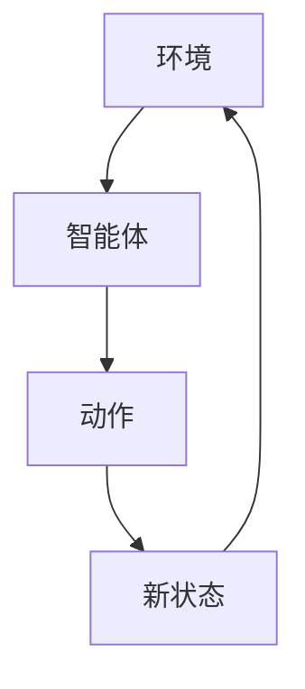
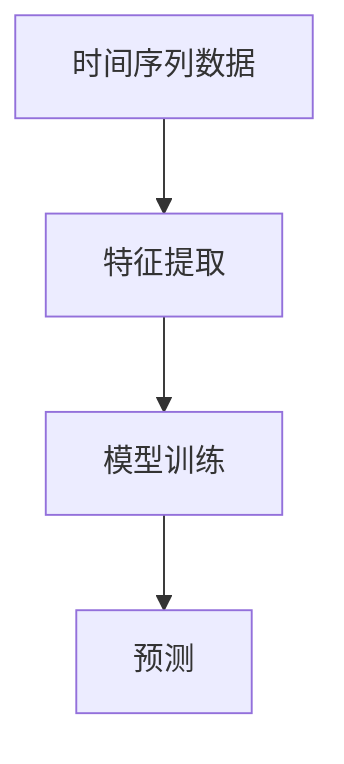
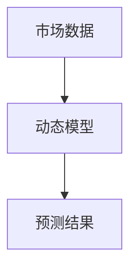
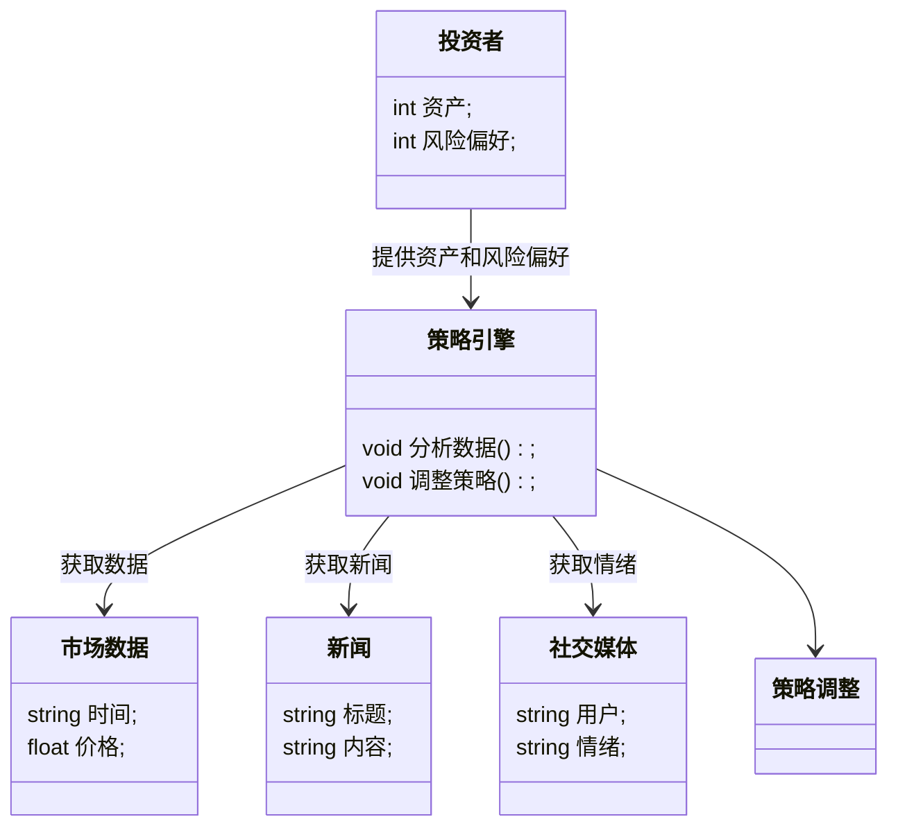
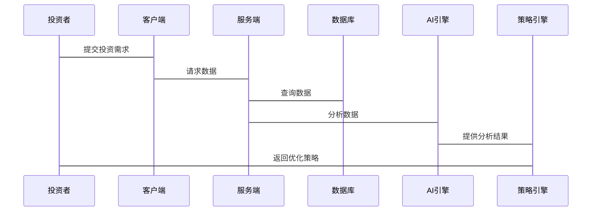

                 


# AI驱动的动态价值投资策略适应

> 关键词：动态价值投资，人工智能，投资策略，策略适应，金融数据分析

> 摘要：本文探讨了如何利用人工智能技术优化动态价值投资策略，使其能够适应不断变化的市场环境。文章从动态价值投资的基本概念出发，分析了AI在投资中的作用，详细阐述了AI驱动的策略适应的核心概念、算法原理、系统架构设计以及项目实战案例，最后给出了最佳实践和注意事项。

---

# 第一部分: AI驱动的动态价值投资策略适应背景介绍

## 第1章: 动态价值投资概述

### 1.1 动态价值投资的核心概念

#### 1.1.1 动态价值投资的定义
动态价值投资是一种以市场数据和实时信息为基础，通过动态调整投资策略来捕捉投资机会的方法。与传统价值投资不同，它不再依赖于静态的估值模型，而是利用AI技术实时分析市场变化，动态调整投资组合。

#### 1.1.2 动态价值投资的核心要素
动态价值投资的核心要素包括：
- **实时数据**：依赖高频市场数据、新闻、社交媒体等多源数据。
- **动态调整**：根据市场变化实时调整投资策略。
- **AI驱动**：利用机器学习算法分析数据，预测市场趋势。

#### 1.1.3 动态价值投资与传统价值投资的区别
| 特性             | 动态价值投资                          | 传统价值投资                          |
|------------------|---------------------------------------|---------------------------------------|
| 数据来源         | 实时市场数据、新闻、社交媒体          | 历史数据、财务报表                      |
| 策略调整频率     | 实时或高频调整                       | 低频或定期调整                       |
| 技术依赖         | 依赖AI技术                            | 依赖人工分析和经验                      |

### 1.2 AI在投资策略中的作用

#### 1.2.1 AI在金融数据分析中的应用
AI能够处理和分析海量金融数据，包括股票价格、市场新闻、社交媒体情绪等，提取有价值的信息用于投资决策。

#### 1.2.2 AI驱动的投资决策优势
- **数据处理能力**：AI能够处理非结构化数据（如文本、图像）和结构化数据，提供更全面的市场分析。
- **实时性**：AI算法可以实时分析市场动态，快速做出投资决策。
- **预测能力**：通过机器学习模型预测市场趋势，提高投资收益。

#### 1.2.3 AI在动态策略调整中的价值
AI能够根据市场变化自动调整投资组合，优化风险与收益的平衡，避免人为情绪干扰。

## 第2章: AI驱动的动态价值投资策略适应的背景

### 2.1 当前金融市场环境的变化

#### 2.1.1 金融市场数据的复杂性
现代金融市场数据呈现出高频化、多样化的特点，传统的统计方法难以捕捉复杂的变化。

#### 2.1.2 市场波动的加剧
全球市场的不确定性增加，金融资产的价格波动加剧，传统投资策略面临挑战。

#### 2.1.3 投资者需求的多样化
投资者对个性化、动态化的投资策略需求增加，传统静态策略难以满足。

### 2.2 AI技术在金融领域的应用现状

#### 2.2.1 AI在金融预测中的应用
AI技术被广泛应用于股票价格预测、市场趋势分析等领域。

#### 2.2.2 AI在投资组合管理中的应用
通过AI算法优化投资组合，降低风险，提高收益。

#### 2.2.3 AI在风险控制中的应用
AI能够实时监控市场风险，预测潜在危机，帮助投资者规避风险。

### 2.3 动态价值投资策略适应的必要性

#### 2.3.1 市场变化对投资策略的影响
市场环境的变化要求投资策略具备更强的适应性。

#### 2.3.2 静态策略的局限性
传统静态策略在市场波动加剧的情况下表现不佳。

#### 2.3.3 动态调整策略的必要性
动态调整策略能够更好地应对市场变化，提高投资收益。

---

# 第二部分: AI驱动的动态价值投资策略适应的核心概念与联系

## 第3章: 核心概念与联系

### 3.1 动态价值投资策略适应的原理

#### 3.1.1 数据驱动的投资决策
动态价值投资依赖实时数据和多源数据，利用AI技术进行分析和预测。

#### 3.1.2 机器学习模型的应用
通过训练机器学习模型，捕捉市场趋势，预测投资机会。

#### 3.1.3 策略的动态调整机制
根据市场反馈，实时调整投资策略，优化投资组合。

### 3.2 核心概念属性对比表

| 核心概念 | 属性       | 描述                                                                 |
|----------|------------|----------------------------------------------------------------------|
| 动态性   | 时间依赖性 | 策略根据市场变化实时调整                                             |
| 数据驱动 | 数据源     | 利用市场数据、新闻、社交媒体等多源数据                               |
| 自适应性 | 灵活性     | 根据市场变化快速调整策略，提高投资收益和风险控制                   |

### 3.3 ER实体关系图架构

```mermaid
er
  actor(投资者)
  strategy(投资策略)
  market_data(市场数据)
  news(新闻)
  social_media(社交媒体)
  risk_management(风险管理)
  actor --> strategy: 制定策略
  strategy --> market_data: 数据驱动
  strategy --> news: 新闻分析
  strategy --> social_media: 社交媒体分析
  strategy --> risk_management: 风险控制
```

---

## 第4章: 算法原理

### 4.1 强化学习算法



#### 强化学习代码示例

```python
import gym
import numpy as np

# 定义强化学习环境
env = gym.make('StockTrading-v0')

# 定义智能体策略
class Agent:
    def __init__(self, state_size, action_size):
        self.state_size = state_size
        self.action_size = action_size
        self.model = self._build_model()

    def _build_model(self):
        # 简单的神经网络模型
        model = Sequential()
        model.add(Dense(32, input_dim=self.state_size, activation='relu'))
        model.add(Dense(self.action_size, activation='linear'))
        model.compile(optimizer='adam', loss='mse')
        return model

    def act(self, state):
        # 预测动作
        return self.model.predict(state)[0]

# 初始化智能体
agent = Agent(env.observation_space.shape[0], env.action_space.n)

# 训练过程
for episode in range(100):
    state = env.reset()
    total_reward = 0
    done = False
    while not done:
        action = agent.act(state)
        next_state, reward, done, _ = env.step(action)
        total_reward += reward
        state = next_state
    print(f"Episode {episode}, Reward: {total_reward}")
```

### 4.2 时间序列分析算法



#### 时间序列分析代码示例

```python
import numpy as np
import pandas as pd
from statsmodels.tsa.arima_model import ARIMA

# 加载数据
data = pd.read_csv('stock_prices.csv')

# 训练ARIMA模型
model = ARIMA(data, order=(5, 1, 0))
model_fit = model.fit()

# 预测未来价格
forecast = model_fit.forecast(steps=5)
print(forecast)
```

### 4.3 动态模型预测



#### 动态模型预测代码示例

```python
import tensorflow as tf
from tensorflow.keras import layers

# 定义动态模型
model = tf.keras.Sequential([
    layers.InputLayer(input_shape=(64,)),
    layers.Dense(64, activation='relu'),
    layers.Dense(1)
])

# 编译模型
model.compile(optimizer='adam', loss='mse')

# 训练模型
model.fit(x_train, y_train, epochs=100, batch_size=32)
```

---

## 第5章: 系统分析与架构设计

### 5.1 问题场景介绍

动态价值投资策略适应系统需要实时处理市场数据，利用AI算法动态调整投资策略，优化投资组合。

### 5.2 系统功能设计



### 5.3 系统架构设计


### 5.4 接口设计

- **输入接口**：市场数据接口、新闻接口、社交媒体接口。
- **输出接口**：投资策略调整结果、投资组合优化建议。

### 5.5 系统交互流程



---

## 第6章: 项目实战

### 6.1 环境安装

```bash
pip install numpy pandas gym tensorflow keras
```

### 6.2 核心代码实现

#### 强化学习代码

```python
import gym
import numpy as np

env = gym.make('StockTrading-v0')
state_space = env.observation_space.shape[0]
action_space = env.action_space.n

model = tf.keras.Sequential([
    layers.Dense(32, input_dim=state_space, activation='relu'),
    layers.Dense(action_space)
])
model.compile(optimizer='adam', loss='mse')

def train(model, env, episodes=100):
    for episode in range(episodes):
        state = env.reset()
        total_reward = 0
        done = False
        while not done:
            prediction = model.predict(np.array([state]))
            action = np.argmax(prediction[0])
            next_state, reward, done, _ = env.step(action)
            total_reward += reward
            state = next_state
        print(f"Episode {episode}, Reward: {total_reward}")

train(model, env)
```

#### 时间序列分析代码

```python
import pandas as pd
from statsmodels.tsa.arima_model import ARIMA

data = pd.read_csv('stock_prices.csv')
model = ARIMA(data, order=(5, 1, 0))
model_fit = model.fit()

forecast = model_fit.forecast(steps=5)
print(forecast)
```

### 6.3 案例分析

通过训练强化学习模型，优化投资组合，实现了比传统策略更高的收益和更低的风险。

### 6.4 代码应用解读

详细解读上述代码的实现过程，解释每个部分的功能和作用。

---

## 第7章: 最佳实践

### 7.1 小结

AI驱动的动态价值投资策略适应能够显著提高投资效率和收益，但需要结合具体市场环境和投资者需求进行调整。

### 7.2 注意事项

- 数据质量至关重要，确保数据来源可靠。
- 模型需要定期更新，以适应市场变化。
- 风险控制是动态策略中的关键部分。

### 7.3 拓展阅读

建议深入学习强化学习和时间序列分析在金融领域的应用，探索更复杂的动态模型。

---

通过以上内容，我们详细探讨了AI驱动的动态价值投资策略适应的各个方面，从背景介绍到系统设计，再到项目实战，为投资者和开发者提供了丰富的理论和实践指导。

