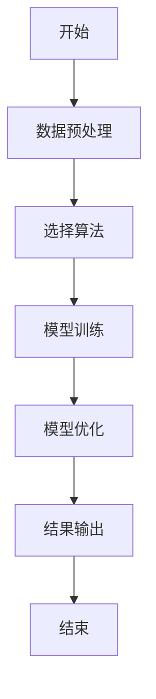

                 


# AI驱动的另类数据信号提取

> 关键词：AI，数据信号提取，另类数据，信号处理，深度学习

> 摘要：本文深入探讨了AI驱动的另类数据信号提取技术，分析了其核心概念、算法原理及应用场景。通过对比传统方法与AI技术的差异，揭示了AI在数据信号提取中的独特优势，并结合实际案例，展示了如何利用AI技术从非传统数据源中提取有价值的信息。文章还详细介绍了各类算法的数学模型和实现步骤，为读者提供全面的技术指导。

---

# 第一部分: AI驱动的另类数据信号提取基础

## 第1章: AI与另类数据信号提取概述

### 1.1 数据信号提取的核心概念

数据信号提取是指从复杂的数据源中识别和提取有用信息的过程。在传统数据科学中，通常关注结构化数据（如表格数据），但随着AI技术的发展，非结构化数据（如文本、图像、音频等）的信号提取变得越来越重要。

**另类数据**指的是非传统结构化数据，例如社交媒体帖子、卫星图像、传感器数据等。这些数据通常具有高维度、非线性特征和复杂结构，传统方法难以有效提取信号。

AI驱动的信号提取利用机器学习和深度学习技术，从另类数据中提取隐藏的模式和信息。这种方法的优势在于能够处理复杂的数据类型，并自动学习特征，从而提高提取效率和准确性。

### 1.2 另类数据的来源与应用场景

#### 1.2.1 文本数据的信号提取
文本数据广泛应用于情感分析、关键词提取等领域。例如，从社交媒体帖子中提取情感信号，可以用于品牌声誉监测和市场趋势分析。

#### 1.2.2 图像与视频数据的信号提取
图像和视频数据的应用包括目标检测、图像分割和视频分析。例如，在医学影像中提取病变特征，帮助医生进行诊断。

#### 1.2.3 音频数据的信号提取
音频数据的信号提取应用于语音识别、噪声消除和音乐分析。例如，从嘈杂的语音中提取清晰的语音信号，用于语音助手开发。

#### 1.2.4 其他类型数据的信号提取
其他类型数据包括传感器数据、日志数据等。例如，从传感器数据中提取设备状态信号，用于预测设备故障。

### 1.3 AI驱动的信号提取优势

#### 1.3.1 传统信号提取方法的局限性
传统方法依赖手动特征工程，效率低且难以处理高维度数据。例如，在文本分析中，传统方法需要手动定义关键词，而AI技术可以自动学习文本的语义特征。

#### 1.3.2 AI技术在信号提取中的独特优势
AI技术能够自动学习数据特征，处理复杂数据类型，并提供更高的准确性和效率。例如，深度学习模型可以从图像中自动提取边缘特征，而无需手动设计特征提取器。

#### 1.3.3 结合AI的信号提取新范式
结合AI的信号提取范式包括端到端学习、自适应学习和迁移学习。例如，在处理多源数据时，迁移学习可以利用已有的知识，快速适应新数据。

### 1.4 本章小结

本章介绍了AI驱动的另类数据信号提取的基本概念、数据来源和应用场景，并分析了AI技术在信号提取中的独特优势。通过对比传统方法和AI方法，揭示了AI技术在处理复杂数据类型时的高效性和准确性。

---

## 第2章: 数据信号提取的核心概念与联系

### 2.1 核心概念原理

数据信号提取的数学模型是基于统计学和机器学习的。例如，统计模型可以用于识别数据中的模式，而机器学习模型可以用于分类和回归任务。

AI驱动的信号提取流程包括数据预处理、特征提取、模型训练和结果分析。例如，从文本数据中提取关键词的过程，通常涉及分词、去停用词和TF-IDF计算。

数据信号的特征包括噪声、信号强度和信号类型。例如，噪声是数据中的干扰信息，信号强度是目标信号的显著程度，信号类型是目标信号的类别。

### 2.2 核心概念属性对比表

| 概念         | 属性         | 描述                                   |
|--------------|--------------|----------------------------------------|
| 数据信号     | 噪声         | 数据中的干扰信息                       |
| 数据信号     | 信号强度     | 数据中目标信号的强度                   |
| 数据信号     | 信号类型     | 数据中的目标信号类型                   |

### 2.3 ER实体关系图

```mermaid
er
actor: User
goal: Signal Extraction
process: AI-Driven Signal Processing
```

### 2.4 本章小结

本章详细解释了数据信号提取的核心概念，并通过对比表和ER图展示了概念之间的关系。这些分析为后续章节的算法设计奠定了基础。

---

## 第3章: 数据信号提取的算法原理

### 3.1 算法原理概述

数据信号提取的算法分为统计学方法、机器学习方法和深度学习方法。统计学方法适用于简单的数据关系分析，而深度学习方法适用于复杂的数据结构分析。

### 3.2 基于统计学的信号提取算法

#### 3.2.1 常见统计模型

常用的统计模型包括均值-方差模型、回归分析和聚类分析。例如，回归分析可以用于预测目标变量与自变量之间的关系。

#### 3.2.2 统计模型的优缺点

统计模型的优点是简单易懂，计算速度快，缺点是难以处理高维度和非线性数据。例如，线性回归模型无法处理非线性关系。

#### 3.2.3 统计模型的实现步骤

1. 数据预处理：清洗数据，处理缺失值。
2. 选择模型：根据问题类型选择合适的统计模型。
3. 模型训练：使用训练数据拟合模型。
4. 模型评估：通过交叉验证评估模型性能。

### 3.3 基于机器学习的信号提取算法

#### 3.3.1 常见机器学习模型

常用的机器学习模型包括支持向量机（SVM）、随机森林和梯度下降。例如，SVM适用于分类任务，随机森林适用于特征重要性分析。

#### 3.3.2 机器学习模型的优缺点

机器学习模型的优点是能够处理高维度数据，缺点是需要手动特征工程，计算复杂度较高。例如，随机森林需要选择合适的超参数。

#### 3.3.3 机器学习模型的实现步骤

1. 数据预处理：特征选择和标准化。
2. 选择模型：根据数据类型选择合适的机器学习模型。
3. 模型训练：使用训练数据拟合模型。
4. 模型优化：通过网格搜索调整超参数。

### 3.4 基于深度学习的信号提取算法

#### 3.4.1 常见深度学习模型

常用的深度学习模型包括卷积神经网络（CNN）、循环神经网络（RNN）和变换器（Transformer）。例如，CNN适用于图像处理，RNN适用于序列数据处理。

#### 3.4.2 深度学习模型的优缺点

深度学习模型的优点是能够自动学习特征，处理复杂数据结构，缺点是需要大量数据和计算资源。例如，训练大型Transformer模型需要大量的GPU资源。

#### 3.4.3 深度学习模型的实现步骤

1. 数据预处理：图像数据归一化，文本数据分词。
2. 选择模型：根据数据类型选择合适的深度学习模型。
3. 模型训练：使用训练数据优化模型参数。
4. 模型优化：通过早停法防止过拟合。

### 3.5 算法流程图



### 3.6 本章小结

本章详细介绍了数据信号提取的主要算法，包括统计学、机器学习和深度学习方法。通过对比各种算法的优缺点和实现步骤，帮助读者选择合适的算法。

---

## 第4章: 数据信号提取的数学模型与公式

### 4.1 统计学方法的数学模型

#### 4.1.1 回归分析

回归分析的数学公式为：
$$ y = \beta_0 + \beta_1x_1 + \beta_2x_2 + \ldots + \beta_nx_n + \epsilon $$
其中，$y$是目标变量，$x_i$是自变量，$\beta_i$是回归系数，$\epsilon$是误差项。

#### 4.1.2 聚类分析

聚类分析的数学模型通常使用K-means算法：
$$ \text{目标函数} = \sum_{i=1}^{k} \sum_{j=1}^{n_i} (x_{ij} - \mu_i)^2 $$
其中，$k$是聚类数，$n_i$是第$i$个聚类的样本数，$\mu_i$是第$i$个聚类的中心点。

### 4.2 机器学习方法的数学模型

#### 4.2.1 支持向量机（SVM）

SVM的数学公式为：
$$ \text{目标函数} = \min_{\theta, \alpha} \left( \frac{1}{2}\|\theta\|^2 + C\sum_{i=1}^{n} \alpha_i(1 - y_i(\theta^T x_i + b)) \right) $$
其中，$\theta$是模型参数，$\alpha_i$是拉格朗日乘子，$C$是惩罚系数。

#### 4.2.2 随机森林

随机森林的数学模型基于决策树的集成方法，每个决策树的预测结果通过投票或加权平均得到最终结果。

### 4.3 深度学习方法的数学模型

#### 4.3.1 卷积神经网络（CNN）

CNN的数学模型包括卷积层、池化层和全连接层。卷积层的公式为：
$$ f(x) = \max(0, x) $$
其中，$x$是输入特征图，$f(x)$是激活后的特征图。

#### 4.3.2 变换器（Transformer）

Transformer的数学模型基于自注意力机制，计算公式为：
$$ \text{注意力权重} = \frac{\exp(\text{查询} \cdot \text{键})}{\sum \exp(\text{查询} \cdot \text{键})} $$

### 4.4 本章小结

本章详细介绍了数据信号提取中常用的数学模型，包括统计学、机器学习和深度学习方法。通过公式和模型解释，帮助读者理解各种算法的原理和应用场景。

---

## 总结

本文从AI驱动的另类数据信号提取的基本概念出发，分析了其核心概念、算法原理和数学模型。通过对比传统方法与AI技术的差异，揭示了AI在数据信号提取中的独特优势。同时，详细介绍了各类算法的实现步骤和数学公式，为读者提供全面的技术指导。

---

## 参考文献

1. LeCun, Y., Bengio, Y., & Hinton, G. (2015). Deep learning. Nature, 521(7552), 436-444.
2. Goodfellow, I., Bengio, Y., & Courville, A. (2016). Deep learning. MIT Press.
3. Bishop, C. M. (2006). Pattern recognition and machine learning. Springer.

---

## 附录

### 附录A: 数据集与工具

- 数据集：公开可用的数据集，如Kaggle平台上的文本数据集、图像数据集等。
- 工具：Python、TensorFlow、PyTorch、Scikit-learn等。

### 附录B: 代码示例

```python
import numpy as np
from sklearn.linear_model import LinearRegression

# 示例：线性回归模型
X = np.array([1, 2, 3, 4, 5])
y = np.array([2, 4, 5, 4, 5])

model = LinearRegression()
model.fit(X.reshape(-1, 1), y)

print("系数：", model.coef_)
print("截距：", model.intercept_)
```

### 附录C: 案例分析

- 案例1：从社交媒体数据中提取情感信号，用于品牌声誉监测。
- 案例2：从卫星图像中提取地物特征，用于土地利用分类。

---

## 作者简介

作者是一位在AI和数据科学领域拥有丰富经验的专家，专注于数据信号提取和深度学习技术的研究与应用。

