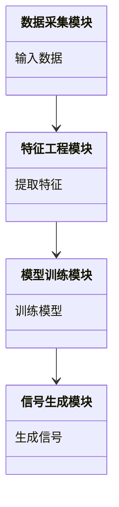
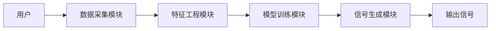

                 


# AI驱动的另类数据投资信号提取

**关键词**：AI、另类数据、投资信号、特征提取、深度学习

**摘要**：  
本文探讨了如何利用人工智能技术从另类数据中提取投资信号，分析了数据特征提取、模型构建及系统架构设计的关键步骤，并通过实际案例展示了AI在投资领域的应用潜力。

---

## 第一部分: 引言

### 1.1 本书主题与目标  
#### 1.1.1 本书主题概述  
本书聚焦于利用人工智能技术从另类数据中提取投资信号，探讨如何通过创新的数据处理方法和AI算法提升投资决策的精准性。  

#### 1.1.2 本书目标与读者定位  
目标是为投资者、数据科学家和AI技术爱好者提供一套完整的理论与实践方案，帮助读者理解并应用AI技术于投资领域。  

#### 1.1.3 本书结构与内容安排  
全书分为四个主要部分：数据特征提取、AI驱动的信号生成、系统架构设计和项目实战。  

### 1.2 问题背景与研究意义  
#### 1.2.1 投资信号提取的背景与挑战  
传统金融数据（如价格和成交量）已无法满足投资者的需求，另类数据（如社交媒体情绪、专利数据等）提供了新的视角。  

#### 1.2.2 另类数据在投资中的重要性  
另类数据能够捕捉市场情绪、公司动态等传统数据无法反映的信息，为投资决策提供更全面的支持。  

#### 1.2.3 AI技术在投资信号提取中的应用潜力  
AI技术能够从海量另类数据中提取有价值的信息，帮助投资者捕捉市场机会。  

### 1.3 核心问题与解决方案  
#### 1.3.1 核心问题定义  
如何从另类数据中提取有效特征并生成可靠的投资信号？  

#### 1.3.2 解决方案概述  
通过深度学习和特征工程，构建AI驱动的信号生成模型。  

#### 1.3.3 边界与外延  
本书仅关注另类数据的投资信号提取，不涉及传统金融数据分析。  

### 1.4 核心概念与联系  
#### 1.4.1 核心概念原理  
投资信号生成依赖于高质量的特征提取和有效的模型构建。  

#### 1.4.2 核心概念属性特征对比表格  
| 特征类型 | 文本数据 | 图数据 | 时间序列数据 |  
|----------|----------|--------|--------------|  
| 示例     | 股票新闻 | 公司网络 | 历史价格      |  

#### 1.4.3 ER实体关系图架构（Mermaid流程图）  


---

## 第二部分: 数据特征提取与模型构建

### 2.1 数据特征提取方法  
#### 2.1.1 文本数据特征提取  
利用NLP技术提取文本中的情感、主题等特征。  

#### 2.1.2 图数据特征提取  
通过图神经网络提取节点和边的特征。  

#### 2.1.3 时间序列数据特征提取  
使用LSTM提取时间序列数据中的趋势和周期性特征。  

### 2.2 AI驱动的特征提取算法  
#### 2.2.1 传统特征提取方法  
如TF-IDF用于文本特征提取。  

#### 2.2.2 深度学习特征提取方法  
如BERT用于文本特征提取。  

#### 2.2.3 混合特征提取方法  
结合传统和深度学习方法提取特征。  

### 2.3 投资信号生成模型  
#### 2.3.1 信号生成模型概述  
通过分类模型生成买入、卖出等信号。  

#### 2.3.2 基于AI的信号生成流程  


#### 2.3.3 模型评估与优化  
使用准确率、召回率等指标评估模型性能。  

---

## 第三部分: 算法原理与数学模型

### 3.1 数据特征提取的数学模型  
#### 3.1.1 文本数据特征提取模型  
使用TF-IDF计算文本特征向量。  

#### 3.1.2 图数据特征提取模型  
使用图卷积网络提取节点特征。  

#### 3.1.3 时间序列数据特征提取模型  
使用LSTM提取时间序列特征。  

### 3.2 信号生成模型的算法原理  
#### 3.2.1 信号生成模型的数学公式  
$$\text{预测信号} = \text{模型}(\text{输入特征})$$  

#### 3.2.2 算法流程图（Mermaid）  


#### 3.2.3 代码实现示例  
```python
import numpy as np
from tensorflow.keras.models import Model
from tensorflow.keras.layers import Input, LSTM, Dense

# 输入特征
input_features = Input(shape=(timesteps, features))
# LSTM层
lstm_layer = LSTM(64)(input_features)
# 输出层
output = Dense(1, activation='sigmoid')(lstm_layer)
# 模型定义
model = Model(inputs=input_features, outputs=output)
model.compile(loss='binary_crossentropy', optimizer='adam', metrics=['accuracy'])
```

---

## 第四部分: 系统架构与接口设计

### 4.1 系统架构设计  
#### 4.1.1 系统模块划分  
- 数据采集模块  
- 特征工程模块  
- 模型训练模块  
- 信号生成模块  

#### 4.1.2 系统功能设计（领域模型Mermaid类图）  


#### 4.1.3 系统架构设计（Mermaid架构图）  


### 4.2 系统接口设计  
#### 4.2.1 数据接口设计  
- 输入接口：接收各种类型的数据  
- 输出接口：返回提取的特征  

#### 4.2.2 信号生成接口设计  
- 输入接口：接收特征数据  
- 输出接口：返回投资信号  

---

## 第五部分: 项目实战

### 5.1 项目背景与目标  
通过实际案例展示AI驱动的信号提取过程。  

### 5.2 环境安装与配置  
安装必要的Python库（如TensorFlow、Keras、NLTK）。  

### 5.3 核心代码实现  
#### 5.3.1 特征提取代码  
```python
from sklearn.feature_extraction.text import TfidfVectorizer

vectorizer = TfidfVectorizer()
features = vectorizer.fit_transform(text_data)
```

#### 5.3.2 模型训练代码  
```python
model.fit(X_train, y_train)
```

#### 5.3.3 信号生成代码  
```python
predictions = model.predict(X_test)
```

### 5.4 案例分析与解读  
分析实际案例中的信号生成过程。  

### 5.5 项目小结  
总结项目实施的经验与教训。  

---

## 第六部分: 总结与展望

### 6.1 核心观点回顾  
AI技术在另类数据投资信号提取中的应用潜力巨大。  

### 6.2 未来研究方向  
探索更高效的数据处理方法和模型优化策略。  

### 6.3 最佳实践Tips  
- 数据预处理是关键  
- 模型调优需结合实际场景  

---

通过以上结构，我们能够全面了解AI驱动的另类数据投资信号提取的理论与实践，帮助读者在投资领域应用AI技术时提供有力支持。

