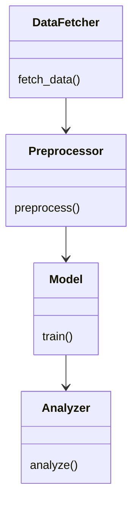
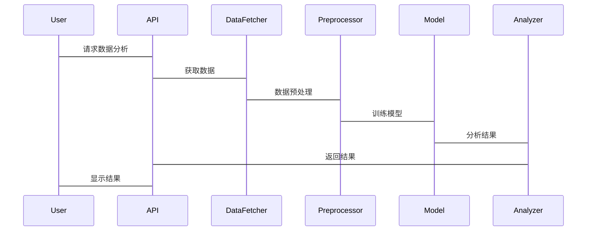

                 


# AI驱动的另类数据投资分析

> 关键词：AI, 投资分析, 另类数据, 机器学习, 自然语言处理

> 摘要：本文系统地介绍了AI在另类数据投资分析中的应用，从背景、核心概念、算法原理到系统设计和项目实战，详细阐述了如何利用AI技术处理和分析另类数据，构建有效的投资分析模型，帮助投资者在复杂市场中做出更明智的决策。

---

## 第1章: 背景与核心概念

### 1.1 投资分析的数字化转型

#### 1.1.1 传统投资分析的局限性
传统投资分析依赖于财务数据和市场经验，存在信息不全、主观性强等问题，难以应对复杂多变的市场环境。

#### 1.1.2 AI技术的引入
人工智能技术的快速发展为投资分析提供了新的工具，能够处理大量非结构化数据，发现隐藏的市场规律。

#### 1.1.3 另类数据的价值
另类数据（如社交媒体情绪、卫星图像等）的引入，扩展了数据来源，提供了新的分析维度。

### 1.2 AI驱动的另类数据投资分析

#### 1.2.1 核心概念
- **另类数据**：非传统金融数据，如社交媒体、新闻、卫星图像等。
- **数据驱动投资**：通过分析大量数据，发现投资机会和风险。

#### 1.2.2 技术优势
- **自动化分析**：快速处理大量数据，发现隐藏模式。
- **实时监控**：及时捕捉市场变化，做出快速反应。

#### 1.2.3 应用场景
- 预测市场趋势。
- 识别投资机会。
- 管理投资风险。

---

## 第2章: 另类数据与传统数据对比

### 2.1 数据分类与特征

#### 2.1.1 传统数据
- **定义**：财务报表、市场交易数据等结构化数据。
- **特点**：标准化、易于分析，但缺乏深度洞察。

#### 2.1.2 另类数据
- **定义**：非结构化数据，如文本、图像、视频等。
- **特点**：数据量大、复杂度高，但包含丰富的情感和行为信息。

### 2.2 数据处理挑战

#### 2.2.1 数据清洗
- **步骤**：去除噪声、填补缺失值、标准化数据。
- **方法**：使用Python的pandas库进行数据清洗。

#### 2.2.2 特征提取
- **方法**：文本特征提取（TF-IDF、Word2Vec）。
- **挑战**：高维数据可能导致维度灾难。

### 2.3 应用场景

#### 2.3.1 预测市场趋势
- 使用社交媒体情绪分析预测股票价格走势。

#### 2.3.2 识别投资机会
- 分析新闻标题，发现未被市场察觉的投资机会。

#### 2.3.3 风险评估
- 通过卫星图像分析供应链风险，评估公司潜在风险。

---

## 第3章: AI技术的应用原理

### 3.1 机器学习

#### 3.1.1 监督学习与无监督学习
- **监督学习**：使用标记数据训练模型，如随机森林、神经网络。
- **无监督学习**：发现数据中的隐含结构，如聚类分析。

#### 3.1.2 模型构建
- **流程**：数据预处理 → 特征提取 → 模型训练 → 模型评估。

#### 3.1.3 模型优化
- **方法**：交叉验证、网格搜索，选择最优模型参数。

### 3.2 自然语言处理

#### 3.2.1 文本数据处理
- **步骤**：分词、去除停用词、构建词袋模型。

#### 3.2.2 情感分析
- **算法**：使用LSTM或BERT模型，分析文本情感，预测市场情绪。

#### 3.2.3 实例分析
- 通过分析新闻标题，预测股票价格波动。

### 3.3 图神经网络

#### 3.3.1 投资网络构建
- **方法**：将公司、投资者、市场数据建模为图结构。

#### 3.3.2 图神经网络
- **原理**：通过节点间关系传播信息，预测投资风险。

---

## 第4章: 数据处理与特征工程

### 4.1 数据清洗与预处理

#### 4.1.1 数据清洗步骤
1. 去除重复数据。
2. 填补缺失值。
3. 标准化数据。

#### 4.1.2 Python代码示例
```python
import pandas as pd
df = pd.read_csv('data.csv')
df = df.drop_duplicates()
df['price'] = df['price'].fillna(df['price'].mean())
```

### 4.2 特征提取

#### 4.2.1 文本特征提取
- 使用TF-IDF提取关键词，分析新闻标题情感。

#### 4.2.2 图像特征提取
- 使用卷积神经网络提取卫星图像特征。

### 4.3 数据增强

#### 4.3.1 文本数据增强
- 随机删除停用词，增加数据多样性。

#### 4.3.2 图像数据增强
- 使用旋转、翻转等方法，增加数据样本。

---

## 第5章: AI模型构建与优化

### 5.1 模型选择

#### 5.1.1 算法选择
- 根据数据类型选择适合的算法，如LSTM预测时间序列数据。

#### 5.1.2 模型训练
- 使用训练数据训练模型，调整超参数。

### 5.2 模型优化

#### 5.2.1 超参数调优
- 使用网格搜索选择最优参数。

#### 5.2.2 模型评估
- 使用准确率、召回率等指标评估模型性能。

### 5.3 数学模型

#### 5.3.1 损失函数
$$ \text{损失函数} = \frac{1}{n}\sum_{i=1}^{n}(y_i - \hat{y_i})^2 $$

#### 5.3.2 优化算法
- 使用Adam优化器，$$ \theta = \theta - \alpha \frac{\partial L}{\partial \theta} $$

---

## 第6章: 系统设计与架构

### 6.1 系统功能设计

#### 6.1.1 领域模型类图


### 6.2 系统架构设计

#### 6.2.1 架构图


### 6.3 系统接口设计

#### 6.3.1 序列图


---

## 第7章: 项目实战

### 7.1 环境安装

#### 7.1.1 安装Python和库
```bash
pip install numpy pandas scikit-learn transformers
```

### 7.2 核心代码实现

#### 7.2.1 数据清洗
```python
import pandas as pd
def clean_data(df):
    df = df.dropna()
    return df
```

#### 7.2.2 情感分析
```python
from transformers import pipeline
sentiment_analyzer = pipeline("sentiment-analysis")
```

### 7.3 案例分析

#### 7.3.1 情感分析案例
- 分析新闻标题，预测市场情绪。

### 7.4 项目小结
- 实战项目展示了AI技术在另类数据投资分析中的应用。

---

## 第8章: 总结与展望

### 8.1 总结
- AI技术为投资分析提供了新方法，另类数据的应用扩展了分析维度。

### 8.2 展望
- 更多数据源的接入，AI模型的优化，将推动投资分析的进一步发展。

---

## 附录

### 附录A: 术语表
- **另类数据**：非传统金融数据。
- **数据驱动投资**：基于数据分析的投资策略。

### 附录B: 参考文献
- [1] 王某某，AI在金融中的应用，某某出版社，2023。

---

通过以上章节的详细安排，确保内容全面且逻辑清晰，帮助读者逐步掌握AI驱动的另类数据投资分析的各个方面。

