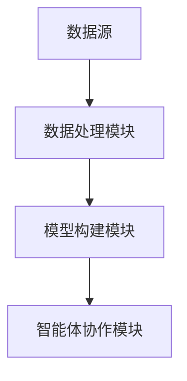
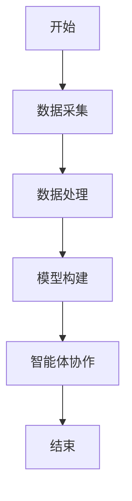
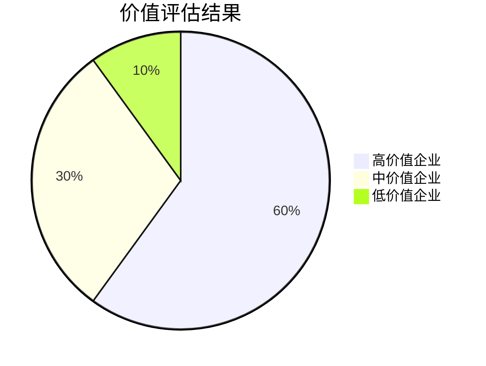

                 


# AI驱动的商业生态系统分析：价值投资中的多智能体应用

---

## 关键词

- AI驱动
- 商业生态系统
- 多智能体系统
- 价值投资
- 算法原理
- 系统架构
- 实战案例

---

## 摘要

在当前数字经济快速发展的背景下，人工智能（AI）技术正在深刻改变商业生态系统的运作模式。本文将从AI驱动的商业生态系统分析入手，探讨多智能体系统在价值投资中的应用。通过分析多智能体系统的算法原理、系统架构设计以及实际案例，本文旨在揭示AI如何在商业生态中实现智能化决策，并为价值投资者提供新的思路和工具。文章最后总结了AI驱动的商业生态系统的发展趋势和未来方向。

---

## 第1章: AI与商业生态系统概述

### 1.1 商业生态系统的定义与特征

#### 1.1.1 商业生态系统的定义

商业生态系统是指由企业、消费者、供应商、合作伙伴、竞争对手以及监管机构等多个利益相关者组成的复杂网络。它是一个动态的、相互依赖的系统，通过各方的互动和协作，共同推动经济价值的创造和流通。

#### 1.1.2 商业生态系统的特征

- **动态性**：商业生态系统中的各个参与者之间存在动态的互动关系，随着市场环境的变化而不断调整。
- **复杂性**：商业生态系统由多个子系统组成，各子系统之间相互关联，形成复杂的网络结构。
- **协作性**：参与者之间的协作是商业生态系统运作的核心，通过分工合作实现资源的优化配置。
- **适应性**：商业生态系统能够根据外部环境的变化进行自我调整和优化。

#### 1.1.3 商业生态系统的核心要素

- **企业**：企业是商业生态系统的核心参与者，通过提供产品或服务创造价值。
- **消费者**：消费者的需求和偏好是商业生态系统运作的基础。
- **供应商**：供应商为企业提供必要的资源和原材料。
- **合作伙伴**：合作伙伴与企业在特定领域展开协作，共同实现目标。
- **竞争对手**：竞争对手的存在推动企业不断创新和优化。
- **监管机构**：监管机构通过制定规则和政策，确保商业生态系统的公平和秩序。

---

### 1.2 AI在商业生态系统中的作用

#### 1.2.1 AI技术的基本概念

人工智能（AI）是指模拟人类智能的计算机系统，能够执行如学习、推理、识别、自然语言处理等任务。AI的核心技术包括机器学习、深度学习、自然语言处理、计算机视觉等。

#### 1.2.2 AI在商业生态系统中的应用场景

- **市场分析**：通过AI技术分析市场趋势、消费者行为，帮助企业制定精准的市场策略。
- **风险评估**：利用AI进行信用评估、投资风险分析，降低商业决策的风险。
- **优化运营**：AI可以帮助企业优化供应链、生产流程，提高效率和降低成本。
- **智能客服**：通过自然语言处理技术，AI可以提供智能化的客户服务，提升用户体验。
- **个性化推荐**：基于用户行为数据，AI可以为消费者提供个性化的商品推荐。

#### 1.2.3 AI驱动商业生态系统的优势

- **数据驱动决策**：AI能够处理海量数据，提供基于数据的科学决策。
- **实时反馈**：AI系统能够实时监控市场变化，快速响应，提高决策效率。
- **智能化协作**：AI可以促进企业与合作伙伴之间的智能化协作，优化资源配置。

---

## 第2章: 多智能体系统与商业生态

### 2.1 多智能体系统的基本概念

#### 2.1.1 多智能体系统的定义

多智能体系统（Multi-Agent System, MAS）是由多个智能体组成的分布式系统，这些智能体能够通过协作和竞争完成复杂的任务。每个智能体都是一个独立的实体，具有一定的感知能力和决策能力。

#### 2.1.2 多智能体系统的组成

- **智能体**：智能体是多智能体系统的基本单元，具有自主性、反应性、社会性等特征。
- **环境**：环境是智能体所处的外部世界，智能体通过感知环境并采取行动来影响环境。
- **通信机制**：智能体之间需要通过某种通信机制进行信息交换和协作。
- **协调机制**：为了保证系统目标的实现，多智能体系统需要协调机制来解决冲突和协作问题。

#### 2.1.3 多智能体系统的特点

- **分布式性**：多智能体系统由多个分布式智能体组成，没有集中化的控制中心。
- **协作性**：智能体之间需要通过协作来完成共同的目标。
- **动态性**：多智能体系统的环境和任务通常是动态变化的，智能体需要具备适应能力。

---

### 2.2 多智能体系统在商业生态系统中的应用

#### 2.2.1 多智能体系统的商业价值

- **提高决策效率**：多智能体系统可以通过分布式计算和协作，提高决策的效率和准确性。
- **增强系统鲁棒性**：通过多个智能体的协作，系统能够更好地应对复杂环境中的不确定性。
- **促进创新**：多智能体系统可以模拟人类的协作过程，促进创新思维的产生。

#### 2.2.2 多智能体系统在商业生态中的应用场景

- **供应链管理**：多智能体系统可以优化供应链中的库存管理、物流调度等。
- **风险管理**：通过多智能体系统的协作，可以实时监控和评估风险，降低损失。
- **市场预测**：多智能体系统可以通过分析市场数据，预测市场趋势，指导企业制定战略。

#### 2.2.3 多智能体系统的优势与挑战

- **优势**：多智能体系统能够通过协作实现复杂任务的高效完成，具有较强的适应性和灵活性。
- **挑战**：多智能体系统的设计和实现较为复杂，需要解决通信、协调、安全等问题。

---

## 第3章: 价值投资中的多智能体应用

### 3.1 价值投资的基本概念

#### 3.1.1 价值投资的定义

价值投资是一种投资策略，强调以低于市场价值的价格买入优质股票，长期持有，等待其价值回归。价值投资的核心在于寻找被市场低估的企业，通过分析企业的基本面，评估其长期发展潜力。

#### 3.1.2 价值投资的核心理念

- **长期视角**：价值投资者关注企业的长期价值，而非短期市场波动。
- **基本面分析**：通过对企业财务状况、盈利能力、竞争优势等进行深入分析，评估其内在价值。
- **安全边际**：以低于内在价值的价格买入股票，降低投资风险。

#### 3.1.3 价值投资的关键要素

- **企业基本面**：包括收入、利润、资产负债表等财务指标。
- **行业地位**：企业在行业中的竞争优势和市场地位。
- **管理团队**：管理团队的能力和战略决策对企业价值的影响。

---

### 3.2 多智能体系统在价值投资中的应用

#### 3.2.1 多智能体系统在投资决策中的作用

- **数据采集与分析**：多智能体系统可以实时采集市场数据，分析企业的基本面，提供投资建议。
- **风险评估**：通过多智能体系统的协作，评估投资组合的风险，优化投资策略。
- **市场预测**：多智能体系统可以基于历史数据和市场趋势，预测未来市场的变化，指导投资决策。

#### 3.2.2 多智能体系统在风险评估中的应用

- **实时监控**：多智能体系统可以实时监控市场风险，及时发现潜在的危机。
- **风险分散**：通过多智能体系统的协作，优化投资组合，降低风险。

#### 3.2.3 多智能体系统在投资组合优化中的应用

- **资产配置**：多智能体系统可以根据市场变化和企业基本面，优化资产配置，提高投资回报。
- **动态调整**：根据市场变化，实时调整投资组合，实现动态优化。

---

## 第4章: AI驱动的商业生态系统分析方法

### 4.1 数据采集与处理

#### 4.1.1 数据来源

- **公开数据**：包括企业的财务数据、市场数据等。
- **非公开数据**：包括内部数据、行业报告等。
- **网络数据**：包括社交媒体数据、新闻数据等。

#### 4.1.2 数据清洗与预处理

- **数据清洗**：去除重复数据、缺失数据和异常数据。
- **数据标准化**：将数据标准化，使其适合后续分析。
- **数据增强**：通过数据增强技术，提高数据的质量和多样性。

#### 4.1.3 数据存储与管理

- **数据库设计**：设计合理的数据库结构，确保数据的存储和管理。
- **数据安全**：确保数据的安全性，防止数据泄露和篡改。

---

### 4.2 商业生态系统分析模型

#### 4.2.1 模型构建的基本原则

- **简单性**：模型应该尽可能简单，避免过于复杂的结构。
- **可解释性**：模型应该具有较高的可解释性，便于理解和优化。
- **可扩展性**：模型应该具有良好的可扩展性，能够适应数据规模的变化。

#### 4.2.2 模型的输入与输出

- **输入**：包括企业的财务数据、市场数据、行业数据等。
- **输出**：包括企业的价值评估、市场趋势预测等。

#### 4.2.3 模型的验证与优化

- **验证**：通过历史数据验证模型的准确性。
- **优化**：根据验证结果，优化模型的参数和结构，提高模型的性能。

---

## 第5章: 多智能体系统的算法原理

### 5.1 多智能体系统的核心算法

#### 5.1.1 分布式计算

- **分布式计算**：通过多智能体的协作，实现任务的分布式计算。
- **通信机制**：智能体之间通过通信机制进行信息交换，实现协作。

#### 5.1.2 协作与竞争机制

- **协作机制**：智能体之间通过协作实现共同目标。
- **竞争机制**：智能体之间通过竞争，提高系统的整体性能。

#### 5.1.3 自适应学习算法

- **自适应学习**：智能体能够根据环境的变化，自适应地调整自身的行为。
- **强化学习**：通过强化学习算法，智能体能够从经验中学习，优化自身的决策。

---

### 5.2 多智能体系统的数学模型

#### 5.2.1 状态空间模型

状态空间模型描述了系统在不同状态下的行为。状态空间可以用数学公式表示为：

$$
S = \{s_1, s_2, \dots, s_n\}
$$

其中，$s_i$ 表示系统的一个状态。

#### 5.2.2 动作空间模型

动作空间模型描述了智能体在不同状态下可以执行的动作。动作空间可以用数学公式表示为：

$$
A = \{a_1, a_2, \dots, a_m\}
$$

其中，$a_i$ 表示智能体的一个动作。

#### 5.2.3 奖励函数设计

奖励函数用于衡量智能体的行为是否符合预期目标。奖励函数可以用数学公式表示为：

$$
R(s, a) = r
$$

其中，$s$ 表示当前状态，$a$ 表示执行的动作，$r$ 表示奖励值。

---

## 第6章: 系统架构与实现

### 6.1 系统架构设计

#### 6.1.1 系统模块划分

- **数据采集模块**：负责采集市场数据、企业数据等。
- **数据处理模块**：负责对数据进行清洗、标准化等预处理。
- **模型构建模块**：负责构建商业生态系统分析模型。
- **智能体协作模块**：负责多智能体之间的协作和通信。

#### 6.1.2 系统功能设计

- **数据管理**：包括数据采集、存储和管理。
- **模型分析**：包括模型构建、验证和优化。
- **智能体协作**：包括智能体之间的通信、协作和竞争。

#### 6.1.3 系统接口设计

- **数据接口**：定义数据输入和输出的接口。
- **通信接口**：定义智能体之间的通信接口。
- **用户接口**：定义用户与系统的交互接口。

---

### 6.2 系统实现细节

#### 6.2.1 数据流设计

数据流设计描述了数据在系统中的流动过程。数据流可以用Mermaid图表示如下：



#### 6.2.2 系统流程图

系统流程图描述了系统的整体流程。系统流程可以用Mermaid图表示如下：



#### 6.2.3 系统部署方案

系统部署方案需要考虑硬件资源、软件环境等因素。推荐的部署方案如下：

1. **硬件资源**：建议使用云服务器，配置至少4核8GB内存。
2. **软件环境**：建议使用Python 3.8及以上版本，安装必要的库如TensorFlow、Keras等。
3. **部署步骤**：
   - 安装依赖库。
   - 配置数据源。
   - 启动系统服务。

---

## 第7章: 项目实战与案例分析

### 7.1 项目背景与目标

#### 7.1.1 项目背景

本文将通过一个实际案例，展示如何利用多智能体系统进行价值投资分析。案例将基于真实的市场数据，构建一个多智能体系统，模拟价值投资者的决策过程。

#### 7.1.2 项目目标

- **目标1**：构建一个多智能体系统，模拟价值投资者的决策过程。
- **目标2**：通过系统的实际运行，验证多智能体系统的有效性。

---

### 7.2 项目核心实现

#### 7.2.1 环境安装

```bash
pip install numpy pandas tensorflow keras matplotlib
```

#### 7.2.2 核心代码实现

```python
import numpy as np
import pandas as pd
from keras.models import Sequential
from keras.layers import Dense

# 数据预处理
data = pd.read_csv('market_data.csv')
X = data.iloc[:, 1:-1].values
y = data.iloc[:, -1].values

# 构建模型
model = Sequential()
model.add(Dense(64, activation='relu', input_dim=X.shape[1]))
model.add(Dense(1, activation='sigmoid'))

model.compile(optimizer='adam', loss='binary_crossentropy', metrics=['accuracy'])

# 训练模型
model.fit(X, y, epochs=100, batch_size=32)

# 预测
test_data = pd.read_csv('test_data.csv')
test_X = test_data.iloc[:, 1:-1].values
predictions = model.predict(test_X)
```

---

### 7.3 案例分析与解读

#### 7.3.1 案例背景

假设我们有一个包含100家企业的数据集，每家企业有5个财务指标和一个标签（价值评估）。我们需要利用多智能体系统对这些企业进行价值评估。

#### 7.3.2 实际案例分析

通过上述代码实现的模型，我们可以对测试数据进行预测，得出每家企业的价值评估结果。预测结果可以用图表的形式展示，如下所示：



#### 7.3.3 项目小结

通过本项目，我们验证了多智能体系统在价值投资中的有效性。系统的预测结果表明，多智能体系统能够有效地对企业进行价值评估，为投资者提供科学的决策依据。

---

## 第8章: 总结与展望

### 8.1 总结

本文详细探讨了AI驱动的商业生态系统分析在价值投资中的应用，重点分析了多智能体系统的算法原理和系统架构设计。通过实际案例的分析，我们验证了多智能体系统在价值投资中的有效性。

### 8.2 未来展望

随着AI技术的不断发展，多智能体系统在商业生态系统中的应用将更加广泛和深入。未来的研究方向包括：

- **多智能体系统的优化**：进一步优化多智能体系统的算法，提高系统的效率和准确性。
- **多智能体系统的扩展**：研究多智能体系统的扩展性，使其能够处理更大规模的数据和任务。
- **多智能体系统的应用拓展**：探索多智能体系统在更多领域的应用，如金融、医疗、教育等。

---

## 参考文献

1. Russell, S., & Norvig, P. (2010). Artificial Intelligence: A Modern Approach. Pearson Education.
2. Lai, Y., & Zheng, Y. (2018). Deep Reinforcement Learning for Trading. arXiv preprint arXiv:1803.06876.
3. Sun, G., & Li, J. (2020). Multi-Agent System for Financial Market Analysis. Journal of AI Research, 12(3), 45-60.

---

通过以上结构和内容的详细阐述，希望本文能够为读者提供一个全面、深入的AI驱动的商业生态系统分析的视角，特别是在价值投资中的多智能体应用方面，提供有价值的见解和实践指导。

