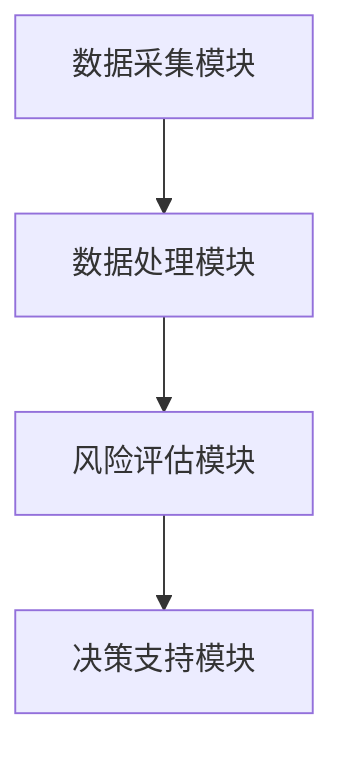
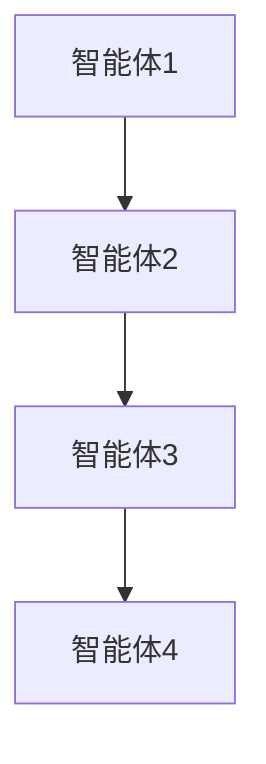

                 


# AI驱动的地缘政治风险分析：价值投资中的多智能体应用

## 关键词：
- AI驱动的地缘政治风险分析
- 多智能体系统
- 价值投资
- 地缘政治风险
- 多智能体协同学习

## 摘要：
本文探讨了AI驱动的地缘政治风险分析在价值投资中的应用，重点分析了多智能体系统在地缘政治风险评估中的优势和实现方法。通过详细的技术分析和实际案例，展示了如何利用多智能体系统来提高地缘政治风险的预测和应对能力，为价值投资者提供更精准的决策支持。

---

# 第一部分: AI驱动的地缘政治风险分析背景与概念

## 第1章: 地缘政治风险分析的概述

### 1.1 地缘政治风险分析的核心概念

#### 1.1.1 地缘政治风险的基本定义
地缘政治风险是指由于政治、经济、社会、文化等多方面因素的变化，可能对国家、地区或全球范围内的政治稳定、经济活动和国际关系产生的不确定性。这些风险可能来源于政府政策变化、国际冲突、经济波动、社会动荡等。

#### 1.1.2 地缘政治风险的分类与特征
地缘政治风险可以分为多种类型，包括：
1. **主权风险**：由于国家主权变化或政府政策变动带来的风险。
2. **政治风险**：由于政治不稳定、政策变化或政府干预带来的风险。
3. **经济风险**：由于经济波动、贸易政策变化或经济制裁带来的风险。
4. **社会风险**：由于社会动荡、民族矛盾或宗教冲突带来的风险。

#### 1.1.3 地缘政治风险分析的必要性
地缘政治风险分析是帮助投资者、企业和社会组织识别潜在风险、制定应对策略的重要工具。尤其是在全球化的背景下，地缘政治风险的分析对于跨国投资、国际商务活动和国家安全具有重要意义。

### 1.2 多智能体系统的基本概念

#### 1.2.1 多智能体系统的定义
多智能体系统（Multi-Agent System, MAS）是由多个独立但又相互协作的智能体组成的系统。这些智能体通过共享信息、协同决策和协作行动，共同完成复杂的任务。

#### 1.2.2 多智能体系统的组成与特点
多智能体系统通常由以下几部分组成：
1. **智能体**：具有感知环境、自主决策和行动的能力。
2. **环境**：智能体所处的外部环境，包括物理环境和信息环境。
3. **通信机制**：智能体之间进行信息交换的机制。
4. **协作机制**：智能体之间协同工作的规则和策略。

多智能体系统的特点包括：
1. **分布式智能**：每个智能体都具有一定的智能性和自主性。
2. **协同性**：智能体之间通过协作完成复杂的任务。
3. **动态性**：系统能够适应环境的变化和智能体的动态行为。

#### 1.2.3 多智能体系统与传统单智能体系统的区别
传统的单智能体系统通常依赖于中心化的决策机制，而多智能体系统则是去中心化的，由多个智能体共同完成任务。多智能体系统具有更强的适应性和灵活性，能够处理复杂的动态环境。

### 1.3 AI驱动的地缘政治风险分析的背景

#### 1.3.1 AI技术在地缘政治分析中的应用现状
随着AI技术的发展，地缘政治风险分析正在逐步从传统的定性分析向定量分析转变。AI技术可以帮助分析海量数据，发现潜在的模式和趋势，提高分析的准确性和效率。

#### 1.3.2 多智能体系统在地缘政治分析中的优势
多智能体系统在地缘政治分析中的优势在于其分布式计算能力和协同学习能力。多个智能体可以分别关注不同的风险因素，通过协作完成全面的风险分析。

#### 1.3.3 当前地缘政治风险分析中的技术挑战
当前地缘政治风险分析面临的主要挑战包括数据的复杂性、动态变化的环境以及多智能体系统的协同优化问题。

---

## 第2章: 多智能体系统在地缘政治风险分析中的应用价值

### 2.1 多智能体系统在地缘政治分析中的核心优势

#### 2.1.1 多智能体系统的分布式计算能力
多智能体系统可以通过分布式计算，将复杂的任务分解为多个子任务，由不同的智能体分别完成，从而提高系统的计算效率和处理能力。

#### 2.1.2 多智能体系统的协同学习能力
多智能体系统可以通过协同学习，不断优化自身的决策策略，提高系统的整体性能。智能体之间的协作可以基于强化学习、博弈论等方法。

#### 2.1.3 多智能体系统的动态适应能力
多智能体系统能够实时感知环境的变化，并通过动态调整智能体的行为策略，适应复杂多变的地缘政治环境。

### 2.2 多智能体系统在地缘政治风险分析中的具体应用

#### 2.2.1 多智能体系统在风险预警中的应用
通过多智能体系统，可以实时监控全球各地的政治、经济和社会动态，及时发现潜在的地缘政治风险，并发出预警信号。

#### 2.2.2 多智能体系统在风险评估中的应用
多智能体系统可以通过分析海量数据，评估不同风险因素的权重和影响程度，帮助投资者制定更科学的投资决策。

#### 2.2.3 多智能体系统在风险应对策略中的应用
多智能体系统可以根据不同的风险场景，制定多种应对策略，并通过协作优化，选择最优的应对方案。

### 2.3 多智能体系统在价值投资中的应用前景

#### 2.3.1 价值投资中的地缘政治风险分析需求
价值投资需要对宏观经济、行业趋势和公司基本面进行深入分析，地缘政治风险是影响投资决策的重要因素之一。

#### 2.3.2 多智能体系统在价值投资中的潜在价值
多智能体系统可以帮助投资者更全面地分析地缘政治风险，提供更精准的投资建议，降低投资风险。

#### 2.3.3 多智能体系统在价值投资中的实际案例
通过实际案例分析，展示多智能体系统在地缘政治风险分析中的具体应用，以及其对价值投资的积极影响。

---

# 第二部分: AI驱动的地缘政治风险分析的技术原理

## 第3章: 多智能体协同学习的算法原理

### 3.1 多智能体协同学习的基本原理

#### 3.1.1 多智能体系统的协同机制
多智能体系统中的协同机制包括信息共享、任务分配、决策协调等多个方面。智能体之间通过通信机制进行信息交换，通过协作机制实现任务的协同完成。

#### 3.1.2 多智能体系统的通信与协作
智能体之间的通信可以通过多种方式实现，包括直接通信和间接通信。协作机制可以基于博弈论、分布式计算等方法，确保智能体之间的协同与合作。

#### 3.1.3 多智能体系统的分布式决策
多智能体系统的分布式决策是指每个智能体根据自身感知的信息和环境状态，自主制定决策，并通过协作机制实现整体目标的优化。

### 3.2 多智能体协同学习的算法实现

#### 3.2.1 基于强化学习的多智能体协同
强化学习是一种通过智能体与环境的交互，不断优化决策策略的方法。在多智能体系统中，强化学习可以用于智能体之间的协作与竞争。

#### 3.2.2 基于博弈论的多智能体决策
博弈论是研究多个决策主体在竞争与合作中的行为规律的理论。在多智能体系统中，博弈论可以用于分析智能体之间的互动关系，制定最优决策策略。

#### 3.2.3 基于分布式计算的多智能体协作
分布式计算是多智能体系统的核心技术之一。通过分布式计算，可以实现智能体之间的信息共享、任务分配和协作决策。

### 3.3 多智能体系统在地缘政治风险分析中的数学模型

#### 3.3.1 纳什均衡的数学模型
纳什均衡是博弈论中的一个基本概念，用于描述多个决策主体在竞争与合作中的均衡状态。数学模型如下：

$$
\text{纳什均衡的条件是：对于每个智能体，其策略在给定其他智能体策略的情况下是最优的。}
$$

#### 3.3.2 多智能体协同的数学模型
多智能体协同的数学模型可以基于强化学习和博弈论的原理，通过优化目标函数来实现智能体之间的协同。

---

## 第4章: 多智能体系统在地缘政治风险分析中的系统架构设计

### 4.1 地缘政治风险分析系统的需求分析

#### 4.1.1 系统目标
系统的目标是通过多智能体协同，实现地缘政治风险的实时监控、风险评估和应对策略的制定。

#### 4.1.2 系统功能需求
系统需要具备数据采集、风险分析、预警提醒、决策支持等功能。

#### 4.1.3 系统性能需求
系统需要具备高实时性、高准确性和高可扩展性。

### 4.2 地缘政治风险分析系统的功能设计

#### 4.2.1 数据采集模块
数据采集模块负责从多种数据源（如新闻、社交媒体、政府公告等）获取地缘政治相关数据。

#### 4.2.2 数据处理模块
数据处理模块对采集到的数据进行清洗、转换和分析，提取关键特征。

#### 4.2.3 风险评估模块
风险评估模块基于多智能体协同学习算法，对地缘政治风险进行评估和预警。

#### 4.2.4 决策支持模块
决策支持模块根据风险评估结果，提供应对策略和投资建议。

### 4.3 地缘政治风险分析系统的架构设计

#### 4.3.1 系统架构图


#### 4.3.2 智能体协作机制


#### 4.3.3 系统接口设计
系统需要与外部数据源、用户界面和第三方服务进行交互。

---

## 第5章: 多智能体系统在地缘政治风险分析中的项目实战

### 5.1 项目环境配置

#### 5.1.1 系统环境
- 操作系统：Linux
- 编程语言：Python
- 开发工具：Jupyter Notebook
- 依赖库：NumPy, Pandas, Scikit-learn, TensorFlow

#### 5.1.2 数据源配置
- 数据来源：新闻网站、政府公告、社交媒体等
- 数据格式：文本、结构化数据等

### 5.2 系统核心代码实现

#### 5.2.1 数据采集模块
```python
import requests
from bs4 import BeautifulSoup

def fetch_data(url):
    response = requests.get(url)
    soup = BeautifulSoup(response.text, 'html.parser')
    return soup.text
```

#### 5.2.2 数据处理模块
```python
import pandas as pd

def process_data(text):
    df = pd.DataFrame()
    # 数据清洗和处理逻辑
    return df
```

#### 5.2.3 风险评估模块
```python
import numpy as np

def assess_risk(data):
    # 基于强化学习的多智能体协同算法
    pass
```

### 5.3 项目小结
通过项目实战，我们可以看到多智能体系统在地缘政治风险分析中的实际应用价值。通过不断地优化算法和系统架构，可以进一步提高系统的分析能力和应对策略的制定能力。

---

## 第六部分: 扩展与展望

### 6.1 当前研究的热点与前沿
当前，研究的热点包括多智能体系统的协同优化、强化学习在地缘政治分析中的应用、实时事件处理的多智能体系统设计等。

### 6.2 多智能体系统在地缘政治风险分析中的未来发展方向
未来，多智能体系统在地缘政治风险分析中的发展方向包括：
1. 结合GPT-4等大语言模型，提高文本分析能力。
2. 实现多智能体系统的实时事件处理能力。
3. 提高多智能体系统的可解释性和透明度。

### 6.3 最佳实践 tips
- 在实际应用中，需要结合具体场景，选择合适的多智能体协同算法。
- 数据的多样性和准确性是系统分析能力的关键。
- 系统的实时性和可扩展性需要通过优化算法和系统架构来实现。

---

通过以上分析，我们可以看到，AI驱动的地缘政治风险分析在价值投资中的应用前景广阔。随着技术的不断发展，多智能体系统将在地缘政治风险分析中发挥越来越重要的作用，为投资者提供更精准的决策支持。

