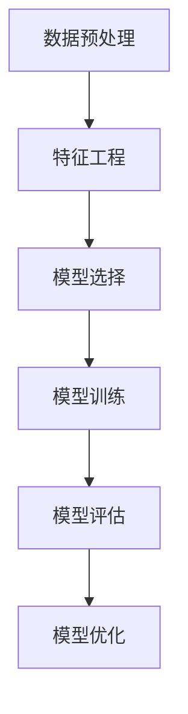
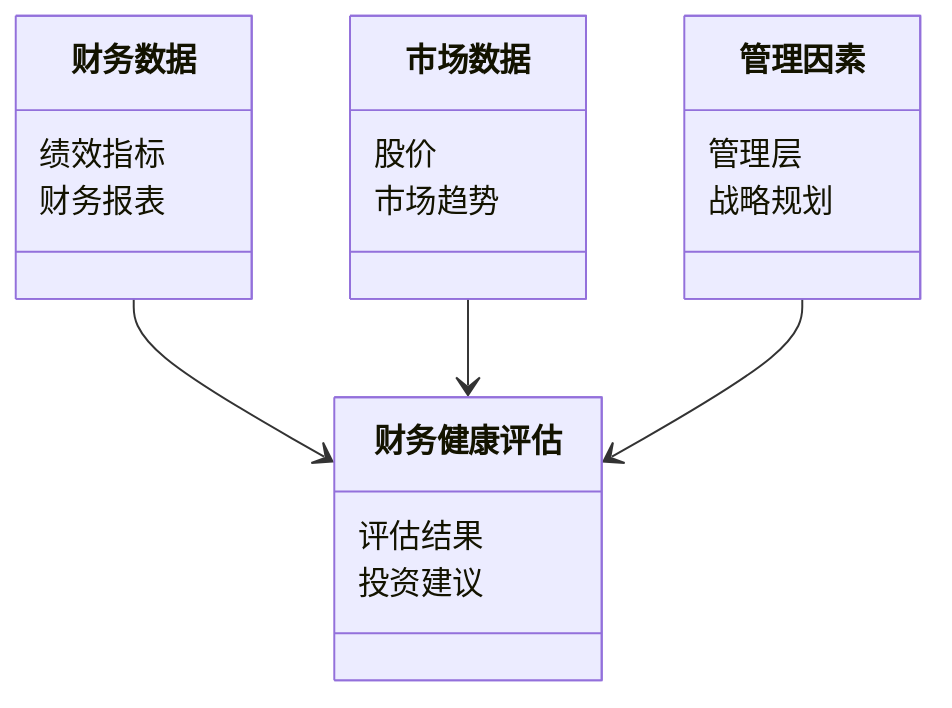

                 


# AI驱动的多维度财务健康评估：价值投资新范式

**关键词**：AI驱动、多维度财务健康评估、价值投资、新范式、技术博客

**摘要**：本文探讨了利用人工智能技术进行多维度财务健康评估的新方法，提出了一种基于AI的新型价值投资策略。文章详细分析了传统评估方法的局限性，介绍了AI驱动模型的核心概念、算法原理和系统架构，通过案例展示了如何将AI应用于实际投资中，为投资者提供了新的视角和工具。

---

# 《AI驱动的多维度财务健康评估：价值投资新范式》

## 第1章：背景介绍

### 1.1 问题背景与描述

#### 1.1.1 传统财务健康评估的局限性
传统财务健康评估方法主要依赖于财务报表分析，如利润表、资产负债表和现金流量表。这些方法虽然提供了基本的财务状况信息，但在面对复杂多变的市场环境和企业经营风险时显得力不从心。例如，传统方法难以捕捉到企业潜在的财务风险，也无法有效评估非财务因素对企业价值的影响。

#### 1.1.2 价值投资中的挑战与需求
价值投资是一种长期投资策略，强调以低于内在价值的价格购买优质资产。然而，传统的价值评估方法往往依赖于历史数据和简单财务指标，难以适应市场波动和企业复杂性。投资者需要更精准、动态的评估工具，以识别真正具有长期投资价值的企业。

#### 1.1.3 AI技术在金融领域的应用潜力
人工智能技术的快速发展为金融行业带来了新的可能性。AI能够处理海量数据，识别复杂模式，并提供实时反馈，这些能力非常适合应用于财务健康评估和价值投资领域。AI技术可以帮助投资者更全面地分析企业财务状况，发现潜在风险，并制定更科学的投资策略。

### 1.2 核心概念与问题解决

#### 1.2.1 多维度财务健康评估的定义
多维度财务健康评估是一种综合考虑企业财务、市场、行业、管理等多个维度的评估方法。它不仅关注企业的财务数据，还考虑外部市场环境和内部管理能力，从而提供更全面的企业价值评估。

#### 1.2.2 AI驱动评估的优势与目标
AI驱动的财务健康评估通过机器学习算法，能够自动提取和分析多维度数据，发现传统方法难以察觉的模式和趋势。其目标是帮助投资者更准确地评估企业价值，识别投资机会和风险。

#### 1.2.3 问题的边界与外延
AI驱动的财务健康评估不仅关注企业的财务数据，还包括市场情绪、行业趋势、管理团队等因素。其边界在于企业外部环境和内部管理的可量化数据，外延则涉及投资策略的制定和风险管理。

### 1.3 概念结构与核心要素

#### 1.3.1 财务健康评估的关键维度
- **财务数据**：利润表、资产负债表、现金流量表等。
- **市场数据**：股价、成交量、市场情绪等。
- **行业数据**：行业趋势、竞争环境等。
- **管理因素**：管理层稳定性、战略决策等。

#### 1.3.2 AI模型的核心要素
- **数据源**：多维度数据的获取与整合。
- **特征工程**：数据的预处理与特征提取。
- **模型选择**：选择合适的机器学习算法。
- **模型训练**：基于历史数据进行训练。
- **模型评估**：验证模型的准确性和稳定性。

#### 1.3.3 模型的输入输出关系
- **输入**：多维度数据，包括财务、市场、行业等数据。
- **输出**：企业财务健康评分、投资建议、风险预警等。

---

## 第2章：核心概念的原理与联系

### 2.1 AI模型的原理

#### 2.1.1 深度学习与特征提取
深度学习通过多层神经网络结构，能够自动提取数据中的高阶特征。例如，卷积神经网络（CNN）常用于图像识别，而长短时记忆网络（LSTM）则适合处理时间序列数据。

#### 2.1.2 模型训练与优化
模型训练包括数据预处理、模型选择、参数调优等步骤。优化目标是最小化预测误差，通常使用损失函数如均方误差（MSE）或交叉熵损失。

### 2.2 财务指标与数据特征

#### 2.2.1 财务指标的分类与重要性
- **盈利能力**：如净利率、ROE等。
- **偿债能力**：如资产负债率、流动比率等。
- **营运能力**：如存货周转率、应收账款周转率等。
- **成长能力**：如收入增长率、净利润增长率等。

#### 2.2.2 数据特征的工程化处理
- **数据清洗**：处理缺失值、异常值。
- **特征选择**：通过相关性分析选择重要特征。
- **特征变换**：如标准化、归一化处理。

### 2.3 ER实体关系图

```mermaid
er
    title 实体关系图
    rectangle 财务数据 {
        绩效指标
        财务报表
    }
    rectangle 市场数据 {
        股价
        市场趋势
    }
    rectangle 管理因素 {
        管理层
        战略规划
    }
    财务数据 --> 财务健康评估
    市场数据 --> 财务健康评估
    管理因素 --> 财务健康评估
```

---

## 第3章：算法原理与实现

### 3.1 算法流程



### 3.2 算法实现

#### 3.2.1 Python代码实现

```python
import pandas as pd
from sklearn.model_selection import train_test_split
from sklearn.ensemble import RandomForestClassifier
from sklearn.metrics import accuracy_score

# 加载数据
data = pd.read_csv('financial_data.csv')
X = data.drop('target', axis=1)
y = data['target']

# 数据分割
X_train, X_test, y_train, y_test = train_test_split(X, y, test_size=0.2, random_state=42)

# 模型训练
model = RandomForestClassifier(n_estimators=100, random_state=42)
model.fit(X_train, y_train)

# 模型预测
y_pred = model.predict(X_test)

# 模型评估
print(f'准确率: {accuracy_score(y_test, y_pred)}')
```

#### 3.2.2 模型调优与优化

- 调整模型参数，如n_estimators、max_depth等。
- 使用网格搜索（GridSearchCV）进行参数优化。
- 交叉验证评估模型性能。

---

## 第4章：数学模型解析

### 4.1 损失函数与优化

#### 4.1.1 损失函数的定义与公式
- 均方误差（MSE）：
  $$ \text{MSE} = \frac{1}{n}\sum_{i=1}^{n}(y_i - \hat{y_i})^2 $$
- 交叉熵损失：
  $$ \text{CE} = -\frac{1}{n}\sum_{i=1}^{n} y_i \log(\hat{y_i}) + (1 - y_i)\log(1 - \hat{y_i}) $$

#### 4.1.2 优化算法的选择与实现
- 使用随机梯度下降（SGD）或Adam优化器进行参数更新。

### 4.2 评估指标与公式

#### 4.2.1 分类指标的计算公式
- 精准率（Precision）：
  $$ \text{Precision} = \frac{\text{TP}}{\text{TP} + \text{FP}} $$
- 召回率（Recall）：
  $$ \text{Recall} = \frac{\text{TP}}{\text{TP} + \text{FN}} $$

#### 4.2.2 回归指标的计算公式
- 均方误差（MSE）：
  $$ \text{MSE} = \frac{1}{n}\sum_{i=1}^{n}(y_i - \hat{y_i})^2 $$
- R平方值（R²）：
  $$ R^2 = 1 - \frac{\text{MSE}}{\text{MSE}_{\text{base}}} $$

---

## 第5章：系统分析与架构设计

### 5.1 系统功能设计

#### 5.1.1 领域模型的构建



### 5.2 系统架构图


---

## 第6章：项目实战

### 6.1 环境配置

- **开发环境**：Python 3.8以上版本，安装必要的库如Pandas、Scikit-learn、TensorFlow等。
- **数据源**：获取财务数据、市场数据等多源数据。

#### 6.1.1 开发环境的搭建

```bash
pip install numpy pandas scikit-learn
jupyter notebook
```

---

通过以上章节，我们可以看到，AI驱动的多维度财务健康评估不仅能够提高评估的准确性，还能为投资者提供更科学的投资决策支持。未来，随着AI技术的不断进步，这种评估方法将在价值投资中发挥越来越重要的作用。

