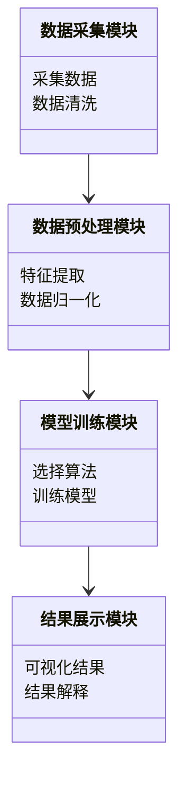

                 


# AI驱动的宏观经济预测模型

## 关键词
- 宏观经济预测
- 人工智能
- 机器学习
- 深度学习
- 时间序列分析
- 系统架构设计

## 摘要
本文深入探讨了AI驱动的宏观经济预测模型的构建与应用。首先介绍了宏观经济预测的重要性及其面临的挑战，详细分析了AI技术在其中的作用。接着从理论角度阐述了宏观经济预测的核心概念与AI模型的结合，重点讲解了线性回归、随机森林和神经网络等算法的原理及其数学模型。随后，从系统架构的角度详细设计了宏观经济预测系统的数据流、功能模块和接口设计。最后，通过具体的实战项目展示了如何利用Python代码实现宏观经济预测模型，并对实际案例进行了深入分析。本文旨在为读者提供从理论到实践的全面指导，帮助他们理解和应用AI技术在宏观经济预测中的潜力。

---

# 第1章: 宏观经济预测与AI的结合

## 1.1 宏观经济预测的背景与意义
### 1.1.1 宏观经济预测的核心概念
- 宏观经济预测是对整体经济趋势的预测，包括GDP、通货膨胀率、失业率等指标。
- 宏观经济预测对政府政策制定、企业战略规划具有重要意义。

### 1.1.2 AI技术在宏观经济预测中的作用
- AI能够处理海量数据，发现传统方法难以捕捉的复杂模式。
- AI模型可以实时更新，适应经济环境的变化。

### 1.1.3 当前宏观经济预测的挑战与机遇
- 数据量大、维度高，传统方法难以有效处理。
- 经济系统复杂，变量之间的关系难以建模。
- AI技术的进步为非线性关系建模提供了新方法。

## 1.2 AI驱动的宏观经济预测模型的定义
### 1.2.1 宏观经济预测模型的基本类型
- 线性模型：简单但对非线性关系的捕捉能力有限。
- 非线性模型：如随机森林和神经网络，能够处理复杂的经济关系。

### 1.2.2 AI在宏观经济预测中的应用场景
- 财政政策模拟：预测政策调整对经济的影响。
- 通货膨胀预测：基于历史数据预测未来通胀趋势。
- 经济周期分析：识别经济周期的波动。

### 1.2.3 宏观经济预测模型的评价指标
- �均方误差（MSE）
- R平方值（R²）
- 模型的泛化能力

## 1.3 本章小结
本章介绍了宏观经济预测的重要性，分析了AI技术在其中的应用潜力，并提出了AI驱动的宏观经济预测模型的基本概念和评价指标。

---

# 第2章: 宏观经济预测的核心概念与联系

## 2.1 宏观经济预测的核心要素
### 2.1.1 宏观经济指标的分类
- 国内生产总值（GDP）
- 失业率
- 消费者价格指数（CPI）
- 利率

### 2.1.2 数据来源与特征分析
- 数据来源：政府统计机构、金融市场数据、学术研究数据。
- 数据特征：时间序列性、多维性、复杂性。

### 2.1.3 宏观经济预测的边界与外延
- 预测的范围：短期预测与长期预测。
- 数据的限制：数据的质量、完整性和及时性。

## 2.2 AI模型的核心原理
### 2.2.1 机器学习与深度学习的对比
- 机器学习：基于特征工程，适合结构化数据。
- 深度学习：基于特征提取，适合非结构化数据。

### 2.2.2 神经网络的基本结构
- 输入层、隐藏层、输出层。
- 神经元之间的连接权重和激活函数。

### 2.2.3 时间序列分析的原理
- 时间序列的平稳性：通过差分等方法实现。
- ARIMA模型：自回归积分滑动平均模型。

## 2.3 宏观经济预测模型与AI模型的结合
### 2.3.1 数据流与模型输入的关系
- 数据预处理：清洗、归一化、特征提取。
- 模型输入：将数据转化为模型可接受的形式。

### 2.3.2 模型输出与实际预测值的关联
- 模型输出：预测值的范围和意义。
- 结果解释：将模型输出转化为实际经济指标的预测。

### 2.3.3 模型训练与优化的流程
- 数据分割：训练集、验证集、测试集。
- 模型训练：优化目标函数和损失函数。
- 模型调优：超参数优化。

## 2.4 本章小结
本章详细分析了宏观经济预测的核心要素，对比了机器学习和深度学习的原理，并探讨了AI模型在宏观经济预测中的应用流程。

---

# 第3章: 宏观经济预测模型的算法原理

## 3.1 常见的宏观经济预测算法
### 3.1.1 线性回归模型
- 简单线性回归：$y = \beta_0 + \beta_1x + \epsilon$。
- 多元线性回归：$y = \beta_0 + \beta_1x_1 + \beta_2x_2 + ... + \beta_nx_n + \epsilon$。

### 3.1.2 随机森林模型
- 集成学习：通过投票或平均值进行预测。
- 抗过拟合能力强，适合高维数据。

### 3.1.3 神经网络模型
- 多层感知机（MLP）：用于处理复杂非线性关系。
- 长短期记忆网络（LSTM）：适合时间序列预测。

## 3.2 算法原理的数学模型
### 3.2.1 线性回归的公式推导
$$ y = \beta_0 + \beta_1x + \epsilon $$

### 3.2.2 随机森林的集成学习原理
- 基于决策树的Bagging方法。
- 模型预测结果通过投票或平均得到。

### 3.2.3 神经网络的前向传播过程
$$ a^{(l+1)} = \sigma(w^{(l)}a^{(l)} + b^{(l)}) $$

## 3.3 算法流程图


## 3.4 本章小结
本章详细介绍了几种常用的宏观经济预测算法，包括线性回归、随机森林和神经网络，并通过公式和流程图解释了它们的工作原理。

---

# 第4章: 宏观经济预测系统的架构设计

## 4.1 系统功能设计
### 4.1.1 数据采集模块
- 数据来源：政府统计机构、金融市场、学术研究。
- 数据格式：结构化数据和非结构化数据。

### 4.1.2 数据预处理模块
- 数据清洗：处理缺失值、异常值。
- 特征提取：将数据转化为模型可接受的形式。

### 4.1.3 模型训练模块
- 模型选择：根据数据特点选择合适的算法。
- 模型训练：优化目标函数和损失函数。

### 4.1.4 结果展示模块
- 可视化展示：将预测结果以图表形式呈现。
- 结果解释：将模型输出转化为实际经济指标的预测。

## 4.2 系统架构设计
### 4.2.1 数据流与模块划分


### 4.2.2 系统功能模块的类图


## 4.3 本章小结
本章从系统架构的角度详细设计了宏观经济预测系统的功能模块和数据流，为实际开发提供了参考。

---

# 第5章: 宏观经济预测系统的项目实战

## 5.1 环境配置
- Python版本：Python 3.8+
- 开发工具：Jupyter Notebook
- 依赖库：NumPy、Pandas、Scikit-learn、Keras、TensorFlow

## 5.2 系统核心实现源代码
### 5.2.1 数据预处理代码
```python
import pandas as pd
import numpy as np

# 数据加载
data = pd.read_csv('macroeconomic.csv')

# 数据清洗
data.dropna(inplace=True)
data = data[~data.isin([np.nan, np.inf, -np.inf]).any(axis=1)]
```

### 5.2.2 线性回归模型实现
```python
from sklearn.linear_model import LinearRegression
from sklearn.metrics import mean_squared_error

# 模型训练
model = LinearRegression()
model.fit(X_train, y_train)

# 模型预测
y_pred = model.predict(X_test)

# 模型评估
mse = mean_squared_error(y_test, y_pred)
print(f'均方误差：{mse}')
```

### 5.2.3 神经网络模型实现
```python
from keras.models import Sequential
from keras.layers import Dense

# 模型构建
model = Sequential()
model.add(Dense(64, activation='relu', input_dim=X_train.shape[1]))
model.add(Dense(1))
model.compile(optimizer='adam', loss='mean_squared_error')

# 模型训练
model.fit(X_train, y_train, epochs=100, batch_size=32)
```

## 5.3 代码应用解读与分析
### 5.3.1 线性回归模型解读
- 输入数据：特征矩阵X。
- 输出数据：预测值y_pred。
- 模型评估：均方误差（MSE）和决定系数（R²）。

### 5.3.2 神经网络模型解读
- 网络结构：输入层、隐藏层、输出层。
- 激活函数：ReLU和线性激活函数。
- 损失函数：均方误差（MSE）。
- 优化器：Adam优化器。

## 5.4 实际案例分析
### 5.4.1 数据来源与处理
- 数据集：宏观经济指标，如GDP、CPI、失业率等。
- 数据预处理：清洗、归一化、特征选择。

### 5.4.2 模型训练与结果分析
- 训练数据：训练集、验证集。
- 测试数据：测试集。
- 模型性能：预测准确率、误差分析。

## 5.5 本章小结
本章通过具体的实战项目展示了如何利用Python代码实现宏观经济预测模型，包括数据预处理、模型训练和结果分析。

---

# 第6章: 宏观经济预测系统的高级主题

## 6.1 集成学习与时间序列分析
### 6.1.1 集成学习的应用
- 使用随机森林和梯度提升机（GBM）进行集成预测。
- 模型融合：投票法和加权法。

### 6.1.2 时间序列分析的高级方法
- SARIMA模型：季节性ARIMA模型。
- LSTM网络：处理时间序列的长期依赖关系。

## 6.2 实际案例分析
### 6.2.1 GDP预测
- 数据来源：国家统计局。
- 数据预处理：季度数据、年度数据。
- 模型选择：线性回归、随机森林、LSTM。

### 6.2.2 通货膨胀预测
- 数据来源：CPI数据。
- 数据预处理：季节性调整。
- 模型选择：ARIMA、LSTM。

## 6.3 本章小结
本章探讨了宏观经济预测中的高级主题，包括集成学习和时间序列分析，并通过实际案例分析了它们的应用。

---

# 第7章: 宏观经济预测系统的总结与展望

## 7.1 本章总结
- 宏观经济预测的重要性：政策制定、企业规划。
- AI技术的优势：数据处理能力、模型复杂性。
- 系统架构设计：模块化设计、数据流优化。

## 7.2 未来展望
- 多模态数据的融合：文本数据、图像数据。
- 新兴技术的应用：强化学习、图神经网络。
- 可解释性与透明性：提升模型的可解释性，增强用户信任。

## 7.3 最佳实践 tips
- 数据预处理：清洗、归一化、特征选择。
- 模型选择：根据数据特点选择合适的算法。
- 模型评估：均方误差、R²、MAE（平均绝对误差）。

## 7.4 本章小结
本章总结了全文的主要内容，并展望了未来的研究方向和应用前景。

---

# 结语

本文系统地介绍了AI驱动的宏观经济预测模型的构建与应用，从理论到实践，为读者提供了全面的指导。通过具体的实战项目和案例分析，展示了AI技术在宏观经济预测中的巨大潜力。未来，随着AI技术的不断发展，宏观经济预测模型将更加智能化和精准化，为经济决策提供更有力的支持。

