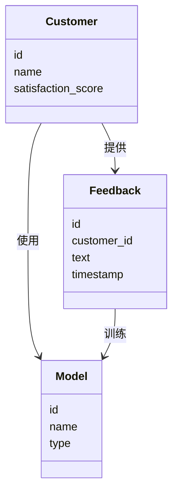

                 


# AI驱动的客户满意度分析：预测公司的长期成功

> 关键词：客户满意度分析，人工智能，机器学习，深度学习，预测模型

> 摘要：本文深入探讨了如何利用人工智能技术进行客户满意度分析，预测公司的长期成功。通过系统化的分析和实践案例，展示了AI在客户满意度预测中的强大能力，为企业提供数据驱动的决策支持。

---

# 第一部分: AI驱动的客户满意度分析基础

# 第1章: 客户满意度分析概述

## 1.1 客户满意度分析的定义与重要性

### 1.1.1 客户满意度的定义

客户满意度是指客户对公司产品或服务的满意程度。它是通过客户反馈、行为数据和情感分析等多种方式综合评估的结果，反映了客户对公司整体体验的感知。

$$
\text{客户满意度} = f(\text{客户反馈}, \text{行为数据}, \text{情感分析})
$$

### 1.1.2 客户满意度分析的重要性

客户满意度分析是企业提升客户忠诚度和市场竞争力的重要工具。通过分析客户满意度，企业可以识别客户痛点，优化产品和服务，降低客户流失率，提高客户留存率和满意度。

### 1.1.3 客户满意度与公司长期成功的关联

客户满意度与公司长期成功密切相关。高满意度的客户更可能成为忠诚客户，为企业带来持续的收入和口碑传播。通过AI技术，企业可以实时监控客户满意度，预测客户行为，提前采取措施应对潜在问题。

## 1.2 AI在客户满意度分析中的作用

### 1.2.1 AI技术的基本概念

人工智能（AI）是指模拟人类智能的计算机系统，能够执行学习、推理、感知和决策等任务。AI技术包括机器学习、自然语言处理、计算机视觉等，广泛应用于数据分析和预测。

### 1.2.2 AI在客户满意度分析中的优势

AI技术能够高效处理海量数据，提取关键特征，建立预测模型，帮助企业准确预测客户满意度。AI的优势包括自动化处理、高精度分析和实时监控。

### 1.2.3 AI驱动的客户满意度分析的未来趋势

随着AI技术的不断发展，客户满意度分析将更加智能化和个性化。未来的AI系统将能够实时分析客户的反馈，动态调整预测模型，提供更加精准的预测结果。

## 1.3 本书的核心目标与结构

### 1.3.1 本书的核心目标

本书旨在通过系统化的分析和实践案例，帮助读者掌握AI驱动的客户满意度分析的方法和技术，提升企业的客户满意度和长期盈利能力。

### 1.3.2 本书的主要内容与结构

- 第一部分：客户满意度分析概述
- 第二部分：AI算法原理
- 第三部分：系统架构设计
- 第四部分：项目实战
- 第五部分：总结与展望

### 1.3.3 本书的读者群体

本书适合企业管理人员、数据科学家、AI工程师以及对客户满意度分析感兴趣的学生和研究人员阅读。

---

# 第2章: 客户满意度分析的核心概念

## 2.1 客户满意度分析的背景与问题

### 2.1.1 客户满意度分析的背景

在现代商业环境中，客户满意度是企业成功的关键因素之一。随着市场竞争的加剧，企业需要通过客户满意度分析来优化产品和服务，提升客户忠诚度。

### 2.1.2 客户满意度分析中的主要问题

客户满意度分析面临数据多样性、数据质量和模型选择等挑战。企业需要处理文本、评分和行为数据，构建高效的预测模型。

### 2.1.3 问题的边界与外延

客户满意度分析的边界包括数据范围、模型适用性和预测准确性。外延则涉及客户细分、个性化服务和实时监控。

## 2.2 核心概念与联系

### 2.2.1 客户满意度分析的核心概念

客户满意度分析的核心概念包括数据预处理、特征提取、模型训练和结果解释。这些概念相互关联，共同构成了完整的分析流程。

### 2.2.2 核心概念的属性特征对比

以下是核心概念的属性特征对比表：

```mermaid
| 概念         | 数据类型 | 数据量 | 时间复杂度 |
|--------------|----------|--------|------------|
| 数据预处理   | 结构化   | 大量    | 中等        |
| 特征提取     | 特征向量 | 中等    | 高          |
| 模型训练     | 模型参数 | 小型    | 高          |
| 结果解释     | 解释文本 | 小型    | 中等        |
```

### 2.2.3 ER实体关系图

以下是一个简单的ER实体关系图，展示了客户、反馈和模型之间的关系：

```mermaid
erd
  table Customer {
    id
    name
    satisfaction_score
  }
  table Feedback {
    id
    customer_id
    text
    timestamp
  }
  table Model {
    id
    name
    type
  }
  Customer --> Feedback: 提供
  Customer --> Model: 使用
  Feedback --> Model: 训练
```

---

# 第3章: AI算法原理

## 3.1 机器学习算法

### 3.1.1 逻辑回归

逻辑回归是一种常用的分类算法，适用于二分类问题。其数学模型如下：

$$
P(y=1|x) = \frac{1}{1 + e^{-\beta x}}
$$

### 3.1.2 随机森林

随机森林是一种基于决策树的集成算法，具有高精度和良好的泛化能力。其核心思想是通过随机采样构建多棵决策树，并取平均结果。

### 3.1.3 算法选择与比较

以下是几种常用算法的比较表：

```mermaid
| 算法名称 | 优点                     | 缺点                     |
|----------|--------------------------|--------------------------|
| 逻辑回归 | 简单，适合线性问题       | 非线性问题表现较差       |
| 随机森林 | 高精度，抗过拟合         | 计算复杂度高             |
| LSTM     | 适合序列数据             | 需要大量数据和计算资源   |
```

---

# 第4章: 系统架构设计

## 4.1 系统功能设计

### 4.1.1 领域模型

以下是一个领域模型的类图：



### 4.1.2 系统架构设计

以下是一个系统架构的分层架构图：


---

# 第5章: 项目实战

## 5.1 环境安装

### 5.1.1 安装Python环境

使用Anaconda安装Python 3.8及以上版本。

### 5.1.2 安装必要的库

安装numpy、pandas、scikit-learn和keras等库：

```bash
pip install numpy pandas scikit-learn keras
```

## 5.2 系统核心实现源代码

### 5.2.1 数据预处理

```python
import pandas as pd

data = pd.read_csv('customer_feedback.csv')
data.dropna(inplace=True)
```

### 5.2.2 特征提取

```python
from sklearn.feature_extraction.text import TfidfVectorizer

vectorizer = TfidfVectorizer()
X = vectorizer.fit_transform(data['text'])
```

### 5.2.3 模型训练

```python
from sklearn.linear_model import LogisticRegression

model = LogisticRegression()
model.fit(X, data['satisfaction_score'])
```

### 5.2.4 模型评估

```python
from sklearn.metrics import accuracy_score

y_pred = model.predict(X_test)
print(accuracy_score(y_test, y_pred))
```

---

# 第6章: 总结与展望

## 6.1 最佳实践 tips

- 数据预处理是关键，确保数据质量和完整性。
- 特征提取应根据具体问题选择合适的方法。
- 模型选择应综合考虑精度、计算复杂度和适用场景。

## 6.2 小结

通过AI技术，企业可以高效地分析客户满意度，预测长期成功。本文详细介绍了核心概念、算法原理和系统架构，并通过案例展示了实际应用。

## 6.3 注意事项

- 数据隐私和安全需严格保护。
- 模型需定期更新以适应数据变化。
- 结果需结合业务背景进行解释。

## 6.4 拓展阅读

- 《机器学习实战》
- 《深度学习入门：基于Python和Keras》
- 《自然语言处理入门》

---

通过以上章节的内容，读者可以系统地掌握AI驱动的客户满意度分析的方法和技术，为企业提升客户满意度和长期成功提供有力支持。

