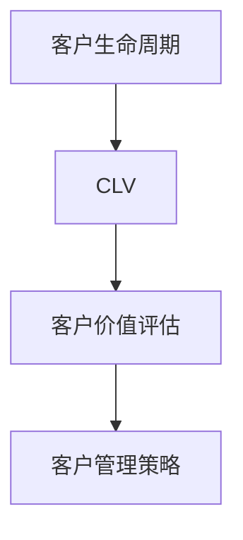
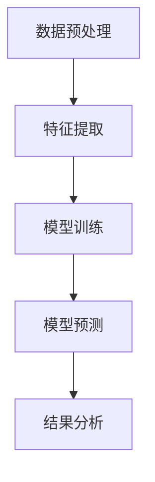
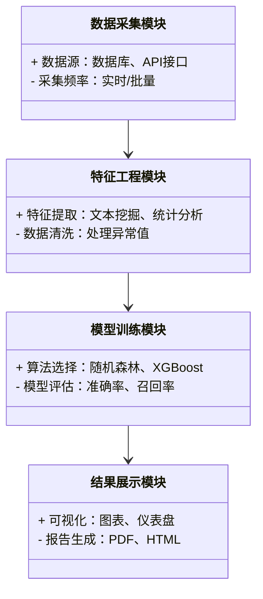

                 


# AI驱动的客户终身价值分析：深入理解公司的收入质量

---

## 关键词  
客户终身价值（CLV）、AI驱动、收入质量分析、数据驱动决策、人工智能、客户价值评估

---

## 摘要  
客户终身价值（CLV）是衡量客户对公司长期贡献的重要指标，AI驱动的分析方法能够帮助企业更精准地预测和优化客户价值。本文从CLV的核心概念出发，结合AI技术，详细探讨如何通过数据分析和模型构建，深入理解公司的收入质量，优化客户管理策略，提升企业盈利能力。

---

## 第一章：客户终身价值（CLV）概述  

### 1.1 CLV的核心概念与重要性  
客户终身价值（CLV）是指客户在其生命周期内为企业带来的总收入减去相关成本的净现值。它是企业制定客户管理策略的重要依据。  

#### 1.1.1 CLV的基本概念  
- 客户生命周期的四个阶段：获取阶段、成长阶段、成熟阶段、衰退阶段。  
- CLV = ∑(未来现金流) × 现金流贴现率  

#### 1.1.2 CLV的重要性  
- 帮助企业识别高价值客户，优化资源分配。  
- 提供数据支持，制定精准的客户营销策略。  

#### 1.1.3 AI在CLV分析中的作用  
- AI技术能够处理海量数据，快速构建预测模型。  
- 通过机器学习算法，实时更新客户价值评估。  

### 1.2 CLV与客户生命周期的关系  
- CLV的计算依赖于客户在生命周期中的表现。  
- 不同阶段的客户价值差异显著，企业需要针对性地制定策略。  

#### 图1-1：客户生命周期与CLV的关系  


---

## 第二章：AI驱动的CLV分析核心概念  

### 2.1 数据驱动的CLV分析  
- 数据收集与处理：包括交易数据、客户属性、行为数据等。  
- 特征提取：如购买频率、客单价、客户留存率等。  
- 数据预处理：处理缺失值、异常值，归一化处理。  

#### 表2-1：CLV分析的关键特征对比  
| 特征类型 | 特征描述 | 示例 |
|----------|----------|------|
| 客户属性 | 年龄、性别、地理位置 | 地区分布 |
| 行为特征 | 购买频率、访问时长 | 高频用户 |
| 交易特征 | 客单价、退货率 | 高价值客户 |

### 2.2 AI算法在CLV分析中的应用  
- 常见算法：线性回归、随机森林、XGBoost、神经网络。  
- 算法选择：根据数据类型和业务需求选择合适的模型。  

#### 图2-1：AI驱动的CLV分析流程图  


### 2.3 系统架构设计  
- 系统功能模块：数据采集、特征工程、模型训练、结果展示。  
- 架构设计：基于微服务架构，支持高并发和实时分析。  

#### 图2-2：系统架构类图  


---

## 第三章：CLV分析的数学模型与算法原理  

### 3.1 CLV的数学模型  
- **基于概率的CLV模型**：  
  $$ CLV = \sum_{t=1}^{\infty} \frac{\text{未来现金流}}{(1 + r)^t} $$  
  其中，$r$为贴现率。  
- **基于回归的CLV模型**：  
  $$ \ln(CLV) = \beta_0 + \beta_1x_1 + \beta_2x_2 + \epsilon $$  

### 3.2 算法流程图  


### 3.3 Python代码实现  
```python
import pandas as pd
import numpy as np
from sklearn.ensemble import RandomForestRegressor
from sklearn.metrics import mean_absolute_error

# 数据加载
data = pd.read_csv('customer_data.csv')

# 特征工程
X = data[['revenue', 'cost', 'purchase_frequency']]
y = data['CLV']

# 数据分割
X_train, X_test, y_train, y_test = train_test_split(X, y, test_size=0.2, random_state=42)

# 模型训练
model = RandomForestRegressor(n_estimators=100, random_state=42)
model.fit(X_train, y_train)

# 模型预测
y_pred = model.predict(X_test)

# 模型评估
print(mean_absolute_error(y_test, y_pred))
```

---

## 第四章：系统分析与架构设计方案  

### 4.1 项目背景与目标  
- 项目背景：企业希望通过AI技术优化客户管理，提升收入质量。  
- 项目目标：构建一个实时、高效的CLV分析系统。  

### 4.2 系统功能设计  
- **功能模块**：  
  - 数据采集模块：实时采集客户数据。  
  - 特征工程模块：提取关键特征。  
  - 模型训练模块：构建预测模型。  
  - 结果展示模块：可视化分析结果。  

#### 图4-1：系统功能模块类图  


---

## 第五章：项目实战：电商行业CLV分析  

### 5.1 环境安装与数据加载  
- 环境：Python 3.8、Jupyter Notebook、Pandas、Scikit-learn。  
- 数据加载：使用电商客户数据集。  

### 5.2 核心代码实现  
```python
import pandas as pd
import numpy as np
from sklearn.ensemble import RandomForestRegressor
from sklearn.metrics import mean_absolute_error
from sklearn.model_selection import train_test_split

# 数据加载
data = pd.read_csv('customer_data.csv')

# 特征工程
X = data[['revenue', 'cost', 'purchase_frequency']]
y = data['CLV']

# 数据分割
X_train, X_test, y_train, y_test = train_test_split(X, y, test_size=0.2, random_state=42)

# 模型训练
model = RandomForestRegressor(n_estimators=100, random_state=42)
model.fit(X_train, y_train)

# 模型预测
y_pred = model.predict(X_test)

# 模型评估
print(mean_absolute_error(y_test, y_pred))
```

### 5.3 实际案例分析  
- 案例分析：通过模型预测高价值客户，制定精准营销策略。  
- 结果展示：生成可视化报告，指导业务决策。  

### 5.4 项目总结与优化建议  
- 项目总结：通过AI技术提升CLV分析的效率和准确性。  
- 优化建议：优化模型参数，引入实时数据流处理。  

---

## 第六章：AI驱动CLV分析的优化策略与未来展望  

### 6.1 数据质量优化  
- 数据清洗：减少缺失值和异常值的影响。  
- 数据增强：引入更多维度的特征数据。  

### 6.2 模型优化策略  
- 算法优化：尝试其他机器学习算法，如XGBoost、神经网络。  
- 模型调优：通过网格搜索优化模型参数。  

### 6.3 客户行为预测  
- 预测客户流失风险，提前制定挽留策略。  
- 预测客户购买行为，优化营销活动。  

### 6.4 未来展望  
- 技术趋势：深度学习在CLV分析中的应用前景。  
- 商业价值：AI驱动的CLV分析将推动企业收入质量的全面提升。  

---

## 附录：数据预处理与模型调优  

### 附录A：数据预处理代码示例  
```python
import pandas as pd
import numpy as np

data = pd.read_csv('customer_data.csv')

# 处理缺失值
data['revenue'].fillna(data['revenue'].mean(), inplace=True)

# 处理异常值
data['purchase_frequency'] = np.clip(data['purchase_frequency'], data['purchase_frequency'].quantile(0.05), data['purchase_frequency'].quantile(0.95))
```

### 附录B：模型调优代码示例  
```python
from sklearn.model_selection import GridSearchCV

param_grid = {
    'n_estimators': [100, 200],
    'max_depth': [None, 10, 20],
    'min_samples_split': [2, 5]
}

grid_search = GridSearchCV(RandomForestRegressor(), param_grid, cv=5)
grid_search.fit(X_train, y_train)
print(grid_search.best_params_)
```

### 附录C：结果可视化代码示例  
```python
import matplotlib.pyplot as plt

plt.scatter(y_test, y_pred)
plt.xlabel('Actual CLV')
plt.ylabel('Predicted CLV')
plt.title('CLV Actual vs Predicted')
plt.show()
```

---

## 结语  
通过AI驱动的客户终身价值分析，企业能够更精准地理解收入质量，优化客户管理策略，提升盈利能力。未来，随着技术的不断进步，AI在CLV分析中的应用将更加广泛和深入。

--- 

**全文完**

