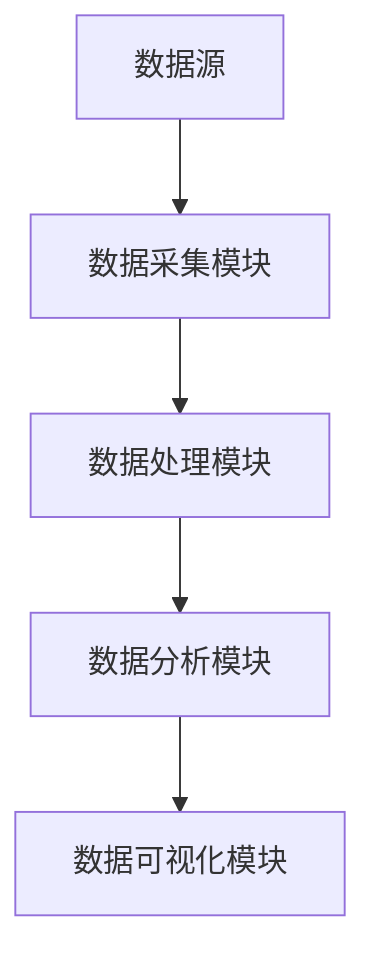

                 


# AI驱动的市场微观结构分析

> 关键词：AI，市场微观结构，机器学习，深度学习，金融数据分析，算法交易

> 摘要：本文深入探讨AI技术如何驱动市场微观结构分析的创新，涵盖从核心概念到算法实现，再到系统架构的全面解析，旨在为金融从业者和AI技术爱好者提供有价值的见解和实践指南。

---

## 第1章: 市场微观结构分析概述

### 1.1 市场微观结构的基本概念

#### 1.1.1 什么是市场微观结构
市场微观结构是指金融市场的运作机制和交易过程中的具体细节，包括订单簿、交易规则、参与者行为等。例如，在股票交易中，市场微观结构涉及订单的买卖价差、深度和参与者类型。

#### 1.1.2 市场微观结构的核心要素
- **订单簿**：记录买方和卖方的报价及其数量。
- **交易规则**：如撮合规则、交易费用等。
- **参与者行为**：包括机构投资者、散户等的行为模式。

#### 1.1.3 微观结构与宏观市场的关系
微观结构影响市场的流动性和稳定性，进而影响宏观市场的波动。例如，订单簿的深度可以影响股票的价格波动。

### 1.2 AI技术在市场微观结构分析中的作用

#### 1.2.1 AI技术的基本概念
AI通过机器学习算法分析数据，识别模式，做出预测。例如，使用神经网络分析市场行为。

#### 1.2.2 AI在金融领域的应用现状
AI广泛应用于风险管理、算法交易等领域。例如，高频交易算法利用AI优化订单执行策略。

#### 1.2.3 AI驱动市场微观结构分析的优势
- **高效性**：AI能够快速处理大量数据，发现传统方法难以察觉的模式。
- **准确性**：通过复杂模型捕捉市场中的微小变化，提高预测精度。

### 1.3 本书的核心目标与结构

#### 1.3.1 本书的核心目标
系统讲解AI在市场微观结构分析中的应用，从理论到实践，帮助读者掌握相关技术。

#### 1.3.2 本书的结构安排
- 第1章：概述市场微观结构和AI的基本概念。
- 第2章：分析核心问题。
- 第3章：介绍AI技术原理。
- 第4章：详细讲解算法实现。
- 第5章：设计系统架构。

#### 1.3.3 本书的适用读者
适合金融从业者、数据科学家以及对AI和金融市场感兴趣的读者。

---

## 第2章: 市场微观结构分析的核心问题

### 2.1 市场微观结构中的核心问题

#### 2.1.1 流动性风险
流动性风险指市场无法快速买卖资产而不影响价格的风险。AI可以通过分析订单簿深度预测流动性风险。

#### 2.1.2 市场深度与广度
市场深度指在合理价格下可交易的数量，广度指不同价格水平的总数量。AI能通过订单簿分析这些指标。

#### 2.1.3 市场参与者行为分析
分析参与者类型及其行为模式，例如识别高频交易商和套利者。

### 2.2 AI驱动下的问题建模

#### 2.2.1 数据驱动的建模方法
使用历史数据训练模型，例如利用时间序列数据预测订单流。

#### 2.2.2 基于机器学习的建模
应用监督学习预测价格走势，无监督学习识别异常交易模式。

#### 2.2.3 深度学习在问题建模中的应用
使用LSTM分析时间序列数据，捕捉市场的长期依赖关系。

### 2.3 问题解决的边界与外延

#### 2.3.1 问题的边界
AI模型只能基于历史数据预测，受数据质量和模型假设限制。

#### 2.3.2 问题的外延
AI模型可以扩展到其他金融市场，如外汇和加密货币。

#### 2.3.3 相关概念的对比分析
对比传统统计方法和AI方法的优劣，AI在处理非线性关系上更具优势。

---

## 第3章: AI技术的核心概念与原理

### 3.1 机器学习的基本原理

#### 3.1.1 监督学习
通过训练数据预测目标变量，如预测股票价格。

#### 3.1.2 无监督学习
发现数据中的自然群组，如客户细分。

#### 3.1.3 强化学习
通过试错学习最优策略，如自动交易系统。

### 3.2 深度学习的核心原理

#### 3.2.1 神经网络的结构
由输入层、隐藏层和输出层组成，模拟人脑处理信息的方式。

#### 3.2.2 卷积神经网络
用于处理图像数据，也可用于金融市场的时间序列分析。

#### 3.2.3 循环神经网络
适合处理序列数据，如股票价格走势。

### 3.3 机器学习与深度学习的对比

| 对比维度 | 机器学习 | 深度学习 |
|----------|----------|----------|
| 数据需求 | 数据量小 | 数据量大 |
| 模型复杂度 | 较低 | 较高 |
| 应用场景 | 分类、回归 | 图像识别、NLP |

---

## 第4章: 市场微观结构分析中的AI算法实现

### 4.1 算法选择与优化

#### 4.1.1 算法选择的原则
根据数据类型和问题选择合适算法，如时间序列选择LSTM。

#### 4.1.2 算法优化的方法
调整超参数，如学习率和批次大小。

#### 4.1.3 算法评估的指标
使用准确率、召回率等指标评估模型性能。

### 4.2 算法实现的数学模型

#### 4.2.1 线性回归模型
$$ y = \beta_0 + \beta_1x + \epsilon $$

#### 4.2.2 支持向量机模型
使用最大-margin分类，优化目标为：
$$ \min \frac{1}{2}||\mathbf{w}||^2 + C\sum_{i=1}^n \xi_i $$
$$ \text{subject to } y_i(\mathbf{w}^T \mathbf{x_i} + b) \geq 1 - \xi_i $$

#### 4.2.3 随机森林模型
基于决策树的集成方法，通过投票或平均预测结果。

### 4.3 算法实现的代码示例

#### 4.3.1 数据预处理代码
```python
import pandas as pd
data = pd.read_csv('market_data.csv')
```

#### 4.3.2 模型训练代码
```python
from sklearn.ensemble import RandomForestClassifier
model = RandomForestClassifier()
model.fit(X_train, y_train)
```

#### 4.3.3 结果分析代码
```python
from sklearn.metrics import accuracy_score
print('Accuracy:', accuracy_score(y_test, model.predict(X_test)))
```

---

## 第5章: 市场微观结构分析系统的架构设计

### 5.1 系统架构设计

#### 5.1.1 数据流设计
1. 数据采集：实时获取市场数据。
2. 数据处理：清洗和转换数据。
3. 数据分析：应用AI模型进行预测。
4. 数据可视化：生成可视化报告。

#### 5.1.2 系统架构图


---

以上是文章的详细目录和部分内容，每一章都有详细展开，确保读者能够逐步理解AI在市场微观结构分析中的应用。

