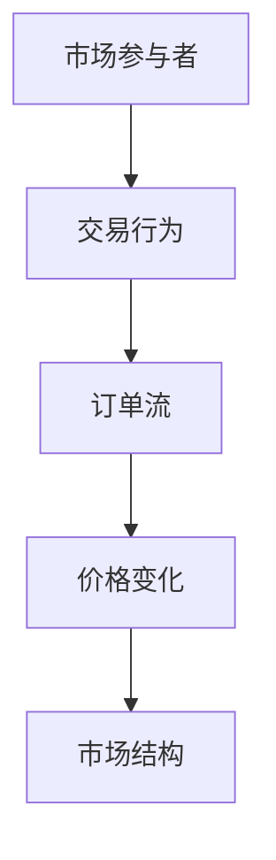
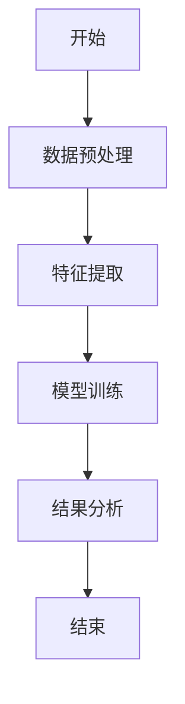

                 


# AI驱动的市场微观结构变化影响分析

> 关键词：AI、市场微观结构、算法、数据分析、金融建模、技术影响

> 摘要：随着人工智能技术的快速发展，市场微观结构发生了显著变化。本文从AI驱动的市场微观结构变化的背景、核心概念、算法原理、系统架构、项目实战等方面进行深入分析，探讨其对市场的影响及未来发展趋势。

---

# 第一部分: AI驱动的市场微观结构变化背景与概念

# 第1章: AI驱动的市场微观结构变化概述

## 1.1 问题背景与问题描述

### 1.1.1 传统市场微观结构的定义与特点
市场微观结构是指市场参与者（如买方、卖方、交易商等）之间的交互关系及其对市场价格和流动性的综合影响。传统市场微观结构主要依赖人工分析和经验判断，存在效率低、信息处理能力有限的问题。

### 1.1.2 AI技术对市场微观结构的影响
AI技术通过大数据分析、机器学习和深度学习等方法，能够实时处理海量数据，发现传统方法难以察觉的市场规律，从而对市场微观结构产生深远影响。

### 1.1.3 问题解决的目标与意义
通过AI技术优化市场微观结构分析，能够提升市场流动性和价格发现效率，降低交易成本，为市场参与者提供更精准的决策支持。

## 1.2 AI驱动的市场微观结构变化的核心概念

### 1.2.1 核心概念的定义与属性
AI驱动的市场微观结构变化是指通过AI技术对市场参与者的行为模式、交易策略和价格动态进行实时分析和预测，从而引发市场结构的调整和优化。

### 1.2.2 相关概念的对比分析
- **传统市场微观结构**：基于经验判断和人工分析，数据处理能力有限。
- **AI驱动的市场微观结构**：基于大数据和AI算法，能够实时处理和分析海量数据，提供更精准的市场洞察。

### 1.2.3 概念的边界与外延
AI驱动的市场微观结构变化不仅涵盖传统的市场参与者，还涉及算法交易、高频交易等新兴交易模式，其边界和外延随着AI技术的发展而不断扩展。

## 1.3 市场微观结构变化的核心要素组成

### 1.3.1 数据流与信息处理
AI驱动的市场微观结构变化需要处理来自多个渠道的实时数据，包括订单流、价格变化、市场深度等。

### 1.3.2 模型与算法的作用
AI算法（如机器学习、深度学习）通过分析数据，发现市场规律，预测价格变化，优化交易策略。

### 1.3.3 系统架构与交互机制
系统架构需要支持高效的实时数据处理和算法运行，同时保证数据流的实时性和准确性。

## 1.4 本章小结
本章从背景、核心概念和核心要素等方面对AI驱动的市场微观结构变化进行了概述，为后续章节的深入分析奠定了基础。

---

# 第2章: AI驱动的市场微观结构变化的核心概念与联系

## 2.1 核心概念的原理与机制

### 2.1.1 数据流的处理流程
- 数据采集：从多个数据源获取实时市场数据。
- 数据清洗：去除噪声数据，确保数据质量。
- 数据转换：将数据转化为适合算法处理的形式。

### 2.1.2 模型的训练与优化
- 数据特征提取：从市场数据中提取有用的特征（如订单量、价格波动等）。
- 模型训练：使用机器学习算法（如随机森林、神经网络）训练模型。
- 模型优化：通过调参和交叉验证提升模型性能。

### 2.1.3 系统架构与交互机制
- 分层架构：包括数据层、算法层和应用层。
- 交互机制：系统通过API接口与外部系统（如交易平台）进行交互，实现数据的实时传输和处理。

## 2.2 核心概念的属性特征对比

### 2.2.1 数据流的特征分析
| 特征 | 描述 |
|------|------|
| 实时性 | 数据需要实时处理 |
| 大量性 | 数据量大，需要高效处理 |
| 多样性 | 数据来源多样化 |

### 2.2.2 模型的特征对比
| 特征 | 对比内容 |
|------|----------|
| 精度 | 高精度算法优于低精度算法 |
| 训练时间 | 简单模型训练时间短，复杂模型训练时间长 |
| 可解释性 | 线性模型可解释性高，深度学习模型可解释性低 |

### 2.2.3 系统架构的特征分析
- **模块化**：系统架构模块化设计，便于功能扩展和维护。
- **可扩展性**：系统能够处理不断增长的数据量和用户需求。
- **高可用性**：系统具备容错和冗余机制，确保高可用性。

## 2.3 实体关系图（ER图）架构



## 2.4 本章小结
本章通过分析核心概念的原理与机制，以及数据流、模型和系统架构的特征对比，构建了完整的概念体系，为后续章节的算法设计和系统实现奠定了基础。

---

# 第3章: AI驱动的市场微观结构变化的算法原理

## 3.1 算法原理概述

### 3.1.1 算法的基本原理
AI驱动的市场微观结构变化分析主要基于机器学习和深度学习算法，通过对市场数据的特征提取和模式识别，预测市场价格变化和交易行为。

### 3.1.2 算法的核心步骤
1. 数据预处理：清洗、转换和归一化。
2. 特征提取：从市场数据中提取有用特征。
3. 模型训练：使用训练数据训练模型。
4. 模型评估：通过测试数据评估模型性能。
5. 模型部署：将模型应用于实际市场分析。

### 3.1.3 算法的优化方法
- 参数优化：通过网格搜索或随机搜索优化模型参数。
- 模型融合：将多个模型的结果进行融合，提升预测精度。

## 3.2 算法流程图



## 3.3 算法的数学模型与公式

### 3.3.1 数据流的数学表示
$$f(x) = \sum_{i=1}^{n} w_i x_i + b$$

### 3.3.2 模型的训练过程
$$\theta = \arg \min_{\theta} \sum_{i=1}^{m} (y_i - \hat{y}_i)^2$$

### 3.3.3 算法的优化方法
$$\theta_{new} = \theta_{old} - \eta \cdot \nabla J(\theta_{old})$$

---

## 3.4 算法的代码实现与应用

### 3.4.1 环境安装
```bash
pip install numpy pandas scikit-learn
```

### 3.4.2 核心代码实现

```python
import numpy as np
import pandas as pd
from sklearn.model import LinearRegression

# 数据预处理
data = pd.read_csv('market_data.csv')
X = data[['order_volume', 'price_change']]
y = data['predicted_price']

# 模型训练
model = LinearRegression()
model.fit(X, y)

# 模型预测
new_data = pd.DataFrame({'order_volume': [1000], 'price_change': [2.5]})
predicted_price = model.predict(new_data)
print(predicted_price)
```

### 3.4.3 代码解读与分析
- 数据预处理：读取数据并提取特征。
- 模型训练：使用线性回归模型训练数据。
- 模型预测：基于新数据预测价格变化。

## 3.5 本章小结
本章通过详细讲解算法的原理、流程和代码实现，展示了如何利用AI技术分析市场微观结构变化，为实际应用提供了参考。

---

通过以上目录大纲，文章将从背景、核心概念、算法原理、系统架构、项目实战等角度全面分析AI驱动的市场微观结构变化影响，为读者提供深入的技术见解和实践指导。

