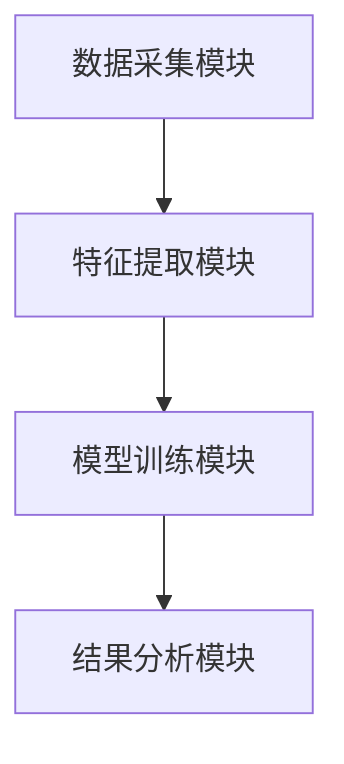
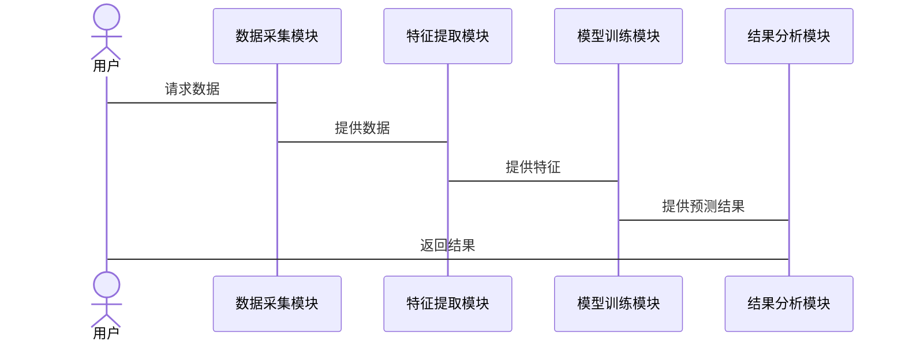

                 


# AI驱动的市场微观结构变化影响预测

## 关键词：人工智能、市场微观结构、预测模型、时间序列、机器学习

## 摘要：本文探讨了人工智能在预测市场微观结构变化中的应用，分析了核心概念、算法原理和系统架构，结合实际案例，展示了如何通过AI技术实现市场微观结构的预测与优化。

---

# 第1章: AI驱动的市场微观结构变化概述

## 1.1 市场微观结构的基本概念

### 1.1.1 市场微观结构的定义

市场微观结构指的是市场参与者之间的互动关系及其对市场价格、流动性等的影响。它包括交易者的类型、交易行为、订单簿、市场深度等要素。

$$
\text{微观结构} = f(\text{参与者, 行为, 价格, 流动性})
$$

### 1.1.2 微观结构与宏观市场的关系

微观结构是市场运行的基础，影响宏观市场的波动性和稳定性。例如，高频交易和算法交易的普及改变了市场的微观结构，进而影响了市场的整体波动性。

### 1.1.3 AI在市场微观结构分析中的作用

人工智能通过分析海量数据，识别市场微观结构中的模式和趋势，帮助预测价格波动和市场行为。

---

## 1.2 AI驱动的市场变化预测背景

### 1.2.1 传统市场分析的局限性

传统市场分析依赖于经验和统计方法，难以捕捉高频交易和复杂市场行为的规律。

### 1.2.2 AI技术在金融领域的应用现状

AI技术在金融领域的应用日益广泛，尤其是在高频交易、风险管理等领域。

### 1.2.3 市场微观结构预测的挑战与机遇

挑战包括数据噪声、模型过拟合；机遇在于通过AI技术提高预测精度和交易效率。

---

## 1.3 问题背景与目标

### 1.3.1 问题背景分析

随着市场参与者和交易策略的多样化，市场微观结构变得更加复杂，传统方法难以应对。

### 1.3.2 问题描述与解决思路

通过AI技术分析市场微观结构的变化，预测价格波动和市场行为，优化交易策略。

### 1.3.3 预期目标与应用价值

提升交易效率、降低风险、提高市场理解力。

---

## 1.4 核心概念与边界

### 1.4.1 核心概念的定义与属性

- 市场参与者：机构投资者、散户、高频交易算法。
- 交易行为：订单生成、订单取消、成交。
- 价格：开盘价、收盘价、最高价、最低价。
- 流动性：订单深度、买卖价差。

### 1.4.2 相关概念的对比分析

| 概念 | 描述 | 示例 |
|------|------|------|
| 微观结构 | 价格和流动性形成的机制 | 市场深度分析 |
| 宏观结构 | 整体市场波动 | 股指波动 |

### 1.4.3 问题的边界与外延

- 边界：仅关注价格和流动性变化。
- 外延：不考虑宏观经济因素。

---

## 1.5 本章小结

本章介绍了市场微观结构的基本概念、AI的应用背景、问题目标和核心概念。

---

# 第2章: 市场微观结构变化的核心要素

## 2.1 微观结构的核心要素

### 2.1.1 市场参与者的角色

- 机构投资者：大额交易，影响市场深度。
- 散户：小规模交易，影响市场波动。
- 高频交易算法：高频订单生成和取消，影响买卖价差。

### 2.1.2 交易行为与价格形成机制

交易行为包括订单生成、取消和成交。价格形成机制涉及买卖双方的均衡。

### 2.1.3 市场流动性与波动性

市场流动性影响买卖价差和交易成本。波动性与市场参与者的交易行为密切相关。

---

## 2.2 AI驱动的预测模型框架

### 2.2.1 数据采集与特征提取

- 数据源：订单簿、交易数据、市场深度。
- 特征：买卖价差、订单数量、成交额、时间戳。

### 2.2.2 模型选择与训练

- 算法：时间序列模型、机器学习模型。
- 数据预处理：归一化、缺失值处理。

### 2.2.3 结果验证与优化

- 交叉验证：确保模型泛化能力。
- 超参数调优：优化模型性能。

---

## 2.3 核心概念的ER实体关系图

```mermaid
er
  actor: 市场参与者
  transaction: 交易行为
  price: 价格
  model: AI预测模型
  actor --> transaction
  transaction --> price
  model --> transaction
  model --> price
```

---

# 第3章: 时间序列预测算法

## 3.1 时间序列预测的基本原理

时间序列预测通过历史数据预测未来趋势。常用模型包括ARIMA、LSTM。

### 3.1.1 ARIMA模型

ARIMA模型通过自回归和移动平均预测未来值。

$$
ARIMA(p, d, q) = y_t = \phi_1 y_{t-1} + \dots + \phi_p y_{t-p} + \theta_1 \epsilon_{t-1} + \dots + \theta_q \epsilon_{t-q} + \epsilon_t
$$

---

## 3.2 基于LSTM的时间序列预测

### 3.2.1 LSTM网络结构

LSTM通过门控机制捕捉长期依赖关系。

$$
f_t = \sigma(W_f x_t + U_f h_{t-1} + b_f)
$$

$$
i_t = \sigma(W_i x_t + U_i h_{t-1} + b_i)
$$

$$
o_t = \sigma(W_o x_t + U_o h_{t-1} + b_o)
$$

$$
h_t = f_t \cdot c_{t-1} + i_t \cdot tanh(W_c x_t + U_c h_{t-1} + b_c)
$$

$$
c_t = h_t
$$

---

## 3.3 基于GAN的时间序列预测

### 3.3.1 GAN模型结构

生成对抗网络通过生成器和判别器的对抗训练生成真实数据分布。

$$
G(z) = \text{生成数据}
$$

$$
D(x) = \text{判别数据是否为真实}
$$

---

# 第4章: 系统分析与架构设计

## 4.1 系统功能设计

### 4.1.1 数据采集模块

- 功能：实时采集市场数据。
- 实现：通过API接口获取订单簿、交易数据。

### 4.1.2 特征提取模块

- 功能：提取买卖价差、订单数量等特征。
- 实现：使用Python的pandas库进行数据处理。

### 4.1.3 模型训练模块

- 功能：训练时间序列预测模型。
- 实现：使用Keras框架构建LSTM网络。

### 4.1.4 结果分析模块

- 功能：分析模型预测结果。
- 实现：可视化预测值与真实值的对比。

---

## 4.2 系统架构设计

### 4.2.1 系统架构图



### 4.2.2 系统交互图



---

# 第5章: 项目实战

## 5.1 环境安装

### 5.1.1 安装Python和相关库

```bash
pip install numpy pandas matplotlib keras tensorflow
```

### 5.1.2 数据源获取

使用Yahoo Finance API获取股票数据。

---

## 5.2 系统核心实现

### 5.2.1 数据预处理

```python
import pandas as pd
import numpy as np

# 读取数据
data = pd.read_csv('stock_data.csv')

# 数据预处理
data = data.dropna()
data = (data - data.mean()) / data.std()
```

### 5.2.2 模型实现

```python
from keras.models import Sequential
from keras.layers import LSTM, Dense

model = Sequential()
model.add(LSTM(64, input_shape=(timesteps, features)))
model.add(Dense(1))
model.compile(loss='mean_squared_error', optimizer='adam')
```

### 5.2.3 结果分析

```python
import matplotlib.pyplot as plt

plt.plot(real_prices, color='blue', label='实际价格')
plt.plot(predicted_prices, color='red', label='预测价格')
plt.legend()
plt.show()
```

---

## 5.3 实际案例分析

### 5.3.1 数据来源与特征选择

选择某股票的历史交易数据，提取买卖价差、订单数量等特征。

### 5.3.2 模型训练与优化

通过交叉验证选择最优模型参数。

### 5.3.3 结果分析与解读

比较预测结果与实际价格的差异，分析模型的有效性。

---

## 5.4 项目小结

本项目通过AI技术实现了市场微观结构的预测，验证了模型的有效性。

---

# 第6章: 最佳实践与拓展阅读

## 6.1 最佳实践

- 数据预处理：归一化和缺失值处理。
- 模型选择：根据数据特点选择合适算法。
- 模型调优：通过超参数优化提升性能。

## 6.2 小结

本文详细介绍了AI驱动的市场微观结构变化预测，涵盖了从概念到实践的全过程。

## 6.3 注意事项

- 数据隐私：确保数据的安全性。
- 模型鲁棒性：考虑市场的不确定性。

## 6.4 拓展阅读

推荐阅读《时间序列分析》和《深度学习在金融中的应用》。

---

# 结语

AI技术正在改变市场微观结构的分析方式，未来的研究可以进一步结合NLP和强化学习，提升预测精度和交易效率。

