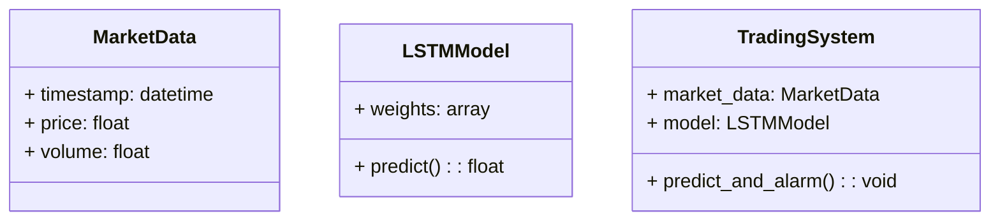
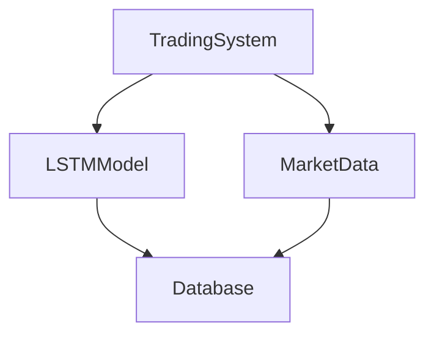

                 


# AI驱动的市场流动性枯竭预警

> 关键词：市场流动性，AI，时间序列预测，LSTM，金融风险管理

> 摘要：本文探讨了利用人工智能技术预测市场流动性枯竭的问题。通过分析市场流动性特征，结合时间序列预测模型，提出了一种基于LSTM的流动性预警方法。文章详细阐述了算法原理、系统设计及项目实现，展示了AI在金融风险管理中的强大能力。

---

# 第一部分: 背景介绍

## 第1章: 问题背景与重要性

### 1.1 问题背景
市场流动性是指资产在短时间内以合理价格买卖的能力。流动性枯竭意味着市场无法及时以合理价格成交，可能导致价格崩盘和系统性风险。

### 1.2 问题的重要性
流动性枯竭可能导致以下问题：
- 投资者损失：无法及时卖出资产，造成重大损失。
- 市场不稳定：流动性下降会引发市场恐慌，进一步加剧波动。
- 金融机构风险：流动性不足会影响金融机构的资产质量，引发连锁反应。

### 1.3 传统方法的局限性
传统上，流动性管理依赖于市场参与者的经验和市场监控工具。然而，这些方法存在以下问题：
- 依赖主观判断：经验不足可能导致误判。
- 数据处理能力有限：难以处理海量实时数据。
- 响应速度慢：无法及时发现潜在风险。

---

# 第二部分: 核心概念与联系

## 第2章: AI驱动的流动性预警核心概念

### 2.1 数据特征
流动性预测的关键在于数据特征的选择。常见的数据特征包括：
- 价格波动：如标准差、波动率等。
- 交易量：如订单簿深度、成交量变化率。
- 时间序列特征：如均值、自相关性等。

### 2.2 AI模型的选择
深度学习模型，尤其是LSTM，适用于时间序列预测。LSTM通过门控机制捕捉长期依赖关系，非常适合捕捉市场流动性变化的复杂模式。

### 2.3 系统架构
系统架构包括：
- 数据采集模块：实时采集市场数据。
- 数据预处理模块：清洗和特征提取。
- 模型训练模块：使用LSTM进行训练。
- 预警模块：实时预测并发出预警信号。

---

# 第三部分: 算法原理讲解

## 第3章: LSTM算法原理

### 3.1 LSTM结构
LSTM由输入门、遗忘门和输出门组成，每个门使用sigmoid函数，并通过乘法和加法操作控制信息流动。

### 3.2 LSTM训练过程
- 前向传播：通过输入数据更新各个门的状态。
- 后向传播：计算损失函数的梯度，更新模型参数。
- 循环结构：处理时间序列数据，捕捉长期依赖关系。

### 3.3 数学模型
LSTM的基本单元如下：
$$
f_t = \sigma(W_f \cdot [h_{t-1}, x_t] + b_f)
$$
$$
i_t = \sigma(W_i \cdot [h_{t-1}, x_t] + b_i)
$$
$$
o_t = \sigma(W_o \cdot [h_{t-1}, x_t] + b_o)
$$
$$
c_t = f_t \odot c_{t-1} + i_t \odot tanh(W_c \cdot [h_{t-1}, x_t] + b_c)
$$
$$
h_t = o_t \odot tanh(c_t)
$$

其中，$f_t$、$i_t$、$o_t$分别为输入门、遗忘门和输出门，$c_t$为单元状态，$h_t$为隐藏层输出。

### 3.4 代码实现
以下是一个简单的LSTM模型实现：

```python
import numpy as np
from tensorflow.keras.models import Sequential
from tensorflow.keras.layers import LSTM, Dense

# 模型定义
model = Sequential()
model.add(LSTM(64, input_shape=(timesteps, features)))
model.add(Dense(1, activation='sigmoid'))
model.compile(loss='binary_crossentropy', optimizer='adam')
```

---

# 第四部分: 系统分析与架构设计

## 第4章: 系统架构设计

### 4.1 领域模型类图


### 4.2 系统架构图


### 4.3 接口设计
系统接口包括：
- 数据采集接口：实时获取市场数据。
- 模型调用接口：调用LSTM模型进行预测。
- 预警接口：根据预测结果发出预警信号。

---

# 第五部分: 项目实战

## 第5章: 项目实现与案例分析

### 5.1 环境安装
安装必要的库：
```bash
pip install numpy pandas tensorflow keras matplotlib
```

### 5.2 数据预处理
数据预处理步骤：
1. 数据清洗：处理缺失值和异常值。
2. 特征提取：选择相关特征，如价格、交易量等。
3. 数据分割：将数据分为训练集和测试集。

### 5.3 模型实现
编写LSTM模型代码：
```python
import numpy as np
from tensorflow.keras.models import Sequential
from tensorflow.keras.layers import LSTM, Dense

# 模型定义
model = Sequential()
model.add(LSTM(64, input_shape=(timesteps, features)))
model.add(Dense(1, activation='sigmoid'))
model.compile(loss='binary_crossentropy', optimizer='adam')

# 训练模型
model.fit(X_train, y_train, epochs=10, batch_size=32)
```

### 5.4 案例分析
通过实际案例分析模型的预测效果，调整模型参数，优化预测准确率。

---

# 第六部分: 总结与展望

## 第6章: 总结与未来研究方向

### 6.1 总结
本文详细探讨了AI驱动的市场流动性枯竭预警方法，提出了基于LSTM的预测模型，并通过实际案例展示了其有效性。

### 6.2 未来研究方向
- 提高模型的实时性：优化模型结构，减少预测时间。
- 结合其他模型：尝试集成其他模型，如随机森林和LSTM，提高预测准确性。
- 多市场应用：将模型应用于不同市场和资产类别，验证其普适性。

---

通过本文的分析，读者可以深入了解AI技术在市场流动性管理中的应用，掌握基于LSTM的预测方法，并在未来的研究中进一步优化和扩展这一技术。

