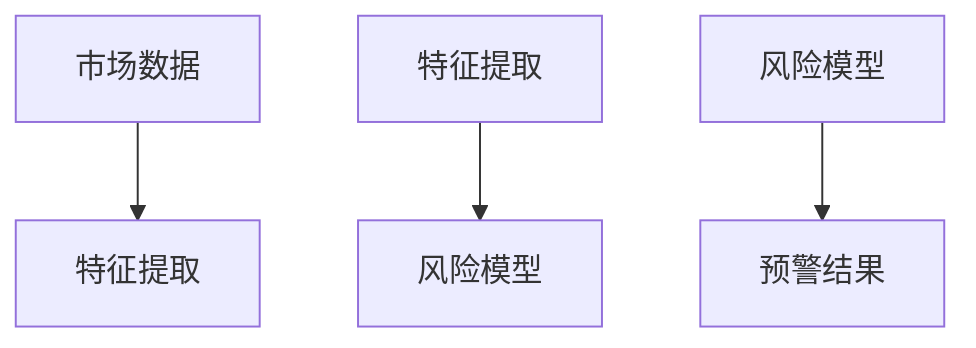
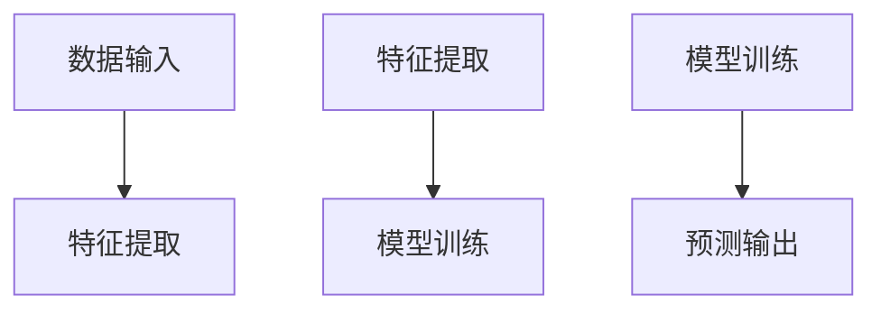
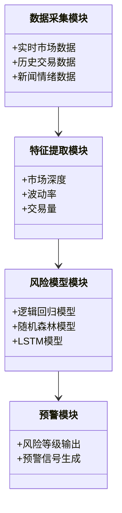
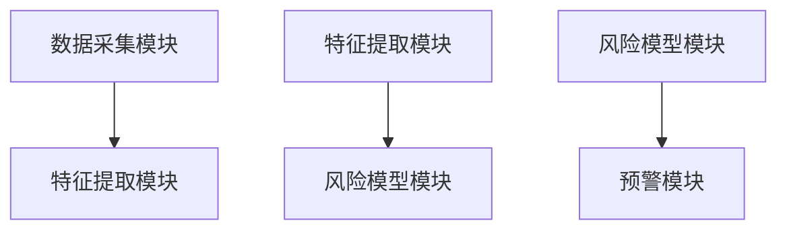

                 


# AI驱动的市场流动性风险预警系统

> 关键词：AI，市场流动性风险，预警系统，机器学习，金融风险

> 摘要：本文介绍了一种基于人工智能的市场流动性风险预警系统，探讨了系统的核心概念、算法原理、系统架构设计及实际应用案例，展示了如何利用AI技术提升金融市场风险预警的效率和准确性。

---

# 第一部分: AI驱动的市场流动性风险预警系统概述

## 第1章: 背景与核心概念

### 1.1 问题背景与定义

#### 1.1.1 市场流动性风险的定义与特征
市场流动性风险是指在金融市场中，资产在短时间内以合理价格买卖的难度。当市场流动性不足时，投资者可能无法以合理价格迅速买卖资产，导致损失。流动性风险的核心特征包括：

1. **波动性**：市场波动剧烈时，流动性风险显著增加。
2. **传染性**：流动性风险可能从一个资产或市场扩散到其他相关资产或市场。
3. **突发性**：流动性风险往往在市场压力增大时突然出现。

#### 1.1.2 传统市场流动性风险的局限性
传统方法在应对市场流动性风险时存在以下问题：
1. **滞后性**：基于历史数据的分析方法难以捕捉实时变化。
2. **主观性**：依赖人工判断，容易受到主观因素影响。
3. **覆盖范围有限**：难以同时监控多个市场和资产类别。

#### 1.1.3 AI技术在风险预警中的潜力
AI技术通过处理海量数据、识别复杂模式和实时分析，为市场流动性风险预警提供了新的解决方案。AI能够快速识别潜在风险信号，提供实时预警，并根据市场动态调整预警策略。

### 1.2 AI驱动的市场流动性风险预警系统

#### 1.2.1 系统的核心目标
- 实时监控市场数据，识别潜在流动性风险。
- 提供精准的预警信号，帮助投资者和机构及时采取应对措施。
- 建立动态风险评估模型，适应市场变化。

#### 1.2.2 系统的边界与外延
- **边界**：系统专注于流动性风险预警，不涉及投资决策或其他类型的风险。
- **外延**：系统可扩展至其他类型市场风险预警，如信用风险、市场波动风险等。

#### 1.2.3 核心要素与组成结构
- **数据采集模块**：实时采集市场数据。
- **特征提取模块**：提取影响流动性的关键特征。
- **风险模型模块**：构建AI模型预测流动性风险。
- **预警模块**：生成实时预警信号。

### 1.3 核心概念关系图



---

## 第2章: AI技术基础与算法原理

### 2.1 机器学习基础

#### 2.1.1 机器学习的核心概念
- **监督学习**：基于标记数据进行模型训练。
- **无监督学习**：从无标记数据中发现模式。
- **深度学习**：通过多层神经网络提取特征。

#### 2.1.2 监督学习与无监督学习
- 监督学习适用于有标签数据，如预测流动性风险等级。
- 无监督学习适用于发现数据中的潜在结构，如聚类市场行为模式。

#### 2.1.3 深度学习简介
深度学习通过多层神经网络自动提取数据特征，适用于处理非结构化数据。

### 2.2 常见算法与模型

#### 2.2.1 线性回归与逻辑回归
- **线性回归**：用于预测连续型变量，如流动性风险指数。
- **逻辑回归**：用于分类问题，如判断流动性风险是否为高风险。

#### 2.2.2 支持向量机（SVM）
SVM适用于高维数据分类，常用于将市场行为分为高风险和低风险两类。

#### 2.2.3 随机森林与集成学习
随机森林通过集成多个决策树提高模型鲁棒性，适用于处理复杂市场数据。

#### 2.2.4 神经网络与深度学习
神经网络适用于处理复杂非线性关系，如 LSTM 用于时间序列预测。

### 2.3 算法流程图



### 2.4 数学模型与公式

#### 2.4.1 线性回归公式
$$y = \beta_0 + \beta_1x + \epsilon$$

#### 2.4.2 逻辑回归公式
$$P(y=1|x) = \frac{1}{1 + e^{-\beta x}}$$

#### 2.4.3 神经网络结构
$$\text{激活函数} = \text{ReLU}(x) = \max(0, x)$$

---

## 第3章: 系统分析与架构设计

### 3.1 问题场景分析

#### 3.1.1 市场数据流分析
- 数据来源：实时市场数据、历史交易数据、新闻情绪数据。
- 数据处理：清洗、标准化、特征提取。

#### 3.1.2 风险预警的实时性要求
- 系统需要实时处理数据，快速生成预警信号。

### 3.2 项目介绍

#### 3.2.1 系统功能设计



#### 3.2.2 系统架构设计



---

## 第4章: 项目实战

### 4.1 环境安装
- **Python**：安装Python 3.8+。
- **库的安装**：`pip install numpy pandas scikit-learn keras tensorflow`

### 4.2 系统核心实现源代码

#### 4.2.1 数据采集模块

```python
import pandas as pd
import requests

def get_market_data(api_key):
    url = f"https://api.example.com/market_data?api_key={api_key}"
    response = requests.get(url)
    data = response.json()
    df = pd.DataFrame(data)
    return df
```

#### 4.2.2 特征提取模块

```python
from sklearn.feature_selection import SelectKBest

def extract_features(data):
    selector = SelectKBest(k=10)
    selected_features = selector.fit_transform(data)
    return selected_features
```

#### 4.2.3 风险模型模块

```python
from sklearn.ensemble import RandomForestClassifier

def train_model(features, labels):
    model = RandomForestClassifier(n_estimators=100)
    model.fit(features, labels)
    return model
```

#### 4.2.4 预警模块

```python
def generate_alerts(model, new_features):
    predictions = model.predict(new_features)
    for pred in predictions:
        if pred == 1:
            print("高风险预警!")
        else:
            print("低风险预警!")
```

### 4.3 代码应用解读与分析
- **数据采集模块**：实时获取市场数据，确保数据来源可靠。
- **特征提取模块**：提取关键特征，如波动率、交易量等。
- **风险模型模块**：使用集成学习模型提高预测准确性。
- **预警模块**：根据模型预测结果生成实时预警信号。

---

## 第5章: 总结与展望

### 5.1 项目小结
- 本文介绍了AI驱动的市场流动性风险预警系统，从背景、算法、系统架构到项目实现进行了详细讲解。
- 通过实际案例展示了系统的核心功能和实现过程。

### 5.2 小结
- AI技术为市场流动性风险预警提供了新的解决方案。
- 本文的系统设计可以作为未来研究的基础。

### 5.3 注意事项
- 数据来源和质量直接影响预警系统的准确性。
- 需要根据市场变化不断优化模型。

### 5.4 拓展阅读
- 推荐阅读《机器学习实战》和《深度学习》等书籍，深入理解AI技术的应用。

---

通过以上步骤，我们可以构建一个高效、可靠的市场流动性风险预警系统，为金融市场风险防控提供有力支持。

