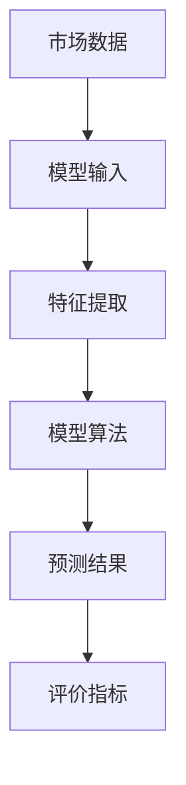
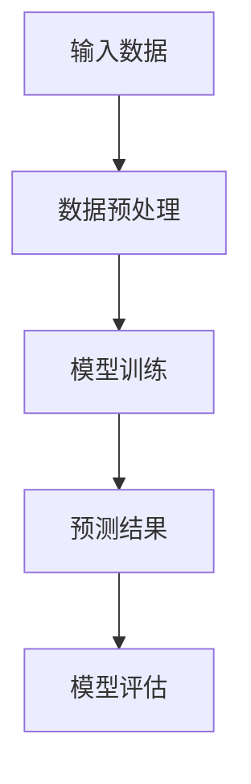
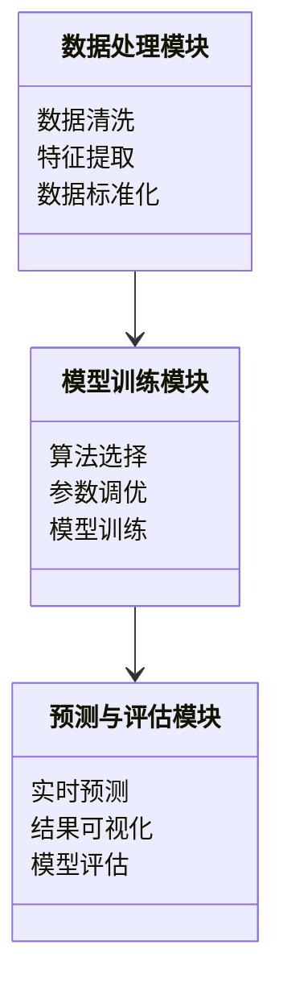
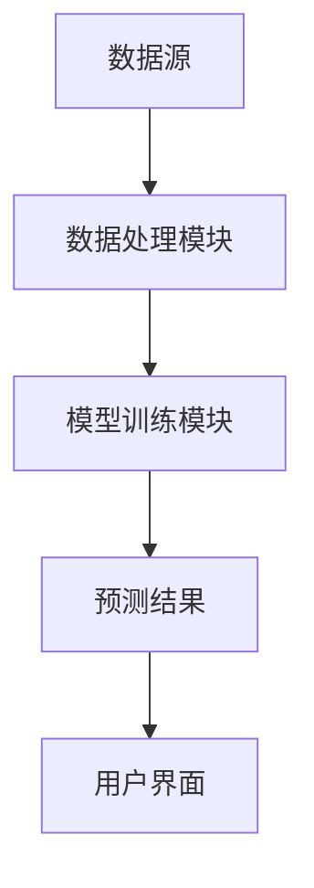
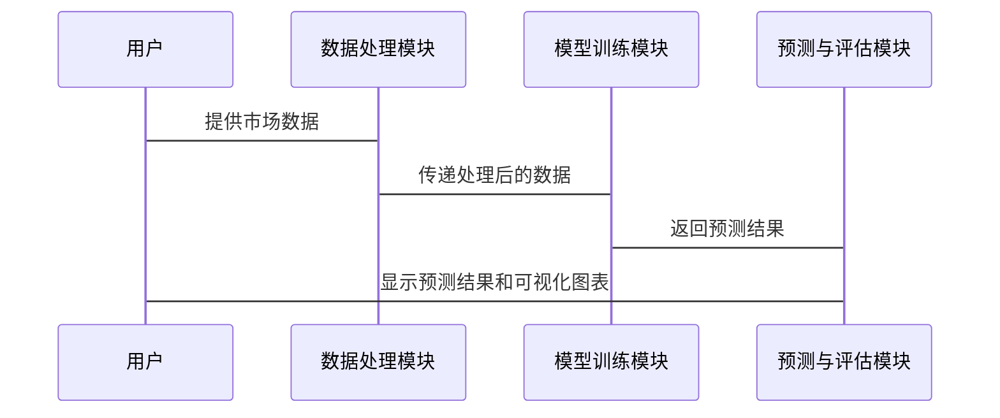

                 


# AI驱动的市场趋势预测模型开发

> 关键词：AI驱动，市场趋势预测，机器学习，深度学习，模型开发，预测算法，数据特征

> 摘要：本文系统地介绍了AI驱动的市场趋势预测模型的开发过程，从背景分析、核心概念、算法原理到系统架构和项目实战，全面阐述了如何利用人工智能技术进行市场趋势预测。文章结合理论与实践，通过详细的算法流程图、数学公式和代码示例，帮助读者深入理解模型开发的每一个环节，并提供了实际案例分析和最佳实践建议。

---

# 第一部分: AI驱动的市场趋势预测模型开发背景

## 第1章: AI驱动的市场趋势预测模型概述

### 1.1 问题背景
#### 1.1.1 市场趋势预测的传统方法
传统市场趋势预测方法依赖于统计分析和专家经验，例如时间序列分析、回归分析等。这些方法虽然有一定效果，但存在以下问题：
- 数据量有限，难以捕捉复杂市场动态
- 专家经验依赖性强，主观性较高
- 对新兴市场或突发事件的预测能力有限

#### 1.1.2 传统方法的局限性
传统方法在处理复杂、非线性数据时表现不佳，尤其是在面对海量数据和复杂市场环境时，预测精度和稳定性难以保证。

#### 1.1.3 AI技术如何解决这些问题
人工智能技术，尤其是机器学习和深度学习，能够处理海量数据，发现复杂模式，提供更高的预测精度和稳定性。AI驱动的市场趋势预测模型能够实时更新，适应市场变化。

### 1.2 问题描述
#### 1.2.1 市场趋势预测的核心目标
市场趋势预测的核心目标是通过分析历史数据和当前市场信息，预测未来市场走向，帮助企业做出更科学的决策。

#### 1.2.2 数据特征与需求分析
- 数据特征：时间序列数据、市场指标（如价格、成交量、指数等）、行业数据、宏观经济指标等。
- 需求分析：预测模型需要具备高精度、实时性、可解释性。

#### 1.2.3 问题解决的边界与外延
边界：限定在特定市场或行业，预测短期（如1周到1个月）趋势。
外延：通过模型优化和数据增强，可以扩展到更长的时间范围或更广泛的市场领域。

### 1.3 模型开发的必要性
#### 1.3.1 市场趋势预测的业务价值
准确的市场趋势预测能够帮助企业优化资源配置、降低风险、抓住市场机会。

#### 1.3.2 AI驱动预测的优势
- 高精度：AI模型能够捕捉复杂的市场规律。
- 实时性：基于实时数据的更新，模型可以快速调整预测结果。
- 可扩展性：AI模型能够处理多维度数据，适应不同市场环境。

---

## 第2章: AI驱动的市场趋势预测模型核心概念

### 2.1 核心概念与联系
#### 2.1.1 数据特征与模型输入
市场趋势预测模型的输入数据通常包括以下几类：
- 时间序列数据：如历史价格、成交量等。
- 市场指标：如行业指数、宏观经济指标等。
- 文本数据：如新闻、社交媒体信息等。

#### 2.1.2 模型算法与预测结果
模型算法通过处理输入数据，生成预测结果。预测结果可以是具体的数值（如预测价格）或趋势方向（如上升、下降或持平）。

#### 2.1.3 评价指标与效果评估
常用的评价指标包括：
- �均方误差（MSE）
- 平均绝对误差（MAE）
- R平方值（R²）

#### 2.1.4 实体关系图（ER图）


### 2.2 核心概念对比表
| 模型算法 | 数据特征 | 预测结果 | 评价指标 |
|----------|----------|----------|----------|
| 线性回归 | 时间序列数据 | 预测值 | MSE, MAE |
| 随机森林 | 多维度数据 | 预测值 | R² |
| LSTM     | 时间序列数据 | 预测值 | MAE, MSE |

### 2.3 实体关系图（ER图）


---

# 第二部分: AI驱动的市场趋势预测模型算法原理

## 第3章: 常见算法原理与实现

### 3.1 线性回归算法
#### 3.1.1 算法原理
线性回归是一种简单且常用的回归算法，适用于线性关系的预测。其数学模型如下：
$$ y = \beta_0 + \beta_1 x + \epsilon $$

#### 3.1.2 算法流程


#### 3.1.3 Python代码实现
```python
import numpy as np
from sklearn.linear_model import LinearRegression

# 示例数据
X = np.array([[1], [2], [3], [4], [5]])
y = np.array([2, 4, 5, 4, 6])

# 模型训练
model = LinearRegression()
model.fit(X, y)

# 预测结果
print(model.predict([[6]]))
```

### 3.2 随机森林算法
#### 3.2.1 算法原理
随机森林是一种基于决策树的集成算法，通过构建多棵决策树并进行投票或平均来提高预测准确性。

#### 3.2.2 算法流程


#### 3.2.3 Python代码实现
```python
from sklearn.ensemble import RandomForestRegressor
from sklearn.datasets import make_regression

# 示例数据
X, y = make_regression(n_samples=100, n_features=4, random_state=0)

# 模型训练
model = RandomForestRegressor(n_estimators=100)
model.fit(X, y)

# 预测结果
print(model.predict(X[:2]))
```

### 3.3 LSTM算法
#### 3.3.1 算法原理
长短期记忆网络（LSTM）是一种特殊的循环神经网络（RNN），适用于时间序列数据的预测。

#### 3.3.2 算法流程


#### 3.3.3 Python代码实现
```python
import numpy as np
from keras.models import Sequential
from keras.layers import LSTM, Dense

# 示例数据
X = np.random.randn(100, 1, 4)
y = np.random.randn(100, 1)

# 模型训练
model = Sequential()
model.add(LSTM(5, input_shape=(1, 4)))
model.add(Dense(1))
model.compile(loss='mean_squared_error', optimizer='adam')
model.fit(X, y, epochs=5)

# 预测结果
print(model.predict(X[:2]))
```

---

## 第4章: 算法原理的数学模型

### 4.1 线性回归的数学模型
$$ y = \beta_0 + \beta_1 x + \epsilon $$

### 4.2 随机森林的数学模型
随机森林通过集成学习（Bagging）和特征随机化（Feature Randomization）提高预测准确性。

### 4.3 LSTM的数学模型
LSTM的核心是细胞状态（Cell State）和门控机制（Gate Mechanism），其数学表达式如下：
$$
f_t = \sigma(W_f \cdot [h_{t-1}, x_t] + b_f)
$$
$$
i_t = \sigma(W_i \cdot [h_{t-1}, x_t] + b_i)
$$
$$
o_t = \sigma(W_o \cdot [h_{t-1}, x_t] + b_o)
$$
$$
c_t = f_t \cdot c_{t-1} + i_t \cdot tanh(W_c \cdot [h_{t-1}, x_t] + b_c)
$$
$$
h_t = o_t \cdot tanh(c_t)
$$

---

# 第三部分: AI驱动的市场趋势预测模型系统架构

## 第5章: 问题场景介绍

### 5.1 系统功能设计
#### 5.1.1 数据处理模块
- 数据清洗
- 特征提取
- 数据标准化

#### 5.1.2 模型训练模块
- 算法选择
- 参数调优
- 模型训练

#### 5.1.3 预测与评估模块
- 实时预测
- 结果可视化
- 模型评估

### 5.2 领域模型设计


### 5.3 系统架构设计


### 5.4 系统接口设计
- 数据输入接口：接收市场数据（如CSV文件或数据库）
- 模型接口：调用预训练模型进行预测
- 结果输出接口：返回预测结果和可视化图表

### 5.5 系统交互流程图


---

## 第6章: 项目实战

### 6.1 环境安装
- 安装Python和相关库（如NumPy、Scikit-learn、Keras等）
- 安装Jupyter Notebook或IDE（如PyCharm）

### 6.2 系统核心实现源代码
#### 6.2.1 数据处理代码
```python
import pandas as pd
import numpy as np

# 数据加载
data = pd.read_csv('market_data.csv')

# 数据清洗
data = data.dropna()
data = data.drop_duplicates()

# 特征提取
features = data[['price', 'volume', 'index']]
labels = data['target']
```

#### 6.2.2 模型训练代码
```python
from sklearn.model import LinearRegression

# 模型训练
model = LinearRegression()
model.fit(features, labels)

# 模型保存
import joblib
joblib.dump(model, 'market_prediction_model.pkl')
```

### 6.3 代码应用解读与分析
- 数据处理：加载数据、清洗数据、提取特征
- 模型训练：选择算法、训练模型、保存模型
- 预测与评估：加载模型、进行预测、评估结果

### 6.4 实际案例分析
#### 6.4.1 数据来源与预处理
- 数据来源：市场数据（如股票价格、指数等）
- 数据预处理：数据清洗、标准化、特征选择

#### 6.4.2 模型训练与预测
- 训练数据：历史市场数据
- 测试数据：预留数据或实时数据
- 预测结果：基于模型的预测值

### 6.5 项目小结
- 通过实际案例分析，验证模型的有效性
- 总结项目开发过程中的经验与教训
- 提出进一步优化的方向

---

## 第7章: 最佳实践

### 7.1 小结
- AI驱动的市场趋势预测模型开发需要结合理论与实践
- 算法选择与数据处理是关键
- 模型评估与优化是保障

### 7.2 注意事项
- 数据质量直接影响预测结果
- 模型调优需要结合业务需求
- 实际应用中需要考虑模型的实时性和可解释性

### 7.3 拓展阅读
- 《Hands-On Machine Learning with Scikit-Learn, Keras, and TensorFlow》
- 《Deep Learning》
- 《时间序列分析》

---

通过以上目录和内容的详细规划，您可以逐步展开每部分内容，撰写一篇结构清晰、内容丰富的技术博客文章。

