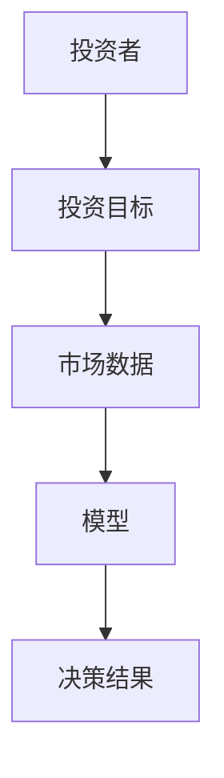
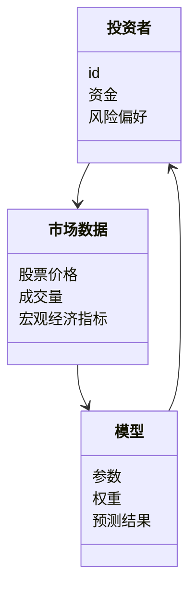
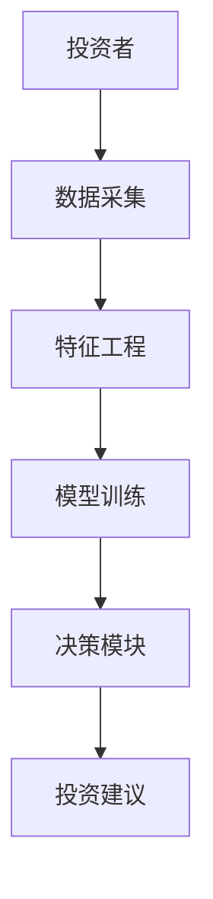
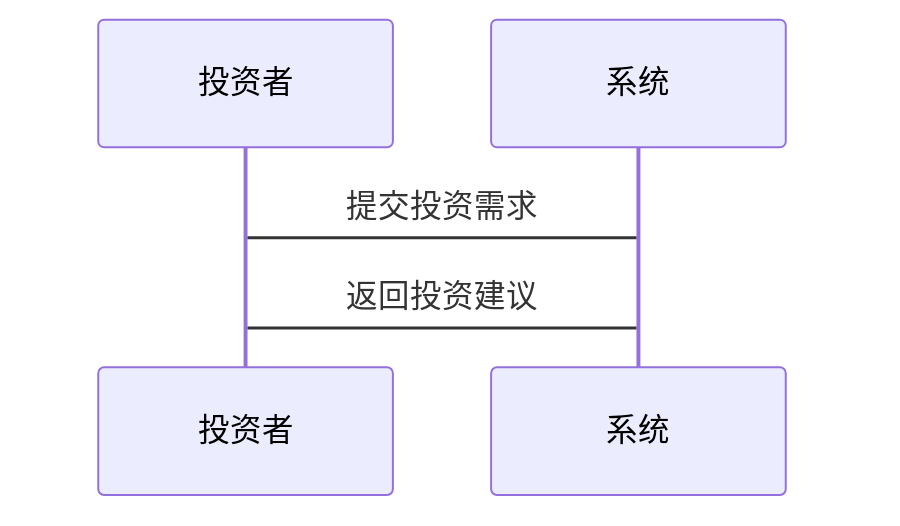

                 


# AI驱动的投资决策支持系统

> 关键词：人工智能、投资决策、机器学习、深度学习、数据挖掘、数据分析、系统架构

> 摘要：本文探讨了AI在投资决策支持系统中的应用，从背景、核心概念、算法原理到系统架构和项目实战，详细解析了AI如何驱动投资决策的优化与创新。通过案例分析和代码实现，展示了AI在投资领域的实际应用价值。

---

## 第一部分: AI驱动的投资决策支持系统概述

## 第1章: AI驱动的投资决策支持系统背景

### 1.1 投资决策支持系统的概念与背景

#### 1.1.1 投资决策支持系统的定义
投资决策支持系统（Investment Decision Support System, IDSS）是一种利用技术手段辅助投资者进行决策的系统，旨在通过数据分析、模型构建和智能算法，提供更精准的投资建议。

#### 1.1.2 AI在投资决策中的应用背景
随着金融市场的复杂化，传统的人工决策方式难以应对海量数据和快速变化的市场环境。AI技术的引入，为投资决策提供了更高效、更精准的解决方案。

#### 1.1.3 投资决策支持系统的演变
从早期的简单数据查询到如今的智能分析，投资决策支持系统经历了从人工辅助到全自动化的演变过程。

### 1.2 AI驱动投资决策的核心问题

#### 1.2.1 数据驱动的决策需求
通过分析历史数据和实时数据，AI可以帮助投资者识别市场趋势和潜在机会。

#### 1.2.2 传统投资决策的局限性
传统决策方式依赖经验，存在主观性强、效率低、覆盖面窄等问题。

#### 1.2.3 AI如何解决投资问题
AI通过大数据分析、模式识别和预测模型，能够快速处理海量数据，发现潜在规律，辅助投资者做出更科学的决策。

### 1.3 本书的核心目标与内容

#### 1.3.1 本书的目标
本书旨在探讨AI技术在投资决策中的应用，通过理论与实践结合，帮助读者理解并掌握AI驱动的投资决策支持系统的构建与优化。

#### 1.3.2 本书的主要内容
涵盖投资决策支持系统的背景、核心概念、算法原理、系统架构、项目实战等内容，全面解析AI在投资领域的应用。

#### 1.3.3 本书的结构安排
按照从理论到实践的顺序，分为背景、概念、算法、系统架构、项目实战、最佳实践等章节。

### 1.4 本章小结
本章通过介绍投资决策支持系统的背景、核心问题和本书内容，为读者理解AI在投资中的应用奠定了基础。

---

## 第2章: AI驱动投资决策的核心概念与联系

### 2.1 投资决策支持系统的概念体系

#### 2.1.1 核心概念的定义
- **投资者**：决策的主体。
- **投资目标**：决策的具体方向。
- **市场数据**：决策的基础。
- **模型**：决策的核心工具。
- **决策结果**：决策的输出。

#### 2.1.2 概念之间的关系
投资者通过市场数据构建模型，生成决策结果，最终实现投资目标。

#### 2.1.3 概念的边界与外延
- **边界**：仅限于数据驱动的决策过程。
- **外延**：可以扩展到更复杂的金融工具和市场环境。

#### 2.1.4 概念的结构与核心要素
通过ER图展示概念之间的关系：


### 2.2 AI技术在投资中的应用原理

#### 2.2.1 数据驱动的决策原理
通过数据分析提取有用信息，构建模型进行预测和优化。

#### 2.2.2 特征工程的作用
对数据进行预处理和特征提取，提升模型的性能。

#### 2.2.3 模型训练的核心步骤
数据预处理、特征提取、模型训练、结果分析。

### 2.3 核心概念的ER实体关系图


### 2.4 本章小结
本章通过概念图和ER图，展示了AI在投资决策中的核心概念及其相互关系，为后续章节奠定了理论基础。

---

## 第3章: AI驱动投资决策的关键算法原理

### 3.1 线性回归算法

#### 3.1.1 线性回归的数学模型
$$ y = \beta_0 + \beta_1x + \epsilon $$

#### 3.1.2 线性回归的应用
用于预测股票价格，通过拟合数据点找到最佳回归线。

#### 3.1.3 线性回归的Python实现
```python
import numpy as np
from sklearn.linear_model import LinearRegression

X = np.array([1, 2, 3, 4, 5]).reshape(-1, 1)
y = np.array([2, 4, 5, 4, 5])
model = LinearRegression()
model.fit(X, y)
print(model.predict(X))
```

### 3.2 随机森林算法

#### 3.2.1 随机森林的工作原理
通过构建多个决策树，集成预测结果，提高模型的准确性和鲁棒性。

#### 3.2.2 随机森林的Python实现
```python
from sklearn.ensemble import RandomForestRegressor

X = np.array([[1, 2], [3, 4], [5, 6], [7, 8], [9, 10]])
y = np.array([2, 4, 5, 4, 5])
model = RandomForestRegressor(n_estimators=100)
model.fit(X, y)
print(model.predict(X))
```

#### 3.2.3 随机森林的数学模型
$$ y = \text{median}(\text{多个决策树的预测结果}) $$

### 3.3 神经网络算法

#### 3.3.1 神经网络的结构
包括输入层、隐藏层和输出层，通过多层感知机实现非线性分类。

#### 3.3.2 神经网络的训练过程
通过反向传播和梯度下降优化权重参数。

#### 3.3.3 神经网络的数学模型
$$ \text{输出} = \sigma(\sum w_i x_i + b) $$

### 3.4 本章小结
本章介绍了三种常用的机器学习算法，通过数学公式和代码示例，详细讲解了它们在投资决策中的应用。

---

## 第4章: AI驱动投资决策系统的架构设计

### 4.1 系统功能模块划分

#### 4.1.1 数据采集模块
负责收集市场数据，包括股票价格、成交量等。

#### 4.1.2 特征工程模块
对数据进行清洗、转换和特征提取。

#### 4.1.3 模型训练模块
选择合适的算法，训练模型并进行优化。

#### 4.1.4 决策模块
根据模型预测结果，生成投资建议。

### 4.2 系统功能设计

#### 4.2.1 领域模型


#### 4.2.2 系统架构设计


#### 4.2.3 系统接口设计
- **输入接口**：接收市场数据和投资者信息。
- **输出接口**：提供投资建议和决策结果。

#### 4.2.4 系统交互设计


### 4.3 本章小结
本章通过系统架构设计和交互设计，展示了AI驱动投资决策系统的整体框架和模块划分。

---

## 第5章: 项目实战——AI驱动的股票价格预测

### 5.1 项目背景与目标
通过AI技术预测股票价格，帮助投资者制定投资策略。

### 5.2 环境配置

#### 5.2.1 安装Python和相关库
```bash
pip install numpy pandas scikit-learn matplotlib
```

### 5.3 数据获取与处理

#### 5.3.1 数据获取
从Yahoo Finance获取股票数据：
```python
import pandas_datareader as pdr
data = pdr.get_data_yahoo('AAPL', start='2020-01-01', end='2023-12-31')
```

#### 5.3.2 数据预处理
```python
import pandas as pd
import numpy as np

data['收盘价'] = data['Close']
data = data[['收盘价']]
data = data.fillna(method='ffill')
```

### 5.4 特征工程

#### 5.4.1 常规特征提取
```python
data['收盘价_1d'] = data['收盘价'].shift(1)
data['收盘价_2d'] = data['收盘价'].shift(2)
```

#### 5.4.2 技术指标计算
计算移动平均线（MA）和相对强弱指数（RSI）。

### 5.5 模型训练

#### 5.5.1 训练集与测试集划分
```python
train_data = data[:-100]
test_data = data[-100:]
```

#### 5.5.2 模型选择与训练
使用随机森林回归模型：
```python
from sklearn.ensemble import RandomForestRegressor

X_train = train_data[['收盘价_1d', '收盘价_2d']]
y_train = train_data['收盘价']
X_test = test_data[['收盘价_1d', '收盘价_2d']]
y_test = test_data['收盘价']

model = RandomForestRegressor(n_estimators=100)
model.fit(X_train, y_train)
```

#### 5.5.3 模型预测与评估
```python
y_pred = model.predict(X_test)
print('预测值:', y_pred)
print('实际值:', y_test.values)
print('均方误差:', np.mean((y_pred - y_test.values) ** 2))
```

### 5.6 项目小结
本章通过一个股票价格预测的项目，展示了AI驱动投资决策系统的实际应用。

---

## 第6章: 最佳实践与注意事项

### 6.1 最佳实践

#### 6.1.1 数据质量的重要性
确保数据的完整性和准确性。

#### 6.1.2 模型选择的合理性
根据业务需求选择合适的算法。

#### 6.1.3 模型的可解释性
确保模型结果的可解释性，便于投资者理解。

### 6.2 小结
总结全书内容，强调AI在投资决策中的重要性。

### 6.3 注意事项

#### 6.3.1 数据风险
数据偏差可能导致模型预测不准确。

#### 6.3.2 模型风险
模型的过度拟合或欠拟合会影响预测结果。

#### 6.3.3 市场风险
金融市场具有不确定性，模型结果仅供参考。

### 6.4 拓展阅读
推荐阅读相关书籍和论文，深入了解AI在金融领域的应用。

---

## 结语

AI技术正在改变投资决策的方式，通过数据分析和智能算法，投资者可以做出更科学的决策。本书通过理论与实践结合，为读者提供了构建和优化AI驱动的投资决策支持系统的思路和方法。

---

## 参考文献

1. 《机器学习实战》
2. 《Python机器学习》
3. 《深度学习》
4. 相关学术论文和行业报告

