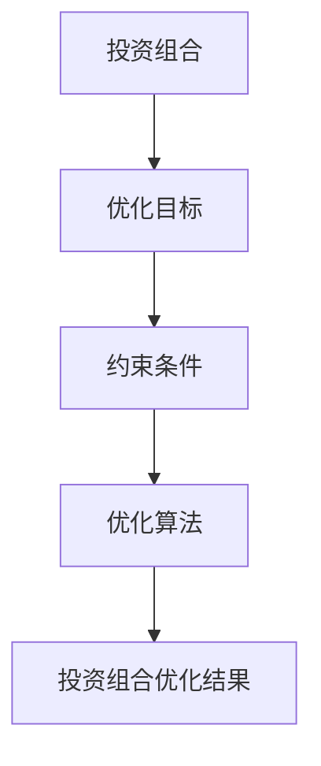
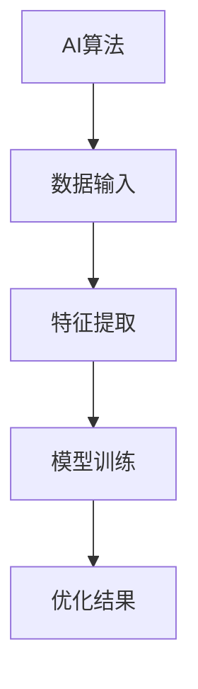
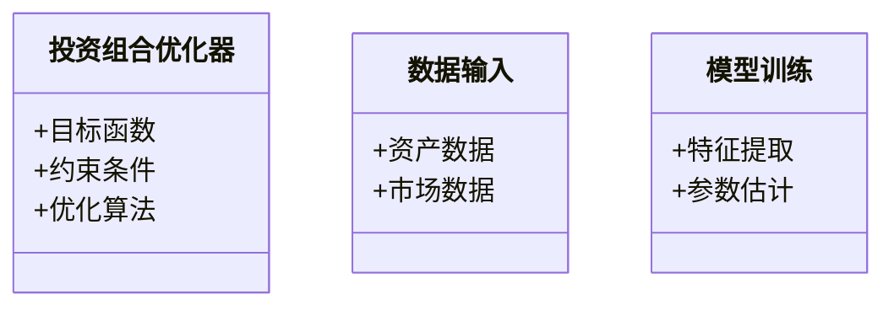
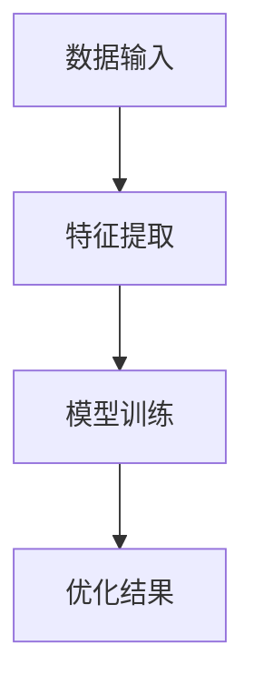

                 


# AI驱动的投资组合优化器

## 关键词
AI, 投资组合优化, 机器学习, 强化学习, 金融数据分析, 投资组合风险管理

## 摘要
本文详细探讨了AI在投资组合优化中的应用，从基础理论到算法实现，再到系统设计和项目实战，全面解析AI驱动的投资组合优化器的构建与优化。通过结合强化学习和遗传算法等先进AI技术，分析投资组合优化的核心问题，揭示AI如何提升投资组合的风险管理和收益优化能力。

---

# 第一部分: AI驱动的投资组合优化器背景与基础

## 第1章: 投资组合优化概述

### 1.1 投资组合优化的基本概念

#### 1.1.1 投资组合的定义与目标
投资组合是指将一定资金分配到不同金融资产上的配置方式，旨在在风险可控的前提下实现最大收益。其核心目标包括最大化收益、最小化风险以及优化资产配置。

#### 1.1.2 投资组合优化的核心问题
投资组合优化主要解决以下问题：
- 如何选择最优资产配置？
- 如何平衡风险与收益？
- 如何应对市场波动？

#### 1.1.3 投资组合优化的边界与外延
优化边界包括资金分配比例、风险承受能力等，外延则涉及动态调整和风险管理。

### 1.2 AI在投资组合优化中的作用
AI通过处理海量数据和复杂模型，提升优化效率和精度，为投资组合优化提供新思路。

### 1.3 本章小结
介绍了投资组合优化的基本概念及其与AI的结合，为后续分析奠定基础。

---

# 第二部分: AI驱动的投资组合优化器核心概念与联系

## 第2章: 核心概念与原理

### 2.1 投资组合优化的数学模型

#### 2.1.1 投资组合优化的数学表达
数学模型通常包括目标函数和约束条件。目标函数如最大化收益或最小化风险，约束条件如资金分配比例等。

#### 2.1.2 常用优化目标与约束条件
目标函数：如均值-方差模型，约束条件包括权重之和等于1等。

#### 2.1.3 投资组合优化的数学公式
$$\text{目标函数：} \quad \max \mu^T w - \lambda w^T \Sigma w$$
其中，$w$是权重向量，$\mu$是收益均值，$\Sigma$是协方差矩阵，$\lambda$是风险惩罚系数。

### 2.2 AI驱动优化的核心算法

#### 2.2.1 强化学习在投资组合优化中的应用
通过状态、动作和奖励机制，优化投资决策。

#### 2.2.2 遗传算法在投资组合优化中的应用
通过模拟自然选择，优化资产配置。

### 2.3 投资组合优化与AI算法的关系
AI算法为优化问题提供高效解决方案，优化结果又为AI算法提供反馈。

### 2.4 核心概念关系图


---

## 第3章: 核心概念与联系的Mermaid流程图

### 3.1 投资组合优化的核心概念关系图


### 3.2 AI驱动优化算法的关系图


---

# 第三部分: AI驱动的投资组合优化器算法原理

## 第4章: 投资组合优化的算法原理

### 4.1 基于强化学习的优化算法

#### 4.1.1 强化学习的基本原理
通过状态、动作和奖励机制，优化投资决策。

#### 4.1.2 强化学习在投资组合优化中的应用
用于动态资产配置和风险管理。

#### 4.1.3 强化学习算法的数学模型
$$\text{目标函数：} \quad \max \sum_{t=1}^T r_t$$

### 4.2 基于遗传算法的优化算法

#### 4.2.1 遗传算法的基本原理
通过模拟自然选择，优化资产配置。

#### 4.2.2 遗传算法在投资组合优化中的应用
用于组合优化和风险控制。

### 4.3 其他AI算法在优化中的应用
包括支持向量机和随机森林等。

---

## 第5章: 算法原理的数学模型与公式

### 5.1 强化学习的数学模型
$$Q(s,a) = Q(s,a) + \alpha [r + \max Q(s',a) - Q(s,a)]$$

### 5.2 遗传算法的流程
1. 初始化种群。
2. 计算适应度。
3. 选择、交叉和变异。
4. 重复直到收敛。

---

# 第四部分: AI驱动的投资组合优化器系统分析与架构设计

## 第6章: 系统分析与架构设计方案

### 6.1 系统功能设计

#### 6.1.1 领域模型


### 6.2 系统架构设计

#### 6.2.1 系统架构图


---

## 第7章: 项目实战与代码实现

### 7.1 环境安装
安装必要的库，如NumPy和Scikit-learn。

### 7.2 核心实现代码

#### 7.2.1 强化学习代码
```python
class DQN:
    def __init__(self, state_space, action_space):
        self.state_space = state_space
        self.action_space = action_space
        self.model = self.build_model()
```

### 7.2.2 遗传算法代码
```python
def genetic_algorithm(population, fitness_fn, num_generations):
    for _ in range(num_generations):
        population = evolve(population, fitness_fn)
    return best_individual(population)
```

### 7.3 案例分析与代码解读

### 7.4 项目小结

---

## 第五部分: 总结与展望

### 结语
AI驱动的投资组合优化器通过结合先进算法，显著提升了优化效率和效果，未来将在更多场景中得到应用。

---

### 最佳实践 Tips

1. **数据质量**：确保数据准确性和完整性。
2. **模型选择**：根据实际需求选择合适的算法。
3. **风险控制**：始终关注风险管理和投资目标的平衡。

通过本文的学习，读者可以深入了解AI在投资组合优化中的应用，并掌握相关算法的设计与实现方法。

