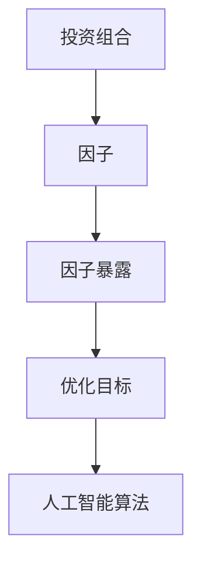
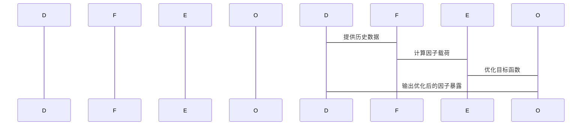

                 


# AI驱动的投资组合因子暴露优化

## 关键词：投资组合优化，因子暴露，人工智能，组合优化，投资策略

## 摘要：本文探讨了如何利用人工智能技术优化投资组合的因子暴露，详细分析了传统方法的局限性，并提出了基于AI的新方法。通过系统设计和算法实现，展示了如何提高投资组合的收益或降低风险，同时提供了实际的项目案例和总结。

---

## 第一部分: AI驱动的投资组合因子暴露优化背景介绍

## 第1章: 投资组合因子暴露优化的背景与问题

### 1.1 问题背景
#### 1.1.1 投资组合优化的传统方法
传统的投资组合优化方法依赖于均值-方差模型，使用历史数据进行预测，存在数据局限性和假设偏差。

#### 1.1.2 因子暴露在投资组合管理中的重要性
因子暴露是指投资组合在不同风险因子上的敏感程度，直接影响组合的风险收益特征。

#### 1.1.3 传统因子暴露优化的局限性
传统方法难以处理高维数据和非线性关系，且忽视了市场动态变化。

### 1.2 问题描述
#### 1.2.1 投资组合因子暴露的定义
因子暴露是投资组合对各风险因子的敏感程度，用权重或载荷表示。

#### 1.2.2 因子暴露优化的目标
在给定风险约束下，优化投资组合的收益或风险调整后的收益。

#### 1.2.3 优化过程中的关键挑战
高维数据、非线性关系、市场动态变化和计算复杂性。

### 1.3 问题解决
#### 1.3.1 引入AI技术的必要性
AI能够处理高维数据和非线性关系，提供更精确的预测和优化。

#### 1.3.2 AI驱动优化的核心思想
利用机器学习模型发现数据中的非线性关系，动态调整因子暴露。

#### 1.3.3 技术实现的可行性分析
基于深度学习和强化学习的算法，能够有效优化因子暴露。

### 1.4 边界与外延
#### 1.4.1 问题的边界条件
限定于标准化的金融数据，考虑市场有效性和理性投资者假设。

#### 1.4.2 相关领域的外延
包括风险管理、组合优化和机器学习等领域的交叉应用。

#### 1.4.3 与其他优化方法的区别
AI驱动优化更加灵活，能够处理非线性和动态变化，而传统方法较为 rigid。

### 1.5 概念结构与核心要素
#### 1.5.1 核心概念的层次结构
投资组合 -> 因子 -> 因子暴露 -> 优化目标 -> AI算法。

#### 1.5.2 核心要素的组成
因子、因子暴露、优化目标、AI算法。

#### 1.5.3 各要素之间的关系
因子暴露是投资组合对各因子的敏感程度，优化目标是最大化收益或最小化风险，AI算法用于动态调整因子暴露。

## 第2章: AI驱动优化的核心概念与联系

### 2.1 核心概念原理
#### 2.1.1 因子暴露的数学表达
因子暴露可以用矩阵表示，每个元素代表对某个因子的暴露程度。

#### 2.1.2 AI算法在优化中的作用
AI算法通过学习历史数据，预测因子表现，动态调整暴露。

#### 2.1.3 组合优化的数学模型
目标函数：maximize return - λ * variance，约束条件：sum of weights = 1，weights ≥ 0。

### 2.2 概念属性特征对比
| 特征     | 传统优化方法 | AI驱动优化方法 |
|----------|--------------|----------------|
| 数据维度 | 低维         | 高维           |
| 非线性处理 | 线性          | 非线性          |
| 动态调整 | 固定          | 动态            |
| 计算效率 | 较低          | 较高            |

### 2.3 ER实体关系图


## 第3章: 算法原理与实现

### 3.1 算法原理
#### 3.1.1 因子分解模型
将因子暴露分解为低维矩阵，利用矩阵分解技术提取因子间的关系。

#### 3.1.2 强化学习策略
通过状态-动作-奖励机制，动态调整因子暴露，最大化预期收益。

#### 3.1.3 集成学习方法
结合多种算法结果，提高优化的稳定性和鲁棒性。

### 3.2 算法实现
#### 3.2.1 因子分解模型的实现
使用矩阵分解技术，如SVD，分解因子载荷矩阵，得到因子间的关联。

#### 3.2.2 强化学习策略的实现
定义状态空间、动作空间和奖励函数，训练策略网络，优化因子暴露。

### 3.3 数学模型与公式
#### 3.3.1 因子分解模型
$$X = US^T$$
其中，$X$ 是观测数据矩阵，$U$ 是因子载荷矩阵，$S$ 是因子得分矩阵。

#### 3.3.2 强化学习策略
定义状态 $s$，动作 $a$，奖励 $r$，策略 $\pi(a|s)$，目标是最大约化期望奖励。

## 第4章: 系统分析与架构设计

### 4.1 系统分析
#### 4.1.1 问题场景介绍
投资组合管理中的因子暴露优化，涉及多因子、高维数据和动态调整。

### 4.2 系统架构设计


### 4.3 系统交互流程


## 第5章: 项目实战

### 5.1 环境安装
安装必要的Python库，如NumPy、Pandas、Scikit-learn、TensorFlow等。

### 5.2 核心实现
#### 5.2.1 因子分解代码
```python
import numpy as np
from sklearn.decomposition import TruncatedSVD

# 示例数据
X = np.random.rand(100, 10)
svd = TruncatedSVD(n_components=5)
svd.fit(X)
U = svd.components_
S = np.diag(svd.explained_variance_)
```

#### 5.2.2 强化学习代码
```python
import tensorflow as tf

# 定义策略网络
model = tf.keras.Sequential([
    tf.keras.layers.Dense(32, activation='relu'),
    tf.keras.layers.Dense(10, activation='softmax')
])
```

### 5.3 案例分析
使用实际市场数据，训练模型，优化因子暴露，评估收益与风险。

### 5.4 项目总结
详细分析实验结果，对比传统方法与AI驱动方法的优劣，总结经验与教训。

## 第6章: 总结与展望

### 6.1 总结
AI驱动的投资组合因子暴露优化在处理高维数据和动态调整方面具有优势，显著提高了优化效果。

### 6.2 展望
未来将结合实时数据和更复杂的模型，进一步提升优化的效率和准确性。

### 6.3 最佳实践 tips
- 数据清洗和特征工程是关键步骤。
- 选择合适的AI算法，结合业务需求。
- 定期更新模型，适应市场变化。

---

通过以上目录结构，文章系统地介绍了AI驱动的投资组合因子暴露优化，从背景、理论、算法、系统设计到实际应用，层层深入，确保读者能够全面理解并掌握相关知识。

