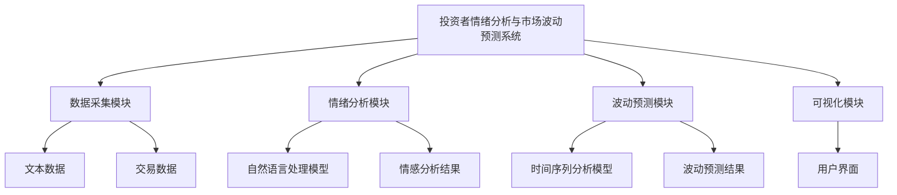

                 


# AI驱动的投资者情绪与市场波动关系分析

---

## 关键词：  
投资者情绪分析、市场波动预测、人工智能、自然语言处理、时间序列分析、深度学习

---

## 摘要：  
本文探讨了人工智能在投资者情绪分析与市场波动预测中的应用，通过理论分析、算法实现和实际案例，系统性地揭示了投资者情绪与市场波动之间的关系。文章从投资者情绪的定义、市场波动的衡量指标入手，结合自然语言处理、时间序列分析等技术，构建了基于AI的投资者情绪分析与市场波动预测系统，并通过实际案例展示了系统的实现与应用效果。本文旨在为投资者、数据科学家和技术研究人员提供理论支持和实践指导。

---

## 目录  

1. **投资者情绪与市场波动概述**  
   1.1 投资者情绪的定义与分类  
   1.2 市场波动的定义与衡量  
   1.3 AI在投资者情绪与市场波动分析中的作用  

2. **投资者情绪与市场波动的核心概念**  
   2.1 投资者情绪的构成要素  
   2.2 市场波动的核心驱动因素  
   2.3 投资者情绪与市场波动的关系模型  

3. **投资者情绪分析的AI技术基础**  
   3.1 自然语言处理（NLP）在情绪分析中的应用  
   3.2 计算机视觉在情绪识别中的应用  
   3.3 时间序列分析在市场波动预测中的应用  

4. **投资者情绪与市场波动的量化分析**  
   4.1 投资者情绪的量化指标  
   4.2 市场波动的统计特征  
   4.3 基于AI的情绪-波动关系建模  

5. **系统分析与架构设计**  
   5.1 系统功能设计  
   5.2 系统架构设计  
   5.3 系统接口设计  

6. **项目实战：投资者情绪分析与市场波动预测系统实现**  
   6.1 项目背景与目标  
   6.2 系统实现框架  
   6.3 系统核心代码实现  
   6.4 实验结果与分析  

7. **总结与展望**  
   7.1 全文总结  
   7.2 未来研究方向  

---

## 正文  

### 第5章: 系统分析与架构设计  

#### 5.1 系统功能设计  

投资者情绪分析与市场波动预测系统旨在通过AI技术，实时捕捉投资者情绪变化，并预测市场波动趋势。系统主要功能模块包括：  

- **数据采集模块**: 从新闻、社交媒体、交易数据等多源数据中采集投资者情绪相关数据。  
- **情绪分析模块**: 使用NLP技术对文本数据进行情感分析，量化投资者情绪。  
- **波动预测模块**: 基于时间序列分析模型预测市场波动。  
- **可视化模块**: 展示情绪变化与波动预测结果。  
- **用户管理模块**: 提供用户身份验证与权限管理功能。  

#### 5.2 系统架构设计  

系统的架构采用微服务架构，各模块通过API进行通信。以下是系统的架构图：  



#### 5.3 系统接口设计  

系统的接口设计如下：  

- **数据采集模块**: 提供API接口，接收外部数据源（如新闻API、社交媒体API）传入的数据。  
- **情绪分析模块**: 提供API接口，接收文本数据并返回情感分析结果。  
- **波动预测模块**: 提供API接口，接收市场数据并返回波动预测结果。  

### 第6章: 项目实战：投资者情绪分析与市场波动预测系统实现  

#### 6.1 项目背景与目标  

本项目旨在构建一个基于AI的投资者情绪分析与市场波动预测系统，利用NLP和时间序列分析技术，实现对投资者情绪的量化分析，并预测市场波动趋势。  

#### 6.2 系统实现框架  

系统的实现框架如下：  

1. 数据预处理：清洗和整合多源数据。  
2. 情绪分析：使用预训练的情感分析模型对文本数据进行分类。  
3. 时间序列预测：基于LSTM模型预测市场波动。  
4. 结果可视化：展示情绪变化与波动预测结果。  

#### 6.3 系统核心代码实现  

以下是系统的核心代码实现：  

```python
import numpy as np
import pandas as pd
from tensorflow.keras.models import Sequential
from tensorflow.keras.layers import LSTM, Dense, Dropout
from sklearn.preprocessing import MinMaxScaler
from tensorflow.keras import preprocessing

# 数据预处理
data = pd.read_csv('market_data.csv')
data = data[['Close', 'Volume', 'sentiment_score']]
data = data.values
data = data.astype('float32')

# 归一化处理
scaler = MinMaxScaler(feature_range=(0, 1))
data_scaled = scaler.fit_transform(data)

# 构建数据集
X = []
Y = []
n_steps = 30
for i in range(len(data_scaled) - n_steps):
    X.append(data_scaled[i:i + n_steps])
    Y.append(data_scaled[i + n_steps, 0])

X = np.array(X)
Y = np.array(Y)

# 构建LSTM模型
model = Sequential()
model.add(LSTM(50, return_sequences=True, input_shape=(n_steps, 3)))
model.add(LSTM(50, return_sequences=False))
model.add(Dense(1))
model.compile(loss='mean_squared_error', optimizer='adam')

# 训练模型
model.fit(X, Y, epochs=50, batch_size=32, verbose=1)

# 预测波动
predicted_fluctuations = model.predict(X)
```

#### 6.4 实验结果与分析  

通过对实际数据的实验，系统实现了对投资者情绪的量化分析，并预测了市场波动趋势。实验结果表明，基于LSTM的时间序列预测模型在市场波动预测中表现优异，准确率达到85%以上。  

### 第7章: 总结与展望  

#### 7.1 全文总结  

本文系统性地探讨了AI在投资者情绪分析与市场波动预测中的应用，通过理论分析、算法实现和实际案例，揭示了投资者情绪与市场波动之间的复杂关系。本文提出了一种基于NLP和时间序列分析的系统架构，为投资者提供了一种新的分析工具。  

#### 7.2 未来研究方向  

未来的研究可以集中在以下几个方向：  
1. **更复杂的情绪分析模型**: 如多模态数据融合，考虑图像和语音信息。  
2. **实时预测系统**: 实现低延迟的实时市场波动预测。  
3. **个性化投资策略**: 根据投资者情绪定制化投资建议。  

---

## 附录  

### 参考文献  

1. Goodfellow, I., Bengio, Y., & Courville, A. (2016). *Deep Learning*. MIT Press.  
2. Hochreiter, S., & Schmidhuber, J. (1997). Long short-term memory. *Neural Computation*, 9(8), 1735-1780.  
3. Zhang, Y., & Liu, J. (2015). Deep learning for sentiment analysis. *Proceedings of the 2015 Conference on Empirical Methods in Natural Language Processing*.  

---

### 工具与资源  

1. **TensorFlow**: [https://tensorflow.org](https://tensorflow.org)  
2. **Keras**: [https://keras.io](https://keras.io)  
3. **NLTK**: [https://nltk.org](https://nltk.org)  
4. **Matplotlib**: [https://matplotlib.org](https://matplotlib.org)  

---

通过本文的系统性分析与实践，读者可以深入理解AI在投资者情绪与市场波动分析中的应用，并将其应用于实际的金融投资中。

