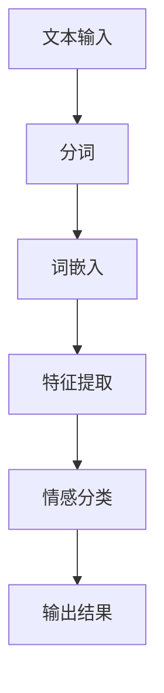
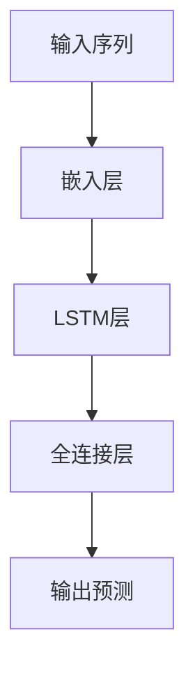
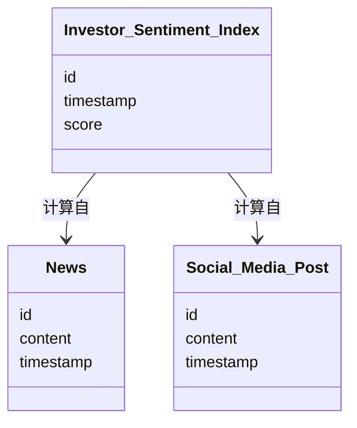
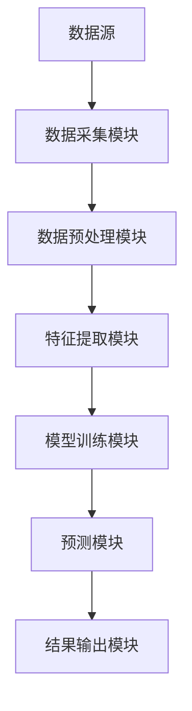
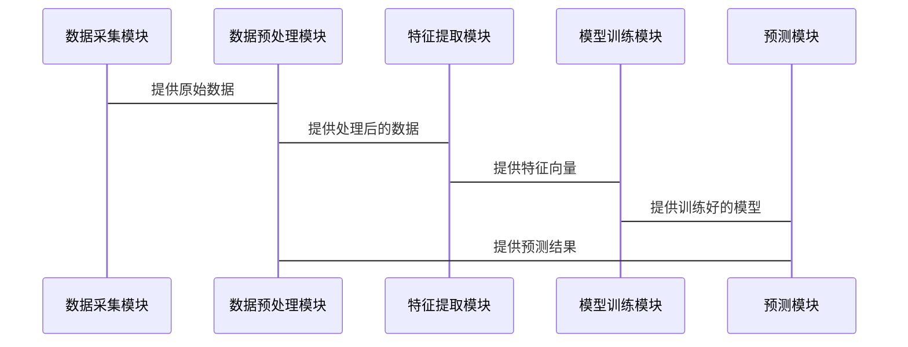

                 


# AI驱动的投资者情绪指数预测系统

> 关键词：投资者情绪指数、AI、机器学习、时间序列分析、自然语言处理、深度学习

> 摘要：本文探讨了如何利用人工智能技术构建投资者情绪指数预测系统。通过结合自然语言处理和时间序列分析，系统能够从金融市场数据和社交媒体信息中提取投资者情绪特征，并利用深度学习模型进行预测。本文详细分析了系统的设计思路、算法实现和实际应用场景，为投资者情绪分析提供了新的视角和解决方案。

---

# 第一部分：投资者情绪指数预测系统的背景与概念

## 第1章：投资者情绪指数预测系统概述

### 1.1 投资者情绪指数的基本概念

#### 1.1.1 投资者情绪指数的定义
投资者情绪指数（Investor Sentiment Index）是衡量市场参与者情绪状态的一个量化指标，反映了投资者对市场的乐观或悲观程度。它通常基于市场数据（如股票价格、交易量）和非结构化数据（如社交媒体、新闻媒体）进行计算。

#### 1.1.2 投资者情绪指数的特征
- **波动性**：情绪指数会随着市场波动而变化。
- **滞后性**：情绪指数通常反映的是过去的情绪状态。
- **相关性**：情绪指数与市场走势存在一定的相关性，但并非完全线性关系。
- **多因素影响**：情绪指数受宏观经济、政策、突发事件等多种因素影响。

#### 1.1.3 投资者情绪指数的重要性和应用
投资者情绪指数是金融分析中的重要工具，广泛应用于以下几个方面：
- **市场预测**：通过情绪指数预测市场的短期走势。
- **风险管理**：识别市场情绪过度乐观或悲观的情况，防范风险。
- **投资决策**：帮助投资者做出更明智的投资决策。

### 1.2 AI在投资者情绪分析中的作用

#### 1.2.1 AI技术在金融领域的应用现状
人工智能技术在金融领域的应用日益广泛，包括股票预测、风险评估、量化交易等。投资者情绪分析作为金融领域的重要分支，正在逐步被AI技术所赋能。

#### 1.2.2 AI在情绪分析中的优势
- **高效性**：AI可以快速处理大量非结构化数据，如社交媒体帖子和新闻文章。
- **准确性**：通过深度学习模型，AI能够捕捉到人类难以察觉的情绪信号。
- **实时性**：AI系统可以实时更新情绪指数，提供最新的市场情绪数据。

#### 1.2.3 AI驱动的投资者情绪指数预测系统的必要性
传统的投资者情绪分析方法依赖于经验丰富的分析师，存在效率低、成本高等问题。AI技术的引入能够显著提升情绪分析的效率和准确性，为投资者提供更可靠的决策支持。

### 1.3 投资者情绪指数预测系统的挑战与机遇

#### 1.3.1 系统开发的主要挑战
- 数据质量：非结构化数据的噪声较高，清洗和预处理成本高。
- 模型复杂性：深度学习模型训练需要大量计算资源。
- 情绪的多变性：市场情绪容易受到突发事件的影响，预测难度大。

#### 1.3.2 系统开发的潜在机遇
- 技术进步：深度学习和自然语言处理技术的快速发展为情绪分析提供了新的工具。
- 数据丰富性：社交媒体和新闻媒体的海量数据为情绪分析提供了丰富的数据来源。
- 市场需求：投资者对实时情绪数据的需求日益增长。

#### 1.3.3 系统开发的边界与外延
投资者情绪指数预测系统的边界包括数据来源、模型选择和预测范围。系统的外延则涉及与其他金融系统的集成，如量化交易系统和风险管理平台。

---

# 第二部分：投资者情绪指数预测系统的算法原理

## 第2章：投资者情绪分析的核心算法

### 2.1 情感分析算法概述

#### 2.1.1 情感分析的基本原理
情感分析旨在判断一段文本的情感倾向，通常分为正面、负面和中性三类。基于自然语言处理技术，情感分析能够从文本中提取情感特征，并通过机器学习模型进行分类。

#### 2.1.2 基于传统机器学习的情感分析算法
- **支持向量机（SVM）**：通过特征向量化和分类器训练实现情感分类。
- **朴素贝叶斯（Naive Bayes）**：基于概率论的情感分类方法。

#### 2.1.3 基于深度学习的情感分析算法
- **卷积神经网络（CNN）**：通过局部特征提取和全连接层进行情感分类。
- **长短记忆网络（LSTM）**：适合处理序列数据，能够捕捉文本的情感变化。

#### 2.1.4 情感分析的流程图


#### 2.1.5 情感分析的代码示例
```python
from tensorflow.keras.models import Sequential
from tensorflow.keras.layers import Dense, Dropout, Embedding, LSTM

# 情感分类模型
model = Sequential()
model.add(Embedding(input_dim=10000, output_dim=100, input_length=500))
model.add(LSTM(64))
model.add(Dropout(0.5))
model.add(Dense(3, activation='softmax'))
model.compile(optimizer='adam', loss='sparse_categorical_crossentropy', metrics=['accuracy'])
```

### 2.2 时间序列预测算法

#### 2.2.1 时间序列预测的基本原理
时间序列预测旨在根据历史数据预测未来趋势。常用的方法包括ARIMA、LSTM和GARCH等。

#### 2.2.2 常用的时间序列预测算法
- **ARIMA模型**：基于差分和移动平均的思想，适用于线性趋势的数据。
- **LSTM模型**：适合处理非线性序列数据，能够捕捉长期依赖关系。
- **GARCH模型**：用于预测金融资产的波动性。

#### 2.2.3 基于深度学习的时间序列预测算法


#### 2.2.4 时间序列预测的代码示例
```python
import numpy as np
from tensorflow.keras.models import Sequential
from tensorflow.keras.layers import LSTM, Dense

# 时间序列预测模型
model = Sequential()
model.add(LSTM(50, input_shape=(None, 1)))
model.add(Dense(1))
model.compile(optimizer='adam', loss='mean_squared_error')
```

### 2.3 情绪指数预测的融合算法

#### 2.3.1 情感分析与时间序列预测的结合
投资者情绪指数预测系统需要结合情感分析和时间序列预测两种技术，前者用于提取情绪特征，后者用于预测情绪指数的未来走势。

#### 2.3.2 融合算法的实现步骤
1. **数据预处理**：清洗和标注情绪数据。
2. **特征提取**：从文本数据中提取情感特征。
3. **模型训练**：训练情感分析模型和时间序列预测模型。
4. **预测融合**：将两种模型的预测结果进行融合，得到最终的情绪指数。

#### 2.3.3 融合算法的代码示例
```python
def fuse_prediction(emotion_prediction, time_series_prediction):
    # 加权融合
    fused = emotion_prediction * 0.6 + time_series_prediction * 0.4
    return fused
```

---

# 第三部分：投资者情绪指数预测系统的系统架构设计

## 第3章：系统分析与架构设计方案

### 3.1 问题场景介绍
投资者情绪指数预测系统需要解决以下问题：
- 如何从社交媒体和新闻媒体中获取实时数据？
- 如何高效处理和分析海量非结构化数据？
- 如何保证预测模型的准确性和实时性？

### 3.2 系统功能设计

#### 3.2.1 领域模型设计


#### 3.2.2 系统架构设计


#### 3.2.3 接口设计与交互流程


---

# 第四部分：投资者情绪指数预测系统的项目实战

## 第4章：项目实战与案例分析

### 4.1 环境安装与配置

#### 4.1.1 Python环境安装
- 安装Python 3.8及以上版本。
- 安装必要的库：`tensorflow`, `numpy`, `pandas`, `scikit-learn`。

#### 4.1.2 数据集获取
- 使用社交媒体API获取股票市场的相关帖子。
- 使用新闻爬虫获取财经新闻。

### 4.2 系统核心实现

#### 4.2.1 数据预处理代码
```python
import pandas as pd

def preprocess_data(data):
    # 去除停用词
    stop_words = set(['a', 'an', 'the', 'and', 'or'])
    data['processed_text'] = data['text'].apply(lambda x: ' '.join([word for word in x.split() if word not in stop_words]))
    return data
```

#### 4.2.2 情感分析模型训练
```python
from tensorflow.keras.models import Sequential
from tensorflow.keras.layers import Dense, LSTM, Embedding

def train_emotion_model(train_texts, train_labels):
    model = Sequential()
    model.add(Embedding(input_dim=10000, output_dim=100, input_length=500))
    model.add(LSTM(64))
    model.add(Dropout(0.5))
    model.add(Dense(3, activation='softmax'))
    model.compile(optimizer='adam', loss='sparse_categorical_crossentropy', metrics=['accuracy'])
    model.fit(train_texts, train_labels, epochs=10, batch_size=32)
    return model
```

#### 4.2.3 时间序列预测模型训练
```python
from tensorflow.keras.models import Sequential
from tensorflow.keras.layers import LSTM, Dense

def train_time_series_model(train_data):
    model = Sequential()
    model.add(LSTM(50, input_shape=(None, 1)))
    model.add(Dense(1))
    model.compile(optimizer='adam', loss='mean_squared_error')
    model.fit(train_data, epochs=20, batch_size=64)
    return model
```

### 4.3 实际案例分析

#### 4.3.1 案例背景
假设我们有一个包含社交媒体帖子和财经新闻的数据集，目标是预测某只股票的情绪指数。

#### 4.3.2 数据处理与分析
```python
import pandas as pd
import matplotlib.pyplot as plt

# 加载数据
data = pd.read_csv('sentiment_data.csv')

# 绘制情绪指数变化图
plt.figure(figsize=(10, 6))
plt.plot(data['timestamp'], data['sentiment_score'])
plt.title('Investor Sentiment Score Over Time')
plt.xlabel('Timestamp')
plt.ylabel('Sentiment Score')
plt.show()
```

#### 4.3.3 模型预测与评估
```python
from sklearn.metrics import mean_absolute_error

# 预测情绪指数
predicted = model.predict(test_data)

# 评估模型性能
mae = mean_absolute_error(true_labels, predicted_labels)
print(f'Mean Absolute Error: {mae}')
```

### 4.4 项目总结与经验分享

#### 4.4.1 项目总结
- 数据清洗和预处理是关键步骤，直接影响模型的性能。
- 深度学习模型在情绪分析和时间序列预测中表现优异，但需要大量的计算资源。
- 模型的融合能够显著提升预测的准确性。

#### 4.4.2 经验分享
- 在实际项目中，建议使用云服务器或GPU加速训练。
- 定期更新模型，以适应市场情绪的变化。
- 注意数据的实时性，确保模型能够捕捉到最新的市场动态。

---

# 第五部分：投资者情绪指数预测系统的最佳实践

## 第5章：最佳实践与系统优化

### 5.1 系统优化建议

#### 5.1.1 数据质量优化
- 使用更先进的自然语言处理技术（如BERT）进行文本清洗。
- 建立数据质量监控机制，及时发现和处理异常数据。

#### 5.1.2 模型优化建议
- 使用超参数调优技术（如网格搜索）优化模型性能。
- 尝试集成学习方法，结合多个模型的结果。

#### 5.1.3 系统性能优化
- 采用分布式计算框架（如Apache Spark）提升数据处理效率。
- 使用轻量级框架（如FastAPI）部署实时预测服务。

### 5.2 系统维护与扩展

#### 5.2.1 系统维护
- 定期更新模型，防止过时模型导致预测误差。
- 监控系统运行状态，及时处理故障。

#### 5.2.2 系统扩展
- 扩展数据来源，引入更多的市场数据。
- 增加模型的可解释性，帮助用户更好地理解预测结果。

### 5.3 注意事项与风险提示

#### 5.3.1 数据隐私问题
- 注意保护用户数据隐私，遵守相关法律法规。
- 对敏感数据进行匿名化处理。

#### 5.3.2 模型鲁棒性问题
- 验证模型的鲁棒性，确保其在不同市场环境下的表现稳定。
- 建立应急预案，应对突发事件对模型的冲击。

### 5.4 拓展阅读与学习资源

#### 5.4.1 推荐书籍
- 《Deep Learning》
- 《自然语言处理实战》

#### 5.4.2 在线课程
- Coursera上的《机器学习专项课程》
- edX上的《金融数据分析》

---

# 结语

通过本文的详细讲解，我们了解了AI驱动的投资者情绪指数预测系统的构建过程，包括背景介绍、算法原理、系统架构设计和项目实战等内容。希望本文能够为读者提供有价值的参考，帮助他们在实际应用中更好地利用AI技术进行投资者情绪分析和预测。

---

# 参考文献
1. Goodfellow, I., Bengio, Y., & Courville, A. (2016). Deep Learning. MIT Press.
2. LeCun, Y., Bengio, Y., & Hinton, G. (2015). Deep learning. Nature, 521(7552), 436-444.
3.

