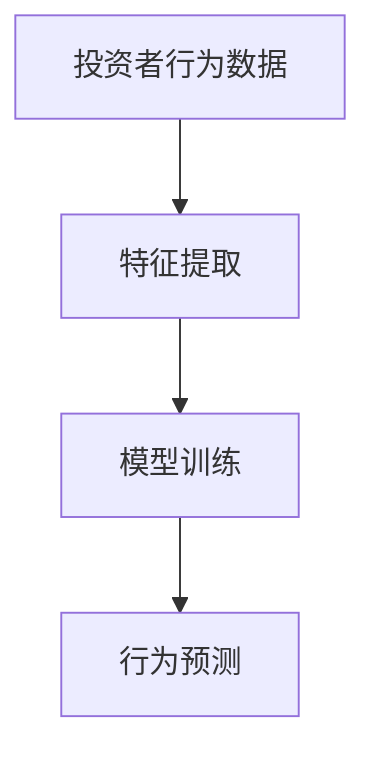
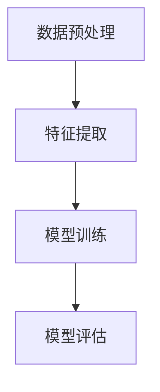
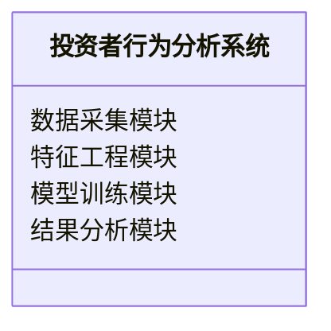
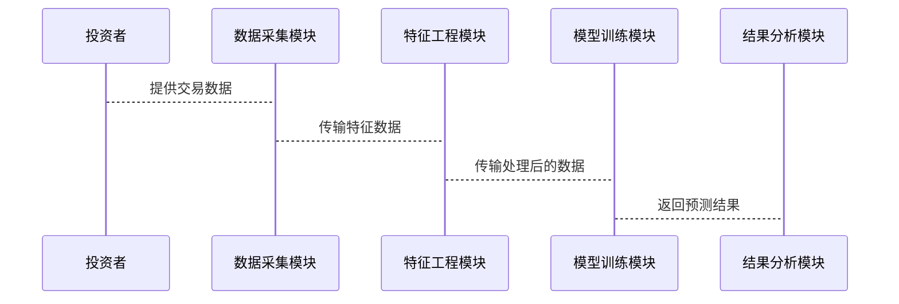

                 


# AI驱动的投资者行为分析

---

## 关键词
AI技术, 投资者行为, 机器学习, 深度学习, 数据分析, 行为预测

---

## 摘要
本文详细探讨了AI技术在投资者行为分析中的应用，从理论基础到算法原理，再到系统架构和实际案例，全面解析了AI如何帮助我们理解投资者行为，并提供行为预测和投资策略优化的支持。文章内容涵盖背景介绍、核心概念、算法原理、系统分析、项目实战以及最佳实践，旨在为读者提供一个全面而深入的视角，帮助他们在金融领域中更好地应用AI技术。

---

# 第1章: AI驱动的投资者行为分析概述

## 1.1 投资者行为分析的背景与意义
### 1.1.1 传统投资者行为分析的局限性
传统的投资者行为分析依赖于心理学和行为学的理论，但其分析结果往往缺乏数据支持，且难以量化和模型化。此外，传统方法难以处理大规模数据，也无法实时分析投资者行为的变化。

### 1.1.2 AI技术在投资者行为分析中的作用
AI技术的引入为投资者行为分析带来了新的可能性。通过机器学习和深度学习算法，我们可以从海量数据中提取有用的特征，并建立预测模型，从而实现对投资者行为的实时分析和预测。

### 1.1.3 研究目标与内容
本文的研究目标是通过AI技术，建立一个投资者行为分析的框架，实现对投资者行为的量化分析和预测。研究内容包括投资者行为数据的采集、特征提取、模型训练和结果分析。

---

## 1.2 AI驱动的投资者行为分析的核心概念
### 1.2.1 投资者行为分析的基本概念
投资者行为分析是指通过对投资者的交易记录、市场反应和心理特征等数据的分析，揭示投资者在不同市场环境下的决策模式和行为特征。

### 1.2.2 AI在投资者行为分析中的应用领域
AI技术在投资者行为分析中的应用领域包括但不限于：交易行为预测、风险评估、投资策略优化等。

### 1.2.3 本章小结
本章主要介绍了AI驱动的投资者行为分析的背景、意义和核心概念，为后续章节的深入分析奠定了基础。

---

# 第2章: 投资者行为分析的核心概念与联系

## 2.1 投资者行为分析的理论基础
### 2.1.1 投资者心理与行为特征
投资者的心理特征包括风险偏好、收益预期和决策风格等。行为特征则包括交易频率、买卖时机和资产配置等。

### 2.1.2 投资决策过程模型
投资决策过程模型描述了投资者从信息收集到最终决策的全过程，包括信息处理、决策制定和行为执行三个阶段。

### 2.1.3 投资者行为的分类与特征
投资者行为可以分为理性行为和非理性行为两大类。理性行为基于充分的信息和理性的决策，而非理性行为则受到情绪和认知偏差的影响。

## 2.2 AI技术在投资者行为分析中的应用
### 2.2.1 数据驱动的投资者行为建模
通过收集投资者的历史交易数据、市场数据和外部事件数据，我们可以建立投资者行为的数学模型。

### 2.2.2 机器学习在投资者行为预测中的应用
机器学习算法（如随机森林和神经网络）可以用于预测投资者的交易行为和市场反应。

### 2.2.3 深度学习在投资者行为分析中的优势
深度学习模型（如LSTM）能够捕捉时间序列数据中的复杂模式，适用于投资者行为的时间依赖性分析。

## 2.3 核心概念关系图
### 2.3.1 投资者行为分析的ER实体关系图
```mermaid
er
    投资者
    投资行为
    市场数据
    外部事件
    决策特征
```

### 2.3.2 AI技术与投资者行为分析的流程图


---

# 第3章: AI驱动的投资者行为分析算法原理

## 3.1 常见的投资者行为分析算法
### 3.1.1 机器学习算法
- 线性回归：用于预测投资者的收益预期。
- 随机森林：用于分类投资者的行为类型。

### 3.1.2 深度学习算法
- LSTM网络：用于分析投资者行为的时间序列数据。

### 3.1.3 时间序列分析算法
- ARIMA模型：用于预测投资者的交易频率。

## 3.2 算法原理与流程图
### 3.2.1 机器学习模型的训练流程


## 3.3 数学模型与公式
### 3.3.1 线性回归模型
$$ y = \beta_0 + \beta_1x + \epsilon $$

### 3.3.2 随机森林模型
$$ y = \sum_{i=1}^{n} \text{Tree}(x) $$

---

# 第4章: 投资者行为分析的系统分析与架构设计

## 4.1 问题场景介绍
### 4.1.1 投资者行为分析的典型场景
包括实时交易监控、风险预警和投资策略优化等。

## 4.2 项目介绍
### 4.2.1 项目目标
建立一个基于AI的投资者行为分析系统，实现投资者行为的实时监测和预测。

## 4.3 系统功能设计
### 4.3.1 系统功能模块
- 数据采集模块：负责收集投资者的交易数据和市场数据。
- 特征工程模块：对数据进行特征提取和处理。
- 模型训练模块：训练投资者行为预测模型。
- 结果分析模块：输出模型预测结果和分析报告。

### 4.3.2 领域模型设计


## 4.4 系统架构设计
### 4.4.1 系统架构图


## 4.5 系统接口设计
### 4.5.1 系统接口
- 数据接口：用于数据的输入和输出。
- 模型接口：用于模型的训练和预测。

## 4.6 系统交互设计
### 4.6.1 系统交互流程


---

# 第5章: 项目实战

## 5.1 环境安装
### 5.1.1 环境配置
安装Python、TensorFlow和Pandas等工具。

## 5.2 系统核心实现源代码
### 5.2.1 数据采集模块
```python
import pandas as pd

def collect_data():
    # 示例代码：从数据库中采集投资者数据
    data = pd.read_sql("SELECT * FROM investor_data", con=db)
    return data
```

### 5.2.2 特征工程模块
```python
def preprocess_data(data):
    # 示例代码：对数据进行特征提取和处理
    data['return'] = data['price'].pct_change()
    return data
```

### 5.2.3 模型训练模块
```python
from tensorflow.keras import layers

def build_model(input_shape):
    model = tf.keras.Sequential()
    model.add(layers.LSTM(64, input_shape=input_shape))
    model.add(layers.Dense(1))
    model.compile(loss='mse', optimizer='adam')
    return model
```

### 5.2.4 结果分析模块
```python
def analyze_results(predictions):
    # 示例代码：对预测结果进行分析和可视化
    plt.plot(predictions, label='预测值')
    plt.show()
```

## 5.3 代码应用解读与分析
### 5.3.1 数据采集模块的实现
通过数据库查询获取投资者的历史交易数据，并存储在数据框中。

### 5.3.2 特征工程模块的实现
对原始数据进行特征提取，例如计算收益率和波动率等。

### 5.3.3 模型训练模块的实现
使用LSTM网络对特征数据进行训练，建立投资者行为预测模型。

### 5.3.4 结果分析模块的实现
对模型的预测结果进行可视化和分析，验证模型的准确性和有效性。

## 5.4 实际案例分析
### 5.4.1 案例背景
以某股票的交易数据为例，分析投资者的行为特征和交易模式。

### 5.4.2 数据采集与处理
收集该股票的历史交易数据，包括开盘价、收盘价、成交量等。

### 5.4.3 模型训练与预测
使用LSTM模型预测该股票的未来走势，并分析投资者的交易行为。

### 5.4.4 结果分析与解读
通过模型预测结果，识别投资者的行为模式，并制定相应的投资策略。

## 5.5 项目小结
本章通过一个实际案例，详细讲解了AI驱动的投资者行为分析系统的实现过程，从数据采集到模型训练，再到结果分析，帮助读者更好地理解和应用相关技术。

---

# 第6章: 最佳实践与总结

## 6.1 最佳实践
### 6.1.1 数据质量的重要性
确保数据的准确性和完整性，是提高模型预测能力的关键。

### 6.1.2 模型解释性的提升
通过可视化和可解释性分析，帮助投资者理解模型的预测结果。

### 6.1.3 模型的实时性与可扩展性
在实际应用中，模型需要具备实时性和可扩展性，以应对复杂多变的市场环境。

## 6.2 小结
本文通过系统的分析和实战案例，全面介绍了AI驱动的投资者行为分析的核心概念、算法原理和系统架构设计。通过本文的学习，读者可以掌握如何利用AI技术，实现投资者行为的量化分析和预测。

## 6.3 注意事项
在实际应用中，需要注意数据隐私和模型的鲁棒性，避免因数据泄露或模型过拟合而导致的风险。

## 6.4 拓展阅读
建议读者进一步阅读相关领域的文献，如《机器学习在金融中的应用》和《深度学习在时间序列分析中的应用》。

---

通过以上章节的内容，读者可以系统地学习和掌握AI驱动的投资者行为分析的理论和实践知识，为在金融领域的深入应用奠定坚实的基础。

