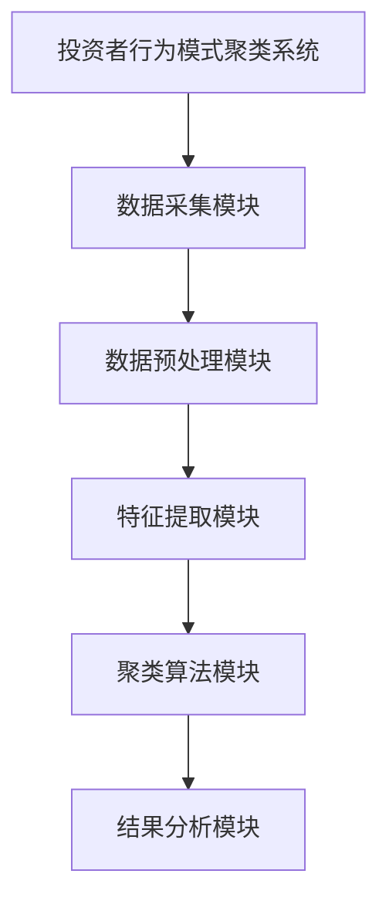
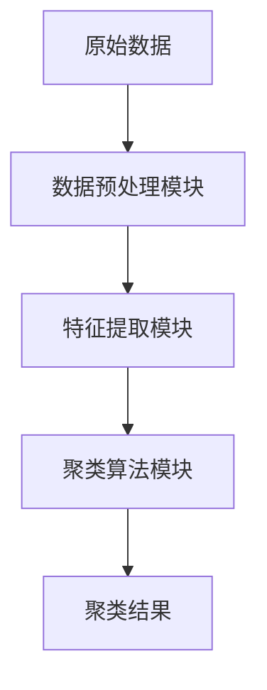

                 


# AI驱动的投资者行为模式聚类

> 关键词：投资者行为模式，聚类分析，机器学习，AI驱动，金融数据，行为分析

> 摘要：本文详细探讨了如何利用人工智能技术进行投资者行为模式的聚类分析。通过分析投资者的行为数据，结合聚类算法，帮助投资者和金融机构更好地理解市场行为、优化投资策略和风险控制。文章从聚类分析的基本概念、投资者行为数据的特征提取、常见聚类算法的原理与实现，到系统设计与实战案例，全面阐述了AI驱动的投资者行为模式聚类的实现过程和应用价值。

---

# 第1章：投资者行为分析与聚类概述

## 1.1 投资者行为模式的定义与特征

### 1.1.1 投资者行为模式的定义
投资者行为模式是指投资者在金融市场中表现出的决策、交易和反应方式的综合特征。这些行为模式反映了投资者的个性、认知和情绪等内在因素，以及市场环境、经济周期等外在因素的影响。

### 1.1.2 投资者行为模式的特征
- **多样性**：投资者根据风险偏好、投资目标和市场认知的不同，表现出多样化的行为模式。
- **动态性**：投资者行为会随市场环境的变化而调整，具有很强的动态特征。
- **复杂性**：投资者行为受到多种因素的综合影响，包括心理、社会和经济因素。

### 1.1.3 聚类分析在投资者行为研究中的作用
聚类分析能够将具有相似行为特征的投资者归为一类，帮助识别不同类型的投资者群体，进而制定针对性的投资策略。

---

## 1.2 AI驱动的投资者行为分析背景

### 1.2.1 传统投资者行为分析的局限性
传统投资者行为分析主要依赖于统计方法和经验分析，存在以下问题：
- 数据量有限，难以捕捉复杂的行为模式。
- 分析过程主观性强，缺乏客观性和科学性。
- 难以实时分析投资者行为，影响投资决策的及时性。

### 1.2.2 AI技术在投资者行为分析中的优势
AI技术通过大数据处理和机器学习算法，能够从海量数据中提取有用的信息，发现传统方法难以捕捉的模式和规律。具体优势包括：
- 高效性：快速处理和分析大量数据。
- 客观性：基于数据的分析结果更具科学性。
- 实时性：能够实时跟踪和分析投资者行为。

### 1.2.3 聚类分析的必要性与应用前景
聚类分析是AI技术在投资者行为分析中的重要应用之一。通过聚类分析，可以将投资者分为不同的类别，帮助金融机构更好地理解投资者需求，优化产品设计和风险控制。

---

## 1.3 聚类分析的基本概念与方法

### 1.3.1 聚类分析的定义
聚类分析是一种无监督学习方法，旨在将数据点划分为若干个簇，使得同一簇内的数据点具有较高的相似性，而不同簇之间的数据点具有较低的相似性。

### 1.3.2 聚类分析的类型
- **划分型聚类**：将数据分成不重叠的簇。
- **层次型聚类**：通过构建树状结构来展示数据点的层次关系。
- **密度型聚类**：基于数据点的密度分布进行聚类。

### 1.3.3 常见的聚类算法介绍
- **K-means**：划分型聚类算法，适用于数据分布均匀的情况。
- **层次聚类**：适用于数据具有层次结构的情况。
- **DBSCAN**：基于密度的聚类算法，适用于噪声较多的数据。

---

# 第2章：投资者行为数据特征提取

## 2.1 投资者行为数据的来源与类型

### 2.1.1 市场数据
包括股票价格、指数、成交量等市场数据。

### 2.1.2 交易数据
包括交易记录、订单簿、成交数据等。

### 2.1.3 行为数据
包括投资者的点击流数据、鼠标悬停时间、页面浏览量等。

---

## 2.2 数据预处理与清洗

### 2.2.1 数据清洗方法
- **去重**：去除重复数据。
- **填补缺失值**：使用均值、中位数或插值方法填补缺失值。
- **异常值处理**：识别并处理异常值。

### 2.2.2 数据标准化与归一化
- **标准化**：将数据标准化到均值为0，方差为1。
- **归一化**：将数据缩放到0-1范围。

### 2.2.3 数据特征选择
通过特征选择方法，去除冗余特征，保留对聚类分析最有价值的特征。

---

## 2.3 投资者行为特征的提取方法

### 2.3.1 时间序列特征提取
提取投资者行为的时间序列特征，如均值、方差、自相关性等。

### 2.3.2 统计特征提取
提取统计特征，如最大值、最小值、标准差等。

### 2.3.3 基于机器学习的特征提取
利用无监督学习方法提取高阶特征，如主成分分析（PCA）。

---

# 第3章：聚类算法原理与实现

## 3.1 聚类算法的分类与选择

### 3.1.1 基础聚类算法
- **K-means**：适用于数据分布均匀的情况。
- **层次聚类**：适用于数据具有层次结构的情况。
- **DBSCAN**：适用于噪声较多的数据。

### 3.1.2 常见聚类算法的比较
- **K-means**：简单高效，但需要预先指定簇的数量。
- **层次聚类**：灵活性高，但计算复杂度较高。
- **DBSCAN**：能够处理噪声数据，但对参数敏感。

---

## 3.2 K-means算法的数学模型与实现

### 3.2.1 K-means算法的数学公式
目标函数：$$ \text{minimize} \sum_{i=1}^{k} \sum_{j=1}^{n_i} (x_j - c_i)^2 $$
其中，\( c_i \) 是第i个簇的中心，\( x_j \) 是数据点。

### 3.2.2 K-means算法的步骤
1. 初始化：随机选择k个簇中心。
2. 聚类：将每个数据点分配到最近的簇中心。
3. 更新：计算每个簇的中心。
4. 重复步骤2和3，直到收敛。

### 3.2.3 K-means算法的优缺点
- **优点**：简单高效，易于实现。
- **缺点**：对初始中心敏感，难以处理高维数据。

---

## 3.3 层次聚类算法的实现与应用

### 3.3.1 层次聚类的分类
- **自底向上**：从每个数据点开始，逐步合并最近的簇。
- **自顶向下**：从一个整体簇开始，逐步划分。

### 3.3.2 层次聚类的实现步骤
1. 计算数据点之间的距离矩阵。
2. 根据距离矩阵构建树状结构。
3. 根据相似性阈值进行剪枝，确定簇的数量。

### 3.3.3 层次聚类的应用场景
适用于数据具有层次结构的情况，如产品分类、客户分层。

---

## 3.4 基于密度的聚类算法

### 3.4.1 DBSCAN算法的原理
基于密度的聚类算法，通过寻找高密度区域来确定簇。

### 3.4.2 DBSCAN算法的实现步骤
1. 计算数据点的密度。
2. 根据密度和距离参数进行聚类。

### 3.4.3 DBSCAN算法的优缺点
- **优点**：能够处理噪声数据。
- **缺点**：对参数敏感，计算复杂度较高。

---

## 3.5 聚类算法的评估与选择

### 3.5.1 聚类评估指标
- **轮廓系数**：衡量簇的紧密性和分离度。
- **Davies-Bouldin指数**：衡量簇的相似性。

---

# 第4章：投资者行为模式聚类的系统设计与实现

## 4.1 系统架构设计



---

## 4.2 功能模块设计

### 4.2.1 数据采集模块
负责采集投资者行为数据，包括交易数据、市场数据和行为数据。

### 4.2.2 数据预处理模块
对数据进行清洗、标准化和归一化处理。

### 4.2.3 特征提取模块
提取投资者行为特征，如时间序列特征和统计特征。

### 4.2.4 聚类算法模块
选择合适的聚类算法，实现投资者行为模式的聚类。

### 4.2.5 结果分析模块
对聚类结果进行分析和可视化，生成报告。

---

## 4.3 数据流设计



---

## 4.4 接口设计

### 4.4.1 数据接口
- 输入接口：接收投资者行为数据。
- 输出接口：输出聚类结果。

### 4.4.2 系统接口
- 调用接口：调用聚类算法模块进行计算。
- 返回接口：返回聚类结果和分析报告。

---

## 4.5 系统实现与测试

### 4.5.1 系统实现
使用Python和机器学习库（如Scikit-learn）实现聚类算法。

### 4.5.2 系统测试
对系统进行功能测试、性能测试和稳定性测试，确保系统能够高效运行。

---

# 第5章：项目实战

## 5.1 项目背景与目标

### 5.1.1 项目背景
随着金融市场的快速发展，投资者行为分析变得越来越重要。通过聚类分析，可以帮助金融机构更好地理解投资者需求，优化投资策略。

### 5.1.2 项目目标
实现投资者行为模式的聚类分析，识别不同类型的投资者群体，为金融机构提供决策支持。

---

## 5.2 环境配置与工具安装

### 5.2.1 环境配置
- Python 3.8+
- Jupyter Notebook
- Scikit-learn、Pandas、NumPy

### 5.2.2 工具安装
使用pip安装必要的库：
```bash
pip install scikit-learn pandas numpy
```

---

## 5.3 数据收集与预处理

### 5.3.1 数据收集
从金融数据平台获取投资者交易数据和市场数据。

### 5.3.2 数据预处理
对数据进行清洗、标准化和归一化处理。

---

## 5.4 模型实现与优化

### 5.4.1 模型实现
使用K-means算法实现投资者行为模式的聚类。

### 5.4.2 模型优化
通过调整K-means算法的参数（如初始中心）优化聚类效果。

---

## 5.5 结果分析与可视化

### 5.5.1 结果分析
对聚类结果进行分析，识别不同类型的投资者群体。

### 5.5.2 结果可视化
使用Matplotlib对聚类结果进行可视化，展示不同簇的特征。

---

# 第6章：高级主题与扩展

## 6.1 深度学习在聚类中的应用

### 6.1.1 深度学习的基本概念
深度学习是一种基于人工神经网络的机器学习方法，能够从数据中自动提取特征。

### 6.1.2 深度学习在聚类中的应用
使用深度学习模型（如自动编码器）提取投资者行为特征，进一步进行聚类分析。

---

## 6.2 时间序列分析与聚类

### 6.2.1 时间序列分析的基本概念
时间序列分析是对时间序列数据进行建模和分析的方法。

### 6.2.2 时间序列与聚类的结合
将时间序列数据与聚类分析结合，分析投资者行为的时间特征。

---

## 6.3 实时行为分析与动态聚类

### 6.3.1 实时行为分析的基本概念
实时行为分析是指对投资者行为进行实时监控和分析。

### 6.3.2 动态聚类的应用
动态聚类能够实时更新聚类结果，适应投资者行为的变化。

---

## 6.4 基于NLP的投资者行为分析

### 6.4.1 NLP的基本概念
自然语言处理（NLP）是研究计算机处理人类自然语言的技术。

### 6.4.2 NLP在投资者行为分析中的应用
通过分析投资者的社交媒体评论和新闻标题，提取情感特征，辅助聚类分析。

---

# 第7章：总结与展望

## 7.1 本文总结
本文详细探讨了AI驱动的投资者行为模式聚类的实现过程和应用价值。通过聚类分析，可以帮助金融机构更好地理解投资者需求，优化投资策略。

## 7.2 未来研究方向
未来的研究可以进一步探索深度学习在聚类中的应用，研究时间序列分析与聚类的结合，以及实时行为分析与动态聚类的优化。

---

通过以上内容，您可以逐步撰写完整的文章，确保每一部分都详细展开，并结合实际案例和代码示例，帮助读者更好地理解和应用所学知识。

